# AgenShield Architecture

This document describes the architecture of AgenShield, a security sandbox for AI agents running on macOS.

## Table of Contents

- [System Overview](#system-overview)
- [Installation Sequence](#installation-sequence)
- [Daemon Architecture](#daemon-architecture)
- [Policy Update Mechanism](#policy-update-mechanism)
- [Broker Request Flow](#broker-request-flow)
- [AgentLink Skill Flow](#agentlink-skill-flow)
- [Sandbox Architecture](#sandbox-architecture)

---

## System Overview

AgenShield provides a multi-layer security sandbox that isolates AI agents from the host system while allowing controlled access to resources through a policy-enforced broker.

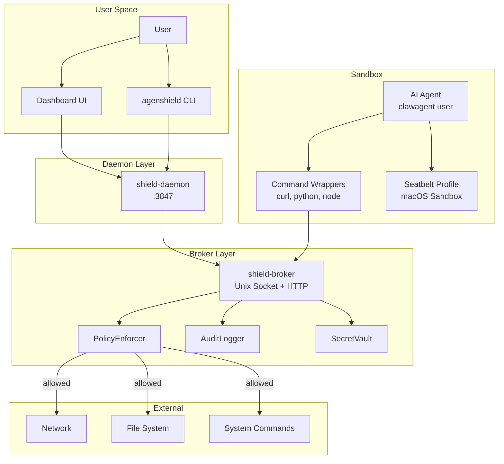

### Component Relationships

| Component | Role | Communication |
|-----------|------|---------------|
| **CLI** | Installation, configuration, status | Direct system calls |
| **Daemon** | HTTP API, real-time events, UI serving | HTTP REST + SSE |
| **Broker** | Request mediation, policy enforcement | Unix Socket + HTTP fallback |
| **Sandbox** | Agent isolation, network blocking | Seatbelt profiles, user isolation |

### Key Files

- `/libs/cli/` - Command-line interface
- `/libs/shield-daemon/` - Management daemon
- `/libs/shield-broker/` - Request broker
- `/libs/shield-sandbox/` - Sandbox utilities
- `/libs/shield-ipc/` - Shared types and schemas

---

## Installation Sequence

The setup wizard runs in two phases: detection (automatic) and setup (after user confirmation).

### Phase 1: Detection

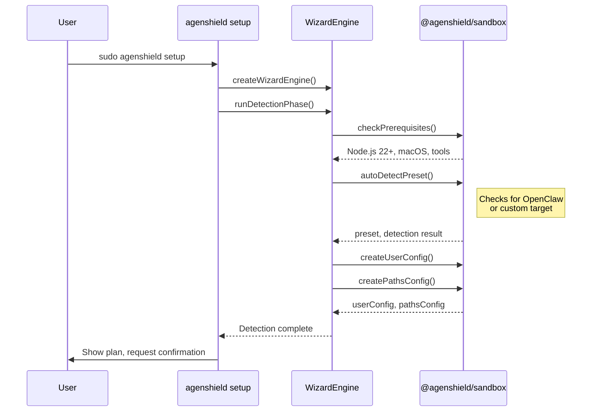

### Phase 2: Setup (17 Steps)

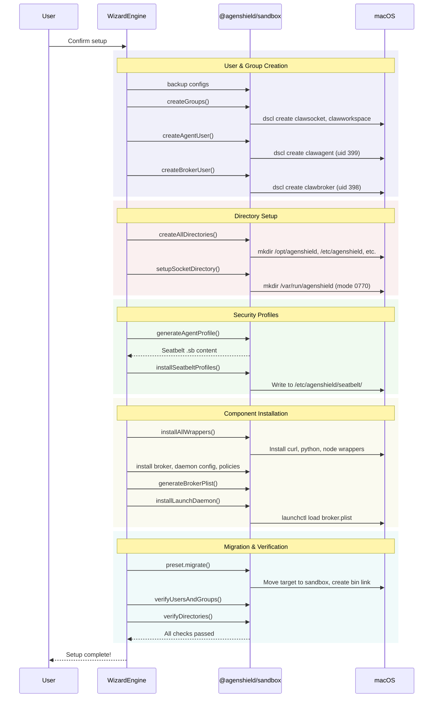

### Wizard Step Reference

| Step ID | Name | Description |
|---------|------|-------------|
| `prerequisites` | Check Prerequisites | Verify Node.js 22+, macOS, required tools |
| `detect` | Detect Target | Find OpenClaw or custom target |
| `configure` | Configure | Set up user configuration |
| `confirm` | Confirm Setup | Show plan, get user confirmation |
| `backup` | Backup Installation | Save backup for safe reversal |
| `create-groups` | Create Groups | Create socket and workspace groups |
| `create-agent-user` | Create Agent User | Create sandboxed agent user |
| `create-broker-user` | Create Broker User | Create broker daemon user |
| `create-directories` | Create Directories | Create /opt/agenshield, /etc/agenshield |
| `setup-socket` | Setup Socket | Create /var/run/agenshield/ |
| `generate-seatbelt` | Generate Seatbelt | Generate macOS sandbox profiles |
| `install-wrappers` | Install Wrappers | Install command wrappers |
| `install-broker` | Install Broker | Install broker binary |
| `install-daemon-config` | Install Daemon Config | Write daemon configuration |
| `install-policies` | Install Policies | Write default security policies |
| `setup-launchdaemon` | Setup LaunchDaemon | Create and load launchd plist |
| `migrate` | Migrate Installation | Move target to sandbox |
| `verify` | Verify Installation | Test sandboxed application |
| `complete` | Complete | Setup finished |

**Key Files:**
- `/libs/cli/src/commands/setup.ts`
- `/libs/cli/src/wizard/engine.ts`
- `/libs/cli/src/wizard/types.ts`

---

## Daemon Architecture

The shield-daemon provides a management API and real-time event streaming.

### Startup Flow

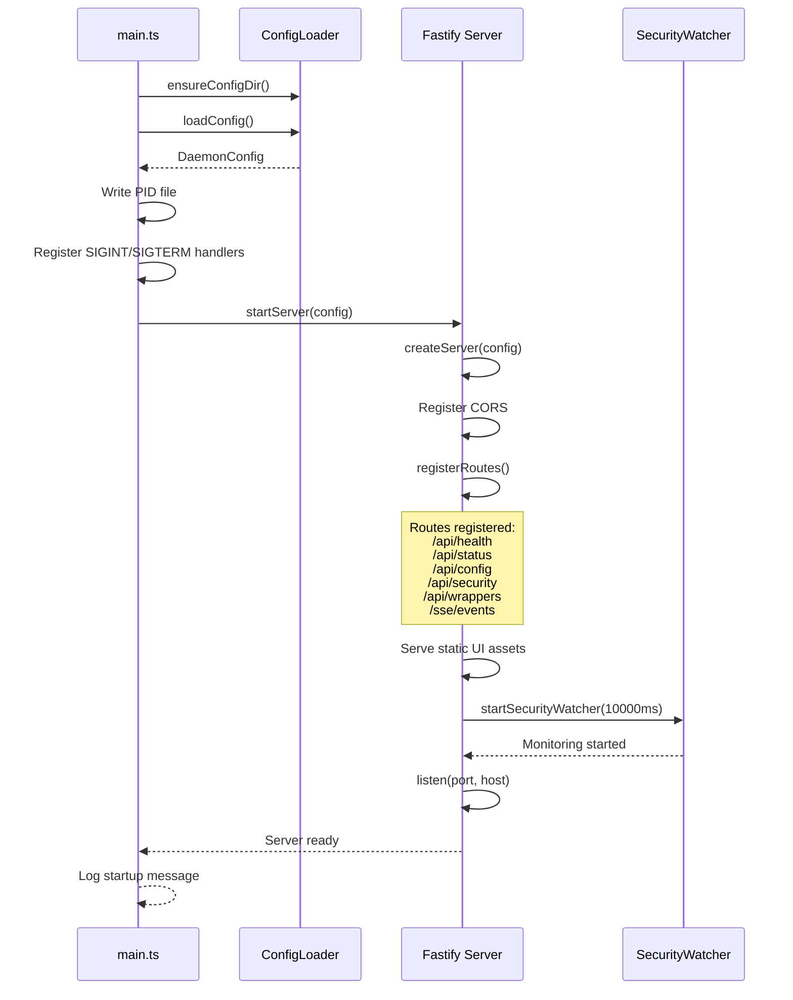

### HTTP API Endpoints

| Endpoint | Method | Description |
|----------|--------|-------------|
| `/api/health` | GET | Health check |
| `/api/status` | GET | Daemon and broker status |
| `/api/config` | GET | Get current configuration |
| `/api/config` | PUT | Update configuration |
| `/api/security` | GET | Security status (users, processes) |
| `/api/wrappers` | GET | Installed wrapper status |
| `/sse/events` | GET | Server-Sent Events stream |

### SSE Events

```typescript
type EventType =
  | 'security_status'  // Security check results
  | 'api_request'      // API traffic
  | 'connected';       // Initial connection
```

**Key Files:**
- `/libs/shield-daemon/src/main.ts`
- `/libs/shield-daemon/src/server.ts`
- `/libs/shield-daemon/src/config/loader.ts`
- `/libs/shield-daemon/src/routes/`

---

## Policy Update Mechanism

Policies control what operations the broker allows.

### Policy Structure

```typescript
interface PolicyConfig {
  version: string;
  defaultAction: 'allow' | 'deny';
  rules: PolicyRule[];
  fsConstraints?: {
    allowedPaths: string[];
    deniedPatterns: string[];
  };
  networkConstraints?: {
    allowedHosts: string[];
    deniedHosts: string[];
    allowedPorts: number[];
  };
}

interface PolicyRule {
  id: string;
  name: string;
  type: 'allowlist' | 'denylist';
  operations: string[];  // e.g., ['http_request', 'file_read']
  patterns: string[];    // Glob patterns for targets
  enabled: boolean;
  priority: number;      // Higher = evaluated first
}
```

### Policy Evaluation Flow

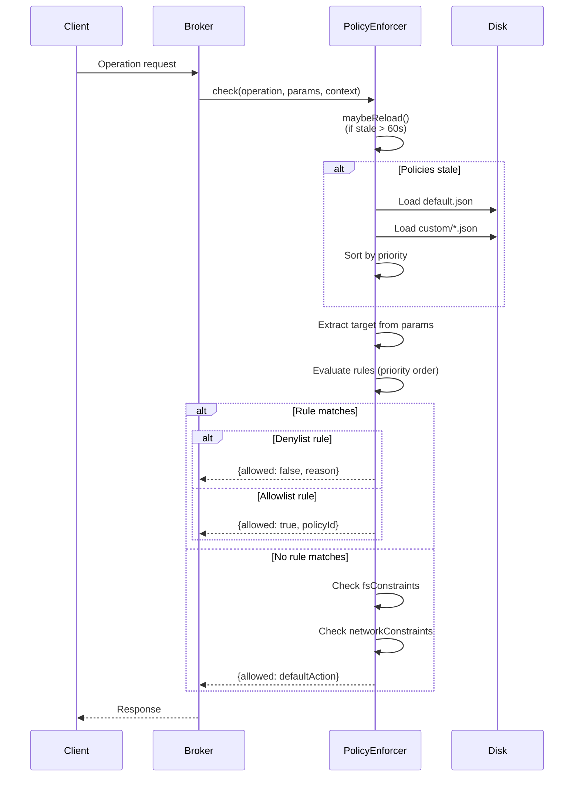

### Configuration Update via API


**Key Files:**
- `/libs/shield-daemon/src/routes/config.ts`
- `/libs/shield-broker/src/policies/enforcer.ts`
- `/libs/shield-ipc/src/schemas/policy.schema.ts`

---

## Broker Request Flow

The broker mediates all operations from the sandboxed agent.

### Request Processing

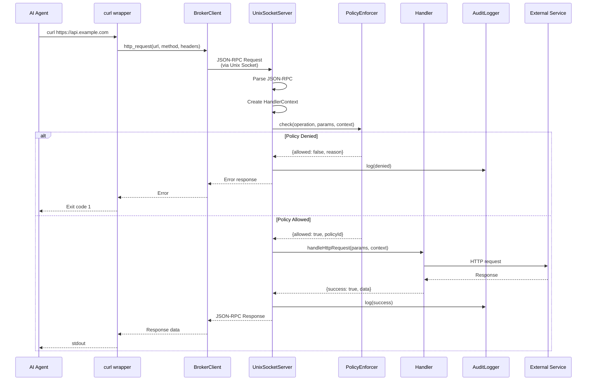

### Operation Types

| Operation | Description | Socket | HTTP |
|-----------|-------------|:------:|:----:|
| `http_request` | Proxy HTTP requests | ✓ | ✓ |
| `file_read` | Read file contents | ✓ | ✓ |
| `file_write` | Write file contents | ✓ | ✗ |
| `file_list` | List directory contents | ✓ | ✓ |
| `exec` | Execute system commands | ✓ | ✗ |
| `secret_inject` | Inject vault secrets | ✓ | ✗ |
| `open_url` | Open URL in browser | ✓ | ✓ |
| `ping` | Health check | ✓ | ✓ |

### Channel Restrictions

The HTTP fallback server is more restricted than the Unix socket for security:

```typescript
// HTTP Allowed
const HTTP_ALLOWED = ['http_request', 'file_read', 'file_list', 'open_url', 'ping'];

// HTTP Denied (socket-only)
const HTTP_DENIED = ['exec', 'file_write', 'secret_inject'];
```

**Key Files:**
- `/libs/shield-broker/src/server.ts` - Unix socket server
- `/libs/shield-broker/src/http-fallback.ts` - HTTP fallback server
- `/libs/shield-broker/src/policies/enforcer.ts`
- `/libs/shield-broker/src/client/broker-client.ts`
- `/libs/shield-ipc/src/types/ops.ts`

---

## AgentLink Skill Flow

AgentLink provides secure third-party integrations without exposing credentials to the AI agent.

### Authentication Flow

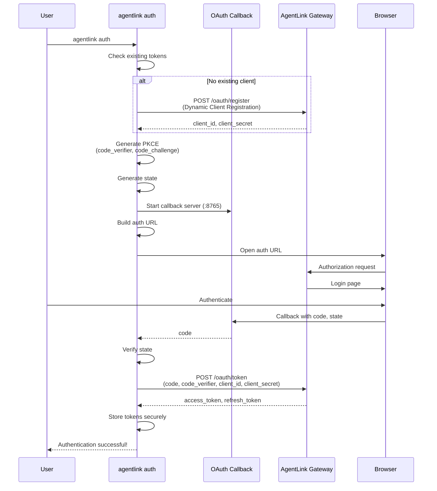

### Tool Execution Flow

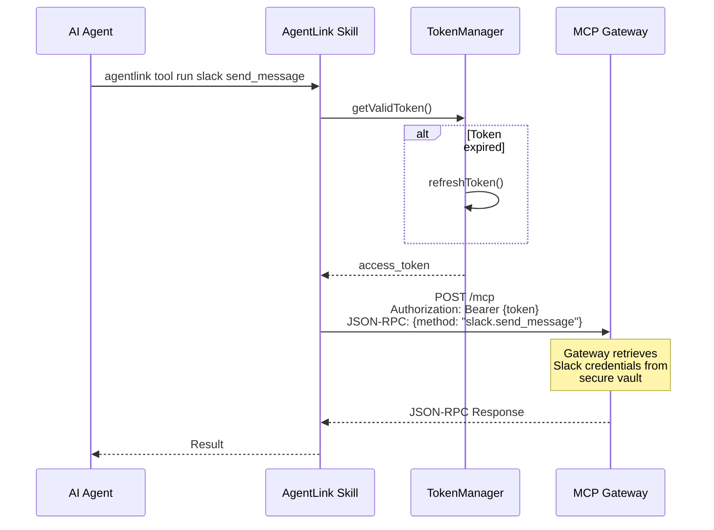

### Skill Injection During Setup

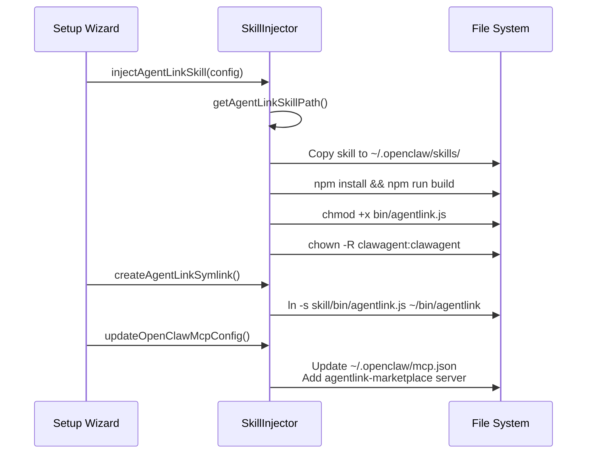

**Key Files:**
- `/tools/agentlink-skill/src/commands/auth.ts`
- `/tools/agentlink-skill/src/commands/tool.ts`
- `/tools/agentlink-skill/src/lib/oauth-server.ts`
- `/tools/agentlink-skill/src/lib/token-manager.ts`
- `/libs/shield-sandbox/src/skill-injector.ts`

---

## Sandbox Architecture

The sandbox uses multiple isolation layers for defense in depth.

### Isolation Layers

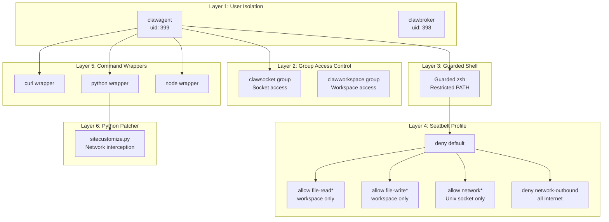

### User Hierarchy

```
root
├── clawbroker (uid: 398)
│   ├── Member of: clawsocket
│   ├── Home: /var/lib/agenshield/broker
│   └── Purpose: Runs broker daemon with elevated socket access
│
└── clawagent (uid: 399)
    ├── Member of: clawsocket, clawworkspace
    ├── Home: /var/lib/agenshield/agent
    ├── Shell: Guarded zsh (restricted PATH)
    └── Purpose: Runs sandboxed AI agent
```

### Directory Structure

```
/opt/agenshield/
├── bin/
│   └── agenshield-broker     # Broker binary
│
/etc/agenshield/
├── daemon.json               # Daemon configuration
├── policies/
│   ├── default.json          # Default policies
│   └── custom/               # Custom policy files
└── seatbelt/
    └── agent.sb              # Agent sandbox profile

/var/lib/agenshield/
├── agent/                    # Agent home
│   ├── bin/                  # Wrappers (curl, python, node)
│   ├── workspace/            # Agent workspace
│   └── .openclaw-pkg/        # Migrated OpenClaw package
│
└── broker/                   # Broker home

/var/run/agenshield/
└── broker.sock               # Unix socket (mode: 0770)

/var/log/agenshield/
├── broker.log
└── daemon.log
```

### Seatbelt Profile (Simplified)

```scheme
(version 1)
(deny default)

;; Allow reading from workspace
(allow file-read*
  (subpath "/var/lib/agenshield/agent/workspace"))

;; Allow writing to workspace
(allow file-write*
  (subpath "/var/lib/agenshield/agent/workspace"))

;; Allow Unix socket to broker
(allow network*
  (remote unix-socket
    (path-literal "/var/run/agenshield/broker.sock")))

;; Block all Internet access
(deny network-outbound
  (remote ip "*:*"))
```

### Wrapper Flow (curl example)

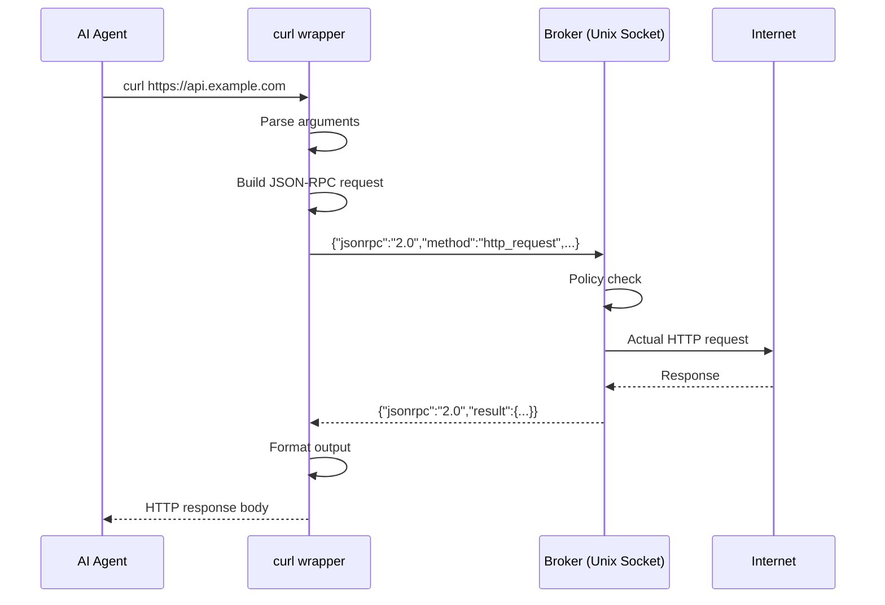

### Python Network Interception

The `sitecustomize.py` module is automatically loaded by Python and patches network modules:

```python
# Simplified concept
import urllib.request
import socket

_original_urlopen = urllib.request.urlopen

def _patched_urlopen(url, *args, **kwargs):
    # Route through broker
    return broker_http_request(url, *args, **kwargs)

urllib.request.urlopen = _patched_urlopen
```

**Key Files:**
- `/libs/shield-sandbox/src/guarded-shell.ts`
- `/libs/shield-sandbox/src/seatbelt.ts`
- `/libs/shield-sandbox/src/users.ts`
- `/libs/shield-sandbox/src/wrappers.ts`
- `/libs/shield-patcher/src/python/sitecustomize.ts`

---

## Security Model Summary

| Threat | Mitigation |
|--------|------------|
| Direct network access | Seatbelt blocks all outbound; wrappers route through broker |
| File system access | Seatbelt restricts to workspace; broker enforces policies |
| Privilege escalation | Unprivileged user (uid 399); no sudo |
| Command execution | Guarded shell; restricted PATH; broker policy for exec |
| Credential theft | AgentLink vault; secrets never reach agent |
| Policy bypass | Multiple layers; broker validates all requests |
| Configuration tampering | Config owned by root; agent has no write access |

---

## Quick Reference

### Start Services

```bash
# Start daemon (development)
npm run daemon

# Start broker via launchd
sudo launchctl load /Library/LaunchDaemons/com.agenshield.broker.plist
```

### Check Status

```bash
# CLI status
agenshield status

# API health
curl http://localhost:3847/api/health

# Broker ping
echo '{"jsonrpc":"2.0","id":1,"method":"ping"}' | nc -U /var/run/agenshield/broker.sock
```

### Configuration Locations

| File | Purpose |
|------|---------|
| `/etc/agenshield/daemon.json` | Daemon configuration |
| `/etc/agenshield/policies/default.json` | Default policies |
| `/var/lib/agenshield/agent/.openclaw/mcp.json` | Agent MCP config |
| `~/.agentlink/tokens.json` | AgentLink tokens (user) |
