# AgenShield Architecture

This document describes the architecture of AgenShield, a security sandbox for AI agents running on macOS.

## Table of Contents

- [System Overview](#system-overview)
- [Installation Sequence](#installation-sequence)
- [Daemon Architecture](#daemon-architecture)
- [Policy Update Mechanism](#policy-update-mechanism)
- [Broker Request Flow](#broker-request-flow)
- [Interceptor Architecture](#interceptor-architecture)
- [AgenCo Skill Flow](#agenco-skill-flow)
- [Sandbox Architecture](#sandbox-architecture)
- [LaunchDaemon Configuration](#launchdaemon-configuration)

---

## System Overview

AgenShield provides a multi-layer security sandbox that isolates AI agents from the host system while allowing controlled access to resources through a policy-enforced broker.

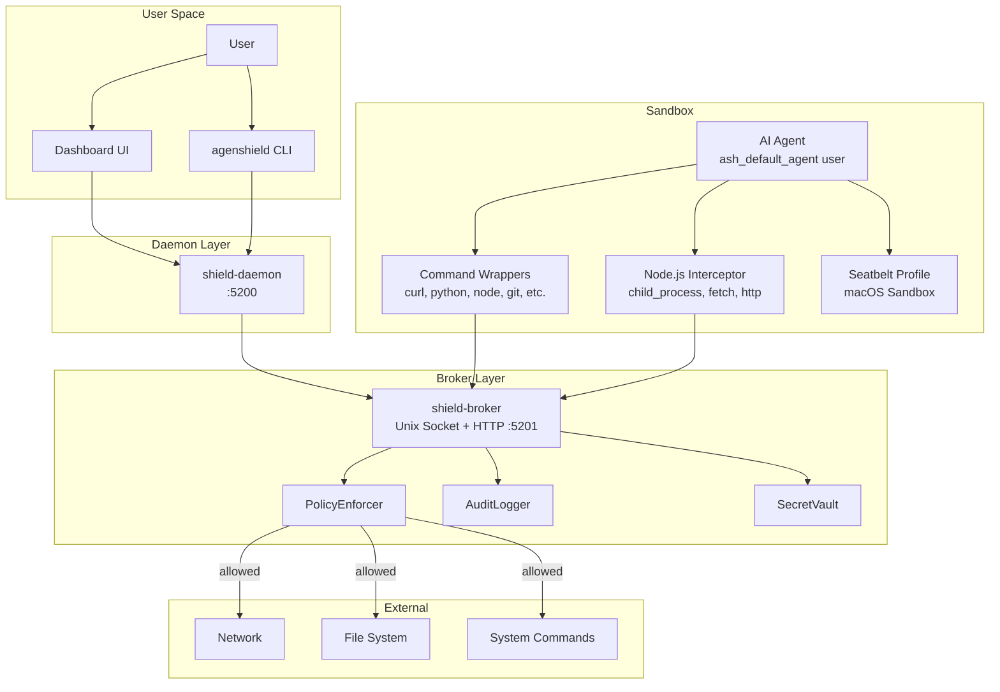

### Component Relationships

| Component | Role | Communication |
|-----------|------|---------------|
| **CLI** | Installation, configuration, status | Direct system calls |
| **Daemon** | HTTP API, real-time events, UI serving | HTTP REST + SSE on port 5200 |
| **Broker** | Request mediation, policy enforcement | Unix Socket + HTTP fallback on port 5201 |
| **Interceptor** | Runtime hook for Node.js processes | JSON-RPC to daemon `/rpc` endpoint |
| **Sandbox** | Agent isolation, network blocking | Seatbelt profiles, user isolation |

### Key Files

- `/libs/cli/` - Command-line interface
- `/libs/shield-daemon/` - Management daemon
- `/libs/shield-broker/` - Request broker
- `/libs/shield-sandbox/` - Sandbox utilities
- `/libs/shield-interceptor/` - Node.js runtime interception
- `/libs/shield-ipc/` - Shared types and schemas
- `/libs/shield-integrations/` - OpenClaw and third-party integrations
- `/libs/shield-skills/` - Skill analysis and management
- `/libs/shield-patcher/` - Python network isolation

---

## Installation Sequence

The setup wizard runs in two phases: detection (automatic) and setup (after user confirmation).

### Phase 1: Detection (5 Steps)

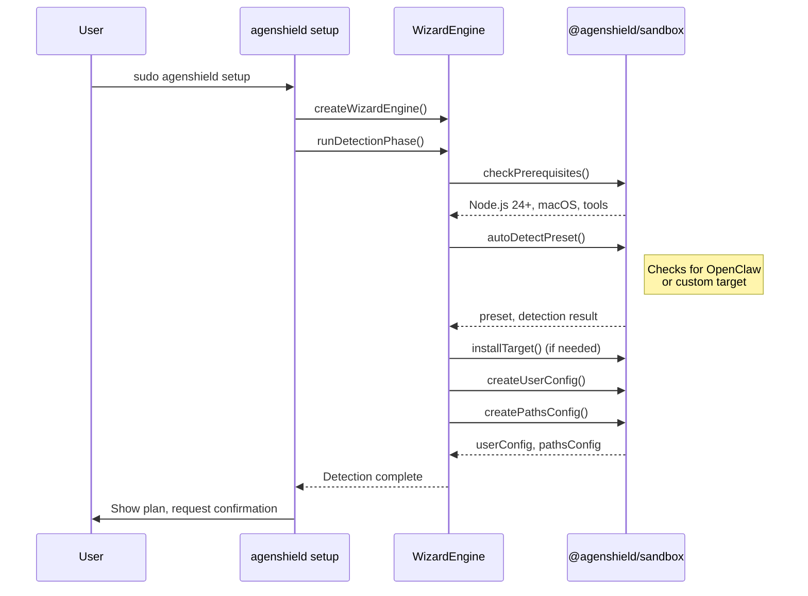

### Phase 2: Setup (24 Steps)

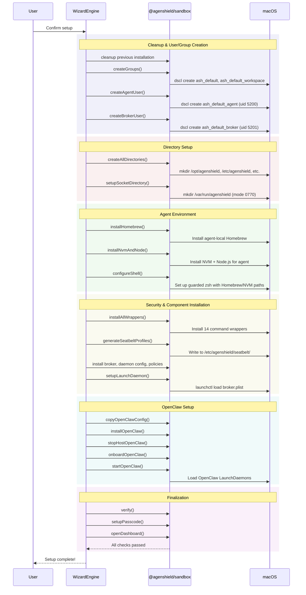

### Wizard Step Reference

| # | Step ID | Name | Description |
|---|---------|------|-------------|
| 1 | `prerequisites` | Check Prerequisites | Verify Node.js 24+, macOS, required tools |
| 2 | `detect` | Detect Target | Find OpenClaw or custom target |
| 3 | `install-target` | Install Target | Install target application if not found |
| 4 | `configure` | Configure | Set up user configuration |
| 5 | `confirm` | Confirm Setup | Show plan, get user confirmation |
| 6 | `cleanup-previous` | Clean Previous | Remove any previous AgenShield installation |
| 7 | `create-groups` | Create Groups | Create `ash_default` and `ash_default_workspace` groups |
| 8 | `create-agent-user` | Create Agent User | Create `ash_default_agent` (uid 5200) with guarded shell |
| 9 | `create-broker-user` | Create Broker User | Create `ash_default_broker` (uid 5201) |
| 10 | `create-directories` | Create Directories | Create /opt/agenshield, /etc/agenshield, etc. |
| 11 | `setup-socket` | Setup Socket | Create /var/run/agenshield/ (mode 0770) |
| 12 | `install-homebrew` | Install Homebrew | Install agent-local Homebrew (up to 2 min) |
| 13 | `install-nvm` | Install NVM & Node.js | Install NVM and Node.js for agent (up to 2 min) |
| 14 | `configure-shell` | Configure Shell | Set up guarded zsh with Homebrew and NVM paths |
| 15 | `install-wrappers` | Install Wrappers | Install 14 command wrappers to agent bin (up to 1 min) |
| 16 | `generate-seatbelt` | Generate Seatbelt | Generate macOS sandbox profiles |
| 17 | `install-broker` | Install Broker | Install broker binary to /opt/agenshield/bin/ |
| 18 | `install-daemon-config` | Install Daemon Config | Write /opt/agenshield/config/shield.json |
| 19 | `install-policies` | Install Policies | Write default security policies |
| 20 | `setup-launchdaemon` | Setup LaunchDaemon | Create and load broker launchd plist (up to 1 min) |
| 21 | `copy-openclaw-config` | Copy OpenClaw Config | Copy and sanitize OpenClaw config from host user |
| 22 | `install-openclaw` | Install OpenClaw | Install OpenClaw in agent sandbox (up to 3 min) |
| 23 | `stop-host-openclaw` | Stop Host OpenClaw | Stop OpenClaw daemon/gateway on host user |
| 24 | `onboard-openclaw` | Initialize OpenClaw | Run `openclaw onboard` in agent environment (up to 2 min) |
| 25 | `verify` | Verify Installation | Verify users, groups, directories, and permissions |
| 26 | `start-openclaw` | Start OpenClaw | Install and start OpenClaw LaunchDaemons |
| 27 | `setup-passcode` | Setup Passcode | Set a passcode to protect sensitive configuration |
| 28 | `open-dashboard` | Open Dashboard | Open AgenShield dashboard in browser |
| 29 | `complete` | Complete | Setup finished successfully |

**Key Files:**
- `/libs/cli/src/commands/setup.ts`
- `/libs/cli/src/wizard/engine.ts`
- `/libs/cli/src/wizard/types.ts`

---

## Daemon Architecture

The shield-daemon provides a management API and real-time event streaming on port 5200.

### Startup Flow

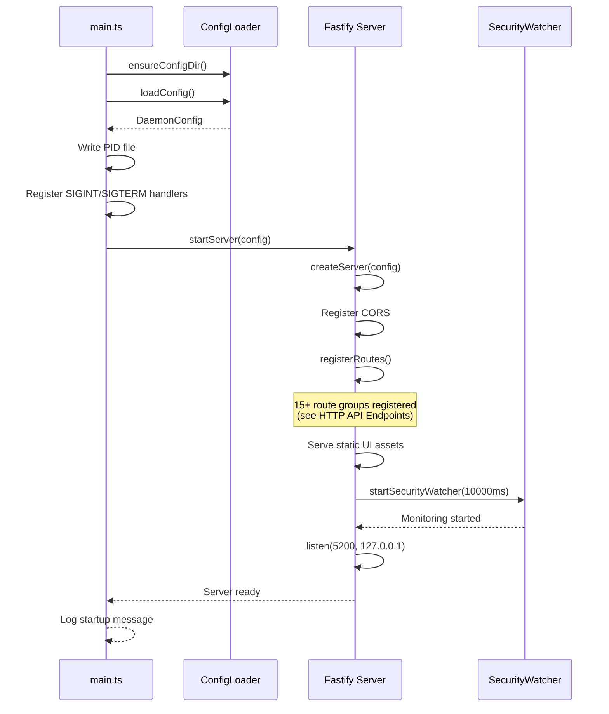

### HTTP API Endpoints

| Route Group | Method(s) | Key Endpoints | Description |
|-------------|-----------|---------------|-------------|
| `/api/health` | GET | `/api/health` | Health check |
| `/api/status` | GET | `/api/status` | Daemon status (uptime, version, pid) |
| `/api/config` | GET, PUT, POST | `GET/PUT /api/config`, `POST factory-reset`, `POST install-wrappers`, `GET openclaw`, `GET openclaw/diff`, `GET policies/instructions` | Configuration management |
| `/api/auth` | GET, POST | `GET status`, `POST setup/unlock/lock/refresh/enable/disable/change`, `POST anonymous-readonly` | Authentication and passcode |
| `/api/security` | GET | `/api/security` | Security status (users, processes) |
| `/api/wrappers` | GET, POST, PUT, DELETE | `GET list`, `GET :name`, `GET status`, `POST install/sync/regenerate/custom`, `PUT :name`, `DELETE :name`, `DELETE custom/:name` | Wrapper management |
| `/api/skills` | GET, POST, PUT, DELETE | `GET list/quarantined/:name`, `POST :name/analyze/:name/approve`, `DELETE :name`, `POST :name/revoke`, `PUT :name/toggle` | Skill management |
| `/api/marketplace` | GET, POST | `GET search/skills/:slug/analysis`, `POST analyze/install` | Skill marketplace |
| `/api/secrets` | GET, POST, PATCH, DELETE | `GET list/env/skill-env`, `POST create`, `PATCH :id`, `DELETE :id` | Secrets management |
| `/api/exec` | GET, POST, DELETE | `GET system-bins/allowed-commands`, `POST/DELETE allowed-commands` | Execution control |
| `/api/discovery` | GET | `GET /api/discovery/scan` | System discovery |
| `/api/activity` | GET | `GET /api/activity` | Activity history |
| `/api/agenco` | GET, POST | OAuth flow, MCP activation/deactivation/status, tool run/list/search, integrations | AgenCo integration |
| `/api/openclaw` | GET, POST | `GET status/dashboard-url`, `POST start/stop/restart` | OpenClaw management |
| `/api/fs` | GET | `GET /api/fs/browse` | Filesystem browsing |
| `/sse/events` | GET | `/sse/events`, `/sse/events/:filter` | Server-Sent Events stream |
| `/rpc` | POST | `/rpc` | JSON-RPC 2.0 (interceptor: `policy_check`, `events_batch`, `http_request`, `ping`) |

### SSE Events

Events are streamed via `/sse/events` and can be filtered by prefix using `/sse/events/:filter`.

| Category | Event Types |
|----------|------------|
| `security:` | `status`, `warning`, `critical`, `alert` |
| `skills:` | `quarantined`, `untrusted_detected`, `approved`, `analyzed`, `analysis_failed`, `install_started`, `install_progress`, `installed`, `install_failed`, `uninstalled` |
| `wrappers:` | `installed`, `uninstalled`, `updated`, `custom_added`, `custom_removed`, `synced`, `regenerated` |
| `broker:` | `request`, `response` |
| `exec:` | `monitored`, `denied` |
| `agenco:` | `connected`, `disconnected`, `auth_required`, `auth_completed`, `tool_executed`, `error` |
| `config:` | `changed` |
| `api:` | `request`, `outbound` |
| `interceptor:` | `event` |
| `process:` | `started`, `stopped` |
| `daemon:` | `status` |
| *(root)* | `heartbeat` (every 30s) |

**Key Files:**
- `/libs/shield-daemon/src/main.ts`
- `/libs/shield-daemon/src/server.ts`
- `/libs/shield-daemon/src/config/loader.ts`
- `/libs/shield-daemon/src/routes/`

---

## Policy Update Mechanism

Policies control what operations the broker allows.

### Policy Structure

```typescript
interface PolicyConfig {
  version: string;
  defaultAction: 'allow' | 'deny';
  rules: PolicyRule[];
  fsConstraints?: {
    allowedPaths: string[];
    deniedPatterns: string[];
  };
  networkConstraints?: {
    allowedHosts: string[];
    deniedHosts: string[];
    allowedPorts: number[];
  };
}

interface PolicyRule {
  id: string;
  name: string;
  type: 'allowlist' | 'denylist';
  operations: string[];  // e.g., ['http_request', 'file_read']
  patterns: string[];    // Glob patterns for targets
  enabled: boolean;
  priority: number;      // Higher = evaluated first
  scope?: string;        // Optional scope restriction
}
```

### Policy Evaluation Flow

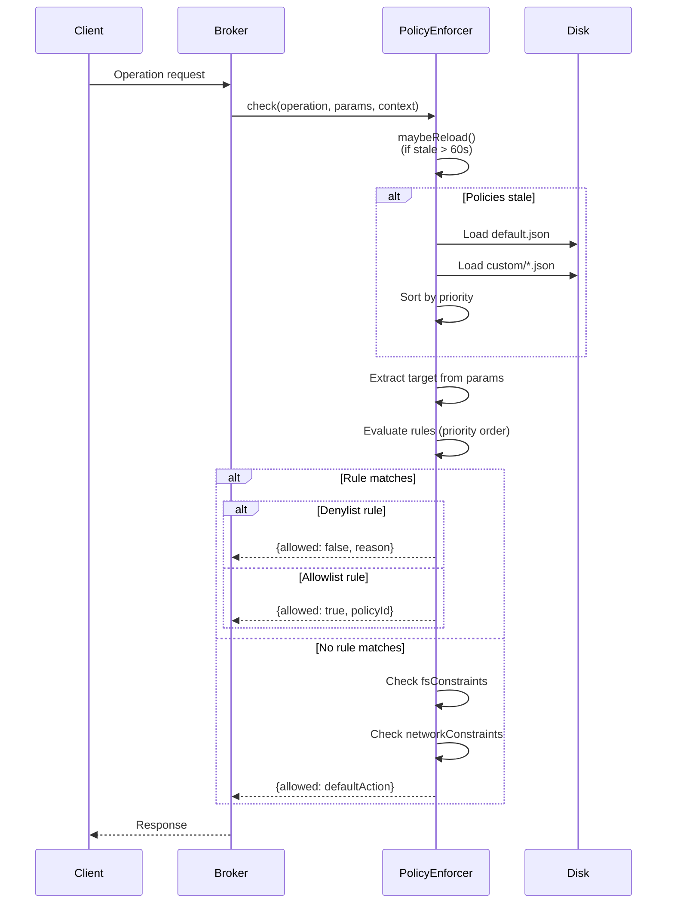

### Configuration Update via API

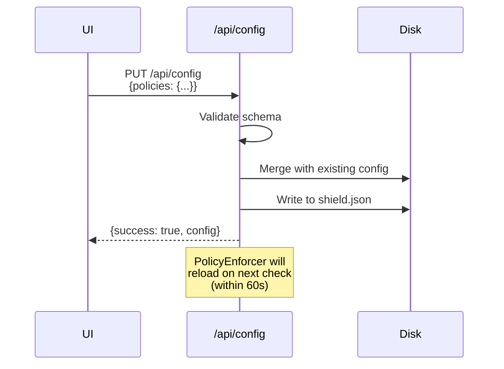

**Key Files:**
- `/libs/shield-daemon/src/routes/config.ts`
- `/libs/shield-broker/src/policies/enforcer.ts`
- `/libs/shield-ipc/src/schemas/policy.schema.ts`

---

## Broker Request Flow

The broker mediates all operations from the sandboxed agent.

### Request Processing

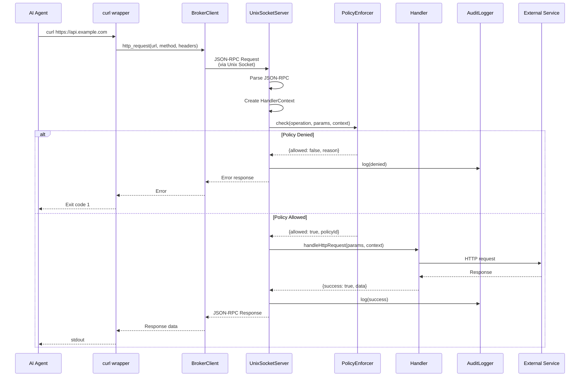

### Operation Types

| Operation | Description | Socket | HTTP |
|-----------|-------------|:------:|:----:|
| `http_request` | Proxy HTTP requests | ✓ | ✓ |
| `file_read` | Read file contents | ✓ | ✓ |
| `file_write` | Write file contents | ✓ | ✗ |
| `file_list` | List directory contents | ✓ | ✓ |
| `exec` | Execute system commands | ✓ | ✗ |
| `secret_inject` | Inject vault secrets | ✓ | ✗ |
| `open_url` | Open URL in browser | ✓ | ✓ |
| `ping` | Health check | ✓ | ✓ |

### Channel Restrictions

The HTTP fallback server is more restricted than the Unix socket for security:

```typescript
// HTTP Allowed
const HTTP_ALLOWED = ['http_request', 'file_read', 'file_list', 'open_url', 'ping'];

// HTTP Denied (socket-only)
const HTTP_DENIED = ['exec', 'file_write', 'secret_inject'];
```

**Key Files:**
- `/libs/shield-broker/src/server.ts` - Unix socket server
- `/libs/shield-broker/src/http-fallback.ts` - HTTP fallback server
- `/libs/shield-broker/src/policies/enforcer.ts`
- `/libs/shield-broker/src/client/broker-client.ts`
- `/libs/shield-ipc/src/types/ops.ts`

---

## Interceptor Architecture

The Node.js interceptor hooks into running processes to enforce policies at runtime, catching programmatic calls that bypass command wrappers.

### What It Intercepts

| Module | What's Hooked | Purpose |
|--------|--------------|---------|
| `child_process` | `spawn`, `spawnSync`, `exec`, `execSync`, `execFile`, `execFileSync`, `fork` | Catch subprocess creation |
| `fetch` | Global `fetch()` | Catch HTTP requests via fetch API |
| `http` / `https` | `request()`, `get()` | Catch HTTP requests via Node.js modules |
| `WebSocket` | Constructor | Catch WebSocket connections |

### How It Loads

The interceptor is injected into Node.js processes via `NODE_OPTIONS`:

```
NODE_OPTIONS="--require /opt/agenshield/lib/interceptor/register.cjs"
```

The `register.cjs` file:
1. Loads the interceptor configuration from environment variables
2. Patches `child_process` methods synchronously (before any user code runs)
3. Patches `fetch` and `http`/`https` modules
4. Establishes communication with the daemon via JSON-RPC on `/rpc`

### Sync Policy Checking Flow

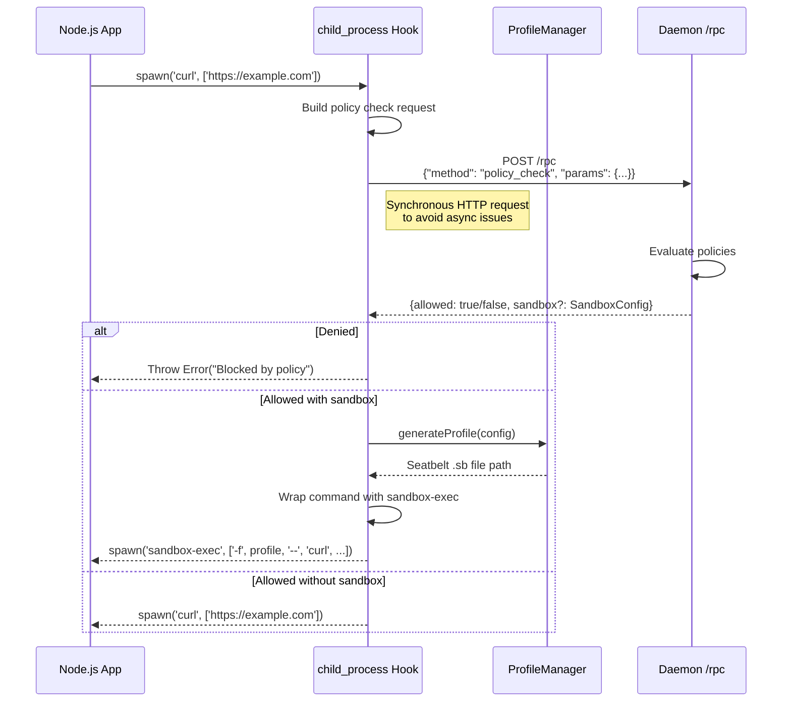

### Profile Manager

The `ProfileManager` dynamically generates macOS Seatbelt profiles for individual commands based on policy check results:

- Generates deny-default `.sb` profiles with targeted allowlists
- Caches profiles in `/tmp/agenshield-profiles/` (or `AGENSHIELD_SEATBELT_DIR`)
- Profiles are scoped per-command with unique hashes
- Wraps the original command with `sandbox-exec -f <profile> --`

### Interceptor Environment Variables

| Variable | Default | Description |
|----------|---------|-------------|
| `AGENSHIELD_INTERCEPT_EXEC` | `true` | Hook child_process |
| `AGENSHIELD_INTERCEPT_FETCH` | `true` | Hook fetch() |
| `AGENSHIELD_INTERCEPT_HTTP` | `true` | Hook http/https |
| `AGENSHIELD_INTERCEPT_WS` | `true` | Hook WebSocket |
| `AGENSHIELD_CONTEXT_TYPE` | `agent` | Context: `agent` or `skill` |
| `AGENSHIELD_SKILL_SLUG` | | Skill identifier when context is `skill` |
| `AGENSHIELD_SEATBELT` | `true` | Enable seatbelt wrapping |
| `AGENSHIELD_FAIL_OPEN` | `false` | Allow on broker errors |

**Key Files:**
- `/libs/shield-interceptor/src/interceptors/child-process.ts`
- `/libs/shield-interceptor/src/interceptors/fetch.ts`
- `/libs/shield-interceptor/src/seatbelt/profile-manager.ts`
- `/libs/shield-interceptor/src/register.ts`

---

## AgenCo Skill Flow

AgenCo provides secure third-party integrations without exposing credentials to the AI agent.

### Authentication Flow

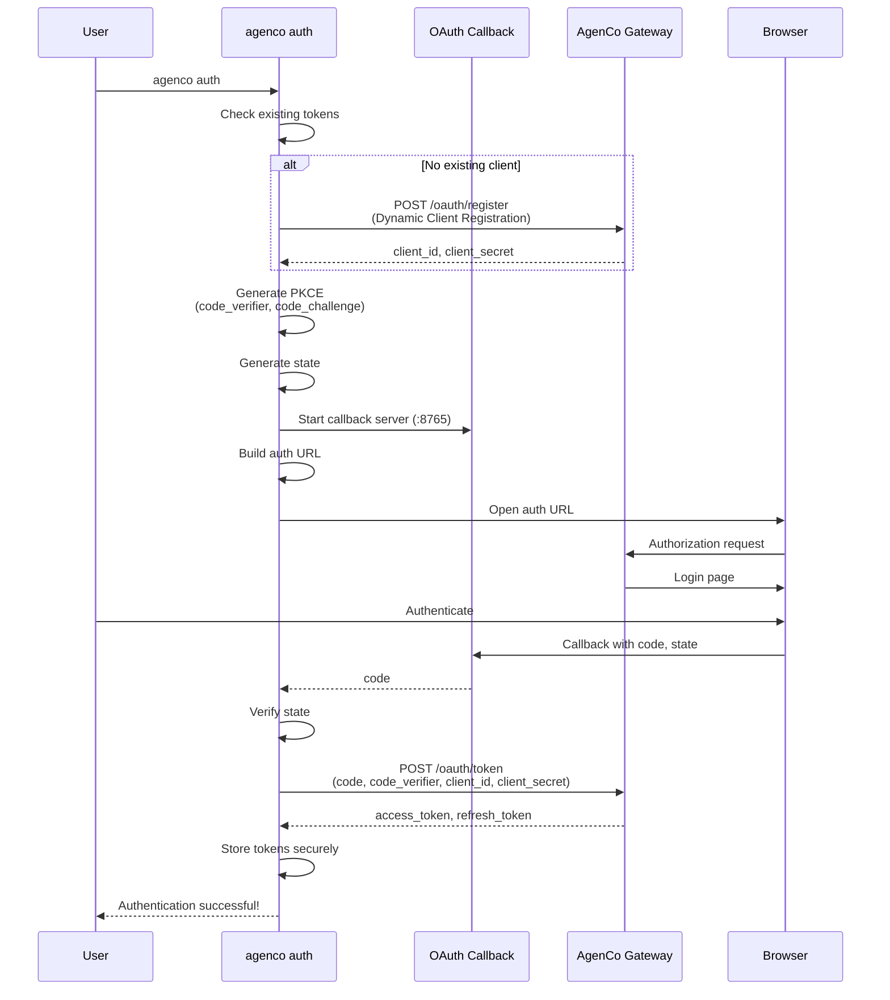

### Tool Execution Flow

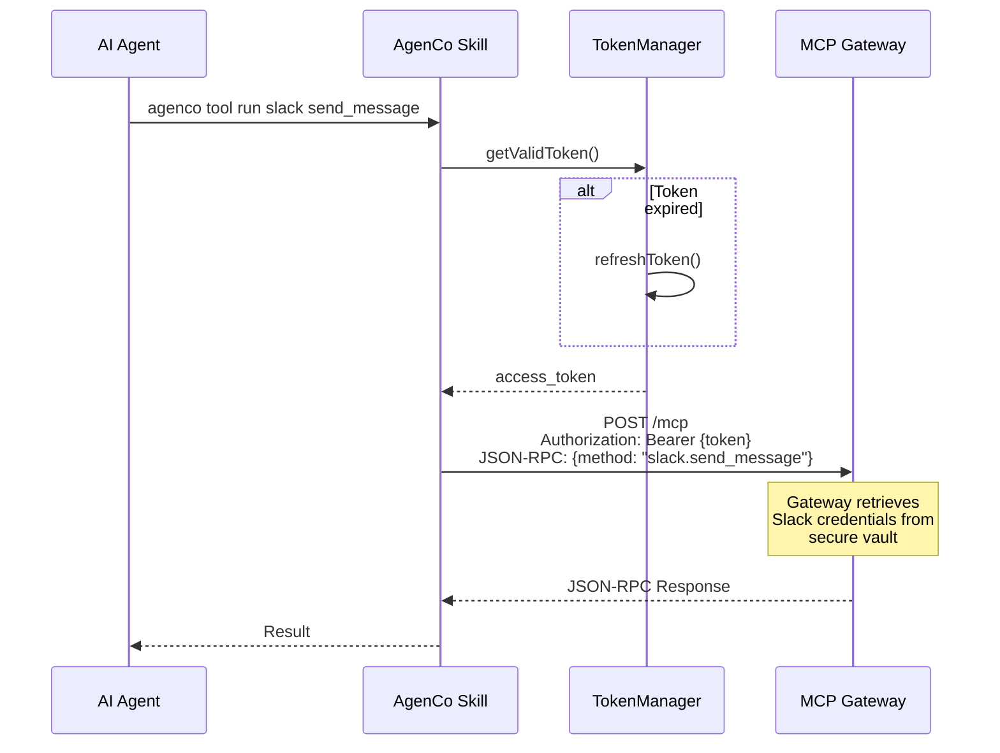

### Skill Injection During Setup

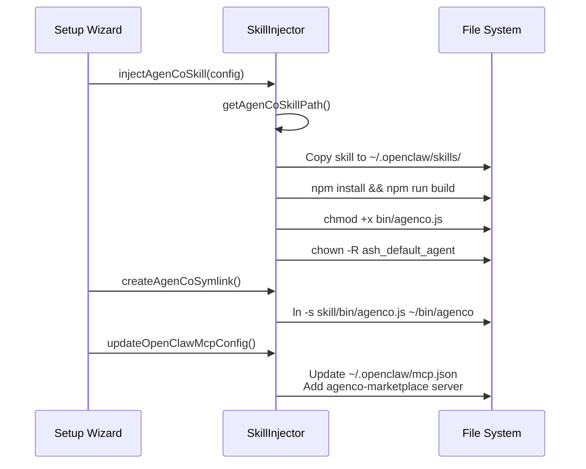

**Key Files:**
- `/tools/agenco-skill/src/commands/auth.ts`
- `/tools/agenco-skill/src/commands/tool.ts`
- `/tools/agenco-skill/src/lib/oauth-server.ts`
- `/tools/agenco-skill/src/lib/token-manager.ts`
- `/libs/shield-sandbox/src/skill-injector.ts`

---

## Sandbox Architecture

The sandbox uses multiple isolation layers for defense in depth.

### Isolation Layers

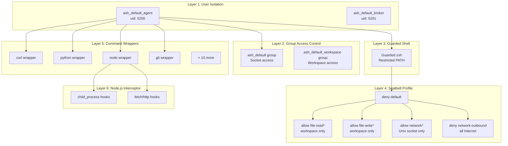

### User Hierarchy

```
root
├── ash_default_broker (uid: 5201)
│   ├── Member of: ash_default
│   ├── Home: /var/empty
│   └── Purpose: Runs broker daemon with elevated socket access
│
└── ash_default_agent (uid: 5200)
    ├── Member of: ash_default, ash_default_workspace
    ├── Home: /Users/ash_default_agent
    ├── Shell: Guarded zsh (restricted PATH)
    └── Purpose: Runs sandboxed AI agent
```

### Directory Structure

```
/opt/agenshield/
├── bin/
│   ├── agenshield-broker        # Broker binary
│   ├── node-bin                 # Node.js binary for broker
│   └── openclaw-launcher.sh     # OpenClaw launch script
├── config/
│   └── shield.json              # Daemon configuration
├── policies/
│   ├── default.json             # Default policies
│   └── custom/                  # Custom policy files
├── lib/
│   └── interceptor/
│       └── register.cjs         # Node.js interceptor loader
├── ops/                         # Operational data
└── quarantine/
    └── skills/                  # Quarantined skill packages

/etc/agenshield/
├── seatbelt/
│   ├── agent.sb                 # Agent sandbox profile
│   └── ops/                     # Per-operation seatbelt profiles
└── zdot/                        # Guarded shell configuration

/Users/ash_default_agent/
├── bin/                         # Wrappers (curl, python, node, git, etc.)
├── .openclaw/
│   ├── mcp.json                 # MCP server configuration
│   └── skills/                  # Installed skills
├── workspace/                   # Agent workspace (setgid)
└── .nvm/                        # Node Version Manager

/var/run/agenshield/
└── agenshield.sock              # Unix socket (mode: 0770)

/var/log/agenshield/
├── broker.log
├── broker.error.log
├── openclaw-daemon.log
├── openclaw-gateway.log
└── daemon.log
```

### Wrapper Definitions

All 14 command wrappers installed to `/Users/ash_default_agent/bin/`:

| Wrapper | Type | Description |
|---------|------|-------------|
| `shieldctl` | Control | AgenShield control CLI |
| `curl` | Network-monitored | Routes HTTP requests through broker |
| `wget` | Network-monitored | Routes HTTP requests through broker |
| `git` | Network-monitored | Git with network routing through broker |
| `ssh` | Network-monitored | SSH connections routed through broker |
| `scp` | Network-monitored | SCP transfers routed through broker |
| `brew` | Network-monitored | Homebrew routed through broker |
| `npm` | Package manager | Delegates to NVM npm (patched node loads interceptor) |
| `npx` | Package manager | Delegates to NVM npx (patched node loads interceptor) |
| `node` | Interceptor | Node.js with AgenShield interceptor (`NODE_OPTIONS --require`) |
| `python` | Seatbelt | Python with seatbelt network isolation |
| `python3` | Seatbelt | Python3 with seatbelt network isolation |
| `pip` | Seatbelt | pip with Python seatbelt isolation |
| `open-url` | Utility | Open URL through broker |

### Seatbelt Profile (Simplified)

```scheme
(version 1)
(deny default)

;; Allow reading from workspace
(allow file-read*
  (subpath "/Users/ash_default_agent/workspace"))

;; Allow writing to workspace
(allow file-write*
  (subpath "/Users/ash_default_agent/workspace"))

;; Allow Unix socket to broker
(allow network*
  (remote unix-socket
    (path-literal "/var/run/agenshield/agenshield.sock")))

;; Block all Internet access
(deny network-outbound
  (remote ip "*:*"))
```

### Wrapper Flow (curl example)

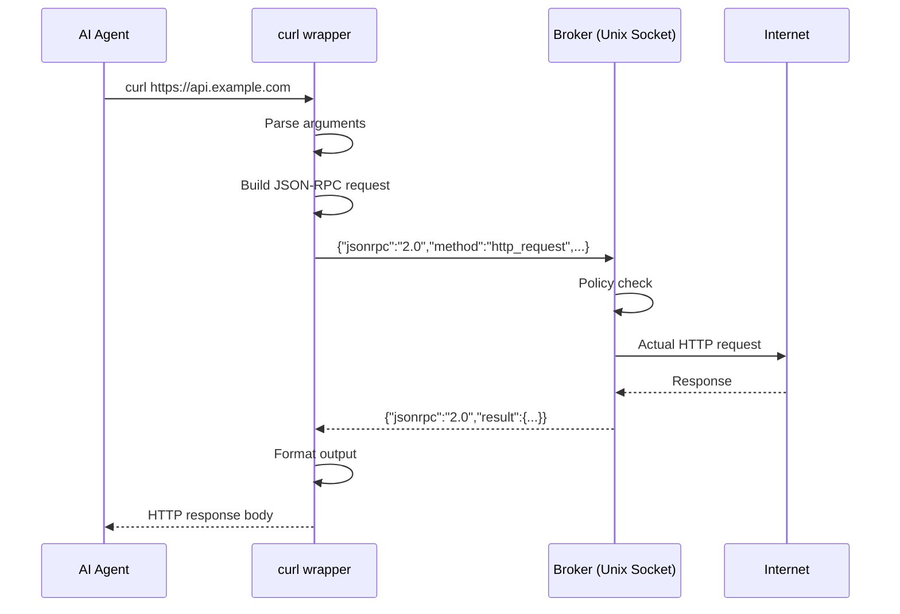

### Python Network Interception

The `sitecustomize.py` module is automatically loaded by Python and patches network modules:

```python
# Simplified concept
import urllib.request
import socket

_original_urlopen = urllib.request.urlopen

def _patched_urlopen(url, *args, **kwargs):
    # Route through broker
    return broker_http_request(url, *args, **kwargs)

urllib.request.urlopen = _patched_urlopen
```

**Key Files:**
- `/libs/shield-sandbox/src/guarded-shell.ts`
- `/libs/shield-sandbox/src/seatbelt.ts`
- `/libs/shield-sandbox/src/users.ts`
- `/libs/shield-sandbox/src/wrappers.ts`
- `/libs/shield-patcher/src/python/sitecustomize.ts`
- `/libs/shield-interceptor/src/seatbelt/profile-manager.ts`

---

## LaunchDaemon Configuration

AgenShield installs three LaunchDaemons to manage its services.

### Broker (`com.agenshield.broker`)

**Plist:** `/Library/LaunchDaemons/com.agenshield.broker.plist`

| Setting | Value |
|---------|-------|
| Program | `/opt/agenshield/bin/node-bin` + `/opt/agenshield/bin/agenshield-broker` |
| User | `ash_default_broker` |
| Group | `ash_default` |
| RunAtLoad | `true` |
| KeepAlive | `true` |
| ThrottleInterval | 10s |
| Stdout | `/var/log/agenshield/broker.log` |
| Stderr | `/var/log/agenshield/broker.error.log` |
| Working Directory | `/opt/agenshield` |

**Environment:**
- `AGENSHIELD_CONFIG=/opt/agenshield/config/shield.json`
- `AGENSHIELD_SOCKET=/var/run/agenshield/agenshield.sock`
- `AGENSHIELD_AGENT_HOME=/Users/ash_default_agent`
- `NODE_ENV=production`

### OpenClaw Daemon (`com.agenshield.openclaw.daemon`)

**Plist:** `/Library/LaunchDaemons/com.agenshield.openclaw.daemon.plist`

| Setting | Value |
|---------|-------|
| Program | `/opt/agenshield/bin/openclaw-launcher.sh daemon run` |
| User | `ash_default_agent` |
| Group | `ash_default` |
| RunAtLoad | `false` |
| KeepAlive | OtherJobEnabled: `com.agenshield.broker` |
| ThrottleInterval | 10s |
| Stdout | `/var/log/agenshield/openclaw-daemon.log` |
| Stderr | `/var/log/agenshield/openclaw-daemon.error.log` |

### OpenClaw Gateway (`com.agenshield.openclaw.gateway`)

**Plist:** `/Library/LaunchDaemons/com.agenshield.openclaw.gateway.plist`

| Setting | Value |
|---------|-------|
| Program | `/opt/agenshield/bin/openclaw-launcher.sh gateway run` |
| User | `ash_default_agent` |
| Group | `ash_default` |
| RunAtLoad | `false` |
| KeepAlive | OtherJobEnabled: `com.agenshield.broker` |
| ThrottleInterval | 10s |
| Stdout | `/var/log/agenshield/openclaw-gateway.log` |
| Stderr | `/var/log/agenshield/openclaw-gateway.error.log` |

### OpenClaw Launcher Script

The launcher script at `/opt/agenshield/bin/openclaw-launcher.sh`:

1. Sources NVM: `. /Users/ash_default_agent/.nvm/nvm.sh`
2. Sets `NODE_OPTIONS="--require /opt/agenshield/lib/interceptor/register.cjs"` (enables interceptor)
3. Exports AgenShield environment variables
4. Executes: `openclaw <daemon|gateway> run`

This ensures all OpenClaw processes run with the Node.js interceptor active.

---

## Security Model Summary

| Threat | Mitigation |
|--------|------------|
| Direct network access | Seatbelt blocks all outbound; wrappers route through broker |
| File system access | Seatbelt restricts to workspace; broker enforces policies |
| Privilege escalation | Unprivileged user (uid 5200); no sudo |
| Command execution | Guarded shell; restricted PATH; broker policy for exec |
| Credential theft | AgenCo vault; secrets never reach agent |
| Policy bypass | Multiple layers; broker validates all requests |
| Configuration tampering | Config owned by root; agent has no write access |
| Programmatic network calls | Node.js interceptor hooks fetch, http, child_process |
| Python network calls | sitecustomize.py patches urllib, socket |

---

## Quick Reference

### Start Services

```bash
# Start daemon (development)
yarn daemon:dev

# Start broker via launchd
sudo launchctl load /Library/LaunchDaemons/com.agenshield.broker.plist

# Start OpenClaw services
sudo launchctl load /Library/LaunchDaemons/com.agenshield.openclaw.daemon.plist
sudo launchctl load /Library/LaunchDaemons/com.agenshield.openclaw.gateway.plist
```

### Check Status

```bash
# CLI status
agenshield status

# API health
curl http://127.0.0.1:5200/api/health

# Broker ping
echo '{"jsonrpc":"2.0","id":1,"method":"ping"}' | nc -U /var/run/agenshield/agenshield.sock
```

### Configuration Locations

| File | Purpose |
|------|---------|
| `/opt/agenshield/config/shield.json` | Daemon configuration |
| `/opt/agenshield/policies/default.json` | Default policies |
| `/opt/agenshield/policies/custom/` | Custom policy files |
| `/Users/ash_default_agent/.openclaw/mcp.json` | Agent MCP config |
| `/etc/agenshield/seatbelt/agent.sb` | Agent seatbelt profile |
| `/etc/agenshield/zdot/` | Guarded shell config |
| `~/.agenco/tokens.json` | AgenCo tokens (user) |
