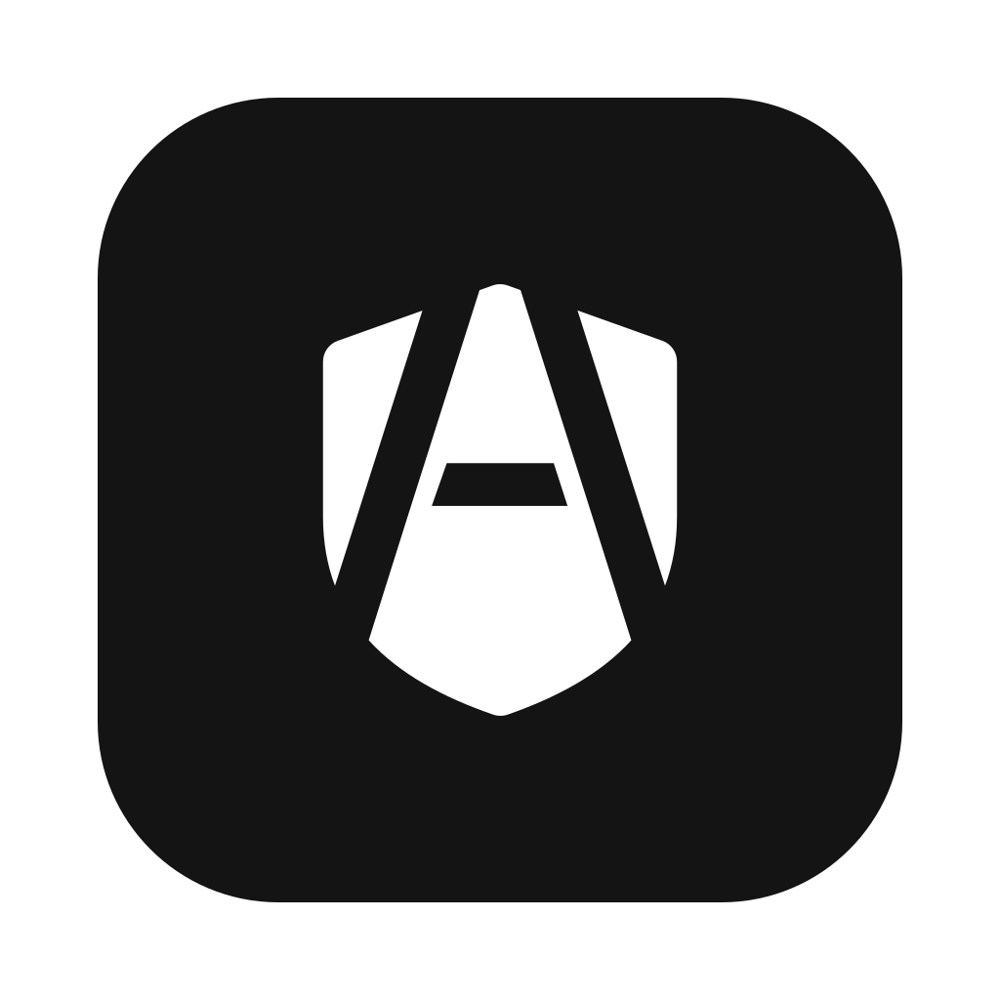

<div align="center">



# AgenShield

**Endpoint security and policy enforcement for AI coding agents**

[agen.co](https://agen.co) &nbsp;·&nbsp; by [Frontegg](https://frontegg.com)

[](https://github.com/agen-co/agenshield/releases)
&nbsp;[](./LICENSE)
&nbsp;[-555.svg)](#install)
&nbsp;[](https://portal.frontegg.com)

</div>

---

AgenShield keeps AI coding agents — Claude Code, OpenClaw, and others — inside the
guardrails your organization sets. A local daemon plus macOS **EndpointSecurity**
and **NetworkExtension** system extensions enforce, at the kernel level, exactly
what an agent may **execute**, **read**, and **connect to** — all driven by policy
you manage centrally from the cloud.

> **About this repository.** AgenShield is a commercial product with a closed
> source. This public repository is its home for **documentation, the changelog,
> and signed release downloads** — it does not contain the product source. Learn
> more at [agen.co](https://agen.co).

## What it does

| Capability | What it enforces |
| --- | --- |
| **Process control** | Allow or deny what an agent may execute — enforced in the kernel via EndpointSecurity. |
| **File guardrails** | Block reads and writes to sensitive paths: `.env`, SSH keys, credentials, tokens. |
| **Network policy** | Allowlist outbound connections, with TLS-terminating inspection. |
| **Skills and MCP** | Quarantine unapproved agent skills; govern Model Context Protocol servers. |
| **Managed settings** | Push organization configuration to Claude Code and other agents — users cannot override it. |
| **Telemetry and alerts** | Stream policy violations and security events to AgenShield Cloud. |

## Install

AgenShield is deployed from your organization's **AgenShield workspace** in the
Frontegg dashboard. Sign in at **[portal.frontegg.com](https://portal.frontegg.com)**,
open **AgenShield**, create a deployment campaign, and run the one-line install
command it gives you — it carries your enrollment token:

```bash
curl -fsSL '<YOUR_INSTALL_URL>' | bash
```

Prefer npm? Use the cloud URL and token from your workspace:

```bash
npx agenshield install --cloud-url <CLOUD_URL> --token <TOKEN>
agenshield start
```

Either way, the installer pulls the signed, notarized `.pkg` from this
repository's [Releases](https://github.com/agen-co/agenshield/releases) and
verifies it against the published `checksums.sha256`. Requires macOS 14 or later
(Apple Silicon).

## Documentation

Guides live in [`docs/`](./docs):

- [Installation](./docs/installation.md) — install, enroll, and uninstall on macOS
- [Usage](./docs/usage.md) — start the daemon, sign in, and what gets enforced
- [CLI reference](./docs/cli.md) — every `agenshield` command

## Releases

Each release attaches a signed macOS installer to a
[GitHub Release](https://github.com/agen-co/agenshield/releases). The full,
versioned history is in [`CHANGELOG.md`](./CHANGELOG.md).

## Support

- [Open an issue](https://github.com/agen-co/agenshield/issues)
- [agen.co](https://agen.co)
- [support@frontegg.com](mailto:support@frontegg.com)

---

<div align="center">

**[AgenShield](https://agen.co)** — built by **[Frontegg](https://frontegg.com)**

© Frontegg LTD &nbsp;·&nbsp; Licensed under [Apache-2.0](./LICENSE)

</div>
