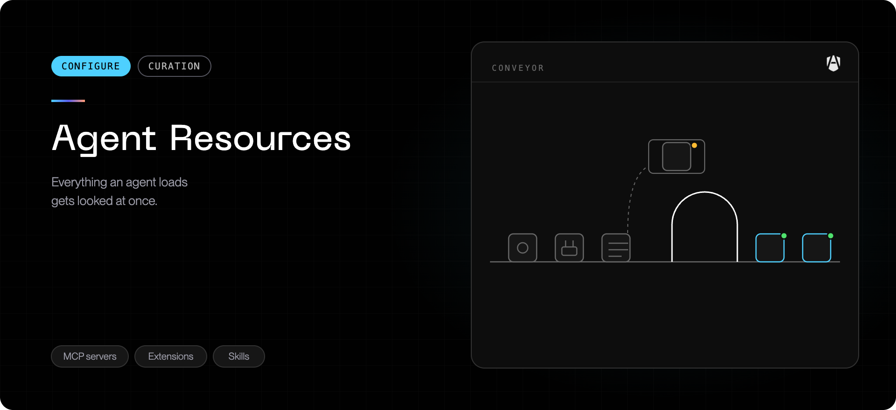
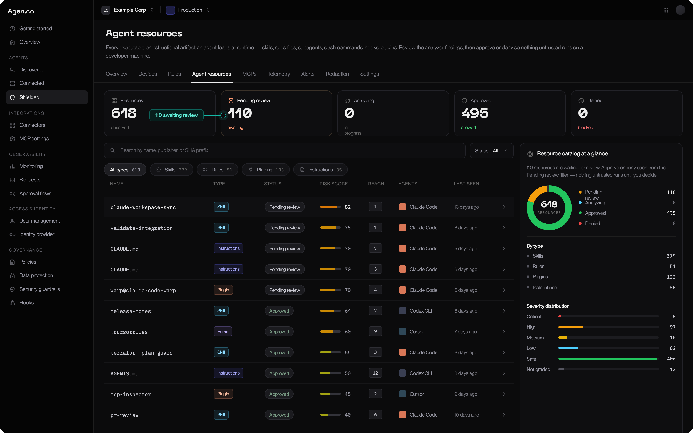
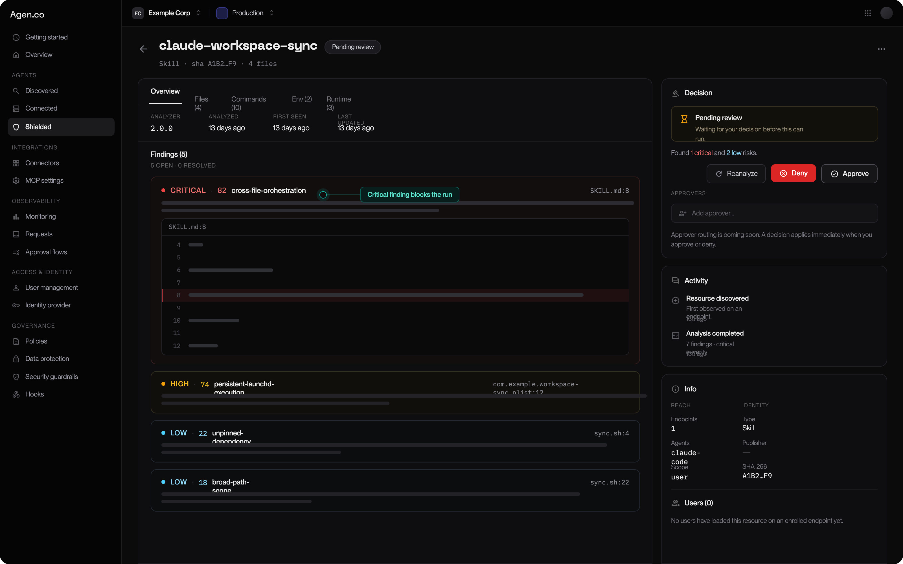
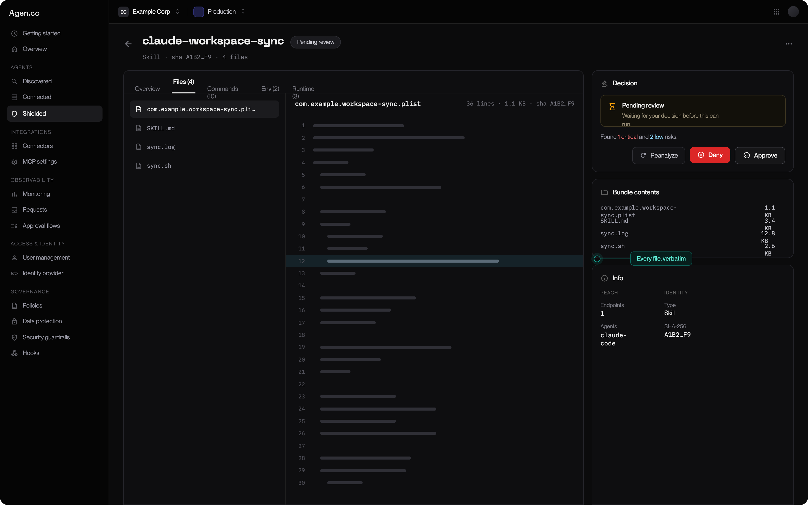
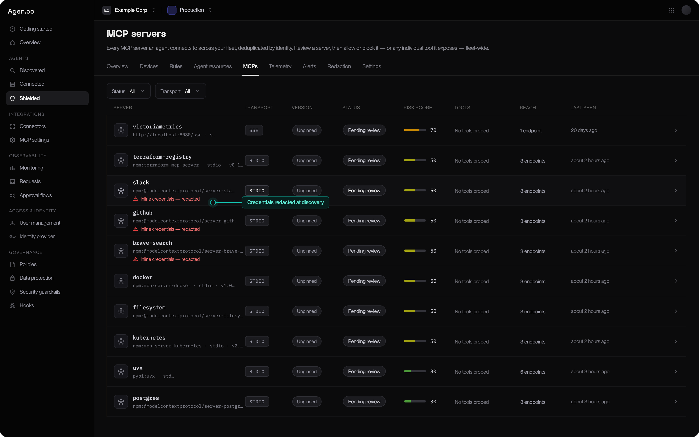

An AI agent is not just its binary. It loads **skills**, instruction files,
subagents, slash commands, hooks, plugins, and **MCP connectors** at runtime —
each of which changes what the agent does, and most of which arrive without
anyone reviewing them.

Policy rules do not cover this. An agent can be perfectly scoped by rules and
still load a skill that tells it to do something you would never have approved.
**Agent resources** is the surface that closes that gap — **AgenShield →
Skills** in the [Frontegg Portal](https://portal.frontegg.com)
(`https://portal.frontegg.com/<environment>/agen/shielded/skills`).

<Frame caption="The resource catalog — everything agents load across the fleet, with risk score, review state, and reach.">
  
</Frame>

## What gets catalogued

Everything an agent loads at runtime, deduplicated across the fleet by content
hash:

| Type             | What it is                                     |
| ---------------- | ---------------------------------------------- |
| **Skill**        | A packaged capability the agent can invoke     |
| **Rules**        | A rules file that shapes the agent's behaviour |
| **Subagent**     | A nested agent definition                      |
| **Command**      | A custom slash command                         |
| **Hook**         | Code that runs on an agent lifecycle event     |
| **MCP config**   | Connector configuration                        |
| **Plugin**       | A packaged extension                           |
| **Instructions** | An instruction file that steers the agent      |

Because they are deduplicated by hash, one row is one _distinct_ resource
however many Macs it appeared on. **Reach** tells you how many devices loaded
it — a resource on 40 machines is a different decision from the same resource on
one.

## The review lifecycle

<Steps>
  <Step title="Observed">
    An agent loaded it on an enrolled Mac. It appears in the catalog.
  </Step>
  <Step title="Analyzing">
    Automated analysis is grading it.
  </Step>
  <Step title="Analyzed, then pending review">
    It has a risk score and a summary of what it actually does. It is waiting on
    a decision — unless auto-approval covers it.
  </Step>
  <Step title="Approved or denied">
    **Approved** resources may load on enrolled endpoints. **Denied** resources
    are blocked fleet-wide.
  </Step>
</Steps>

A resource can also land in **Analysis failed** — treat that as _pending_, not
_safe_, and review it by hand.

## Risk scores

Analysis produces a score from 0 to 100, mapped to a band:

| Band         | Score  | Reading                                                             |
| ------------ | ------ | ------------------------------------------------------------------- |
| **Safe**     | 0–19   | No meaningful capability beyond its stated purpose                  |
| **Low**      | 20–39  | Ordinary capability, nothing surprising                             |
| **Medium**   | 40–59  | Real capability — network, filesystem, or process access            |
| **High**     | 60–79  | Broad capability, or capability that does not match its description |
| **Critical** | 80–100 | Credential access, exfiltration paths, or obfuscation               |

The score is an input to your decision, not the decision. Open the resource:
you get what it actually does, which agents load it, and how far it has spread.
A **Medium** resource everyone depends on and a **Medium** resource that appeared
on one machine last week deserve different treatment.

<Frame caption="A resource open for review — each finding points at the exact line that triggered it, next to Approve and Deny.">
  
</Frame>

Analysis is a summary, not a substitute for the source — the **Files** tab
carries every file the resource ships, verbatim, so a manual review never
requires hunting the file down on an endpoint:

<Frame caption="The Files tab — every file the resource ships, inspectable in place.">
  
</Frame>

## Auto-approval

Reviewing every resource by hand does not scale, and a queue nobody drains is
worse than no queue. So auto-approval is **on by default** with a threshold at
the top of the **Low** band: anything scoring at or below it is approved
automatically, everything above waits for a person.

**Settings → Enforcement → Resource auto-approval.**

| Setting              | Effect                                                                               |
| -------------------- | ------------------------------------------------------------------------------------ |
| **Auto-approve off** | Every resource waits for review. Maximum control, and a queue you must actually work |
| **Threshold**        | The highest score approved without a human. The default admits Safe and Low          |

Raising it into **Medium** auto-approves resources with real network and
filesystem capability. That can be the right call for a mature fleet with good
rules underneath — but make it deliberately.

<Note>
  Auto-approval decides what happens to **new** resources. It never reverses a
  decision you already made: denied stays denied.
</Note>

## MCP servers

Connectors get their own page, because they are the resource type most likely to
reach outside your organization. Servers are deduplicated by identity across the
fleet, with their transport, version, reach, and risk score.

<Frame caption="The MCP server inventory — transport, risk, and review state per connector. Credentials found inline in a config are redacted at discovery.">
  
</Frame>

You can act at two levels:

| Decision                         | Effect                                                              |
| -------------------------------- | ------------------------------------------------------------------- |
| **Allow or block the server**    | Fleet-wide, for every agent                                         |
| **Allow or block a single tool** | Keep a useful connector while denying the one tool that worries you |

Per-tool control is the reason to look here rather than blocking connectors
wholesale. A connector with twelve useful tools and one that writes to
production does not have to be an all-or-nothing decision.

## How enforcement applies

Resource decisions follow the same three modes as everything else — and can be
set independently of the rest of policy. That lets you run a strict resource
allowlist while the rest of the fleet is still in monitor, or the reverse.

<Warning>
  One deliberate exception: when resources are set to **monitor**, AgenShield
  will not remove or quarantine files on disk, even for a rule that asks it to.
  Monitor means observe — it never destroys anything. To enforce one high-risk
  resource rule while staying broadly permissive, use **audit** and act on that
  single resource.
</Warning>

See [Enforcement modes](../configuration/enforcement-modes.mdx) for what the three
modes mean.

## Working the queue

<Steps>
  <Step title="Sort by reach, not by score">
    A Critical resource on one Mac is contained. A Medium one on the whole fleet
    is your actual exposure.
  </Step>
  <Step title="Decide once, fleet-wide">
    Approval and denial are global. You are not making this call per machine.
  </Step>
  <Step title="Deny with the developer in mind">
    A denied resource stops working for everyone who had it. Check reach first,
    and tell those teams.
  </Step>
  <Step title="Re-check after every agent update">
    Agent updates ship new bundled resources. New hashes mean new rows.
  </Step>
</Steps>

## Next

<Columns cols={2}>
  <Card title="Rules and policy" icon="list-checks" href="../configuration/policies.mdx">
    Governing what agents run, read, and connect to.
  </Card>
  <Card title="Telemetry" icon="activity" href="../configuration/telemetry.mdx">
    Watching resources load in real time.
  </Card>
</Columns>
