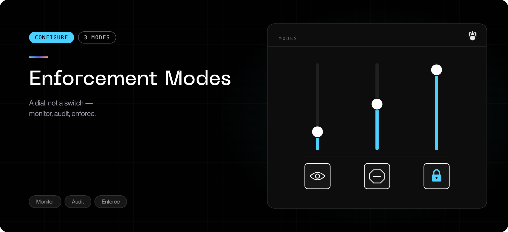

Your organization chooses how strictly AgenShield acts on what it observes.
There are three modes, and the difference between them decides how a rollout
feels.

## The three modes

| Mode        | Rule says allow | No matching rule | Rule says deny                             | Think of it as |
| ----------- | --------------- | ---------------- | ------------------------------------------ | -------------- |
| **monitor** | allow + record  | allow + record   | allow + record a _would-have-denied_ event | A dry run      |
| **audit**   | allow           | allow            | **deny** + record                          | A blocklist    |
| **enforce** | allow           | **deny**         | **deny** + record                          | An allowlist   |

The difference between `audit` and `enforce` is what happens to activity **no
rule covers**:

- In `audit`, unmatched activity is allowed. You are blocking a known list of bad
  things.
- In `enforce`, unmatched activity is denied. You are permitting a known list of
  good things.

`enforce` is stronger and much easier to get wrong — it blocks anything your
allow rules failed to anticipate. Get there via evidence, not on day one.

## Mode is set per rule, not only per fleet

Your organization sets a **default mode** for the fleet — shown in the Frontegg Portal as
**Bundle mode** on the Rules page — and **an individual rule can override it**.

```text
effective mode = the rule's own mode, if it sets one
                 otherwise, the fleet default
```

This is the mechanism behind a safe rollout: leave the fleet in `monitor`, then
promote exactly one well-understood rule to `enforce`. It also works in reverse —
a rule explicitly marked `monitor` stays observation-only even when the fleet is
in `enforce`, which is useful for trialling a new rule.

<Warning>
  Because of this, "the fleet is in monitor mode" does **not** guarantee nothing
  is ever blocked. A rule your administrator promoted still blocks. The Frontegg Portal
  shows which rules are currently enforcing.
</Warning>

## Where to see the active mode

The [Frontegg Portal](https://portal.frontegg.com) is the authoritative view — under **AgenShield → Enforcement** (`https://portal.frontegg.com/<environment>/agen/shielded/enforcement`) — where the Rules page shows the fleet default
(**Bundle mode**) and flags every rule that is pinned to its own mode — filter
the table by Enforcement to see exactly what is blocking today.

On a device, `agenshield status` confirms whether enforcement is active at all.
If a device reports that enforcement is paused or degraded, that is a health
problem rather than a mode setting — see
[Common issues](../troubleshoot/common-issues.mdx).

## What a developer sees when something is blocked

A blocked action fails like an ordinary permissions problem — there is no
AgenShield dialog in the terminal:

| Blocked action              | What the agent sees                             |
| --------------------------- | ----------------------------------------------- |
| Running a program           | The command fails to start, as if not permitted |
| Reading or writing a file   | A permission-denied error                       |
| Connecting to a destination | The connection fails or times out               |

Every block is recorded with the rule that caused it. If a block is wrong, that
record is what your administrator needs — send it to them rather than working
around it.

See [Rules and policy](../configuration/policies.mdx) for how a rule is authored and
how the Enforcement column tells you which rules are pinned.

## Skills, extensions, and connectors

The same three modes apply to the skills and connectors an agent loads, and they
can be set separately from the rest of policy. That lets you enforce a strict
skill allowlist while the rest of the fleet stays in monitor, or the reverse.

One deliberate exception: if skills are set to `monitor`, AgenShield will not
remove or quarantine skill files, even for a rule that asks it to. Monitor means
observe — it never destroys anything on disk. To enforce one high-risk skill rule
while staying broadly permissive, leave the skills mode at `audit` and promote
that single rule.

## What is never blocked, in any mode

Regardless of mode or policy:

- macOS system processes and system paths can never be denied. Those limits are
  compiled into the signed security extension — no configuration file, API,
  policy field, or administrator can change them.
- Your own account is not subject to the agent policy envelope. Enforcement is
  scoped to AI agents.
- If AgenShield starts denying an unexpected volume of ordinary system activity,
  it stands itself down automatically and allows everything for a cooling-off
  period.

Changing any of that would require shipping a newly signed release. This is
deliberate: a security product that can lock a user out of their own computer is
a bigger risk than the one it was installed to manage.

## Requesting a change

Enforcement is managed centrally — there is no local override on the device, by
design. To get a rule relaxed or an agent approved, send whoever administers
AgenShield the blocked-activity record from the Frontegg Portal.

## Next

<Columns cols={2}>
  <Card title="Rollout playbook" icon="map" href="../deployment/rollout-playbook.mdx">
    How to move from monitor to enforcement without breaking workflows.
  </Card>
  <Card title="Privacy and data handling" icon="lock" href="../configuration/privacy-and-data.mdx">
    What is recorded and what leaves the device.
  </Card>
  <Card title="Rules and policy" icon="list-checks" href="../configuration/policies.mdx">
    Authoring rules, and which ones are currently enforcing.
  </Card>
  <Card title="Agent resources" icon="puzzle" href="../configuration/agent-resources.mdx">
    How the modes apply to the skills and connectors agents load.
  </Card>
</Columns>
