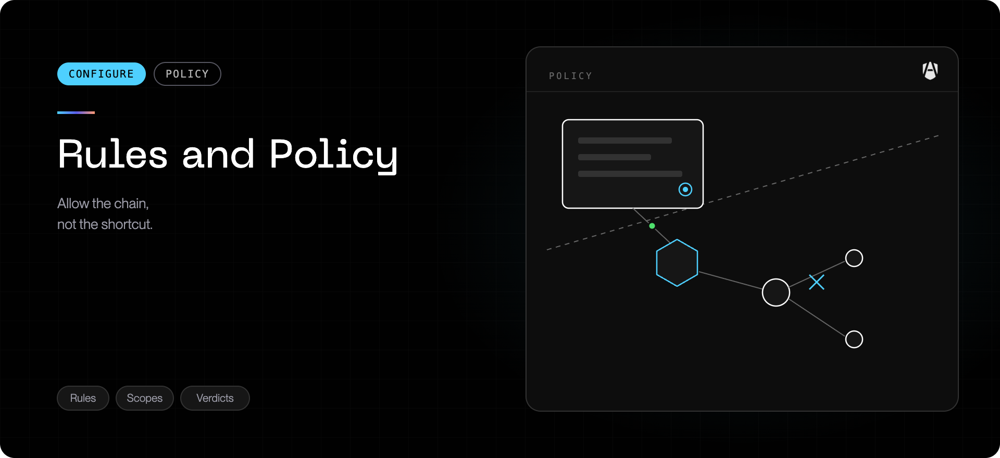

Policy in AgenShield is a set of **rules**, each attached to one or more AI
agents. A rule says what that agent may run, read, write, and connect to. The
fleet's default posture decides how strictly rules are applied — see
[Enforcement modes](../configuration/enforcement-modes.mdx).

<Note>
  Write rules **after** you have telemetry, not before. Two weeks of monitor-mode
  evidence produces rules that fit how your developers actually work; guessing
  produces rules you will spend a month relaxing. The
  [Rollout playbook](../deployment/rollout-playbook.mdx) sequences this.
</Note>

## How a rule is built

In the [Frontegg Portal](https://portal.frontegg.com), under **AgenShield →
Policies** (`https://portal.frontegg.com/<environment>/agen/shielded/policies`):
**Rules → New.** Two steps.

### 1. Pick the agents

Which AI agents the rule applies to — Claude Code, Cursor, Codex CLI, and
whatever else has been detected on your fleet. One rule can cover several agents;
it fans out to one rule per agent when saved, so you can tune them individually
afterwards.

Rules are scoped to an agent on purpose. A global command ban breaks somebody's
unrelated workflow; the same restriction attached to one agent does not.

### 2. Add grants

A **grant** is one permission statement. A rule carries as many as it needs, and
each grant has its own audience, scope, and enforcement:

| Grant type      | Governs                                  | You supply                                                 |
| --------------- | ---------------------------------------- | ---------------------------------------------------------- |
| **Network**     | Where the agent may connect              | Host and port patterns                                     |
| **Filesystem**  | What it may read, write, or delete       | Path patterns plus the operations they cover               |
| **Command**     | What it may execute                      | Command patterns                                           |
| **Sub-command** | What a program the agent launched may do | A chain of hops, each with its own network and file access |

**Sub-command grants** are the ones worth understanding. Agents rarely act
directly — they run a build tool, which runs a package manager, which reaches
the network. A sub-command grant lets you permit exactly that chain (agent →
build tool → registry) without granting the agent unrestricted network access.

## Where an agent is allowed to run

Separate from rules, and coarser: **agent run-control** decides which kind of
account each agent may run under at all.

| Role     | Meaning                     |
| -------- | --------------------------- |
| **Root** | Administrative privileges   |
| **Host** | The developer's own account |

Turning a role **off** writes a fleet-wide deny for that agent in that role.
Turning off **Root** for every agent is the highest-value, lowest-friction
control available — almost no legitimate agent workflow requires it, and it is a
single switch.

## Reading the rules table

| Column          | What it tells you                                                  |
| --------------- | ------------------------------------------------------------------ |
| **Agent**       | Who the rule applies to                                            |
| **Rule**        | Its name                                                           |
| **Domain**      | Network, filesystem, command, or process                           |
| **Enforcement** | Whether it inherits the fleet default or is pinned to its own mode |
| **Scope**       | How narrowly it is targeted                                        |
| **Priority**    | Which rule wins when two match the same action                     |

The **Enforcement** column is the one to read carefully. A rule that _inherits_
follows whatever the fleet default is set to. A rule that is _pinned_ keeps its
own mode regardless — which is exactly how you promote one rule to blocking
while the rest of the fleet stays in monitor.

<Warning>
  Because a pinned rule keeps its own mode, "the fleet is in monitor" does not
  guarantee nothing is blocked. A deny rule someone pinned to enforce still
  blocks. Filter the table by Enforcement to see every rule that is currently
  enforcing.
</Warning>

## Priority and conflicts

When two rules match the same action, priority decides. Practical guidance:

- Keep **deny** rules narrow and high priority. A narrow deny is easy to reason
  about; a broad one generates tickets.
- Keep **allow** rules as specific as the evidence supports. Widening an allow
  to silence noise is how an allowlist quietly stops meaning anything.
- When the Frontegg Portal warns about a conflict while you are authoring,
  resolve it then. A conflict you ship is a conflict someone else debugs later.

If you see a lot of harmless denials in telemetry, the fix is almost always to
**narrow the rule's scope**, not to widen the allow.

## Worked examples

Two rules that show why the [execution tree](../how-it-works.mdx#the-execution-tree)
matters — neither can be expressed with a flat allow/deny list, because the
answer depends on **how** the agent reaches the resource, not just **whether**
it does.

### GitHub only through the `gh` CLI

Goal: the agent may work with GitHub, but only through the audited `gh` CLI —
never by hitting `github.com` with `curl`, `wget`, or its own HTTP client.

| Grant           | Applies to       | What you enter                                                                           |
| --------------- | ---------------- | ---------------------------------------------------------------------------------------- |
| **Network**     | The agent        | Deny `github.com` and `api.github.com`                                                   |
| **Sub-command** | The agent → `gh` | Allow the `gh` hop, and grant that hop network access to `github.com` / `api.github.com` |

Result: `gh pr list` works, because the GitHub access belongs to the `gh` hop
of the chain. A `curl https://api.github.com/...` run by the agent — or by a
script the agent wrote — is denied: the agent itself holds no GitHub grant.
Roll it out the standard way: watch both paths appear in telemetry under
`monitor`, then promote the rule to `enforce` once the `gh`-only pattern is
confirmed.

### Protect `.npmrc` without breaking installs

Goal: the registry token in `~/.npmrc` must not be readable by the agent
itself — but `yarn install` and `npm install`, which legitimately need it for
private registries, must keep working.

| Grant           | Applies to                 | What you enter                                         |
| --------------- | -------------------------- | ------------------------------------------------------ |
| **Filesystem**  | The agent                  | Deny read on `~/.npmrc`                                |
| **Sub-command** | The agent → `yarn` / `npm` | Allow the install hop, and grant it read on `~/.npmrc` |

Result: when the agent runs `yarn install`, the install authenticates to your
private registry exactly as before — the read happens inside the `yarn` hop.
The agent opening the file directly (`cat ~/.npmrc`, or "let me check your npm
config") is denied and recorded, with the rule that caused it.

## Prebuilt policies

The Frontegg Portal ships prebuilt rule sets for common postures — blocking credential
file access, restricting registries to approved mirrors, keeping agents off
administrative privileges. Start from one and adjust rather than authoring from
an empty rule; they encode the scoping mistakes you would otherwise make once
each.

## Getting a change to the fleet

Publishing a rule does not mean it is live. Devices pull policy on their own
cadence, so:

1. Publish the change.
2. Watch the **Bundle** column on [Devices](../deployment/devices.mdx) converge.
3. Confirm in [Telemetry](../configuration/telemetry.mdx) that the rule is matching
   what you expected — while it is still in monitor.
4. Only then pin it to enforce.

Devices that are offline apply the change when they next check in. Policy is
applied locally, so a Mac that loses connectivity keeps enforcing the last
policy it received rather than falling open.

## Next

<Columns cols={2}>
  <Card title="Enforcement modes" icon="shield-check" href="../configuration/enforcement-modes.mdx">
    Monitor, audit, enforce — and how a per-rule mode overrides the fleet default.
  </Card>
  <Card title="Telemetry" icon="activity" href="../configuration/telemetry.mdx">
    The evidence a good rule is built from.
  </Card>
  <Card title="Agent resources" icon="puzzle" href="../configuration/agent-resources.mdx">
    Governing the skills and connectors agents load, which rules do not cover.
  </Card>
  <Card title="Rollout playbook" icon="map" href="../deployment/rollout-playbook.mdx">
    The order to do all of this in.
  </Card>
</Columns>
