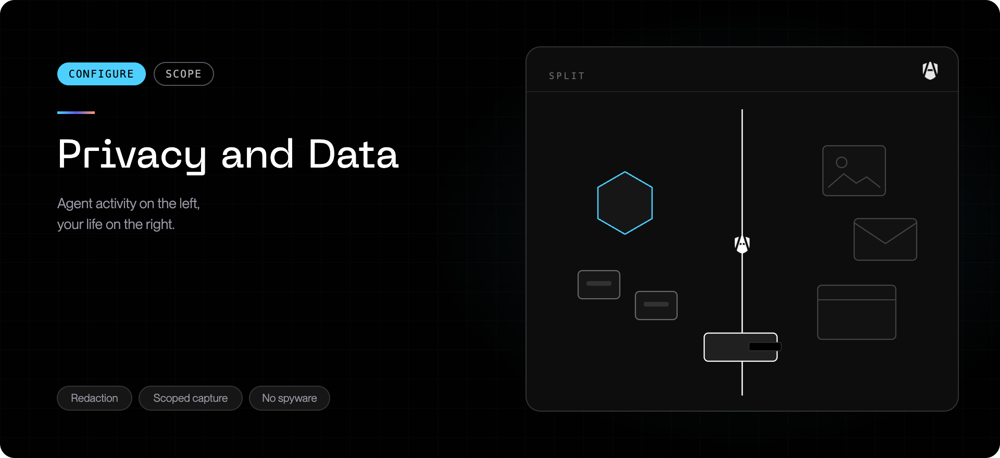

AgenShield is installed on machines people work on, so it is fair to ask exactly
what it watches and what leaves the device. This page answers that. If you are
evaluating AgenShield for a fleet, this is also the page to share with your
privacy or works-council reviewers.

## What AgenShield observes

AgenShield's scope is **AI agents and the processes they start** — the
execution tree behind each agent, as defined by your organization's policy. It
records what those agents execute, which files they read and write, and which
destinations they connect to.

| Observed                                                 | Not observed                                                 |
| -------------------------------------------------------- | ------------------------------------------------------------ |
| Programs an agent runs                                   | Programs you run yourself                                    |
| Files an agent reads or writes                           | Your documents, mail, photos, browsing                       |
| Destinations an agent connects to                        | Your own network traffic                                     |
| Which AI tools, extensions, and connectors are installed | Keystrokes, screen contents, camera, microphone, or location |

Anything unrelated to your AI agents is not observed at all — programs and
tools an agent starts are within its observed scope, everything else on the
Mac is not. `agenshield status` lists the agents AgenShield has detected on
this Mac. See [How AgenShield works](../how-it-works.mdx).

AgenShield does not record keystrokes, capture the screen, or browse your files
on its own. A personal file appears in its records only when an AI agent reads
or writes it — that access is the event being recorded. It has no view into
applications unrelated to your AI agents.

## What leaves the device

Activity records are sent to your organization's AgenShield backend and are
visible in the [Frontegg Portal](https://portal.frontegg.com). Records are
signed by the device and sent over TLS. Your administrator chooses how much
detail is included; the maximum available is:

- which agent acted, and what it did (run, read, write, connect)
- the file paths and destinations involved
- the policy decision — allowed, blocked, or observed
- device health: version, extension status, last policy sync

Administrators can reduce this. A common configuration keeps the _signal_ — "this
agent read a credentials file", "this agent reached an unapproved host" — while
dropping the literal paths and destinations.

## Secrets are removed before anything is sent

Anything that looks like a credential is detected and stripped **on the device,
before the record is transmitted**. API keys, tokens, passwords, and private keys
are replaced with a marker naming the kind of secret found. The secret value
itself is never sent and is never written to a log.

This runs on the device rather than in the cloud on purpose: a secret that leaves
the machine has already leaked, no matter what happens to it afterwards.

## Network inspection

If your administrator enables traffic inspection, AgenShield can look inside an
AI agent's encrypted connections to record what the agent actually sent. This
requires a certificate to be installed on the Mac and is **off by default**.

When it is on:

- it applies only to AI agents, never to your browser or other applications
- secret redaction runs on inspected content, same as everywhere else
- the certificate is generated per device and its private key never leaves it

See [Network inspection certificate](../reference/mitm-ca-for-end-users.md) for what
the certificate is and how to verify it.

## What your administrator can see

| Visible to your administrator                  | Not visible                                |
| ---------------------------------------------- | ------------------------------------------ |
| AI agent activity and policy decisions         | Your personal files or their contents      |
| Which AI tools and connectors are installed    | Your browsing history                      |
| Device health and version                      | Your keystrokes or screen                  |
| Blocked activity, with the rule that caused it | Credential values (removed before sending) |

## Local data

Activity is also stored on the device so protection continues while offline, and
so diagnostics are available. Local storage is capped and old records are removed
automatically. When AgenShield is uninstalled, local data is removed with it.

## Diagnostics you send manually

A diagnostics bundle is generated locally and goes nowhere until you send it.
Review it before sharing — see
[Collecting diagnostics](../troubleshoot/collecting-diagnostics.mdx), which lists what
the bundle contains and what it never contains.

## Related

- [How AgenShield works](../how-it-works.mdx) — what AgenShield governs and what
  it never touches.
- [Enforcement modes](../configuration/enforcement-modes.mdx) — whether activity is
  merely recorded or also blocked.
