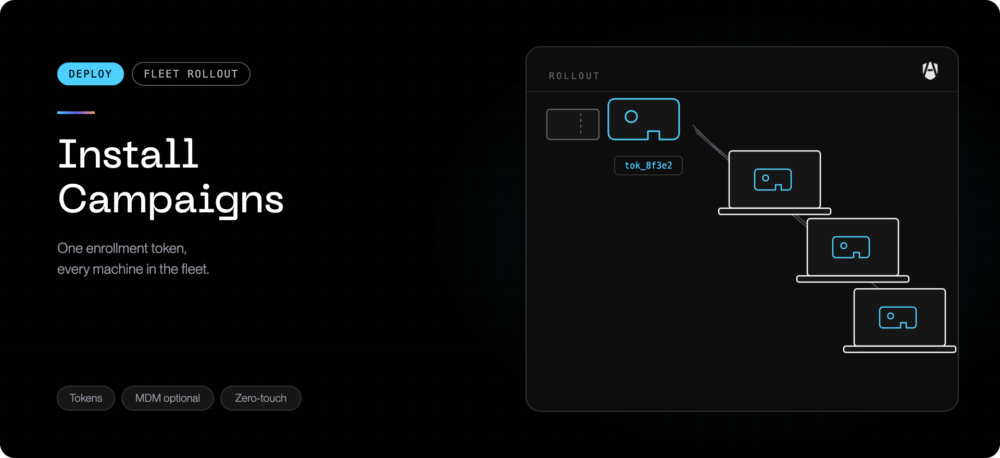
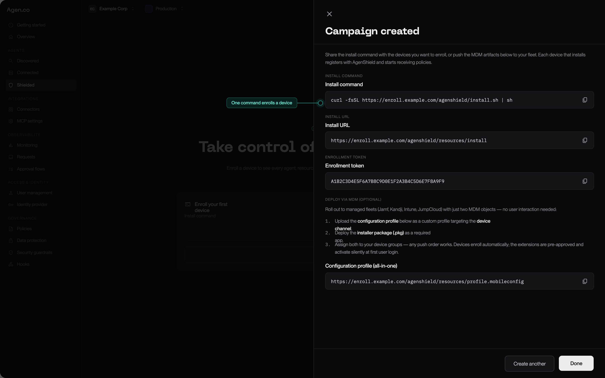

Every AgenShield rollout starts with an **install campaign**. A campaign is a
named enrollment channel: it mints a token, and everything a device needs to
join your fleet — the install command, the configuration profile, the installer
package — is generated from that token.

<Note>
  A campaign is the first of five things you set up. The whole Frontegg Portal journey
  is: **campaign → devices → rules → telemetry → agent resources.** Each page
  below links to the next.
</Note>

## Create one

In the [Frontegg Portal](https://portal.frontegg.com), open **AgenShield →
Devices** (`https://portal.frontegg.com/<environment>/agen/shielded/devices`),
then **New campaign.** There are only two fields:

| Field              | Required | What it does                                                                                                                         |
| ------------------ | -------- | ------------------------------------------------------------------------------------------------------------------------------------ |
| **Name**           | Yes      | How you will recognise it later — `Engineering Macs`, `Design pilot`, `Contractors`. Shown on every device that enrolled through it. |
| **Pinned version** | No       | Locks this campaign to one exact AgenShield release. Leave empty and devices install the latest published version.                   |

Pin a version when you are validating an upgrade on a small group, or when
change control requires a fixed build. Everyone else should leave it empty.

### Use more than one campaign

Campaigns are free, and they are how you segment a rollout. A campaign is the
unit you can revoke, pin to a version, and — with a connected MDM — map to its
own device group. Split them the way you would split a rollout wave:

| Campaign      | Why a separate one                                    |
| ------------- | ----------------------------------------------------- |
| `Pilot`       | 3–5 Macs, pinned version, revoked when the pilot ends |
| `Engineering` | The main wave                                         |
| `Contractors` | Different offboarding cadence, revoked more often     |

A device belongs to exactly one campaign. With a connected MDM, that is enforced
for you — see [Microsoft Intune](../deployment/mdm/intune.mdx).

## What a campaign gives you

Once created, the campaign detail view carries everything a rollout needs.

<Frame caption="The campaign detail view — the install command, install URL, and enrollment token, ready to copy.">
  
</Frame>

### For a single Mac, or a scripted rollout

| Artifact              | Use it for                                                                              |
| --------------------- | --------------------------------------------------------------------------------------- |
| **Install command**   | Paste-and-run, one Mac. This is what the [Quickstart](../getting-started/quickstart.md) uses |
| **Enrollment token**  | Scripted installs and testing, where you supply the token yourself                      |
| **Uninstall command** | Removing AgenShield. Carries no token, so it is safe to hand to any end user            |

### For a managed fleet

The campaign's **MDM artifacts** section carries per-campaign download URLs. The
configuration-profile URL is generated from the campaign token, so the profile
you download already contains your campaign token and backend URL — there is
nothing to hand-edit:

```text
https://<your-backend-url>/resources/campaigns/v1/<campaign-token>/agenshield.mobileconfig
```

| Artifact                               | What it is                                                                                                                    |
| -------------------------------------- | ----------------------------------------------------------------------------------------------------------------------------- |
| **Configuration profile** (all-in-one) | One `.mobileconfig` carrying every payload AgenShield needs — enrollment, extension approval, Full Disk Access, notifications |
| **Installer package**                  | The signed, Apple-notarized `.pkg`                                                                                            |
| **Bootstrap package**                  | A tiny (under 1 MB) alternative `.pkg` that downloads and verifies the full installer on the device                           |

Push the profile and one of the two packages, and the rollout is done. See
[MDM enrollment](../deployment/mdm/overview.mdx) for what each payload does, and the
per-MDM pages for the exact clicks.

<Tip>
  Because the profile URL is campaign-specific, you never edit a profile by
  hand. Need a different campaign? Download that campaign's URL instead.
</Tip>

## Is the token a credential?

No — and this matters, because you will be pasting it into an MDM console and
possibly an onboarding document.

- It authorizes **enrollment only**. It cannot read policy, read telemetry, or
  change anything in the Frontegg Portal.
- It is **revocable** at any time.
- The device's real, long-lived identity is a keypair generated **on the device**
  during enrollment. The token is not that identity, and does not grant it.

## Watch a campaign work

The campaign detail view has an events timeline that tells you where a rollout is:

| Event              | Means                                                   |
| ------------------ | ------------------------------------------------------- |
| **Created**        | The campaign exists                                     |
| **Script fetched** | Something downloaded the install script or a profile    |
| **Registration**   | A device completed enrollment — it is now on your fleet |
| **Revoked**        | The token no longer accepts new enrollments             |

Seeing `Script fetched` but never `Registration` is the classic MDM symptom: the
package reached the device but the profile did not, so there was no token to
enroll with. [MDM enrollment](../deployment/mdm/overview.mdx) covers how to confirm.

## Revoke a campaign

Revoking invalidates the token. Precisely:

- **New** devices can no longer enroll through it. The install script returns an
  error.
- **Already-enrolled** devices are unaffected — they keep their own identity,
  keep receiving policy, and keep reporting.

So revoking is _closing the door_, not _removing the software_. To actually take
AgenShield off a machine, offboard the device — see
[Enrolled devices](../deployment/devices.mdx).

Revoke a campaign when a pilot ends, when an onboarding document with the link
in it has gone stale, or any time you would rotate a shared link.

## Next

<Columns cols={2}>
  <Card title="MDM enrollment" icon="building-2" href="../deployment/mdm/overview.mdx">
    Push the campaign's profile and package to a managed fleet — no user interaction.
  </Card>
  <Card title="Quickstart" icon="rocket" href="../getting-started/quickstart.md">
    Use the install command on a single Mac instead.
  </Card>
  <Card title="Enrolled devices" icon="laptop" href="../deployment/devices.mdx">
    What appears once devices start reporting, and how to read fleet health.
  </Card>
  <Card title="Rollout playbook" icon="map" href="../deployment/rollout-playbook.mdx">
    The phased path from pilot to enforcement.
  </Card>
</Columns>
