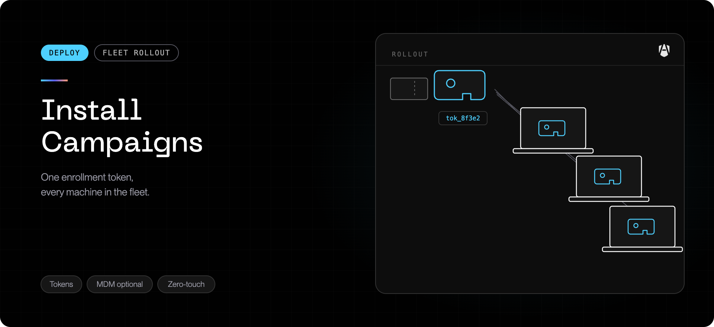
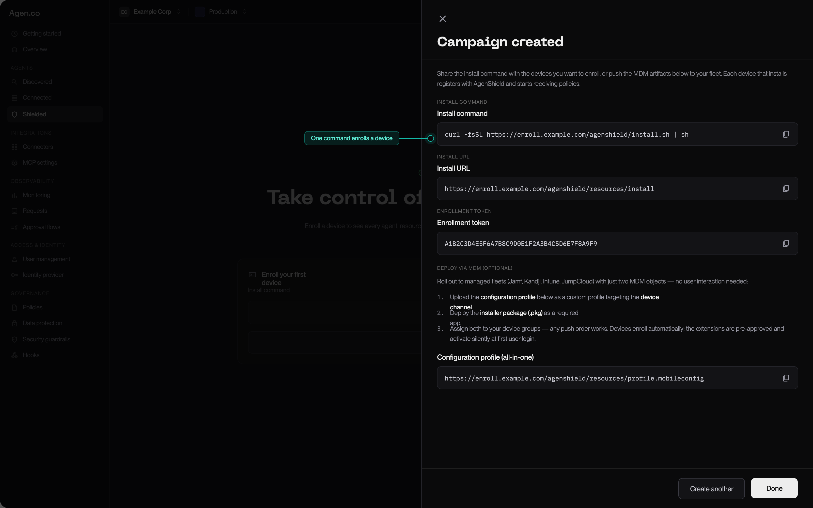

Every AgenShield rollout starts with an **install campaign**. A campaign is a
named enrollment channel: it mints a token, and everything a device needs to
join your fleet — the install command, the configuration profile, the installer
package — is generated from that token.

<Note>
  A campaign is the first thing you set up. From here the path is: **campaign →
  deploy to your fleet → devices → rules → telemetry.** Deploying to a managed
  fleet is [MDM enrollment](../deployment/mdm/overview.mdx); a single Mac is the
  [Quickstart](../getting-started/quickstart.md).
</Note>

## Create one

In the [Frontegg Portal](https://portal.frontegg.com), open **AgenShield →
Devices** (`https://portal.frontegg.com/<environment>/agen/shielded/devices`),
then **New campaign.** There are only two fields:

| Field              | Required | What it does                                                                                                                         |
| ------------------ | -------- | ------------------------------------------------------------------------------------------------------------------------------------ |
| **Name**           | Yes      | How you will recognise it later — `Engineering Macs`, `Design pilot`, `Contractors`. Shown on every device that enrolled through it. |
| **Pinned version** | No       | Locks this campaign to one exact AgenShield release. Leave empty and devices install the latest published version.                   |

Pin a version when you are validating an upgrade on a small group, or when
change control requires a fixed build. Everyone else should leave it empty.

### Use more than one campaign

Campaigns are free, and they are how you segment a rollout. A campaign is the
unit you can revoke, pin to a version, and — with a connected MDM — map to its
own device group. Split them the way you would split a rollout wave:

| Campaign      | Why a separate one                                    |
| ------------- | ----------------------------------------------------- |
| `Pilot`       | 3–5 Macs, pinned version, revoked when the pilot ends |
| `Engineering` | The main wave                                         |
| `Contractors` | Different offboarding cadence, revoked more often     |

A device belongs to exactly one campaign. With a connected MDM, that is enforced
for you — see [Microsoft Intune](../deployment/mdm/intune.mdx).

## What a campaign gives you

Once created, the campaign detail view carries everything a rollout needs.

<Frame caption="The campaign detail view — the install command, install URL, and enrollment token, ready to copy.">
  
</Frame>

### For a single Mac, or a scripted rollout

| Artifact              | Use it for                                                                                                                |
| --------------------- | ------------------------------------------------------------------------------------------------------------------------- |
| **Install command**   | Paste-and-run, one Mac. This is what the [Quickstart](../getting-started/quickstart.md) uses                                   |
| **Enrollment token**  | Scripted installs and testing, where you supply the token yourself                                                        |
| **Uninstall command** | Removing AgenShield. Carries no token, so it is safe to hand to any end user, put in a runbook, or run from an MDM script |

### For a managed fleet

The campaign's **MDM artifacts** section carries per-campaign download URLs. The
configuration-profile URL is generated from the campaign token, so the profile
you download already contains your campaign token and backend URL — there is
nothing to hand-edit:

```text
https://<your-backend-url>/resources/campaigns/v1/<campaign-token>/agenshield.mobileconfig
```

| Artifact                                | What it is                                                                                                                                                       |
| --------------------------------------- | ---------------------------------------------------------------------------------------------------------------------------------------------------------------- |
| **Configuration profile** (recommended) | `deployment.mobileconfig` — the approvals macOS requires, plus your backend URL. Carries **no enrollment token**, so you upload it once and never touch it again |
| **All-in-one profile**                  | `agenshield.mobileconfig` — the same payloads plus the enrollment token, for fleets that cannot run a root script and need the profile to carry it               |
| **Installer package**                   | The signed, Apple-notarized `.pkg`                                                                                                                               |
| **Bootstrap package**                   | A tiny (under 1 MB) alternative `.pkg` that downloads and verifies the full installer on the device                                                              |

Push the recommended profile and run the install command, and the rollout is
done. See [MDM enrollment](../deployment/mdm/overview.mdx) for the guided path and what
each payload does, and the per-MDM pages for the exact clicks.

#### Pinning a version

Some MDMs want a package URL they can hold still, rather than an upload. Released
versions live at stable, immutable addresses:

```text
https://assets.frontegg.com/agenshield/v<version>/AgenShield-<version>-arm64.pkg
https://assets.frontegg.com/agenshield/v<version>/AgenShield-Bootstrap-<version>-arm64.pkg
https://assets.frontegg.com/agenshield/v<version>/checksums.sha256
```

A published version never changes, so a group pointed at one stays there until
you move it. To find the current version, read `latest.txt` in the same place:

```bash
curl -s https://assets.frontegg.com/agenshield/latest.txt
```

<Note>
  There is no "latest" package address on purpose — `latest.txt` is a pointer you
  read, not a file you deploy. Pinning is a deliberate act, so an MDM can never
  quietly move a fleet onto a release you have not validated.
</Note>

<Tip>
  You never edit a profile by hand. The recommended profile is the same for every
  campaign, so rotating a campaign means changing the install command — not
  re-uploading anything to your MDM.
</Tip>

## Is the token a credential?

Yes — a narrow one. It matters because you will be pasting it into an MDM console
and possibly an onboarding document.

What it **cannot** do:

- It authorizes **enrollment only**. It cannot read policy, read telemetry, or
  change anything in the Frontegg Portal.
- The device's real, long-lived identity is a keypair generated **on the device**
  during enrollment. The token is not that identity, does not grant it, and
  cannot be used to impersonate a Mac that has already enrolled.

What it **can** do, and how to handle it:

- Anyone holding it can **enroll a machine into your fleet**. It is a bearer
  token: possession is the whole check.
- It does **not expire**. It stays valid until you revoke it, which you can do at
  any time — revoking is also how you "rotate" one, since a campaign's token
  cannot be changed in place.
- So scope it to the devices you mean to deploy to, and revoke and reissue the
  campaign if it leaks.

### Which artifacts carry it

| Artifact                      | Carries the token | Notes                                                                                                                    |
| ----------------------------- | ----------------- | ------------------------------------------------------------------------------------------------------------------------ |
| The **install command**       | Yes               | In the URL. Whoever can read the command can read the token                                                              |
| **`agenshield.mobileconfig`** | Yes               | The all-in-one profile. The token is also written to each device's managed preferences, which are world-readable at rest |
| **`deployment.mobileconfig`** | No                | The token-free profile — carries only the extension approvals and your cloud URL                                         |
| The signed **`.pkg`**         | No                | Identical bytes for every campaign                                                                                       |

If you would rather no token sat on the device at rest, push
`deployment.mobileconfig` plus the install command instead of the all-in-one
profile. Both shapes deploy the same product.

## Watch a campaign work

The campaign detail view has an events timeline that tells you where a rollout is:

| Event              | Means                                                   |
| ------------------ | ------------------------------------------------------- |
| **Created**        | The campaign exists                                     |
| **Script fetched** | Something downloaded the install script or a profile    |
| **Registration**   | A device completed enrollment — it is now on your fleet |
| **Revoked**        | The token no longer accepts new enrollments             |

Seeing `Script fetched` but never `Registration` is the classic MDM symptom: the
package reached the device but the profile did not, so there was no token to
enroll with. [MDM enrollment](../deployment/mdm/overview.mdx) covers how to confirm.

## Revoke a campaign

Revoking invalidates the token. Precisely:

- **New** devices can no longer enroll through it. The install script returns an
  error.
- **Already-enrolled** devices are unaffected — they keep their own identity,
  keep receiving policy, and keep reporting.

So revoking is _closing the door_, not _removing the software_. To actually take
AgenShield off a machine, offboard the device — see
[Enrolled devices](../deployment/devices.mdx).

Revoke a campaign when a pilot ends, when an onboarding document with the link
in it has gone stale, or any time you would rotate a shared link.

## Next

<Columns cols={2}>
  <Card title="MDM enrollment" icon="building-2" href="../deployment/mdm/overview.mdx">
    Push the campaign's profile and package to a managed fleet — no user interaction.
  </Card>
  <Card title="Quickstart" icon="rocket" href="../getting-started/quickstart.md">
    Use the install command on a single Mac instead.
  </Card>
  <Card title="Enrolled devices" icon="laptop" href="../deployment/devices.mdx">
    What appears once devices start reporting, and how to read fleet health.
  </Card>
  <Card title="Rollout playbook" icon="map" href="../deployment/rollout-playbook.mdx">
    The phased path from pilot to enforcement.
  </Card>
</Columns>
