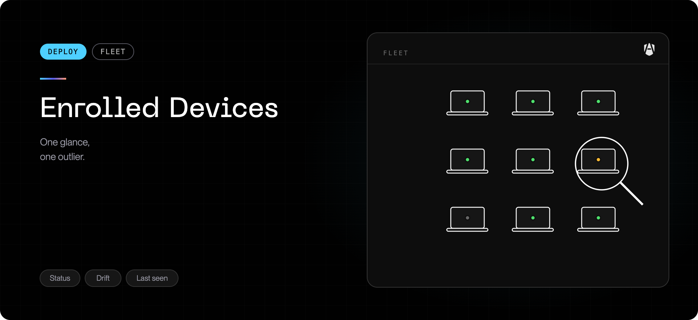

Once a campaign starts producing enrollments, **Devices** in the
[Frontegg Portal](https://portal.frontegg.com)
(`https://portal.frontegg.com/<environment>/agen/shielded/devices`) is where
the fleet lives. Every Mac that completed enrollment appears here, whichever way it was
installed — MDM push or install command.

## Device states

The counters across the top are the fastest read on fleet health. They are
mutually informative, so learn what each one actually measures:

| State           | Means                                                                                 | Act on it when                                                  |
| --------------- | ------------------------------------------------------------------------------------- | --------------------------------------------------------------- |
| **Endpoints**   | Every device that ever completed enrollment, across all states                        | Compare against your MDM group size                             |
| **Online**      | A user is attached and the Mac checked in within the last 15 minutes                  | This is your real coverage number                               |
| **Syncing**     | Pulling policy, but nobody has logged in yet                                          | Normal on freshly imaged Macs. Expected to clear at first login |
| **Drifted**     | Attached, but the last sync is between 15 minutes and 24 hours old                    | A handful is normal (laptops sleep). A cluster is not           |
| **Offline**     | No check-in for over 24 hours — including devices that never synced after registering | Investigate: decommissioned, or never finished setup            |
| **Quarantined** | Revoked, manually or by policy. Policy is no longer delivered                         | Confirm it was intentional                                      |

<Note>
  **Syncing** is the state that surprises people. A Mac deployed by MDM enrolls
  and starts pulling policy *before anyone logs in* — that is working as
  intended. It moves to **Online** at the first GUI login, when the extensions
  activate.
</Note>

A large, persistent **Syncing** count means Macs are being imaged but never
logged into. A large **Offline** count usually means devices left the fleet
without being offboarded.

## The device list

| Column          | What it tells you                                                    |
| --------------- | -------------------------------------------------------------------- |
| **Status**      | The state from the table above                                       |
| **Hostname**    | As reported by the Mac                                               |
| **Fingerprint** | The device's own cryptographic identity, generated during enrollment |
| **User**        | The account currently attached                                       |
| **Platform**    | macOS version and hardware                                           |
| **Endpoint**    | The installed AgenShield version                                     |
| **Bundle**      | Which revision of your policy the device is actually running         |
| **Last sync**   | When it last checked in                                              |

**Bundle** is the column to watch during a policy change: it tells you whether a
rule you just published has actually reached the fleet, rather than whether you
published it. A device stuck on an old revision is not enforcing your latest
rules, no matter what the Frontegg Portal shows centrally.

**Endpoint** is the column to watch during an upgrade — mixed versions here are
normal mid-rollout and should converge.

## A single device

Click any row. The detail view is the answer to "what is this Mac doing, and is
it healthy?":

| Tab           | What you get                                                                                                         |
| ------------- | -------------------------------------------------------------------------------------------------------------------- |
| **Overview**  | Health, versions, extension status, the campaign it enrolled through, and — with a connected MDM — its Intune record |
| **Activity**  | Everything this Mac's agents did, and the decision on each action                                                    |
| **Policies**  | The rules currently in force on this device                                                                          |
| **Resources** | The skills, connectors, and other resources its agents have loaded                                                   |

This is the view to open when a developer reports "AgenShield blocked me" — the
Activity tab shows the exact action and the rule that decided it.

## Revoke versus offboard

These do different things and are not interchangeable.

| Action       | Effect on the device                                              | Effect on the software                   |
| ------------ | ----------------------------------------------------------------- | ---------------------------------------- |
| **Revoke**   | Stops receiving policy. Marked quarantined in the Frontegg Portal | **Still installed.** Nothing is removed  |
| **Offboard** | Removed from the campaign group in your MDM                       | **Uninstalled** at the next MDM check-in |

Revoke is the containment action — a lost or compromised Mac you want cut off
from your policy immediately. Offboard is the lifecycle action — someone left,
or the machine is being reassigned.

<Warning>
  With a connected MDM, removing a device from its group by hand in Intune or
  Entra does **neither** of these cleanly. MDMs run scripts when a device is
  added to a group, never when it is removed — so a manual removal leaves
  AgenShield installed and merely unmanaged. Use **Offboard** in the Frontegg
  Portal. See [Microsoft Intune](../deployment/mdm/intune.mdx#offboard-a-device).
</Warning>

On an unmanaged Mac, the end user can remove AgenShield with the campaign's
uninstall command, which carries no token and is safe to hand out — see
[Install and uninstall](../getting-started/install-and-uninstall.md).

## What to check in the first week

<Steps>
  <Step title="Enrollments match your MDM group">
    Endpoints in the Frontegg Portal should converge on the size of the group you
    assigned. A persistent gap is usually a profile that never landed.
  </Step>
  <Step title="Syncing is draining">
    Macs should move from Syncing to Online as people log in. A stuck count means
    imaged-but-unused machines, or extensions that never activated.
  </Step>
  <Step title="Bundle revisions are converging">
    After you publish a policy change, watch the Bundle column catch up. This is
    the honest measure of whether a rule is live.
  </Step>
  <Step title="Nothing unexpected is quarantined">
    Quarantined devices receive no policy. Confirm every one was intentional.
  </Step>
</Steps>

## Next

<Columns cols={2}>
  <Card title="Rules and policy" icon="list-checks" href="../configuration/policies.mdx">
    Now that devices are reporting, decide what they are allowed to do.
  </Card>
  <Card title="Telemetry" icon="activity" href="../configuration/telemetry.mdx">
    Read what your agents are actually doing before you write a single rule.
  </Card>
</Columns>
