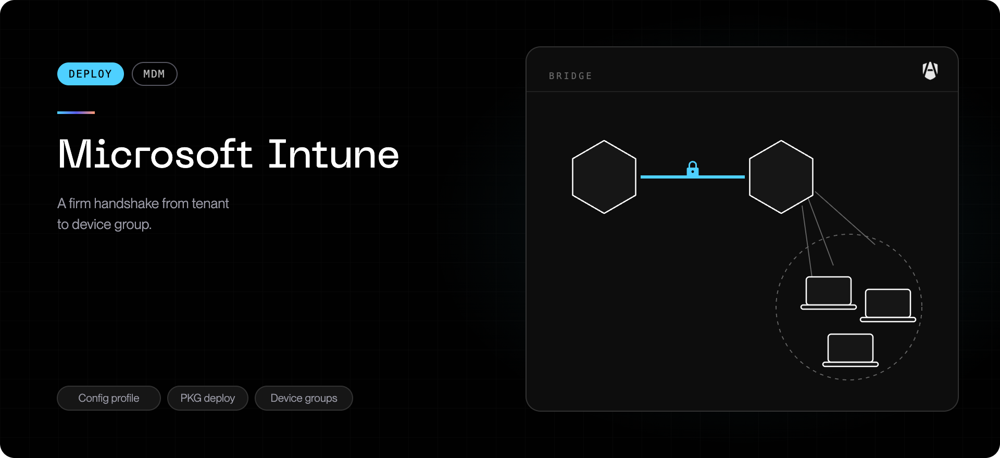
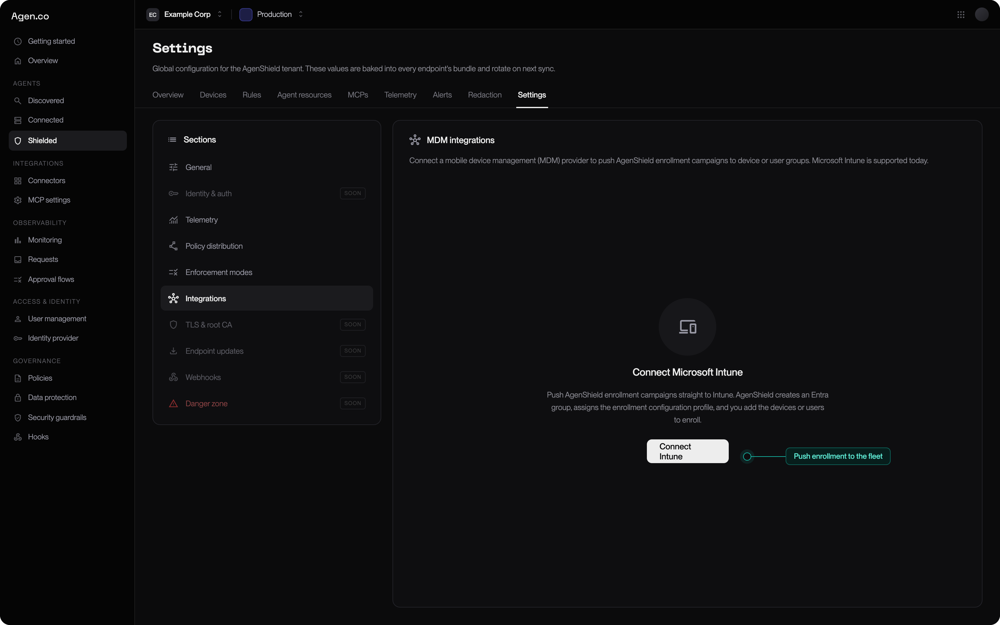
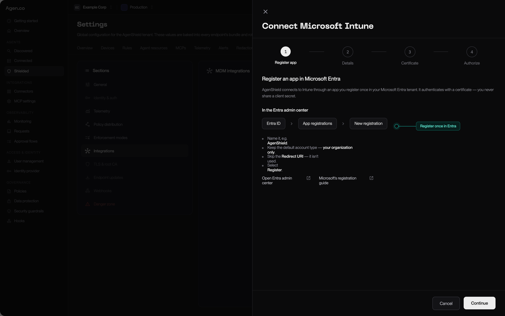

Intune is the one MDM AgenShield connects to directly. Connect your Microsoft
Entra tenant once, and every campaign afterwards deploys from the Frontegg Portal:
no downloading profiles, no uploading packages, no keeping two systems in
sync by hand.

<Columns cols={2}>
  <Card title="Connected (recommended)" icon="plug">
    Register one Entra app. AgenShield creates the group, the profile, the installer app, and the offboarding script for you — and can repair them if they drift.
  </Card>
  <Card title="Manual upload" icon="download">
    Download the campaign's profile and package and push them yourself. Fully supported, no tenant connection.
  </Card>
</Columns>

## Connected integration

You do four things once — register an app, hand over two IDs, upload a
certificate, grant permissions — and from then on every campaign deploys with
one click from the Frontegg Portal.

## What AgenShield does on your behalf

Once connected, pushing a campaign creates and maintains these objects in your
tenant:

| Object                       | Purpose                                                                                    |
| ---------------------------- | ------------------------------------------------------------------------------------------ |
| **Entra security group**     | One per campaign. Adding a device or user to it is what deploys AgenShield                 |
| **Configuration profile**    | The campaign's all-in-one profile, assigned to that group                                  |
| **Installer app**            | The signed package, published once per connection and assigned to every campaign group     |
| **Uninstall script + group** | Shared across the connection. Offboarding moves a member here to remove AgenShield cleanly |

Your side of the deal is one thing: **put devices or users in the group.** You
can do that from the Frontegg Portal or from Intune — both work.

<Note>
  The connected push deploys the **all-in-one profile and the package** — the
  same two objects it has always created. To push things yourself instead, use
  [Manual upload](#manual-upload).

Mixing the two is what to avoid, and the rule is per device: **one profile and
one installer.** Never both profiles (they carry the same payloads, and a
duplicate network-filter payload resolves unpredictably), and never both the
package and the install command.

The pairing is not free in both directions. The **install command** works with
either profile, because it carries the enrollment token itself. The **package**
requires `agenshield.mobileconfig`: it has no other way to receive a token, and
`deployment.mobileconfig` does not carry one — see
[Choosing a profile](#choosing-a-profile).

</Note>

## Connect your tenant

**Settings → Integrations → Connect Microsoft Intune.** The wizard has four
steps and takes about five minutes. AgenShield authenticates with a
**certificate it generates** — you never create, paste, or rotate a client
secret.

<Frame caption="Settings → Integrations — where the connection starts and where its health is reported afterwards.">
  
</Frame>

### 1. Register an app in Entra

In the Entra admin center: **Entra ID → App registrations → New registration.**

- Name it something recognisable, e.g. `AgenShield`.
- Keep the default account type — **your organization only**.
- Skip the redirect URI. It is not used.
- Select **Register**.

<Frame caption="The wizard mirrors the Entra steps as you go — register once, then hand the two IDs back.">
  
</Frame>

### 2. Give AgenShield the app's identifiers

Back in the wizard, enter a name for the connection plus the two GUIDs from your
new app registration's overview page:

| Field                       | Where to find it          |
| --------------------------- | ------------------------- |
| **Directory (tenant) ID**   | App registration overview |
| **Application (client) ID** | App registration overview |

### 3. Upload the certificate

AgenShield generates a keypair, keeps the private key encrypted, and hands you
the public half. Download it, then in your app registration go to
**Certificates & secrets → Certificates → Upload certificate** and add the file.

The wizard shows the **SHA-1 thumbprint** Entra will display after upload —
compare the two to confirm you uploaded the right file to the right app.

### 4. Add permissions and grant consent

**API permissions → Add a permission → Microsoft Graph → Application
permissions.**

<Warning>
  Pick the **Application permissions** tile. **Delegated** — the tab Entra opens
  first — will not work: AgenShield runs with no signed-in user, and the
  connection test fails with a Microsoft "UnknownError" if the permissions were
  added as Delegated. This is the single most common setup mistake.
</Warning>

**Required.** The connection test probes each of these individually, so a
failure tells you exactly which one is missing.

| Permission                                    | What it is for                                                                               |
| --------------------------------------------- | -------------------------------------------------------------------------------------------- |
| `DeviceManagementConfiguration.ReadWrite.All` | Creates the campaign's configuration profile and assigns it. Also proves your Intune license |
| `DeviceManagementApps.ReadWrite.All`          | Publishes the installer package as an Intune app — this is what installs AgenShield          |
| `DeviceManagementScripts.ReadWrite.All`       | Creates the uninstall script used for offboarding                                            |
| `Group.ReadWrite.All`                         | Creates the campaign and offboarding groups and manages their membership                     |

<Accordion title="Optional permissions — three Frontegg Portal conveniences, each addable later">
  Each unlocks one specific feature and nothing else. To add one later, append
  the permission and re-run **Grant admin consent** — no reconnection needed.

| Permission                                | Enables                                                              | If you skip it                                                                     |
| ----------------------------------------- | -------------------------------------------------------------------- | ---------------------------------------------------------------------------------- |
| `Device.Read.All`                         | Browsing your device directory from the Frontegg Portal              | Add devices to the group from Intune or Entra instead                              |
| `User.Read.All`                           | Browsing your users from the Frontegg Portal                         | Manage user-group membership from Intune or Entra instead                          |
| `DeviceManagementManagedDevices.Read.All` | Rollout progress, and matching enrolled Macs to their Intune records | Pushes and offboarding still work; the rollout view reports the missing permission |

</Accordion>

Then select **Grant admin consent for your organization**, confirm, and
**Refresh** — every row must read "Granted". Finally, run the wizard's
connection test.

<Tip>
  Entra propagates consent and certificate changes with a lag, so a test run
  immediately after setup can fail and then pass. AgenShield retries
  automatically before reporting an error. If it still fails, **Settings →
  Integrations** shows a live per-permission status — it names the exact grant
  that is missing rather than making you guess.
</Tip>

## Push a campaign

From **Devices** (on the campaign) or **Settings → Integrations**, choose
**Push to Intune**:

1. Pick the campaign.
2. Name the group — e.g. `AgenShield — Engineering Macs`.
3. Choose whether members will be **devices** or **users**.

AgenShield creates the group, materializes and assigns the campaign profile,
and assigns the installer app. It runs in the background and usually completes
in under a minute; the screen updates itself.

Then **add members**. Nothing deploys until the group has members — Intune
applies a profile only to members of the group it is assigned to.

<Note>
  Membership changes take a few minutes to reach devices. That is Intune's
  check-in cadence, not AgenShield.
</Note>

### One device, one campaign

A device or user may belong to **only one AgenShield campaign group per
connection**. If you try to add one that is already in another campaign's group,
the whole request is refused and the conflicts are listed — moving a device
between campaigns is a decision, not a side effect. Confirm, and AgenShield
removes it from the other group first.

## Track the rollout

With `DeviceManagementManagedDevices.Read.All` granted, the push view joins your
group membership against Intune's device inventory and against the Macs that
actually enrolled:

| State         | Meaning                                                      |
| ------------- | ------------------------------------------------------------ |
| **Connected** | AgenShield is installed and the Mac is reporting recently    |
| **Installed** | AgenShield is installed, but the Mac has not reported lately |
| **Pending**   | In the group, AgenShield not installed yet                   |

It also lists enrolled devices that are **not** in the group — usually machines
that were installed by script before the MDM push existed.

## Offboard a device

Use **Offboard**, not "remove from group".

<Warning>
  Removing a member from the campaign group does **not** uninstall AgenShield.
  MDMs run scripts when a device is *added* to a group, never when it is
  removed — so a plain removal leaves the software installed and merely
  unmanaged.
</Warning>

Offboarding does both halves: it removes the member from the campaign group
**and** adds it to the connection's uninstall group, whose assigned script
removes AgenShield at the next check-in. Re-onboarding later pulls it back out
of the uninstall group automatically, so no device ever sits in both.

## Keep it healthy

Two maintenance actions, both in **Settings → Integrations**:

| Action          | When to use it                                                                                                                                                                                     |
| --------------- | -------------------------------------------------------------------------------------------------------------------------------------------------------------------------------------------------- |
| **Check setup** | Read-only verification of everything the push created — group, profile, installer app, offboarding script. It also confirms the deployed profile still byte-matches the campaign's current profile |
| **Repair**      | Re-runs the push. Recreates anything deleted, renames a renamed group back, refreshes the profile and script to current, and re-asserts assignments                                                |

If someone edits or deletes an AgenShield object in Intune or Entra, **Check
setup** reports it and **Repair** converges it back.

**Publishing a new release:** the installer app is published once per connection
and shared by every campaign group. After a new AgenShield release, re-publish
it from the connection — every campaign picks up the new version without being
re-pushed.

## Manual upload

No tenant connection, no app registration. Push the two objects yourself.

### 1. The configuration profile

1. **Devices → Manage devices → Configuration → Create → New policy**.
2. Platform **macOS**, profile type **Templates → Custom**.
3. Name it, e.g. `AgenShield`, and upload `deployment.mobileconfig`.
4. **Deployment channel: Device channel.**
5. Assign it to your target device group.

<Warning>
  The deployment channel is the setting people get wrong. User-channel delivery
  breaks the system-extension and managed-preferences payloads, and the channel
  is **immutable after creation** — if you picked wrong, delete the profile and
  create a new one.
</Warning>

### 2. The install command

1. **Devices → macOS → Shell scripts → Add**.
2. Upload a script containing the campaign's install command:

   ```bash
   #!/bin/bash
   curl -fsSL 'https://<your-backend-url>/resources/campaigns/v1/<campaign-token>/install.sh' | bash
   ```

3. **Run script as signed-in user: No.**
4. Assign it to the same device group.

<Warning>
  **Run script as signed-in user must be No.** The installer installs a signed
  package, which requires root. Left at **Yes**, the script runs as a standard
  user with no way to elevate: it stops immediately and the run is reported as
  failed. **No** is the default and the correct setting.
</Warning>

Paste the two-line command above rather than the full installer it downloads.
The command is stable across campaign edits and AgenShield releases, so you set
it once; and there is nothing long or non-plain-text for the script editor to
round-trip.

Intune retries a failed script on later check-ins, and the script exits non-zero
if the device does not finish enrolling — so the run status reflects whether the
device actually joined your fleet.

<Note>
  **Give the first run time.** Shell scripts are not delivered over the same
  channel as profiles. They are run by the Intune management agent, which is
  installed the first time you assign a script to a device, and which then checks
  in **on its own schedule — up to 8 hours**, independently of the device's MDM
  check-in. Until that first agent check-in the script reports no status at all,
  which looks like nothing happening.

The **Sync** device action refreshes MDM only; it does not pull scripts. To
make a test device check in now, open **Company Portal** on it, select the
device, and choose **Check status**. If a script has still not run after a day
of the Mac being awake and online, see
[The install script never runs](../../troubleshoot/mdm-script-never-runs.mdx).

</Note>

<Tip>
  **Prefer a package?** Use **Apps → macOS → Add → macOS app (PKG)** with the
  campaign's package instead of the shell script. Included app: bundle ID
  `com.frontegg.AgenShield` and the package's version; assign as **Required**.
  The unmanaged-PKG app type needs the management agent at version 2308.006 or
  later. This is also the route to take if your Macs have no outbound internet
  access, since nothing is downloaded at run time. See
  [If you cannot run a script](../../deployment/mdm/overview.mdx#if-you-cannot-run-a-script).
</Tip>

### Choosing a profile

Both campaign profiles carry the macOS approvals. They differ only in whether
they also carry the enrollment token, and that difference decides which
installers each can be paired with.

| Profile                   | Carries the token | Use it when                                                                                                                                                                                                                                        |
| ------------------------- | ----------------- | -------------------------------------------------------------------------------------------------------------------------------------------------------------------------------------------------------------------------------------------------- |
| `deployment.mobileconfig` | No                | You want to upload the profile once and never touch it again. It survives campaign rotation, version pinning, and group changes, because none of those alter what macOS has to approve. Pair it with the install command, which carries the token. |
| `agenshield.mobileconfig` | Yes               | You want the profile to be self-sufficient — the Mac can enroll from the profile alone. Required with the package, which has no other way to receive a token. Re-upload it whenever you rotate the campaign.                                       |

So: the install command pairs with either profile, and the package pairs only
with `agenshield.mobileconfig`. Pairing the all-in-one profile with the install
command is fine and slightly belt-and-braces: the command's token is used, and
the profile's is the fallback if the command has not run yet. Pairing the
package with `deployment.mobileconfig` is the one combination that does not
work — the Mac gets every approval and never enrolls. What you must not do is
deploy **both** profiles, or **both** installers, to the same Mac.

If your tenant uses Multi-Admin Approval, the profile and the script may sit in
pending approval before they deploy.

## Next

<Columns cols={2}>
  <Card title="Enrolled devices" icon="laptop" href="../../deployment/devices.mdx">
    Reading fleet health once devices land.
  </Card>
  <Card title="MDM enrollment reference" icon="building-2" href="../../deployment/mdm/overview.mdx">
    What each profile payload does, and how to verify a device.
  </Card>
</Columns>
