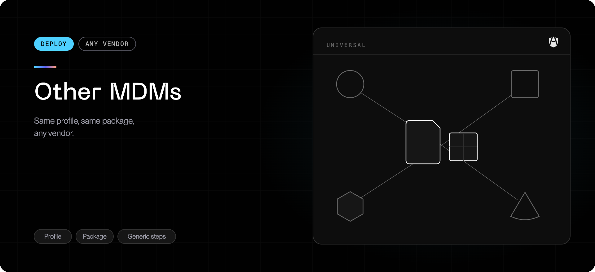

AgenShield does not require a specific MDM. If yours can push a **custom macOS
configuration profile** on the device channel and **run a root shell script**, it
can deploy AgenShield with no user interaction.

Read [MDM enrollment](../../deployment/mdm/overview.mdx) first — it explains what the two
pieces are and why. This page is the clicks.

## The recipe, whatever your MDM calls it

<Steps>
  <Step title="Upload the profile">
    Upload `deployment.mobileconfig` unmodified, on the **device (system)**
    channel, scoped to your device group. Many MDMs re-sign uploaded profiles —
    that is fine.

    You do this once. The profile carries no enrollment token, so it stays valid
    across campaign rotations and new releases.

  </Step>
  <Step title="Run the install command as root">
    Add the campaign's install command as a root script or command object,
    targeting the same group:

    ```bash
    curl -fsSL 'https://<your-backend-url>/resources/campaigns/v1/<campaign-token>/install.sh' | bash
    ```

    Give it a generous timeout — the download and install together take a few
    minutes. It exits non-zero if the device does not finish enrolling.

  </Step>
</Steps>

<Note>
  Upload the profile as-is rather than rebuilding it in your MDM's native payload
  editors. It already pairs every payload with the correct extension identifiers,
  including the Full Disk Access grant — the one that matters most. A device
  without it enrolls and looks healthy but cannot enforce file policy.
</Note>

### Options for unattended runs

Set these before the `curl`. Most rollouts need none of them; the full list with
defaults is in
[Installing and uninstalling](../../getting-started/install-and-uninstall.md#running-it-unattended).

| Variable                      | Use it when                                                                                                               |
| ----------------------------- | ------------------------------------------------------------------------------------------------------------------------- |
| `AGENSHIELD_TARGET_USER`      | The Mac has several accounts and you want to name the one AgenShield installs for                                         |
| `AGENSHIELD_INSTALL_NO_START` | You do not want the installer itself to start the service. Set it to `1` — note the service still starts at the next boot |

```bash
export AGENSHIELD_TARGET_USER='jdoe'
curl -fsSL 'https://<your-backend-url>/resources/campaigns/v1/<campaign-token>/install.sh' | bash
```

## Kandji

| Step | Where                                                                                                 |
| ---- | ----------------------------------------------------------------------------------------------------- |
| 1    | **Library → Add → Custom Profile** — upload `deployment.mobileconfig`, assign via Blueprints          |
| 2    | **Library → Add → Custom Script** — paste the install command, execution **Run once**, same Blueprint |

Kandji also has native System Extension and PPPC library items. If you prefer to
mirror the payloads there, use the campaign's profile as the reference — and push
either the native items or the uploaded profile, never both.

## JumpCloud

| Step | Where                                                                                                    |
| ---- | -------------------------------------------------------------------------------------------------------- |
| 1    | **Device Management → Policies → macOS → MDM Custom Configuration Profile** — upload the profile         |
| 2    | **Device Management → Commands → New Command**, type **Mac**, **Run as `root`**, timeout **900** seconds |

Devices must be enrolled in **JumpCloud MDM** — not only the agent — for the
approval payloads to apply. JumpCloud re-signs profiles.

The command's result view is trustworthy: a red result means the device did not
enroll, not that the script was noisy.

## Mosyle

| Step | Where                                                                                             |
| ---- | ------------------------------------------------------------------------------------------------- |
| 1    | **Management → macOS → Custom Settings / Profiles** — upload the profile, scope to a device group |
| 2    | **Management → macOS → Custom Commands** — paste the install command, same group                  |

## Workspace ONE (Omnissa)

| Step | Where                                                                                                             |
| ---- | ----------------------------------------------------------------------------------------------------------------- |
| 1    | **Resources → Profiles & Baselines → Profiles → Add → Upload Profile → macOS** — upload `deployment.mobileconfig` |
| 2    | Set the profile's context to **Device Profile**, deployment **Managed**, and assign a smart group                 |
| 3    | **Resources → Scripts → Add** (macOS, run as root) — paste the install command and assign the same smart group    |

<Warning>
  **Upload a freshly downloaded profile.** Workspace ONE cannot parse
  `.mobileconfig` files carrying a `<!DOCTYPE ...>` line — it reports an error
  like `3840 Encountered unexpected character` and the profile reaches the device
  corrupted, or not at all. Campaign profiles no longer include that line, but an
  older download or a hand-rebuilt profile may. Check with
  `head -2 deployment.mobileconfig`; if line 2 is a `<!DOCTYPE ...>` line rather
  than `<plist version="1.0">`, delete that line and re-upload. Full steps:
  [Profile fails to install](../../troubleshoot/mdm-profile-fails-to-install.mdx).
</Warning>

Workspace ONE fixes a profile's channel when it is **created**, so a profile made
as a User Profile cannot be switched to Device afterwards — delete it and create
it again. Upload the profile unsigned: signing it yourself grants no additional
permissions and turns it into an opaque binary your MDM console may no longer be
able to read.

## Anything else

Ask your MDM two questions:

1. **Can it push an unmodified custom `.mobileconfig` on the device channel?** If
   yes, AgenShield's approvals will be silent.
2. **Can it run a root shell script?** If yes, the install is silent too.

If the answer to the second is no, push the campaign's all-in-one profile and the
signed `.pkg` instead — see
[If you cannot run a script](../../deployment/mdm/overview.mdx#if-you-cannot-run-a-script).
You still push a profile either way; only the install mechanism changes.

## Verify

On a target Mac:

```bash
sudo profiles show -type configuration | grep -i agenshield   # the profile installed
systemextensionsctl list | grep frontegg                     # both extensions, after first login
agenshield status                                            # service running, device enrolled
```

The device appears under **Devices** in the
[Frontegg Portal](https://portal.frontegg.com) within a minute of the command
completing. If it does not, work through the
[troubleshooting table](../../deployment/mdm/overview.mdx#troubleshooting).

## Next

<Columns cols={2}>
  <Card title="MDM enrollment" icon="building-2" href="../../deployment/mdm/overview.mdx">
    What each payload does and how a device joins your fleet.
  </Card>
  <Card title="Enrolled devices" icon="laptop" href="../../deployment/devices.mdx">
    Reading fleet health once devices land.
  </Card>
</Columns>
