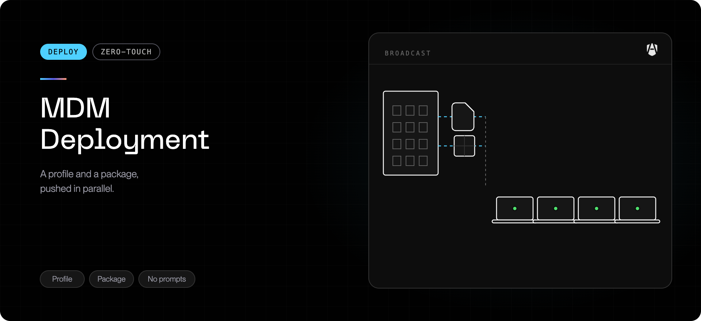

Deploying to a managed fleet is **one profile and one command**. The profile
grants the macOS approvals nobody should have to click through. The command
installs AgenShield and tells the Mac which fleet it belongs to.

This page is the whole path, in order. Read it once and you can deploy.

## Before you start

| You need                                     | Notes                                                                                   |
| -------------------------------------------- | --------------------------------------------------------------------------------------- |
| macOS 14 or later, Apple silicon             | There is no Intel build                                                                 |
| Devices enrolled in your MDM                 | User-Approved MDM or Automated Device Enrollment. The approvals below require it        |
| An [install campaign](../../deployment/campaigns.mdx) | Two minutes to create. It produces both artifacts you are about to push                 |
| An MDM that can run a root shell script      | Nearly all can. If yours cannot, use [the package instead](#if-you-cannot-run-a-script) |

## What you are actually setting up

Two independent things. Keeping them apart is what makes the rest of this simple.

<Columns cols={2}>
  <Card title="Approvals" icon="shield-check">
    What macOS demands before any security product can run: extension approval,
    Full Disk Access, network filtering, notifications, background items.

    **Only an MDM can grant these.** They are identical for every device you will
    ever deploy — no token, no tenant, nothing that expires.

  </Card>
  <Card title="Enrollment and install" icon="download">
    Which fleet this Mac joins, and getting the software onto it.

    **This is the part that changes** — when you rotate a campaign, pin a
    version, or split a rollout into waves.

  </Card>
</Columns>

Because the first never changes and the second always does, they belong in
different places. The profile carries the approvals. The command carries the
enrollment.

<Note>
  This is why the recommended profile holds **no enrollment token**. Upload it to
  your MDM once and leave it alone — it survives campaign rotation, version
  pinning, and re-org of your device groups, because none of those change what
  macOS needs to approve.
</Note>

## Deploy

<Steps>
  <Step title="Create a campaign">
    In the [Frontegg Portal](https://portal.frontegg.com), open **AgenShield →
    Devices → New campaign**. Name it after the wave it covers — `Engineering`,
    `Pilot`, `Contractors`. Leave **Pinned version** empty unless change control
    requires a fixed build.

    The campaign page now shows everything below. Keep it open.

  </Step>

  <Step title="Push the configuration profile">
    Download **`deployment.mobileconfig`** from the campaign's MDM artifacts and
    upload it to your MDM as a custom macOS profile, scoped to your device group.

    It must be delivered on the **device (system) channel**, not the user
    channel. Many MDMs re-sign uploaded profiles — that is fine.

    Exact clicks: [Microsoft Intune](../../deployment/mdm/intune.mdx) ·
    [Jamf](../../deployment/mdm/jamf.mdx) ·
    [Kandji, JumpCloud, Mosyle and others](../../deployment/mdm/other.mdx).

  </Step>

  <Step title="Run the install command">
    Copy the campaign's install command and run it from your MDM as a **root**
    shell script against the same device group:

    ```bash
    curl -fsSL 'https://<your-backend-url>/resources/campaigns/v1/<campaign-token>/install.sh' | bash
    ```

    Run as `root`, which is what MDM script runners do by default. No wrapper is
    needed: with nobody at a terminal the script works out which signed-in user
    the Mac belongs to, installs for that user, and hands the files back to them.

    It exits non-zero if the device does not finish enrolling, so a green result
    in your MDM means the device is genuinely on your fleet.

  </Step>

  <Step title="Check one device">
    It appears under **Devices** in the Frontegg Portal within a minute, and the
    campaign's events timeline gains a **Registration** entry. See
    [Verify a device](#verify-a-device).
  </Step>
</Steps>

Push order does not matter. If the command runs before the profile lands, the
device still enrolls — it just waits for the profile to activate its extensions.

## How a device joins your fleet

Worth understanding once, because every failure mode below is a break in this
chain:

1. Your **campaign** mints an enrollment token.
2. The token is baked into **the install command** for that campaign.
3. The command installs AgenShield and hands it the token.
4. AgenShield registers with your backend and generates a keypair **on the
   device**. That keypair — not the token — is the device's lasting identity.
5. The **profile** pre-approves the extensions, so they activate with no prompt
   at the first login.

Step 4 is why a leaked token cannot impersonate an enrolled Mac: the device's
lasting identity is a keypair generated on the device, and the token authorizes
joining and nothing else.

Treat it as a secret all the same. It is a **bearer credential that does not
expire**, and anyone holding it can enroll a machine into your fleet — so scope
it to the devices you mean to deploy to, and reissue the campaign if it leaks.
See [Is the token a credential?](../../deployment/campaigns.mdx#is-the-token-a-credential)

<Warning>
  Extension activation needs a real login session — macOS ignores activation
  requests from background contexts. A freshly imaged Mac with nobody signed in
  **enrolls and starts syncing immediately**; the security extensions activate at
  **the first login**. That is expected, not a failure, and it is true of every
  deployment method.
</Warning>

Enforcement then begins once the Mac has received your organization's policy —
which is usually seconds after it first syncs, but is a separate step from
activation. Until a policy arrives, a governed agent is **observed, not blocked**:
that is deliberate, so a device that has not heard from the Frontegg Portal yet
never invents rules of its own. A Mac that is offline, or still waiting on its
first sync, is enrolled and reporting but not yet enforcing.

<Info>
  **Confirming it is enforcing, not just enrolled.** The device page shows when
  the Mac last received policy. A device that shows as connected but has never
  received policy is activated and reporting — it is not blocking anything yet.
</Info>

## Verify a device

On a target Mac:

```bash
sudo profiles show -type configuration | grep -i agenshield   # the profile installed
systemextensionsctl list | grep frontegg                     # both extensions, after first login
agenshield status                                            # service running, device enrolled
```

For what a fully healthy Mac looks like, the
[Quickstart's status output](../../getting-started/quickstart.md) is the reference.

## If you cannot run a script

Some fleets cannot, or would rather have their MDM report install state through
its own software inventory. Push the **all-in-one profile**
(`agenshield.mobileconfig`) and the signed **`.pkg`** instead.

|                                  | One profile, one command                    | All-in-one profile + package                   |
| -------------------------------- | ------------------------------------------- | ---------------------------------------------- |
| **Objects to maintain**          | 1 profile (never changes) + 1 command       | 1 profile per campaign + 1 package per release |
| **Rotating a campaign**          | Edit one command string                     | Re-download and re-upload the profile          |
| **New AgenShield release**       | Nothing, unless the campaign pins a version | Re-upload the package                          |
| **Enrollment token lives in**    | The command                                 | The profile, and on every device at rest       |
| **MDM reports install state**    | Command exit code                           | Full software-inventory status                 |
| **Works with no network egress** | No                                          | Yes, with the full package                     |

<Warning>
  Per Mac: **one profile and one installer.** Both profiles carry the
  extension-approval and Full Disk Access payloads, and two installed copies
  naming the same extension behave unpredictably — so never push both. Likewise
  never push both the package and the install command. If you are moving from the
  split profiles, remove `pppc.mobileconfig` as you go.
</Warning>

The table above pairs each profile with its usual installer, but the pairing is
looser than that in one direction. What matters is that the enrollment token
reaches the Mac by **at least one** route:

- The **install command** carries a token, so it works with either profile. With
  the all-in-one profile the command's token is used and the profile's is the
  fallback — harmless, and slightly belt-and-braces.
- The **package** carries no token, so it needs the all-in-one profile
  (`agenshield.mobileconfig`) to supply one. Paired with the token-free profile
  the Mac receives every approval and then never enrolls.

## Reference: what the profile contains

You do not need this to deploy — it is here for security review.

| Payload                        | What it does                                                           | Prompt it removes                           |
| ------------------------------ | ---------------------------------------------------------------------- | ------------------------------------------- |
| **System extension policy**    | Pre-approves the AgenShield security and network extensions            | Extension approval dialogs                  |
| **Web content filter**         | Pre-approves the AgenShield network filter                             | The "Filter Network Content" consent dialog |
| **Privacy preferences (PPPC)** | Grants Full Disk Access to the security extension                      | The Full Disk Access toggle                 |
| **Notification settings**      | Pre-enables AgenShield alerts                                          | Notification-permission prompt              |
| **Service management**         | Manages the AgenShield background items so they cannot be switched off | "Background Items Added" notice             |
| **Settings**                   | Your backend URL and, if you pinned one, the version to install        | —                                           |

<Note>
  The Full Disk Access payload is the one never to trim: without it a device
  enrolls and reports healthy but cannot enforce file policy until someone
  toggles the grant by hand — the manual step MDM deployment exists to avoid.
</Note>

Apple accepts these approval payloads **only from an MDM**; a profile someone
double-clicks is refused. That restriction works in your favor — only a device
your organization manages can be silently approved, so "silent" never means
"unaccountable".

## Troubleshooting

| Symptom                                                                 | Cause and fix                                                                                                                                                                                                             |
| ----------------------------------------------------------------------- | ------------------------------------------------------------------------------------------------------------------------------------------------------------------------------------------------------------------------- |
| Profile install fails: "must originate from a user-approved MDM server" | The profile was opened by hand or pushed outside MDM. These payloads only install through MDM.                                                                                                                            |
| Profile is assigned but never installs (Workspace ONE)                  | An older download carries a `<!DOCTYPE ...>` line Workspace ONE cannot parse. Re-download and re-upload. See [Profile fails to install](../../troubleshoot/mdm-profile-fails-to-install.mdx).                                      |
| Profile fails on some Macs, installs on others                          | The failing Macs are not **user-approved MDM**, or run macOS 12 or earlier. Check `profiles status -type enrollment` and `sw_vers`.                                                                                       |
| Extensions stuck "waiting for user approval" after login                | Profile missing, or pushed on the **user** channel. Confirm with `sudo profiles show -type configuration`, then re-push on the device channel.                                                                            |
| Device enrolled but nothing is ever blocked                             | Full Disk Access payload missing — you are on a profile that does not carry it. Push the recommended profile.                                                                                                             |
| Install command reports success but no device appears                   | On releases before 2026.9 the command staged enrollment under whichever account ran it. Upgrade and re-run. See [Install succeeds but the device never enrolls](../../troubleshoot/install-succeeds-but-device-never-enrolls.mdx). |
| `systemextensionsctl list` is empty right after deployment              | Expected before anyone signs in — activation happens at the first login. Confirm the device landed with `agenshield status` and the Frontegg Portal instead.                                                              |
| Campaign shows `Script fetched` but no `Registration`                   | The command ran but enrollment did not complete. Check the exit code your MDM recorded; a non-zero result names the reason.                                                                                               |
| Pushed two profile shapes                                               | Remove one — duplicate payloads behave unpredictably.                                                                                                                                                                     |

A profile installs **atomically** — one rejected payload discards all of them. To
find which, see [Profile fails to install](../../troubleshoot/mdm-profile-fails-to-install.mdx).

## Next

<Columns cols={2}>
  <Card title="Microsoft Intune" icon="plug" href="../../deployment/mdm/intune.mdx">
    Including the connected integration that pushes campaigns for you.
  </Card>
  <Card title="Jamf" icon="server" href="../../deployment/mdm/jamf.mdx">
    Jamf Pro and Jamf Now.
  </Card>
  <Card title="Other MDMs" icon="boxes" href="../../deployment/mdm/other.mdx">
    Kandji, JumpCloud, Mosyle, Workspace ONE, and anything else.
  </Card>
  <Card title="Enrolled devices" icon="laptop" href="../../deployment/devices.mdx">
    Reading fleet health once devices land, and how to offboard cleanly.
  </Card>
</Columns>
