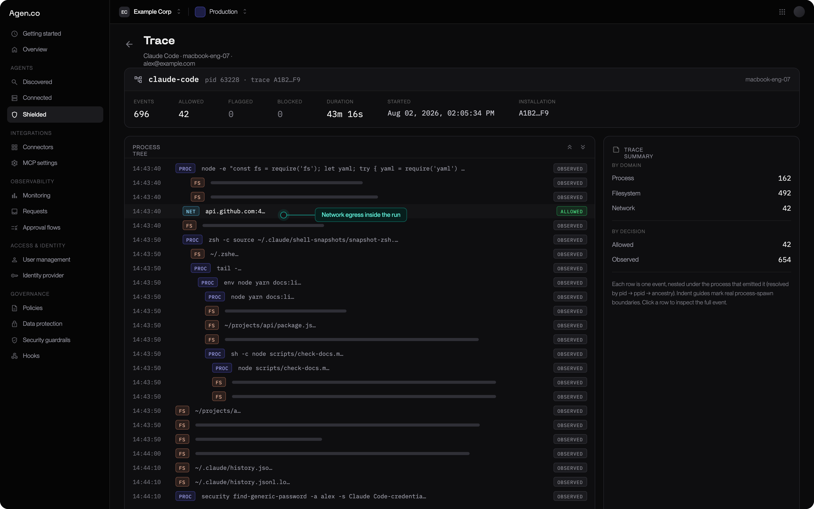

A rollout that starts with blocking generates a queue of angry tickets and gets
switched off. A rollout that starts with watching produces the evidence you need
to block the right things. This is the sequence that works.

<Note>
  This page is for whoever owns AgenShield for the organization. Developers
  should read [Working with a protected agent](../using/protected-agents.mdx).
</Note>

## The five phases

<Steps>
  <Step title="Prepare the tenant">
    Configure posture in the console **before** any Mac enrolls.
  </Step>
  <Step title="Pilot on a handful of Macs">
    Prove install, approvals, and protection work in your environment.
  </Step>
  <Step title="Roll out in monitor mode">
    Deploy widely with nothing blocked. Collect two weeks of real activity.
  </Step>
  <Step title="Turn evidence into rules">
    Approve what is legitimate; write narrow rules for what is not.
  </Step>
  <Step title="Promote to enforcement, one rule at a time">
    Never fleet-wide in one step.
  </Step>
</Steps>

## Phase 1 — Prepare the tenant

Decide these in the console first. None of them touch an endpoint.

| Decision                 | Recommendation for a first rollout                                                       |
| ------------------------ | ---------------------------------------------------------------------------------------- |
| Default enforcement mode | **`monitor`.** Change this only when you have evidence.                                  |
| Which agents to govern   | Start with the one your team actually uses most — Claude Code, Cursor, Codex CLI.        |
| Redaction patterns       | Add any organization-specific credential formats now, so they are stripped from day one. |
| Network inspection       | Leave **off** initially. Turn it on later if you need to see request contents.           |
| Skill governance         | Start in observe-only; move to approval once you know what is in use.                    |

Then create an [**install campaign**](../deployment/campaigns.mdx). It produces the
install link your rollout channel distributes, plus the ready-made configuration
profile and installer package for a managed fleet. The token only authorizes
enrollment, is revocable, and is not an admin credential — so it is safe to hand
to a device management system or an onboarding doc.

## Phase 2 — Pilot on a handful of Macs

Pick 3–5 developers who use AI agents heavily and will tell you when something
feels wrong.

Follow the [Quickstart](../getting-started/quickstart.md) on each, or the
[MDM guide](../deployment/mdm/overview.mdx) if the fleet is managed. What
you are proving:

- the install completes and the Mac enrols
- the three macOS approvals land — pre-approved by MDM, or granted by hand
- an agent can be protected and still works normally afterwards
- activity from that Mac appears in the console

Fix anything that surfaces here. It is far cheaper than fixing it across 200
machines.

## Phase 3 — Roll out in monitor mode

Deploy to the wider group with the default mode still `monitor`. Nothing is
blocked. Let people work normally for **at least two weeks** — long enough to
capture a release cycle, a dependency upgrade, and someone's unusual workflow.

What you are collecting:

| Question                                          | What the evidence tells you                               |
| ------------------------------------------------- | --------------------------------------------------------- |
| What do agents actually execute?                  | The real command surface, not the one you assumed         |
| Which hosts do they need?                         | Package registries, model APIs, and internal services     |
| Which files do they read?                         | Whether they are near credentials, keys, or customer data |
| Which skills and connectors are loaded?           | The extension surface you did not know you had            |
| Does inspected traffic carry credential patterns? | Where secrets are actually leaking                        |

[Telemetry](../configuration/telemetry.mdx) is where all of that is collected, and
[Enrolled devices](../deployment/devices.mdx) tells you whether the fleet is actually
reporting. Resist the urge to write rules during this phase — incomplete
evidence produces brittle rules.

## Phase 4 — Turn evidence into rules

Now work through what you saw. The principle: **narrow rules scoped to a specific
agent**, never broad global blocks.

| What you observed                               | What to do                                                            |
| ----------------------------------------------- | --------------------------------------------------------------------- |
| Agent reaches required vendor and registry APIs | Add agent-scoped allow rules for those hosts                          |
| Agent reaches something unexpected              | Add the deny in **monitor** first; confirm nothing legitimate matches |
| Agent reads credential files                    | Deny scoped to that agent, that path, that operation                  |
| Agent launches a risky child tool               | Rule scoped to the agent, not a global command ban                    |
| An unknown skill appears on many Macs           | Review it once, then approve or block it for everyone                 |
| Lots of harmless denials in the evidence        | Narrow the rule's scope — do not widen the allow                      |

Use the trace view rather than event counts. One trace shows the root agent, the
child command, the file it read, the request it made, and the decision — which is
usually enough to tell "legitimate" from "worth blocking" at a glance.

<Frame caption="A trace — one agent run as a tree of process, file, and network events, each with its decision.">
  
</Frame>

[Rules and policy](../configuration/policies.mdx) covers how a rule is built from
grants; [Agent resources](../configuration/agent-resources.mdx) covers the skills and
connectors, which are approved rather than ruled on.

## Phase 5 — Promote to enforcement

Promote **one rule at a time**. A rule's own mode overrides the fleet default, so
you can leave everything in `monitor` and turn on exactly one rule.

For each rule:

1. Promote it to `enforce` in the console.
2. Wait a full working day.
3. Check the console for blocks against that rule.
4. Legitimate blocks mean the rule is too broad — narrow it and repeat.

Once a cluster of rules is stable, consider moving the fleet default from
`monitor` to `audit` — deny rules block, anything unmatched is still allowed.
Move to `enforce`, where only explicitly permitted activity is allowed, only when
your allow rules genuinely cover normal work.

See [Enforcement modes](../configuration/enforcement-modes.mdx) for the exact
semantics of each mode.

## Keeping it running

The loop does not stop after the first enforced rule.

| Review                | Trigger                                              | Action                                             |
| --------------------- | ---------------------------------------------------- | -------------------------------------------------- |
| Open alerts           | New alert, or a daily security review                | Acknowledge, resolve, or convert into a rule       |
| New or changed skills | A skill appears or its content changes               | Approve, block, or ask for a re-review             |
| Network outliers      | An unexpected host, a volume spike, a secret pattern | Allow, deny, inspect, or extend redaction          |
| Endpoint health       | Missing check-in, inactive extension, stale policy   | Repair the endpoint, or re-enrol it                |
| Policy impact         | High denial counts, or a developer complaint         | Narrow the rule's scope or step it back to monitor |

## Common mistakes

- **Starting in `enforce`.** You will block legitimate work you did not know
  existed, and lose the room to iterate.
- **Broad global rules.** "No agent may run `curl`" breaks more than it protects.
  Scope to the agent and the specific case.
- **Skipping the pilot.** macOS approval behavior varies with your MDM and any
  other security software present. Find that out on 5 machines, not 200.
- **Promoting several rules at once.** When something breaks you will not know
  which one did it.
- **Treating monitor as "not secure yet".** Visibility into what your AI agents
  are doing is already more than most organizations have.

## Next

<Columns cols={2}>
  <Card title="Enforcement modes" icon="shield-check" href="../configuration/enforcement-modes.mdx">
    Exact semantics of monitor, audit, and enforce.
  </Card>
  <Card title="MDM deployment" icon="building-2" href="../deployment/mdm/overview.mdx">
    Zero-touch rollout with no prompts on the endpoint.
  </Card>
  <Card title="Rules and policy" icon="list-checks" href="../configuration/policies.mdx">
    Building a rule out of grants, and getting it to the fleet.
  </Card>
  <Card title="Telemetry" icon="activity" href="../configuration/telemetry.mdx">
    The evidence every phase above depends on.
  </Card>
</Columns>
