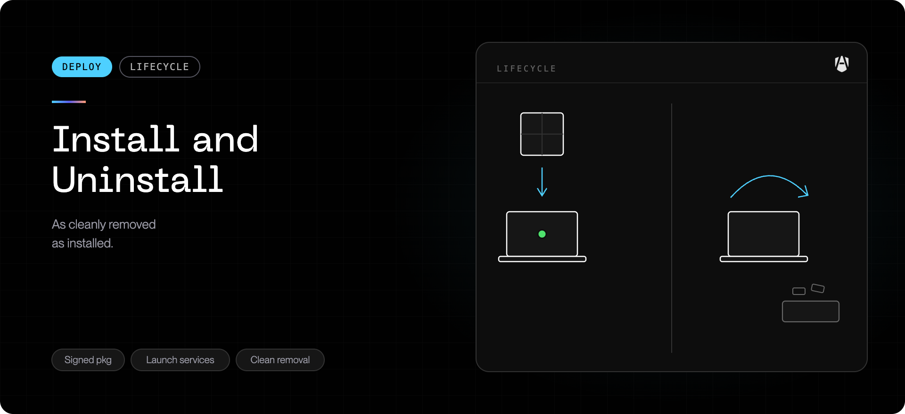

How AgenShield is installed and enrolled on a Mac, what the install puts on
disk, and how to remove it completely.

<Note>
  Setting up one Mac for the first time? Follow the
  [Quickstart](../getting-started/quickstart.md) instead — it covers install, the
  macOS approvals, and confirming the Mac is healthy, in order. Deploying to a
  fleet? Use the [MDM guide](../deployment/mdm/overview.mdx).
</Note>

Installing does **not** enforce anything on its own. It enrolls the Mac and
starts the service; enforcement begins once the macOS approvals are granted and
your organization's policy arrives. See [How AgenShield works](../how-it-works.mdx).

## Installation

AgenShield ships as the signed `AgenShield.app` bundle plus the `agenshield`
command-line tool, packaged as a signed, Apple-notarized macOS `.pkg`. See
[What gets installed](../components.mdx) for what each part is responsible for. The `.pkg` is published as a **GitHub Release
asset** on [`agen-co/agenshield`](https://github.com/agen-co/agenshield). The
`agenshield` npm package is a thin wrapper that bootstraps the installer from
that release — no large binaries ship through npm.

### Campaign install (the normal path)

A security admin creates a deployment **campaign** in the
[Frontegg Portal](https://portal.frontegg.com), on the **Devices** page
(`https://portal.frontegg.com/<environment>/agen/shielded/devices`). The
campaign produces an install URL that carries an enrollment token. The endpoint
user runs:

```bash
curl -fsSL '<CAMPAIGN_INSTALL_URL>' | bash
```

The campaign-served installer script does the following:

1. Detects the platform and architecture. macOS builds are **Apple silicon
   only** — on an Intel Mac the script stops with a clear message rather than
   installing something that cannot run.
2. Resolves the latest version from the `agen-co/agenshield` GitHub Releases API
   (or honors `--version`), then downloads the signed
   `AgenShield-<version>-arm64.pkg` from that release.
3. Stages the enrollment token for the installer, so the package can enroll the
   Mac without anyone typing anything in.
4. Runs `sudo installer -pkg <pkg> -target /`. In an interactive terminal the
   install then hands off to a guided stepper that walks the three System
   Settings approvals — security extension, Full Disk Access, and network
   filtering. Each step advances the moment the approval is detected (press
   Enter to re-check immediately), and it closes by confirming protection is
   active. Non-interactive runs — and runs with `AGENSHIELD_INSTALL_HEADLESS=1`
   set — skip the stepper and log to `/var/log/agenshield/install.log`.

The campaign install does **not** require — or prompt for — a user login. The
Mac is enrolled as a **device** and enforces the policy it receives without
anyone being signed in, so an unattended or overnight rollout works. The person
using the Mac signs in **later from the AgenShield menubar**, or with
`agenshield login`, to attach their account — that is what enables rules scoped
to their team, role, or group.

### Manual install

```bash
npx agenshield install --cloud-url <CLOUD_URL> --token <TOKEN>
agenshield start
agenshield login   # optional — or sign in later from the AgenShield menubar
```

`npx agenshield install` bootstraps a self-managed installation. On macOS it
downloads the signed `.pkg` from the `agen-co/agenshield` GitHub Release and runs
it. Given a backend URL and token, it enrolls the Mac exactly as the campaign
install does.

### Windows

A security admin creates a deployment **campaign** in the
[Frontegg Portal](https://portal.frontegg.com) the same way as for macOS. The
campaign produces an install link; on Windows, run it from a PowerShell window:

```powershell
irm '<CAMPAIGN_INSTALL_URL>' | iex
```

If the window is not already elevated, the install script requests
administrator approval itself (a standard Windows permission prompt) before
continuing — you do not need to right-click "Run as administrator" first.

The script:

1. Checks that the machine is 64-bit Windows — AgenShield for Windows does not
   yet support 32-bit or ARM devices, and the script stops with a clear
   message on those rather than installing something that cannot run.
2. Resolves the latest version for your organization's release channel (or a
   pinned version), downloads the installer package, and verifies it against
   AgenShield's release records before installing anything.
3. Stages your organization's enrollment token so the installer can enroll the
   device without anyone typing anything in — including on a machine with no
   one signed in yet.
4. Installs silently, which registers AgenShield as a Windows service (so it
   starts automatically at boot) and installs the tray app.

As with macOS, **no user login is required for protection to start.** The
device is enrolled and begins enforcing your organization's policy
immediately; signing in later (from the tray app) only adds rules scoped to
your user, team, or group.

Windows may show a publisher warning the first time you run the installer,
and an unattended install that passes the enrollment token directly on the
install command can fail to enroll on some non-English Windows editions — see
[Windows install warnings](../troubleshoot/windows-install-warnings.mdx) if you hit
either.

### What a macOS install does

For either macOS entry point above (campaign or manual install), installation
performs these steps:

1. **Downloads the signed software.** The app bundle and command-line tool, all
   code-signed and Apple-notarized.

2. **Enrolls the Mac with your organization.** The device generates its own
   cryptographic identity locally and registers against your organization's
   AgenShield backend using the enrollment token from the install link. The
   private half of that identity never leaves the machine, and every later
   request is signed with it rather than with a shared secret or bearer token.

3. **Installs the app and its extensions.** `/Applications/AgenShield.app` is
   installed; launching it activates the two system extensions. See
   [What gets installed](../components.mdx) for what each is responsible for.

4. **Starts the background service.** The service is registered to run at boot,
   and a per-user item starts the menubar app at login. The service begins
   syncing your organization's policy immediately.

**No user login is required for protection to start.** The Mac is enrolled as a
device and enforces the policy it receives; signing in later only adds rules
scoped to your user, team, or group.

Afterwards, `agenshield status --install` reports what is installed, which
components are active, and whether the Mac is enrolled.

### What a Windows install does

The Windows installer performs these steps, whether run from the install link
or the installer package directly:

1. **Verifies the installer.** Its checksum is checked against AgenShield's
   release records before anything is installed.

2. **Enrolls the device with your organization — if enrollment data is
   available.** A token can reach the installer three ways: the install
   script's staged handoff (the normal path above), a Group Policy or
   Intune-managed push, or a token passed directly on the installer's command
   line. Whichever supplies it, the device generates its own cryptographic
   identity locally and registers with that token — the same model as macOS,
   so no shared secret or bearer token is used for later requests.

   Running the installer package directly, with none of those three sources
   present, installs the software but leaves the device **unenrolled**: the
   background service runs, but no organization policy has been pulled and
   nothing is protected until enrollment completes — either by supplying a
   token afterward, or automatically once a managed policy push arrives. See
   [Windows install warnings](../troubleshoot/windows-install-warnings.mdx) if an
   unattended install did not enroll.

3. **Installs the background service and the tray app.** The service is
   registered to start automatically at boot. Once the device is enrolled, it
   syncs your organization's policy and enforces your organization's network
   policy; the tray app gives the signed-in user status and controls.

**No user login is required for protection to start.** Once enrolled, the
device enforces the policy it receives immediately; signing in later (from
the tray app) only adds rules scoped to your user, team, or group.

Enrollment state and policy for a Windows install live under
`%ProgramData%\AgenShield\` — the Windows analog of `/opt/agenshield/config/`
on macOS. Both the installer and the background service harden this
directory to administrators only, and the background service independently
verifies that hardening at every startup; enrollment refuses to read the
staged enrollment data here until that verification passes.

### Key files and locations

| Path                                                     | Purpose                                                     |
| -------------------------------------------------------- | ----------------------------------------------------------- |
| `/Applications/AgenShield.app`                           | The app, dashboard, and both system extensions              |
| `/Library/AgenShield/`                                   | The background service and command-line tool                |
| `/opt/agenshield/config/`                                | Your organization's policy (administrator-only, root-owned) |
| `/Library/LaunchDaemons/com.frontegg.AgenShield.*.plist` | Service registration                                        |
| `/etc/agenshield/`                                       | Additional protection configuration (administrator-only)    |
| `~/.agenshield/`                                         | Per-user settings, credentials, and local activity store    |
| `/var/log/agenshield/`                                   | Service logs                                                |

<Warning>
  `~/.agenshield/` holds this device's enrollment credentials. It is created with
  owner-only permissions — do not loosen them, copy it between machines, or check
  it into a repository.
</Warning>

## Uninstallation

The preferred path is the CLI's own `uninstall` command; a campaign-served
`uninstall.sh` and a manual fallback exist for when the binary is missing or
damaged.

### CLI-driven teardown (preferred)

```bash
agenshield uninstall        # add --yes for scripted, non-interactive runs
```

No `sudo` needed — the command asks for your administrator password itself.
`agenshield uninstall` performs a complete, ordered rollback: it stops
enforcement, removes the services and configuration AgenShield created,
deactivates the system extensions, removes the AgenShield certificate from the
system trust store, and forgets the installer receipts.

To also purge stale extension versions that macOS has marked "waiting to
uninstall on reboot":

```bash
agenshield doctor --cleanup-extensions
```

### Campaign-served uninstall.sh

If AgenShield was installed from a campaign URL, it can be removed the same way:

```bash
curl -fsSL '<CAMPAIGN_URL>/uninstall.sh' | bash
```

This delegates to `agenshield uninstall --force --non-interactive` and then
runs the manual cleanup below as a belt-and-suspenders step, so it still
completes if the CLI has been partially torn down.

### Manual fallback

A last resort, not a routine path — use it only when the `agenshield` binary is
missing or broken. On macOS, `npx agenshield uninstall` performs these steps
**automatically** when the binary is gone but files remain (it removes them
directly instead of bootstrapping the installer). Open the steps below only if
that also fails.

<AccordionGroup>
  <Accordion title="Manual removal steps — advanced, run in order">
    **Stop running services:**

    ```bash
    sudo launchctl bootout system/com.frontegg.AgenShield.daemon 2>/dev/null || true
    sudo launchctl bootout system/com.frontegg.AgenShield.privilege-helper 2>/dev/null || true
    launchctl bootout "gui/$(id -u)/com.frontegg.AgenShield.menubar" 2>/dev/null || true
    ```

    **Deactivate the system extensions** (the signed app bundle is what
    deactivates the extensions it activated):

    ```bash
    sudo /Applications/AgenShield.app/Contents/MacOS/AgenShield --uninstall-all 2>/dev/null || true
    ```

    **Remove the CA trust and the node-ca-trust env.** A leftover AgenShield root in
    the System keychain is a security risk, and the stale `NODE_EXTRA_CA_CERTS` points at
    a CA file that is about to be deleted:

    ```bash
    # Delete every AgenShield root from the System keychain by SHA-1 — the CN
    # varies ("AgenShield CA", "AgenShield Dev CA", "AgenShield MITM CA (…)"), so a
    # fixed -c name misses variants. This mirrors what `agenshield uninstall` does.
    security find-certificate -a -Z -c "AgenShield" /Library/Keychains/System.keychain 2>/dev/null \
      | awk '/^SHA-1/ {print $3}' \
      | while read -r SHA; do sudo security delete-certificate -Z "$SHA" /Library/Keychains/System.keychain 2>/dev/null || true; done

    # Drop the node-ca-trust LaunchAgent and clear the env it set.
    launchctl bootout "gui/$(id -u)/com.frontegg.AgenShield.node-ca-trust" 2>/dev/null || true
    launchctl unsetenv NODE_EXTRA_CA_CERTS 2>/dev/null || true
    ```

    `launchctl unsetenv` only affects new launches — fully quit and reopen your
    terminal and GUI apps (Cursor, Claude Desktop, VS Code) so they drop the stale
    value, or `unset NODE_EXTRA_CA_CERTS` in any open shell.

    **Remove plists and directories:**

    ```bash
    sudo rm -f /Library/LaunchDaemons/com.frontegg.AgenShield.*.plist
    rm -f ~/Library/LaunchAgents/com.frontegg.AgenShield.*.plist

    sudo rm -rf /Library/AgenShield \
                /opt/agenshield \
                /Applications/AgenShield.app \
                /etc/agenshield
    sudo rm -f /usr/local/bin/agenshield
    ```

    **Remove user state.** When installed via `.pkg`, the background service runs as root and
    its files in `~/.agenshield/` are root-owned, so `sudo` is required:

    ```bash
    sudo rm -rf ~/.agenshield
    ```

    **Forget pkg receipts:**

    ```bash
    for RECEIPT in com.frontegg.agenshield.core \
                   com.frontegg.agenshield.app \
                   com.frontegg.agenshield.bootstrap; do
      sudo pkgutil --forget "$RECEIPT" 2>/dev/null || true
    done
    ```

  </Accordion>
</AccordionGroup>

### Verify a clean removal

```bash
systemextensionsctl list | grep frontegg        # should be empty (may need reboot)
pkgutil --pkgs | grep frontegg                  # should be empty
ls /Library/AgenShield /opt/agenshield /Applications/AgenShield.app 2>/dev/null
ls ~/.agenshield 2>/dev/null
sudo security find-certificate -c "AgenShield CA" /Library/Keychains/System.keychain 2>/dev/null
# ^ should print nothing (no AgenShield root left in the trust store)
```

macOS finalizes the removal of system extensions on the next reboot — until
then they may show `[terminated waiting to uninstall on reboot]`.

### Troubleshooting

- **`Operation not permitted` on `launchctl bootout`** — run with `sudo`; if it
  still fails, the service was already unloaded, so proceed.
- **Extension still shows `[activated enabled]`** — the app bundle's
  `--uninstall-all` failed (the app may already be gone). Reinstall the app and
  re-run the CLI uninstall, or run
  `sudo systemextensionsctl uninstall 3R2X6557U2 com.frontegg.AgenShield.es-extension`
  (and `.network-extension`) with developer mode enabled.
- **`~/.agenshield` keeps being recreated** — the background service LaunchDaemon is still
  bootstrapped; confirm the `launchctl bootout` step succeeded (no
  `com.frontegg.AgenShield.daemon` in `sudo launchctl list`).

### Related commands

- `agenshield install` — installs or repairs a self-managed installation.
- `agenshield activate` — walks through the three macOS approvals.
- `agenshield status` — confirms what is running after either operation.
- `agenshield doctor --cleanup-extensions` — purges stale system extensions.
- `agenshield uninstall` — the authoritative removal path.

Full list: [CLI reference](../reference/cli.md).

## Next

After installing, grant the [three macOS approvals](../components.mdx) and confirm
the Mac is healthy — see the [Quickstart](../getting-started/quickstart.md). For a
fleet, follow the [rollout playbook](../deployment/rollout-playbook.mdx).
