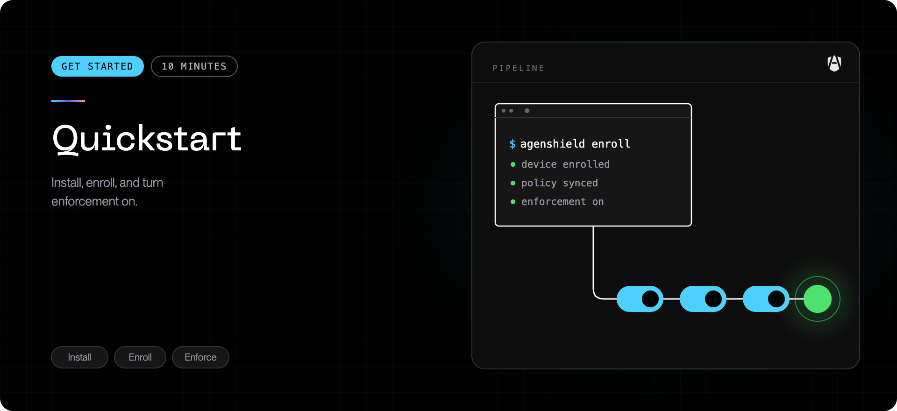

About ten minutes, most of it waiting on macOS approval dialogs. At the end
your AI coding agents will be running under your organization's policy, with
their activity visible in the [Frontegg Portal](https://portal.frontegg.com).

<Note>
  New to the product? [How AgenShield works](../how-it-works.mdx) explains the policy
  model and enforcement modes in five minutes. Rolling out to a fleet? Use the
  [MDM guide](../deployment/mdm/overview.mdx) instead — it pre-approves
  everything below so nobody is prompted.
</Note>

## Before you start

| Requirement           | Notes                                                                                                                     |
| --------------------- | ------------------------------------------------------------------------------------------------------------------------- |
| macOS 14 or later     | Apple silicon only — Intel support is planned, not yet available                                                          |
| Administrator rights  | The installer writes to `/Applications` and installs a system service                                                     |
| Your install link     | From your AgenShield administrator — it carries the enrollment token                                                      |
| Network access        | The Mac must reach your organization's AgenShield backend                                                                 |
| An AI agent installed | Claude Code, Cursor, Codex CLI, Gemini CLI — anything from the [catalog](../how-it-works.mdx#the-agents-agenshield-knows-about) |

## 1. Install

Paste the install link your administrator gave you:

```bash
curl -fsSL '<YOUR_INSTALL_LINK>' | bash
```

This downloads the signed, Apple-notarized package, installs it, enrolls the
Mac with your organization, and starts the background service. You are asked
for your password once.

<Tip>
  No install link? An administrator creates one in the
  [Frontegg Portal](https://portal.frontegg.com) as an
  [**install campaign**](../deployment/campaigns.mdx). The link embeds an enrollment
  token, so nothing has to be typed in by hand and no admin credentials touch the
  endpoint.
</Tip>

## 2. Grant the three macOS approvals

macOS does not let any security product enable itself silently. On an
unmanaged Mac, someone with administrator rights has to approve three things,
once. AgenShield walks you through them:

```bash
agenshield activate
```

<Steps>
  <Step title="Allow the system extensions">
    **System Settings → General → Login Items & Extensions.** Approve both
    AgenShield extensions. Until this is done, nothing is being enforced.
  </Step>
  <Step title="Grant Full Disk Access">
    **System Settings → Privacy & Security → Full Disk Access.** Enable the
    AgenShield security extension. Without it the extension cannot evaluate file
    access, and enforcement stays off.
  </Step>
  <Step title="Allow network filtering">
    Approve the **"Filter Network Content"** prompt when macOS shows it. Without
    it, network rules have no effect.
  </Step>
</Steps>

The command detects each approval the moment you grant it and moves on — there
is nothing to confirm back in the terminal. Press <kbd>Enter</kbd> to re-check
immediately if you want.

## 3. Confirm the Mac is healthy

```bash
agenshield status
```

You are looking for a healthy system report — the background service running,
your organization's policy received, and enforcement active:

```text
AgenShield Status
=================

Daemon         ✓ running — v2026.8.3, pid 4821, up 4m
Setup          ✓ complete (cloud)
Crash reports  ✓ none

Policy         ✓ bundle 3f9c1a2e · monitor · 84 rules
Cloud sync     ✓ connected — last sync 1m ago

Organization   ✓ enrolled — Example Corp
User           ○ logged out — sign in from the AgenShield app

Enforcement    ✓ Enforcing — the security and network extensions are loaded, functional, and enforcing policy.
  ✓ Endpoint Security    enforcing
  ✓ Full Disk Access     granted
  ✓ Network filtering    on
  ✓ Transparent proxy    running
  ✓ CA trust             installed and trusted

Workers        ✓ 9/9 running

Installed agents
  claude-code   v1.4.2   ● running (2 processes)
  cursor        v0.51.1  ○ installed

──────────────────────────────
Status: ✅ Healthy
```

Every agent in the **Installed agents** list is already governed by your
organization's policy — there is nothing to enable per agent. The one open
item above is the next step: signing in.

<Tip>
  The menubar icon shows the same at a glance, and opens the AgenShield
  dashboard — see [The AgenShield app](../using/the-app.mdx).
</Tip>

## 4. Sign in

Open the AgenShield menubar icon and click **Log in** — it opens your
organization's sign-in page in the browser. Signing in links the Mac to your
user account, so policy can apply rules based on your team, role, or group.
Until you sign in, only device-wide rules apply.

Prefer the terminal? `agenshield login` starts the same browser sign-in.

## 5. Use the agent normally

Start the agent the way you always do — there is no new command to learn, and
nothing about your workflow changes.

What you notice from here depends on the mode your administrator chose:

- **monitor** — nothing is blocked; activity is recorded so your security team
  can see what agents genuinely need.
- **audit** or **enforce** — activity outside policy fails with a permission
  error, and the block is recorded with the rule that caused it.

See [Working with your agents](../using/working-with-agents.mdx) for what changes
day to day, and [Enforcement modes](../configuration/enforcement-modes.mdx) for what
each mode means.

## If something is not right

```bash
agenshield doctor
```

`doctor` checks each component and names what is failing; `agenshield doctor --fix`
attempts a repair. Almost every first-install problem is one of the three
approvals in step 2. If it persists, see
[Common issues](../troubleshoot/common-issues.mdx).

## Removing it

```bash
agenshield uninstall
```

No `sudo` needed — the command asks for your administrator password itself.
See [Install and uninstall](../getting-started/install-and-uninstall.md) for the
full removal path and how to verify nothing is left behind.

## Next

<Columns cols={2}>
  <Card title="Rollout playbook" icon="map" href="../deployment/rollout-playbook.mdx">
    Take this from one Mac to a fleet without breaking developer workflows.
  </Card>
  <Card title="Working with your agents" icon="terminal" href="../using/working-with-agents.mdx">
    What changes for the developer, and what a block looks like.
  </Card>
</Columns>
