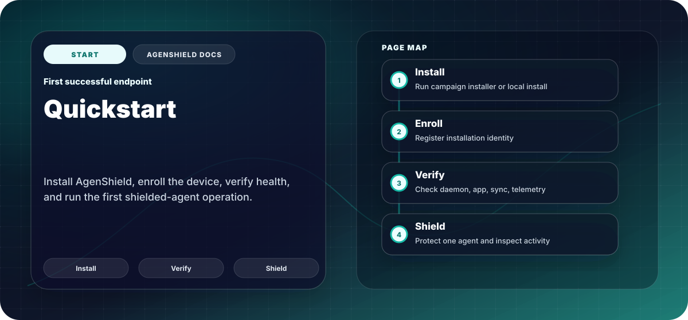

About ten minutes, most of it waiting on macOS approval dialogs. At the end you
will have one AI coding agent running under AgenShield, with its activity visible
in your console.

<Note>
  New to the product? [How AgenShield works](../how-it-works.mdx) explains protected
  agents and enforcement modes in five minutes. Rolling out to a fleet? Use the
  [MDM guide](../deployment/mdm/overview.mdx) instead — it pre-approves
  everything below so nobody is prompted.
</Note>

## Before you start

| Requirement           | Notes                                                                 |
| --------------------- | --------------------------------------------------------------------- |
| macOS 14 or later     | Apple silicon only — Intel support is planned, not yet available      |
| Administrator rights  | The installer writes to `/Applications` and installs a system service |
| Your install link     | From your AgenShield administrator — it carries the enrollment token  |
| Network access        | The Mac must reach your organization's AgenShield console             |
| An AI agent installed | Claude Code, Cursor, Codex CLI — whatever you want to protect         |

## 1. Install

Paste the install link your administrator gave you:

```bash
curl -fsSL '<YOUR_INSTALL_LINK>' | bash
```

This downloads the signed, Apple-notarized package, installs it, enrols the Mac
with your organization, and starts the background service. You are asked for
your password once.

<Tip>
  No install link? An administrator creates one in the AgenShield console as an
  [**install campaign**](../deployment/campaigns.mdx). The link embeds an enrollment
  token, so nothing has to be typed in by hand and no admin credentials touch the
  endpoint.
</Tip>

## 2. Grant the three macOS approvals

macOS does not let any security product enable itself silently. On an
unmanaged Mac, someone with administrator rights has to approve three things,
once. AgenShield walks you through them:

```bash
agenshield activate
```

<Steps>
  <Step title="Allow the system extensions">
    **System Settings → General → Login Items & Extensions.** Approve both
    AgenShield extensions. Until this is done, nothing is being enforced.
  </Step>
  <Step title="Grant Full Disk Access">
    **System Settings → Privacy & Security → Full Disk Access.** Enable the
    AgenShield security extension. Without it the extension cannot evaluate file
    access, and protection stays off.
  </Step>
  <Step title="Allow network filtering">
    Approve the **"Filter Network Content"** prompt when macOS shows it. Without
    it, network rules have no effect.
  </Step>
</Steps>

The command detects each approval the moment you grant it and moves on — there
is nothing to confirm back in the terminal. Press <kbd>Enter</kbd> to re-check
immediately if you want.

## 3. Confirm the Mac is healthy

```bash
agenshield status
```

You are looking for the background service running and your agent detected:

```text
Daemon:       ✓ Running

Targets:
  claudecode:
    Protection:   ○ Not protected

Status: ⚠ UNPROTECTED
```

`UNPROTECTED` at this point is expected — AgenShield has found your agent but is
not protecting it yet. That is the next step.

<Tip>
  The menubar icon shows the same at a glance, and opens the AgenShield
  dashboard — see [The AgenShield app](../using/the-app.mdx).
</Tip>

## 4. Protect an agent

Open the AgenShield menubar, pick the agent you want to protect, and confirm with
your system password.

This registers the agent with the security extensions. From then on, everything
it runs, reads, and connects to is checked against your organization's policy.

Then confirm:

```bash
agenshield status
```

```text
Targets:
  claudecode:
    Protection:   ✓ Protected
    Status:       running

Status: ✅ SECURE
```

## 5. Sign in

```bash
agenshield login
```

This opens a device-code login in your browser and links the Mac to your user
account, so policy can apply rules based on your team, role, or group. Until you
sign in, only device-wide rules apply.

## 6. Use the agent normally

Start the agent the way you always do — there is no new command to learn, and
nothing about your workflow changes.

What you notice from here depends on the mode your administrator chose:

- **monitor** — nothing is blocked; activity is recorded so your security team
  can see what agents genuinely need.
- **audit** or **enforce** — activity outside policy fails with a permission
  error, and the block is recorded with the rule that caused it.

See [Working with a protected agent](../using/protected-agents.mdx) for what changes
day to day, and [Enforcement modes](../configuration/enforcement-modes.mdx) for what
each mode means.

## If something is not right

```bash
agenshield doctor
```

`doctor` checks each component and names what is failing; `agenshield doctor --fix`
attempts a repair. Almost every first-install problem is one of the three
approvals in step 2. If it persists, see
[Common issues](../troubleshoot/common-issues.mdx).

## Removing it

```bash
sudo agenshield uninstall
```

See [Install and uninstall](../getting-started/install-and-uninstall.md) for the full
removal path and how to verify nothing is left behind.

## Next

<Columns cols={2}>
  <Card title="Rollout playbook" icon="map" href="../deployment/rollout-playbook.mdx">
    Take this from one Mac to a fleet without breaking developer workflows.
  </Card>
  <Card title="Working with a protected agent" icon="terminal" href="../using/protected-agents.mdx">
    What changes for the developer, and what a block looks like.
  </Card>
</Columns>
