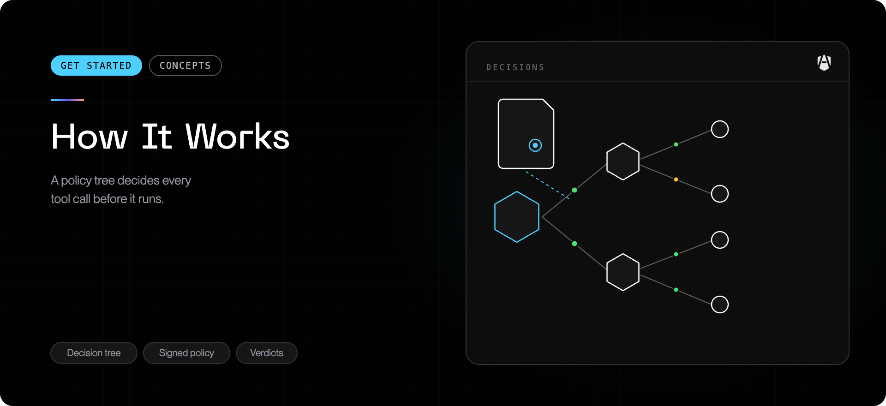

Read this before deploying. Everything else in these docs assumes the model on
this page.

## The problem

An AI coding agent is an ordinary process running as the developer. It inherits
everything they can reach: the whole home directory, every credential file,
every internal service, the shell. It acts continuously, at speed, on
instructions that may have come from a web page, a dependency, or a file it was
asked to read.

Traditional endpoint tooling does not help much here, because nothing the agent
does is unusual on its own. Reading a file is normal. Running `curl` is normal.
The question is whether _this agent_ should be doing it.

## The model

AgenShield answers that question in three parts.

<CardGroup cols={3}>
  <Card title="Detect" icon="radar">
    Every AI agent on the Mac is found automatically and governed as its own
    actor — separate from you and from your other applications.
  </Card>
  <Card title="Decide" icon="scale">
    Every program an agent runs, file it opens, and destination it reaches is
    evaluated against the policy your organization defines centrally.
  </Card>
  <Card title="Record" icon="activity">
    Every decision — allowed, blocked, or merely observed — is recorded, with
    credentials removed before anything leaves the Mac.
  </Card>
</CardGroup>

There is no per-agent switch to flip. From the moment AgenShield is installed
and your organization's policy arrives, every agent it detects is governed by
that policy automatically.

### The agents AgenShield knows about

AgenShield recognizes a broad, growing catalog of AI agents — Claude Code,
Cursor, Codex CLI, Gemini CLI, GitHub Copilot, Windsurf, Aider, Claude
Desktop, and more. The catalog is delivered alongside policy, so new agents
become known to the fleet without reinstalling anything.

`agenshield status` shows what was found on this Mac:

```text
Installed agents
  claude-code   v1.4.2   ● running (2 processes)
  cursor        v0.51.1  ○ installed
  gemini-cli    v0.9.0   ○ installed
```

Developers keep launching their agents the same way — nothing about their
workflow changes.

### The execution tree

Agents rarely act directly. They run a build tool, which runs a package
manager, which opens a network connection. AgenShield follows that chain — the
**execution tree** — so an action taken three processes deep is still
attributed to the agent that started it, and evaluated against that agent's
policy.

The tree is what makes precise rules possible: "this agent may reach GitHub,
but only through the `gh` CLI" or "installs may read the registry credentials
file, the agent itself may not" are statements about the chain, not about a
single process. See [Rules and policy](./configuration/policies.mdx) for worked
examples.

### Policy comes from the Frontegg Portal

Rules are authored once in the [Frontegg Portal](https://portal.frontegg.com)
and delivered to each enrolled Mac as a **signed** policy. The device verifies
the signature before applying it, and keeps enforcing the last policy it
received when offline.

Policy covers what an agent may **run**, **read and write**, **connect to**,
and which **skills, extensions, and connectors** it may load.

## The three enforcement modes

This is the part most worth understanding, because it decides how disruptive a
rollout feels.

| Mode        | Behavior                                                                           | Think of it as |
| ----------- | ---------------------------------------------------------------------------------- | -------------- |
| **monitor** | Nothing is blocked. Activity is recorded, including what _would_ have been denied. | A dry run      |
| **audit**   | Rules that say "deny" block. Anything with no matching rule is allowed.            | A blocklist    |
| **enforce** | Only what policy explicitly permits is allowed. Everything else is denied.         | An allowlist   |

Your organization sets a **default mode** for the fleet, and **an individual rule
can override it**.

That override is the whole rollout strategy: keep the fleet in `monitor`, then
promote one well-understood rule at a time to `enforce`. It also means "we are in
monitor mode" does not guarantee nothing is ever blocked — a rule your
administrator promoted still blocks. The Frontegg Portal shows which rules are
enforcing.

<Note>
  Start in `monitor`. It is not a weak setting — it is how you find out what your
  agents genuinely need before you risk breaking someone's workflow. See the
  [rollout playbook](./deployment/rollout-playbook.mdx).
</Note>

## Where it stops

AgenShield governs AI agents — not you. Your own commands, files, browsing,
and applications are outside its scope, and it never collects keystrokes,
screen contents, camera, microphone, or location. What it records is limited
to what governed agents do, with credentials removed on the device before
anything is sent. [Privacy and data handling](./configuration/privacy-and-data.mdx)
spells out exactly what leaves the Mac.

### It cannot lock you out

A security product that can lock someone out of their own computer is a bigger
risk than the one it was installed to manage. Three things prevent it:

- The processes and system paths macOS needs to function can never be denied.
  Those limits are compiled into the signed security extension — there is no
  configuration file, API, or policy field that can change them.
- Enforcement applies to AI agents. Your own account is outside the agent
  policy envelope.
- If AgenShield ever starts denying an unexpected volume of ordinary system
  activity, it stands itself down automatically and allows everything for a
  cooling-off period, then re-arms itself. No one has to notice for the Mac to
  recover.

Changing any of that would require shipping a newly signed release.

And should you ever find the host account blocked anyway, there is a local
kill-switch that needs no network and no support ticket — an administrator on
the Mac can disable enforcement immediately:

```bash
sudo touch /var/db/com.frontegg.AgenShield/emergency-disable
```

Enforcement stops within about a second. Once the machine is healthy again,
clear it with `agenshield doctor --fix`.

## The operating loop

<Steps>
  <Step title="Observe">
    Deploy in monitor mode. Let real work happen. The Frontegg Portal fills
    with what your agents actually run, read, and reach.
  </Step>
  <Step title="Decide">
    Approve what is legitimate — the package registries, the vendor APIs, the
    shared skills. Write rules for what is not.
  </Step>
  <Step title="Enforce">
    Promote those rules to blocking, one at a time, and watch for fallout.
  </Step>
  <Step title="Repeat">
    Agents, tools, and connectors change constantly. New activity shows up as
    new evidence, and the loop runs again.
  </Step>
</Steps>

## Next

<Columns cols={2}>
  <Card title="Quickstart" icon="rocket" href="./getting-started/quickstart.md">
    Put this into practice on one Mac.
  </Card>
  <Card title="Rollout playbook" icon="map" href="./deployment/rollout-playbook.mdx">
    Take it to a fleet without breaking anyone's day.
  </Card>
</Columns>
