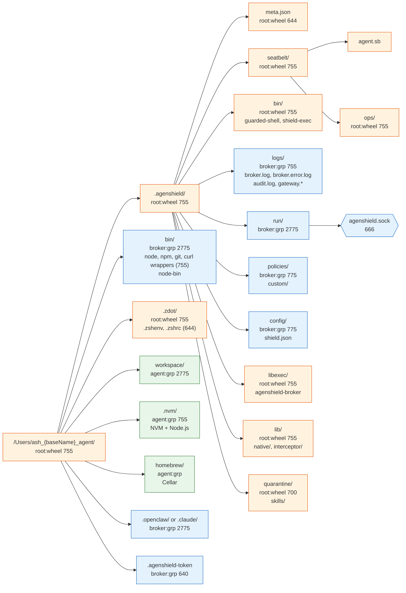
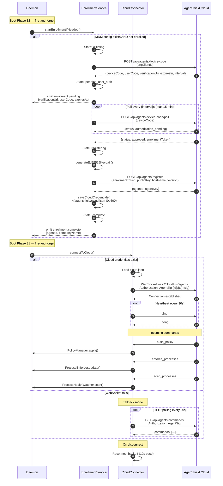

# Post-Shield Architecture (Multi-Target)

> System state after shielding 3 targets: **openclaw**, **openclaw_2**, and **claude_code**.
>
> Four Mermaid diagrams + reference tables describe the full topology, file hierarchy,
> daemon internals, and cloud enrollment flow.

---

## 1. Master Topology Diagram

```mermaid
flowchart TB
    subgraph CLOUD["☁ AgenShield Cloud"]
        cloud_ws[["WebSocket<br/>wss://cloud/ws/agents"]]
        cloud_http[["HTTP API<br/>cloud/api/agents"]]
    end

    subgraph HOST["🖥 Host Machine — /Users/{hostUser}"]

        subgraph UI["Dashboard"]
            ui_app["Shield UI<br/>:4200 (dev)"]
        end

        subgraph DAEMON["Daemon Process :5200"]
            proc_health("ProcessHealthWatcher<br/>10s poll")
            target_watch("TargetWatcher<br/>10s poll")
            skill_mgr("SkillManager<br/>30s watcher")
            cloud_conn("CloudConnector<br/>WS + HTTP 30s")
            enrollment_svc("EnrollmentService<br/>device code OAuth")
            broker_bridge("BrokerBridge<br/>per-profile sockets")
            policy_mgr("PolicyManager<br/>engine + push")
            metrics("MetricsCollector<br/>2s → SQLite")
            sse_ep[/"SSE Endpoints<br/>/sse/events/*"/]
        end

        subgraph SHARED_FS["~/.agenshield/"]
            libexec[("libexec/<br/>SEA binaries")]
            lib_native[("lib/vN/<br/>native, interceptor")]
            host_bin["bin/<br/>host wrappers"]
            cloud_json[("cloud.json<br/>Ed25519 creds")]
            vault_key[(".vault-key")]
            db[("agenshield.db<br/>SQLite WAL")]
            admin_token[".admin-token"]
            path_reg["path-registry.json"]
        end

        subgraph LAUNCHD["launchd (system domain)"]
            plist_daemon[/"com.agenshield.daemon<br/>KeepAlive: SuccessfulExit=false"/]
            plist_oc_broker[/"com.agenshield.broker.openclaw<br/>KeepAlive: true"/]
            plist_oc_gw[/"com.agenshield.openclaw.gateway<br/>KeepAlive: OtherJobEnabled"/]
            plist_oc2_broker[/"com.agenshield.broker.openclaw_2<br/>KeepAlive: true"/]
            plist_oc2_gw[/"com.agenshield.openclaw_2.gateway<br/>KeepAlive: OtherJobEnabled"/]
            plist_cc_broker[/"com.agenshield.broker.claude_code<br/>KeepAlive: true"/]
        end
    end

    subgraph TARGET_OC["🟢 openclaw"]
        oc_broker["Broker Process<br/>ash_openclaw_broker"]
        oc_gateway["Gateway Process<br/>ash_openclaw_agent"]
        oc_socket{{"agenshield.sock"}}
        oc_fs[("Agent Home<br/>/Users/ash_openclaw_agent/")]
    end

    subgraph TARGET_OC2["🟠 openclaw_2"]
        oc2_broker["Broker Process<br/>ash_openclaw_2_broker"]
        oc2_gateway["Gateway Process<br/>ash_openclaw_2_agent"]
        oc2_socket{{"agenshield.sock"}}
        oc2_fs[("Agent Home<br/>/Users/ash_openclaw_2_agent/")]
    end

    subgraph TARGET_CC["🟣 claude_code"]
        cc_broker["Broker Process<br/>ash_claude_code_broker"]
        cc_socket{{"agenshield.sock"}}
        cc_fs[("Agent Home<br/>/Users/ash_claude_code_agent/")]
    end

    %% Cloud connections
    cloud_conn -- "WebSocket wss://" --> cloud_ws
    cloud_conn -. "HTTP polling 30s" .-> cloud_http
    enrollment_svc -- "device code + register" --> cloud_http

    %% Daemon ↔ Brokers (Unix sockets)
    broker_bridge -- "Unix socket" --> oc_socket
    broker_bridge -- "Unix socket" --> oc2_socket
    broker_bridge -- "Unix socket" --> cc_socket

    %% Broker ↔ Socket
    oc_broker -- "listen" --> oc_socket
    oc2_broker -- "listen" --> oc2_socket
    cc_broker -- "listen" --> cc_socket

    %% Gateway ↔ Broker
    oc_gateway -- "NODE_OPTIONS interceptor" --> oc_socket
    oc2_gateway -- "NODE_OPTIONS interceptor" --> oc2_socket

    %% UI ↔ Daemon
    ui_app -- "HTTP :5200 + SSE" --> sse_ep

    %% Daemon ↔ launchd
    proc_health -- "launchctl list 10s" --> LAUNCHD

    %% launchd ↔ processes
    plist_daemon -- "RunAtLoad" --> DAEMON
    plist_oc_broker -- "KeepAlive" --> oc_broker
    plist_oc_gw -- "KeepAlive" --> oc_gateway
    plist_oc2_broker -- "KeepAlive" --> oc2_broker
    plist_oc2_gw -- "KeepAlive" --> oc2_gateway
    plist_cc_broker -- "KeepAlive" --> cc_broker

    %% Daemon ↔ shared FS
    DAEMON -- "read/write" --> db
    DAEMON -- "read" --> vault_key
    DAEMON -- "read" --> cloud_json
    skill_mgr -- "deploy" --> libexec

    %% Broker ↔ agent FS
    oc_broker -- "read/write" --> oc_fs
    oc2_broker -- "read/write" --> oc2_fs
    cc_broker -- "read/write" --> cc_fs

    %% Color classes
    classDef shared fill:#e3f2fd,stroke:#1565c0
    classDef openclaw fill:#e8f5e9,stroke:#2e7d32
    classDef openclaw2 fill:#fff3e0,stroke:#e65100
    classDef claudecode fill:#f3e5f5,stroke:#6a1b9a
    classDef cloud fill:#e0f7fa,stroke:#00838f

    class CLOUD,cloud_ws,cloud_http cloud
    class SHARED_FS,libexec,lib_native,host_bin,cloud_json,vault_key,db,admin_token,path_reg shared
    class TARGET_OC,oc_broker,oc_gateway,oc_socket,oc_fs openclaw
    class TARGET_OC2,oc2_broker,oc2_gateway,oc2_socket,oc2_fs openclaw2
    class TARGET_CC,cc_broker,cc_socket,cc_fs claudecode
```



---

## 2. Per-Target File Hierarchy

### Template (parameterized by `{baseName}`)



### Instantiation per Target

| Parameter | openclaw | openclaw_2 | claude_code |
|-----------|----------|------------|-------------|
| `{baseName}` | `openclaw` | `openclaw_2` | `claude_code` |
| Agent home | `/Users/ash_openclaw_agent/` | `/Users/ash_openclaw_2_agent/` | `/Users/ash_claude_code_agent/` |
| Agent user | `ash_openclaw_agent` | `ash_openclaw_2_agent` | `ash_claude_code_agent` |
| Broker user | `ash_openclaw_broker` | `ash_openclaw_2_broker` | `ash_claude_code_broker` |
| Socket group | `ash_openclaw` | `ash_openclaw_2` | `ash_claude_code` |
| Preset dir | `.openclaw/` | `.openclaw/` | `.claude/` |
| Has gateway | Yes | Yes | No |
| Guarded shell | Yes | Yes | Yes |

### Host-Side File Tree

```
/Users/{hostUser}/.agenshield/        (varies)
├── bin/                               (host:staff 755)  — router wrappers, daemon-launcher.sh
├── libexec/                           (root:wheel 755)  — agenshield-broker SEA, agenshield-daemon SEA
├── lib/vN/                            (root:wheel 755)  — native/, interceptor/, client/, workers/
├── logs/                              (host 755)        — daemon.log, daemon.error.log
├── run/                               (host 755)        — daemon.sock (per-profile)
├── cloud.json                         (host 0o600)      — Ed25519 agent credentials
├── .vault-key                         (host 0o600)      — AES-256-GCM vault master key
├── .admin-token                       (host 0o600)      — signed JWT for local admin
├── agenshield.db                      (host 0o644)      — SQLite WAL database
├── path-registry.json                 (host 644)        — PATH wrapper registry
├── mdm.json                           (host 0o600)      — MDM org config (if enrolled)
└── quarantine/                        (root:wheel 755)  — skill quarantine
    └── skills/                        (root:wheel 755)
```

---

## 3. Shared Daemon Services

```mermaid
flowchart TB
    subgraph DAEMON["Daemon Process :5200"]
        direction TB

        subgraph WATCHERS["Watchers"]
            phw("ProcessHealthWatcher<br/>10s, worker thread<br/>launchctl list")
            tw("TargetWatcher<br/>10s, emit on change")
            sw("SecurityWatcher<br/>10s interval")
            elm("EventLoopMonitor<br/>baseline capture")
        end

        subgraph MANAGERS["Managers"]
            skill_mgr("SkillManager")
            proc_mgr("ProcessManager<br/>spawn, crash guard<br/>5 restarts / 300s")
            policy_mgr("PolicyManager<br/>engine version + push")
            psm("ProfileSocketManager<br/>per-target daemon.sock")
        end

        subgraph SKILLS["Skill Services"]
            catalog("CatalogService")
            installer("InstallService")
            analyzer("AnalyzeService")
            deployer("DeployService")
            watcher_svc("WatcherService<br/>30s poll, integrity<br/>quarantine + reinstall")
            sync_svc("SyncService")
            backup_svc("SkillBackupService")
            download_svc("DownloadService")
            upload_svc("UploadService")
            update_svc("UpdateService")
        end

        subgraph STORAGE["Storage"]
            sqlite[("agenshield.db<br/>SQLite WAL")]
            vault_crypto("Vault Crypto<br/>AES-256-GCM")
            vault_key[(".vault-key")]
        end

        subgraph CLOUD_SVC["Cloud Services"]
            cloud_conn("CloudConnector<br/>WS primary<br/>HTTP polling 30s fallback<br/>heartbeat 30s, reconnect 10s")
            enrollment("EnrollmentService<br/>device code OAuth<br/>max 5 retries, 60s delay")
            icloud("iCloudBackupService<br/>24h default interval")
        end

        subgraph ENDPOINTS["Endpoints"]
            api["/api/*"]
            sse["/sse/events<br/>/sse/events/security<br/>/sse/events/broker<br/>/sse/events/api"]
            rpc["/rpc (interceptor)"]
        end

        subgraph METRICS["Metrics"]
            mc("MetricsCollector<br/>2s, CPU/mem/procs")
            aw("ActivityWriter<br/>SQLite")
        end
    end

    %% Watcher connections
    phw -- "process:started/stopped/restarted" --> sse
    watcher_svc -- "skills:integrity_violation" --> sse
    cloud_conn -- "push_policy" --> policy_mgr
    psm -- "per-target daemon.sock" --> MANAGERS
    skill_mgr --> catalog & installer & analyzer & deployer & watcher_svc & sync_svc & backup_svc
    mc -- "write" --> sqlite
    aw -- "write" --> sqlite
    vault_crypto -- "read" --> vault_key

    classDef watcher fill:#fff3e0,stroke:#ef6c00
    classDef manager fill:#e3f2fd,stroke:#1565c0
    classDef skill fill:#e8f5e9,stroke:#2e7d32
    classDef storage fill:#fce4ec,stroke:#c62828
    classDef cloud fill:#e0f7fa,stroke:#00838f
    classDef endpoint fill:#f3e5f5,stroke:#6a1b9a

    class phw,tw,sw,elm watcher
    class skill_mgr,proc_mgr,policy_mgr,psm manager
    class catalog,installer,analyzer,deployer,watcher_svc,sync_svc,backup_svc,download_svc,upload_svc,update_svc skill
    class sqlite,vault_crypto,vault_key storage
    class cloud_conn,enrollment,icloud cloud
    class api,sse,rpc endpoint
```



### Boot Sequence

| Order | Phase | Component | Details |
|-------|-------|-----------|---------|
| 1 | Server | Fastify | Create instance, CORS, route registration |
| 2 | System | SystemExecutor | Worker thread for system commands |
| 3 | System | EventLoopMonitor | Baseline capture |
| 4 | System | SecurityWatcher | 10s interval start |
| 5 | Context | TargetContext | Resolve agent home, skills dir, socket group |
| 6 | Crypto | InstallationKey | Generate if first run |
| 7 | Crypto | VaultKey | Load or create, unlock storage encryption |
| 8 | Auth | JwtSecret | Load or create signing secret |
| 9 | Auth | AdminToken | Sign and write to `.admin-token` (0o600) |
| 10 | Metrics | MetricsCollector | 2s interval → SQLite |
| 11 | Policy | PolicyManager | Init engine, log version |
| 12 | Migration | OpenClaw policies | Move global preset → per-profile scope |
| 13 | Auth | BrokerTokens | Reconcile token files for all profiles |
| 14 | IPC | ProfileSocketManager | Create per-target sockets, start listening |
| 15 | Integrity | ConfigIntegrity | HMAC check, emit deny-all if tampered |
| 16 | Migration | Skills JSON→SQLite | One-time migration |
| 17 | Migration | Slug-prefix disk rename | One-time migration |
| 18 | Migration | Secrets vault.enc→SQLite | One-time migration |
| 19 | Migration | Legacy cleanup | Remove deprecated files |
| 20 | Skills | SkillManager | Init all sub-services, 30s watcher |
| 21 | Skills | SyncSources | MCP + Remote adapters registered |
| 22 | Skills | BootSync | `syncSource('mcp', 'openclaw')` |
| 23 | Skills | CommandSync | Sync command policies and wrappers |
| 24 | Skills | SecretSync | Push secrets to brokers |
| 25 | Activity | ActivityWriter | Start writing loop |
| 26 | Watchers | ProcessHealthWatcher | 10s, worker thread |
| 27 | Watchers | TargetWatcher | 10s, emit on change |
| 28 | Process | ProcessManager | Gateway lifecycle management |
| 29 | Enforce | ProcessEnforcer | Configurable interval (default 1s) |
| 30 | Listen | Fastify.listen | Bind `127.0.0.1:5200` |
| 31 | Cloud | CloudConnector | Background connect (fire-and-forget) |
| 32 | Enrollment | EnrollmentService | Background MDM check (fire-and-forget) |

---

## 4. Cloud & Enrollment Flow



### AgentSig Authentication Header

```
Authorization: AgentSig {agentId}:{timestamp}:{base64(Ed25519Sign(agentId:timestamp))}
```

- **Signature data**: `"{agentId}:{timestamp}"` signed with Ed25519 private key
- **Timestamp skew tolerance**: ±5 minutes (300s)
- **Credentials file**: `~/.agenshield/cloud.json` (mode `0o600`)

---

## 5. Reference Tables

### 5a. Users, Groups & UIDs

| Target | Agent User | Agent UID | Broker User | Broker UID | Socket Group | GID |
|--------|-----------|-----------|-------------|------------|-------------|-----|
| openclaw | `ash_openclaw_agent` | 5200 | `ash_openclaw_broker` | 5201 | `ash_openclaw` | 5100 |
| openclaw_2 | `ash_openclaw_2_agent` | 5210 | `ash_openclaw_2_broker` | 5211 | `ash_openclaw_2` | 5110 |
| claude_code | `ash_claude_code_agent` | 5220 | `ash_claude_code_broker` | 5221 | `ash_claude_code` | 5120 |

**Allocation rule**: Base UID starts at 5200, base GID at 5100. Each target reserves a block of 10 (`nextUid = max(usedUids) + 10`).

User creation via `dscl`:
- Agent user shell: `{agentHome}/.agenshield/bin/guarded-shell`
- Broker user shell: `/bin/bash`
- Broker home: `/var/empty` (no home directory)
- Both users added to socket group via `dseditgroup`

### 5b. File Permissions & Ownership

#### openclaw (`/Users/ash_openclaw_agent/`)

| Path | Owner | Group | Mode | Notes |
|------|-------|-------|------|-------|
| `/Users/ash_openclaw_agent/` | `ash_openclaw_agent` | `ash_openclaw` | `2775` | setgid agent home |
| `.agenshield/` | `root` | `wheel` | `755` | Shield root |
| `.agenshield/meta.json` | `root` | `wheel` | `644` | User metadata |
| `.agenshield/seatbelt/` | `root` | `wheel` | `755` | Seatbelt profiles |
| `.agenshield/seatbelt/ops/` | `root` | `wheel` | `755` | Ops profiles |
| `.agenshield/bin/` | `root` | `wheel` | `755` | Guarded shell, shield-exec |
| `.agenshield/logs/` | `ash_openclaw_broker` | `ash_openclaw` | `755` | Broker + gateway logs |
| `.agenshield/run/` | `ash_openclaw_broker` | `ash_openclaw` | `2775` | Socket directory (setgid) |
| `.agenshield/run/agenshield.sock` | — | — | `666` | IPC socket |
| `.agenshield/config/` | `ash_openclaw_broker` | `ash_openclaw` | `775` | shield.json |
| `.agenshield/policies/` | `ash_openclaw_broker` | `ash_openclaw` | `775` | Policy JSONs |
| `.agenshield/libexec/` | `root` | `wheel` | `755` | Broker SEA binary |
| `.agenshield/lib/` | `root` | `wheel` | `755` | Native modules |
| `.agenshield/quarantine/` | `root` | `wheel` | `700` | Quarantined skills |
| `bin/` | `ash_openclaw_broker` | `ash_openclaw` | `2775` | Wrappers (setgid) |
| `.zdot/` | `root` | `wheel` | `755` | Guarded shell rc |
| `.zdot/.zshenv` | `root` | `wheel` | `644` | |
| `.zdot/.zshrc` | `root` | `wheel` | `644` | |
| `workspace/` | `ash_openclaw_agent` | `ash_openclaw` | `2775` | Agent workspace |
| `.nvm/` | `ash_openclaw_agent` | `ash_openclaw` | `755` | NVM + Node.js |
| `homebrew/` | `ash_openclaw_agent` | `ash_openclaw` | — | Homebrew Cellar |
| `.openclaw/` | `ash_openclaw_broker` | `ash_openclaw` | `2775` | Preset config |
| `.agenshield-token` | `ash_openclaw_broker` | `ash_openclaw` | `640` | Broker JWT |

> **openclaw_2** and **claude_code** follow the same structure. claude_code uses `.claude/` instead of `.openclaw/` and has no gateway logs.

### 5c. Host ACL Entries

Applied to `/Users/{hostUser}` for each target's broker and agent users:

| Path | User | Permissions |
|------|------|-------------|
| `/Users/{hostUser}` | `{brokerUser}` | `search` |
| `/Users/{hostUser}/.agenshield` | `{brokerUser}` | `search,list,readattr,readextattr` |
| `/Users/{hostUser}/.agenshield/bin` | `{brokerUser}` | `search,list,readattr,readextattr,execute` |
| `/Users/{hostUser}/.agenshield/libexec` | `{brokerUser}` | `search,list,readattr,readextattr,execute` |
| `/Users/{hostUser}/.agenshield/lib` | `{brokerUser}` | `search,list,readattr,readextattr` |
| `/Users/{hostUser}` | `{agentUser}` | `search` |
| `/Users/{hostUser}/.agenshield` | `{agentUser}` | `search,list,readattr,readextattr` |
| `/Users/{hostUser}/.agenshield/bin` | `{agentUser}` | `search,list,readattr,readextattr,execute` |

OpenClaw targets additionally get:

| Path | User | Permissions |
|------|------|-------------|
| `{agentHome}/.openclaw` | `{brokerUser}` | `read,write,append,add_subdirectory,add_file,delete_child,list,search,readattr,readextattr,writeattr,writeextattr,readsecurity,file_inherit,directory_inherit` |

### 5d. LaunchDaemon Registry

| Label | Plist Path | RunAs | KeepAlive | Throttle | Target |
|-------|-----------|-------|-----------|----------|--------|
| `com.agenshield.daemon` | `/Library/LaunchDaemons/com.agenshield.daemon.plist` | host (launcher) | `SuccessfulExit: false` | 10s | shared |
| `com.agenshield.broker.openclaw` | `/Library/LaunchDaemons/com.agenshield.broker.openclaw.plist` | `ash_openclaw_broker` | `true` | 10s | openclaw |
| `com.agenshield.openclaw.gateway` | `/Library/LaunchDaemons/com.agenshield.openclaw.gateway.plist` | `ash_openclaw_agent` | `OtherJobEnabled: broker` | 10s | openclaw |
| `com.agenshield.broker.openclaw_2` | `/Library/LaunchDaemons/com.agenshield.broker.openclaw_2.plist` | `ash_openclaw_2_broker` | `true` | 10s | openclaw_2 |
| `com.agenshield.openclaw_2.gateway` | `/Library/LaunchDaemons/com.agenshield.openclaw_2.gateway.plist` | `ash_openclaw_2_agent` | `OtherJobEnabled: broker` | 10s | openclaw_2 |
| `com.agenshield.broker.claude_code` | `/Library/LaunchDaemons/com.agenshield.broker.claude_code.plist` | `ash_claude_code_broker` | `true` | 10s | claude_code |

> 6 total plists — no gateway for claude_code.

All plists share:
- `AssociatedBundleIdentifiers: com.frontegg.AgenShieldES`
- `SoftResourceLimits.NumberOfFiles: 4096`
- `RunAtLoad: true` (broker plists) or `false` (gateway plists)
- `ExitTimeOut: 10` (broker only)

### 5e. Open Files by Process

| Process | Open Files |
|---------|-----------|
| **Daemon** | `agenshield.db`, `.vault-key`, `cloud.json`, `.admin-token`, `daemon.log`, `daemon.error.log`, per-profile `daemon.sock` |
| **Broker** (per target) | `agenshield.sock` (listen), `broker.log`, `broker.error.log`, `audit.log`, `shield.json`, `.agenshield-token` |
| **Gateway** (openclaw only) | `gateway.log`, `gateway.error.log`, `agenshield.sock` (connect), `.openclaw/openclaw.json` |

### 5f. IPC Connection Map

| Source | Destination | Protocol | Path / Port | Auth |
|--------|------------|----------|-------------|------|
| UI Dashboard | Daemon | HTTP + SSE | `:5200` | none (localhost) |
| Daemon | Broker (per target) | Unix socket | `{agentHome}/.agenshield/run/agenshield.sock` | broker JWT |
| Interceptor (agent procs) | Broker | Unix socket | same sock | context env vars |
| Daemon | Cloud | WebSocket | `wss://cloud/ws/agents` | AgentSig Ed25519 |
| Daemon | Cloud (fallback) | HTTP polling 30s | cloud API URL | AgentSig Ed25519 |
| Daemon | launchd | shell exec | `launchctl list` (10s) | root (sudo) |
| Gateway | Broker | Unix socket | `{agentHome}/.agenshield/run/agenshield.sock` | NODE_OPTIONS interceptor |

### 5g. Environment Variables per Plist

#### Daemon Plist

| Variable | Value |
|----------|-------|
| `HOME` | `/Users/{hostUser}` |
| `AGENSHIELD_USER_HOME` | `/Users/{hostUser}` |
| `AGENSHIELD_PORT` | `5200` |
| `AGENSHIELD_HOST` | `127.0.0.1` |

Daemon launcher script (`~/.agenshield/bin/agenshield-daemon-launcher.sh`) additionally sets:

| Variable | Value |
|----------|-------|
| `PATH` | `~/.agenshield/bin:~/.agenshield/libexec:/usr/local/bin:/usr/bin:/bin:/usr/sbin:/sbin` |

#### Broker Plist (per target — template with `{agentHome}`, `{hostHome}`)

| Variable | Value |
|----------|-------|
| `AGENSHIELD_CONFIG` | `{agentHome}/.agenshield/config/shield.json` |
| `AGENSHIELD_SOCKET` | `{agentHome}/.agenshield/run/agenshield.sock` |
| `AGENSHIELD_AGENT_HOME` | `{agentHome}` |
| `AGENSHIELD_HOST_HOME` | `{hostHome}` |
| `AGENSHIELD_AUDIT_LOG` | `{agentHome}/.agenshield/logs/audit.log` |
| `AGENSHIELD_POLICIES` | `{agentHome}/.agenshield/policies` |
| `AGENSHIELD_LOG_DIR` | `{agentHome}/.agenshield/logs` |
| `AGENSHIELD_PROFILE_ID` | `{agentUser}` |
| `AGENSHIELD_DAEMON_URL` | `http://127.0.0.1:5200` |
| `AGENSHIELD_BROKER_HOME` | `{agentHome}` |
| `HOME` | `{agentHome}` |
| `NODE_ENV` | `production` |
| `BETTER_SQLITE3_BINDING` | `{hostHome}/.agenshield/lib/vN/native/...` (if SEA) |

#### Gateway Plist (openclaw targets — launched via `openclaw-launcher.sh`)

| Variable | Value |
|----------|-------|
| `HOME` | `{agentHome}` |
| `PATH` | `{agentHome}/bin:{agentHome}/homebrew/bin:/usr/bin:/bin:/usr/sbin:/sbin` |
| `SHELL` | `/usr/local/bin/guarded-shell` |
| `HOMEBREW_PREFIX` | `{agentHome}/homebrew` |
| `HOMEBREW_CELLAR` | `{agentHome}/homebrew/Cellar` |
| `HOMEBREW_NO_AUTO_UPDATE` | `1` |
| `HOMEBREW_NO_INSTALL_FROM_API` | `1` |
| `NODE_OPTIONS` | `--disable-warning=ExperimentalWarning --require {interceptorPath}` |
| `AGENSHIELD_SOCKET` | `{agentHome}/.agenshield/run/agenshield.sock` |
| `AGENSHIELD_HTTP_PORT` | `5201` |
| `AGENSHIELD_INTERCEPT_EXEC` | `true` |
| `AGENSHIELD_INTERCEPT_HTTP` | `true` |
| `AGENSHIELD_INTERCEPT_FETCH` | `true` |
| `AGENSHIELD_INTERCEPT_WS` | `true` |
| `AGENSHIELD_CONTEXT_TYPE` | `agent` |
| `AGENSHIELD_LOG_LEVEL` | `debug` |

Launcher script (`openclaw-launcher.sh`) additionally:
- Sources `$NVM_DIR/nvm.sh` to load correct node/npm
- Validates preflight: node-bin, interceptor, openclaw in PATH, NODE_OPTIONS
- Waits up to 30s for broker socket
- Exits with code 78 on preflight failure

### 5h. Expected `launchctl list` Output

```
$ sudo launchctl list | grep agenshield
PID   Status  Label
1234  0       com.agenshield.daemon
2345  0       com.agenshield.broker.openclaw
3456  0       com.agenshield.openclaw.gateway
4567  0       com.agenshield.broker.openclaw_2
5678  0       com.agenshield.openclaw_2.gateway
6789  0       com.agenshield.broker.claude_code
```

### 5i. Sudoers Rules per Target

Path: `/etc/sudoers.d/agenshield-{baseName}` (mode `0o440`)

```sudoers
# AgenShield — allows {hostUser} to run commands as agent/broker without password
{hostUser} ALL=({agentUser}) NOPASSWD: ALL
{hostUser} ALL=({brokerUser}) NOPASSWD: ALL

# AgenShield — allows broker to manage gateway LaunchDaemon without TTY
{brokerUser} ALL=(root) NOPASSWD: /bin/launchctl kickstart system/com.agenshield.{baseName}.gateway
{brokerUser} ALL=(root) NOPASSWD: /bin/launchctl kickstart -k system/com.agenshield.{baseName}.gateway
{brokerUser} ALL=(root) NOPASSWD: /bin/launchctl enable system/com.agenshield.{baseName}.gateway
{brokerUser} ALL=(root) NOPASSWD: /bin/launchctl disable system/com.agenshield.{baseName}.gateway
{brokerUser} ALL=(root) NOPASSWD: /bin/launchctl kill SIGTERM system/com.agenshield.{baseName}.gateway
{brokerUser} ALL=(root) NOPASSWD: /bin/launchctl bootout system/com.agenshield.{baseName}.gateway
{brokerUser} ALL=(root) NOPASSWD: /bin/launchctl list com.agenshield.{baseName}.gateway
```

### 5j. Shield Flow Sequence

| Step | Phase | Action |
|------|-------|--------|
| 1 | Prep | `stop_host` — kill host OpenClaw processes |
| 2 | Prep | `cleanup_stale_check` — remove stale users/groups |
| 3 | Prep | `resolve_preset` — load preset, detect binary |
| 4 | Users | `create_socket_group` — `ash_{baseName}` GID `{baseGid}` |
| 5 | Users | `create_agent_user` — UID `{baseUid}`, shell=guarded-shell |
| 6 | Users | `create_broker_user` — UID `{baseUid+1}`, home=/var/empty |
| 7 | Dirs | `create_directories` — full hierarchy + ACLs |
| 8 | Dirs | `create_marker` — `.agenshield/meta.json` |
| 9 | Shell | `install_guarded_shell` — copy binary, register in /etc/shells |
| 10 | Intercept | `deploy_interceptor` — install to agent home |
| 11 | Intercept | `copy_shield_client` — wrappers to bin/ |
| 12 | Sandbox | `generate_seatbelt` — `agent.sb` profile |
| 13 | Priv | `install_sudoers` — `/etc/sudoers.d/agenshield-{baseName}` |
| 14 | Broker | `install_broker_daemon` — write plist + launchctl bootstrap |
| 15 | Broker | `wait_broker_socket` — 45s initial + 15s kickstart retry |
| 16 | Gateway | `gateway_preflight` — preset-specific checks |
| 17 | Gateway | `start_gateway` — load LaunchDaemon (OpenClaw only) |
| 18 | Storage | `create_profile` — store in SQLite with manifest |
| 19 | Policy | `seed_policies` — load preset defaults |
| 20 | Done | `finalize` — check critical failures, emit event |

### 5k. Key Timing Intervals

| Component | Interval | Notes |
|-----------|----------|-------|
| ProcessHealthWatcher | 10s | Worker thread, `launchctl list` |
| TargetWatcher | 10s | Emit only on change |
| SecurityWatcher | 10s | Real-time monitoring |
| MetricsCollector | 2s | CPU/mem/procs → SQLite |
| SkillWatcherService | 30s | Integrity scan, quarantine + reinstall |
| ProcessEnforcer | 1s (configurable) | `enforcerIntervalMs` in daemon config |
| CloudConnector heartbeat | 30s | WebSocket ping/pong |
| CloudConnector reconnect | 10s | Base backoff on disconnect |
| Cloud HTTP polling fallback | 30s | When WebSocket unavailable |
| iCloudBackupScheduler | 24h (default) | Configurable `intervalHours` |
| Enrollment retry delay | 60s | Max 5 retries |
| Device code poll timeout | 900s (15 min) | Max wait for user approval |
| AgentSig timestamp skew | ±300s (5 min) | Replay attack prevention |
| Socket wait (shield flow) | 45s + 15s | Initial wait + kickstart retry |
| Gateway launcher socket wait | 30s | Preflight broker socket check |
| Broker ThrottleInterval | 10s | launchd restart throttle |
| Broker ExitTimeOut | 10s | Graceful shutdown window |
