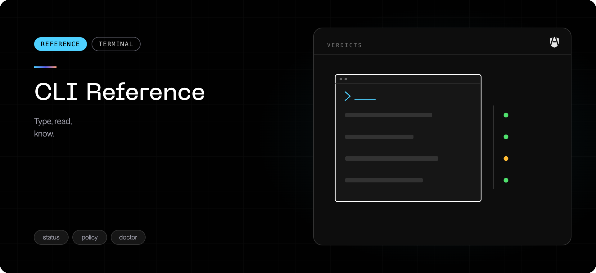

`agenshield` is the signed command-line entry point — a single Apple-notarized
binary installed alongside the app.

Every command accepts `--json` for machine-readable output and `--quiet` to
suppress progress display, which is what you want in MDM scripts and CI.

## Setup

| Command               | What it does                                                                                                                                                                                         |
| --------------------- | ---------------------------------------------------------------------------------------------------------------------------------------------------------------------------------------------------- |
| `agenshield install`  | Install and enroll this Mac. Normally run for you by your organization's install link.                                                                                                               |
| `agenshield setup`    | Interactive guided setup, if you are configuring the Mac by hand.                                                                                                                                    |
| `agenshield activate` | Walk through the three macOS approvals: system extensions, Full Disk Access, network filtering.                                                                                                      |
| `agenshield login`    | Sign in from the terminal. The usual path is the **Log in** button in the AgenShield menubar or dashboard — both open the same browser sign-in that links rules scoped to your team, role, or group. |

## Status and health

| Command                                  | What it does                                                                                 |
| ---------------------------------------- | -------------------------------------------------------------------------------------------- |
| `agenshield status`                      | The system report: service, policy, sync, sign-in, enforcement, detected agents. Start here. |
| `agenshield status --install`            | What is installed — version, paths, and component state.                                     |
| `agenshield doctor`                      | Check every component and name what is failing.                                              |
| `agenshield doctor --fix`                | Attempt to repair what it can.                                                               |
| `agenshield doctor --cleanup-extensions` | Purge stale extension versions macOS has left waiting to uninstall on reboot.                |

The status report ends in one verdict line: `✅ Healthy`,
`○ Running, not enrolled`, `⚠ Degraded` (with the reasons),
`⛔ Boot-locked`, or `✗ Not running`.
[Common issues](../troubleshoot/common-issues.mdx) covers what to do about each.

## Working with agents

You do **not** need a command to launch or use an agent under AgenShield. Start
it the way you always have — your organization's policy is applied by the
security extensions automatically, not by a wrapper command.

## Diagnostics

| Command                        | What it does                            |
| ------------------------------ | --------------------------------------- |
| `agenshield logs`              | Stream local logs in real time.         |
| `agenshield logs -n 200`       | Show the most recent entries instead.   |
| `agenshield logs --level warn` | Raise the threshold: `trace` … `fatal`. |

For a full support bundle, see
[Collecting diagnostics](../troubleshoot/collecting-diagnostics.mdx).

## Lifecycle

| Command                         | What it does                                                                                                        |
| ------------------------------- | ------------------------------------------------------------------------------------------------------------------- |
| `agenshield start` / `stop`     | Start or stop the background service.                                                                               |
| `agenshield upgrade`            | Upgrade to the latest release.                                                                                      |
| `agenshield upgrade --to <ver>` | Pin a specific version.                                                                                             |
| `agenshield upgrade --dry-run`  | Show what would happen without doing it.                                                                            |
| `agenshield uninstall`          | Remove AgenShield completely — no `sudo`; it prompts for the admin password itself. `--yes` skips the confirmation. |

## When something is wrong

<Steps>
  <Step title="agenshield status">
    The system report — the verdict line tells you whether anything needs
    attention, and which section it is in.
  </Step>
  <Step title="agenshield doctor">
    Names the failing component. Most first-install issues are an ungranted
    approval — see [What gets installed](../components.mdx).
  </Step>
  <Step title="agenshield logs">
    Reproduce the problem while this is streaming.
  </Step>
  <Step title="Collect a bundle">
    If the above did not resolve it — see
    [Collecting diagnostics](../troubleshoot/collecting-diagnostics.mdx).
  </Step>
</Steps>

For install and removal detail, see
[Install and uninstall](../getting-started/install-and-uninstall.md).
