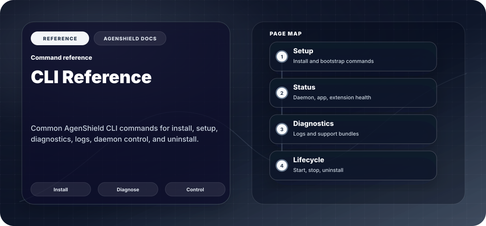

`agenshield` is the signed command-line entry point — a single Apple-notarized
binary installed alongside the app.

Every command accepts `--json` for machine-readable output and `--quiet` to
suppress progress display, which is what you want in MDM scripts and CI.

## Setup

| Command               | What it does                                                                                    |
| --------------------- | ----------------------------------------------------------------------------------------------- |
| `agenshield install`  | Install and enrol this Mac. Normally run for you by your organization's install link.           |
| `agenshield setup`    | Interactive guided setup, if you are configuring the Mac by hand.                               |
| `agenshield activate` | Walk through the three macOS approvals: system extensions, Full Disk Access, network filtering. |
| `agenshield login`    | Sign in via device code, so policy can apply rules scoped to your team, role, or group.         |

## Status and health

| Command                                  | What it does                                                                  |
| ---------------------------------------- | ----------------------------------------------------------------------------- |
| `agenshield status`                      | Is protection active, and which agents are protected. Start here.             |
| `agenshield status --install`            | What is installed — version, paths, and component state.                      |
| `agenshield doctor`                      | Check every component and name what is failing.                               |
| `agenshield doctor --fix`                | Attempt to repair what it can.                                                |
| `agenshield doctor --cleanup-extensions` | Purge stale extension versions macOS has left waiting to uninstall on reboot. |

`agenshield status` reports one of `SECURE`, `PARTIAL`, `UNPROTECTED`,
`DEGRADED`, or `CRITICAL`. [Common issues](../troubleshoot/common-issues.mdx) covers
each one.

## Working with protected agents

You do **not** need a command to launch or use a protected agent. Start it the
way you always have — protection is applied by the security extensions, not by
a wrapper command.

## Skills

| Command                                   | What it does                                 |
| ----------------------------------------- | -------------------------------------------- |
| `agenshield skill drafts list`            | Show your local edits to curated skills.     |
| `agenshield skill drafts show <skill>`    | Print a draft's contents.                    |
| `agenshield skill propose-update <skill>` | Submit your edited version for admin review. |
| `agenshield skill drafts discard <skill>` | Discard local edits permanently.             |

## Diagnostics

| Command                        | What it does                            |
| ------------------------------ | --------------------------------------- |
| `agenshield logs`              | Stream local logs in real time.         |
| `agenshield logs -n 200`       | Show the most recent entries instead.   |
| `agenshield logs --level warn` | Raise the threshold: `trace` … `fatal`. |

For a full support bundle, see
[Collecting diagnostics](../troubleshoot/collecting-diagnostics.mdx).

## Lifecycle

| Command                         | What it does                                                  |
| ------------------------------- | ------------------------------------------------------------- |
| `agenshield start` / `stop`     | Start or stop the background service.                         |
| `agenshield upgrade`            | Upgrade to the latest release.                                |
| `agenshield upgrade --to <ver>` | Pin a specific version.                                       |
| `agenshield upgrade --dry-run`  | Show what would happen without doing it.                      |
| `sudo agenshield uninstall`     | Remove AgenShield completely. `--yes` skips the confirmation. |

## When something is wrong

<Steps>
  <Step title="agenshield status">
    Confirms whether protection is active right now, and what is protected.
  </Step>
  <Step title="agenshield doctor">
    Names the failing component. Most first-install issues are an ungranted
    approval — see [What gets installed](../components.mdx).
  </Step>
  <Step title="agenshield logs">
    Reproduce the problem while this is streaming.
  </Step>
  <Step title="Collect a bundle">
    If the above did not resolve it — see
    [Collecting diagnostics](../troubleshoot/collecting-diagnostics.mdx).
  </Step>
</Steps>

For install and removal detail, see
[Install and uninstall](../getting-started/install-and-uninstall.md).
