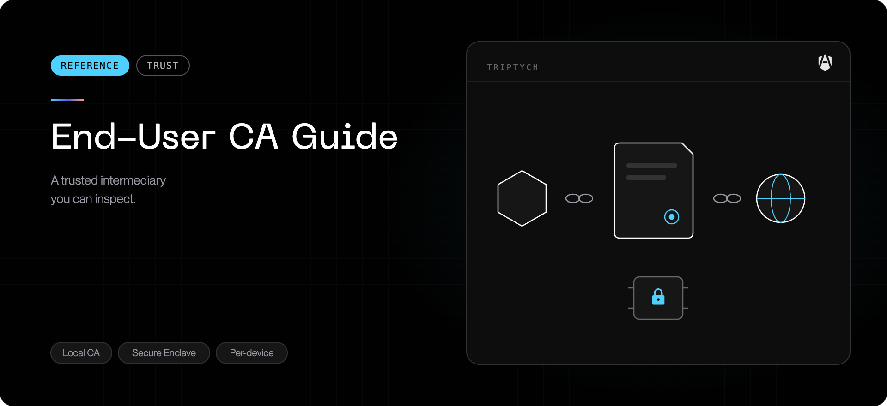

If AgenShield is installed on your machine, you may notice a certificate called
**"AgenShield CA"** in Keychain Access. This page explains what it is, when
macOS asks you to trust it, what it can and cannot see, and how to verify or
remove it.

## Why it exists

AgenShield protects AI coding agents (Claude Code, Cursor, and similar tools)
from leaking secrets — API keys, tokens, source code — to places they should not
go. Most of that traffic is encrypted (`https://`). To apply your organization's
inspection rules to encrypted traffic, AgenShield acts as a **local trusted
intermediary**: the agent connects to AgenShield, AgenShield decrypts the
traffic, checks it against the rules, then re-encrypts it to the real
destination.

For your Mac to trust that intermediary, AgenShield installs a small **local
certificate authority** in the system Keychain. You see it as "AgenShield
CA". This is the same technique used by corporate web filters (Zscaler,
Netskope) and developer tools (Charles Proxy, mitmproxy).

<Note>
  Older AgenShield installs may still show `AgenShield MITM CA (…)` or
  `AgenShield Dev CA` in Keychain Access. Those legacy entries are removed
  automatically the next time AgenShield starts.
</Note>

The certificate is only meaningful on your machine. It is not signed by any
public authority, no other computer trusts it, and even on your Mac only traffic
from agents governed by AgenShield ever uses it. The public certificate also
lives on disk at `~/.agenshield/mitm-ca.pem` — that copy is what the menubar
app and developer tooling read, and it stays stable across restarts and
upgrades.

## The one-time trust prompt

On recent versions of macOS, marking a certificate as trusted system-wide
requires a person — so the **first** time AgenShield sets the certificate up
you may see a standard macOS administrator-password dialog. What to expect:

- **It happens once.** Before asking, AgenShield checks whether the exact
  certificate is already trusted, so restarts and upgrades do **not** re-prompt.
- **If nobody is logged in** when AgenShield installs (an overnight MDM
  rollout, for example), the prompt waits and appears shortly after the first
  login instead.
- **Declining is respected.** If you dismiss the dialog, AgenShield does not
  ask again on its own. The menubar app shows **Root CA: installed (not
  trusted)** with a **Trust Certificate** button — click it whenever you are
  ready, or copy the equivalent Terminal command from the same banner.
- **A repeat prompt means the certificate genuinely changed.** That happens
  only when the CA had to be rebuilt (a new keypair or a repaired install) —
  macOS then correctly treats it as a new certificate. If you are prompted
  repeatedly with no upgrade or repair in between, report it.

Until the certificate is trusted, network inspection cannot run — connections
that match an inspection rule are handled according to your organization's
policy rather than silently weakened.

## What AgenShield can see

**Only traffic from AI agents, and only the HTTPS connections that match an
inspection rule in your organization's policy.** Everything else — your
browser, email client, Slack, video calls — passes through untouched. For that
traffic AgenShield can see only the destination hostname (which it already
knows from DNS), never the contents.

The set of inspected destinations is part of your organization's signed
policy. An administrator cannot add destinations silently: every change ships
as a new signed policy, and the policy in force on this Mac is visible —
read-only — in the AgenShield dashboard under **Managed policies**
(see [The AgenShield app](../using/the-app.mdx)).

## What AgenShield cannot see

- **Password managers** (1Password, Bitwarden) — they pin their own
  certificates, so AgenShield's certificate is ignored.
- **Your bank** — most banking sites pin certificates too.
- **Apple services** (iCloud, the App Store, MDM) — Apple pins its own
  certificates and ignores the system trust store for these.
- **Everyday apps** — anything without a matching inspection rule.

When AgenShield encounters a site it cannot inspect — because the site pins its
own certificate or otherwise refuses substitute certificates — it automatically
falls back to passing the traffic through untouched. The certificate chain you
see in your browser for those sites is the real public one.

## Where the private key lives

The certificate's private key is the sensitive part, and **it never leaves your
device**.

- **Default (per-device) mode** — the private key is generated inside the
  **Apple Secure Enclave**, a dedicated hardware chip. Even software running as
  root with full kernel access cannot extract it; Apple's hardware design
  prevents it. The key is never uploaded to the cloud and never synced to
  iCloud. Only the _public_ certificate is shared with your IT administrator,
  so they can confirm AgenShield is installed correctly across the fleet.
- **Enterprise (MDM-managed) mode** — the key is generated by your
  organization and pushed to your Mac's Keychain by your MDM (Jamf, Intune,
  Kandji). It is marked non-extractable and locked to AgenShield's signed app —
  no other software on your Mac can read or export it.

In both modes the raw private key is unusable by anything except AgenShield's
own signed software.

## How to verify the certificate

You can confirm the certificate is genuinely AgenShield's, and genuinely
trusted, with three independent checks:

1. **Check the issuer name.** In your browser, click the lock icon for an
   inspected site and view the certificate. The chain should end in
   `CN = AgenShield CA`. Seeing the site's real public chain instead usually
   means the connection is simply not covered by an inspection rule — that is
   normal (see "What AgenShield cannot see" above). But if a connection you
   know is inspected shows an issuer that is neither `AgenShield CA` nor the
   site's real public chain, close it and report it.
2. **Check trust, not just presence.** A certificate can sit in the keychain
   without being trusted. The authoritative check is:

   ```bash
   security find-certificate -c 'AgenShield CA' -p \
     /Library/Keychains/System.keychain > /tmp/agenshield-ca.pem
   security verify-cert -c /tmp/agenshield-ca.pem -l -L
   ```

   `...certificate verification successful.` means trusted; an error means it
   is installed but not yet trusted — use the menubar's **Trust Certificate**
   button.

3. **Check the menubar app.** It shows the certificate's live state —
   trusted, installed-but-not-trusted, or not installed. Your administrator
   can additionally cross-check the certificate's fingerprint (Keychain
   Access → System → "AgenShield CA" → Get Info) against the fleet's records,
   since the public certificate is reported during enrollment.

## How to remove it

The standard uninstall removes it for you: `agenshield uninstall` (no `sudo`
needed — it prompts for the administrator password itself) deletes the
AgenShield-issued certificates from the system trust store as part of its
rollback. There is nothing extra to do.

If AgenShield was removed some other way and the certificate is still present,
remove it by hand:

1. Open **Keychain Access** (Applications → Utilities).
2. Select the **System** keychain in the left sidebar.
3. Find **"AgenShield CA"** (older installs may show a legacy name — see
   above), right-click, and choose **Delete**.
4. Confirm with your administrator password.

Or in Terminal:

```bash
sudo security delete-certificate -c 'AgenShield CA' /Library/Keychains/System.keychain
```

In the default per-device mode the private key remains in the Secure Enclave.
That is harmless — it is unusable without AgenShield's own signed software,
occupies no meaningful space, and is reused if you reinstall. In the
MDM-managed mode the Keychain entry is removed automatically when AgenShield
is uninstalled.

## For developers: using the certificate with command-line tools

If your own tooling (`curl`, Node, Python) needs to trust inspected
connections, the public certificate is already on disk at
`~/.agenshield/mitm-ca.pem` — the same file AgenShield points Node tooling at
via `NODE_EXTRA_CA_CERTS`. You can also export it from the keychain yourself:

```bash
security find-certificate -c 'AgenShield CA' -p \
  /Library/Keychains/System.keychain > agenshield-ca.pem
```

Then point your tools at it:

```bash
curl --cacert ~/.agenshield/mitm-ca.pem https://api.example.com
NODE_EXTRA_CA_CERTS=~/.agenshield/mitm-ca.pem node script.js
REQUESTS_CA_BUNDLE=$HOME/.agenshield/mitm-ca.pem python script.py
```

The private key cannot be exported — that is by design.

## Privacy summary

- The CA private key never leaves your machine in the default mode.
- The cloud sees only the public certificate and an audit log of _which hosts_
  were inspected — never request contents, headers, or bodies.
- Inspected destinations are defined by your organization's signed policy, and
  the policy in force is visible read-only in the dashboard — administrators
  cannot add destinations silently.
- The trust prompt appears once; a decline is respected, and the menubar's
  **Trust Certificate** button re-offers it on your schedule.
- The standard uninstall removes the certificate; removing it by hand takes one
  Keychain action or one Terminal command.

## Related

- [Privacy and data handling](../configuration/privacy-and-data.mdx) — what is recorded
  and what leaves the device, inspection on or off.
- [How AgenShield works](../how-it-works.mdx) — why only agent traffic is inspected.
- [Common issues](../troubleshoot/common-issues.mdx) — when network rules appear to
  have no effect.
