# OpenClaw Shielding Flow

Complete sequence diagram of the shield lifecycle with all system-level operations annotated. Dangerous operations and kernel-risk areas are highlighted.

## Sequence Diagram

```mermaid
sequenceDiagram
    participant UI as Shield UI<br/>(SetupPanel)
    participant API as Daemon API<br/>(:5200)
    participant TL as target-lifecycle.ts<br/>(Shield Route)
    participant PE as PrivilegeExecutor<br/>(OsascriptExecutor)
    participant PH as Privilege Helper<br/>(root, Unix socket)
    participant DS as DirectoryService<br/>(dscl)
    participant FS as Filesystem<br/>(/Users, /etc, /opt)
    participant SB as Seatbelt<br/>(Kernel Sandbox)
    participant LD as launchd<br/>(System)
    participant IH as install-helpers.ts<br/>(Homebrew/NVM/Node)
    participant OC as OpenClaw Preset<br/>(openclaw.ts)
    participant NET as Network<br/>(curl/npm)

    Note over UI,NET: PHASE 0: INITIATION
    UI->>API: POST /targets/lifecycle/{targetId}/shield
    API->>TL: Route handler (baseName, hostUsername)
    TL->>PE: Check executor available

    alt No executor
        PE-->>TL: 503 NO_EXECUTOR
        TL-->>UI: Error: restart daemon
    end

    Note over UI,NET: PHASE 1: PRIVILEGE ESCALATION
    Note right of PE: First-time only:<br/>osascript spawns root helper
    PE->>PH: Connect to /tmp/agenshield-priv-XXXX.sock
    PH-->>PE: JSON-RPC ready (PID, UID 0)

    Note over UI,NET: PHASE 2: CLEANUP STALE INSTALLATIONS (0%)
    TL->>TL: emit setup:shield_progress (0%)
    TL->>PE: execAsRoot: pkill -u ash_default_agent
    PE->>PH: RPC exec
    PH->>DS: dscl . -delete /Users/ash_default_agent
    PH->>LD: launchctl bootout system/com.agenshield.broker.default
    PH->>FS: rm -rf /Users/ash_default_agent
    PH->>FS: rm -f /Library/LaunchDaemons/com.agenshield.broker.default.plist
    PH->>FS: rm -f /etc/sudoers.d/agenshield-default

    Note over UI,NET: PHASE 3: RESOLVE PRESET (5%)
    TL->>OC: preset.detect()
    OC-->>TL: version, binaryPath, configPath
    TL->>TL: allocateNextUidGid() -> baseUid:5200, baseGid:5100
    TL->>TL: createUserConfig({baseName, baseUid, baseGid})
    TL->>TL: createPathsConfig(userConfig)

    Note over UI,NET: PHASE 4: CREATE SANDBOX USERS & GROUPS (5%)
    TL->>TL: emit setup:shield_progress (5%)

    rect rgb(255, 200, 200)
        Note over PH,DS: DirectoryService operations
        TL->>PE: execAsRoot (30s timeout)
        PE->>PH: RPC exec
        PH->>DS: dscl . -create /Groups/ash_openclaw (GID 5100)
        PH->>DS: dscl . -create /Groups/ash_openclaw_workspace (GID 5101)
        PH->>DS: dscl . -create /Users/ash_openclaw_agent (UID 5200)
        PH->>DS: dscl . -create /Users/ash_openclaw_broker (UID 5201)
        PH->>DS: dseditgroup -o edit -a ash_openclaw_agent -t user ash_openclaw
        PH->>DS: dseditgroup -o edit -a ash_openclaw_agent -t user ash_openclaw_workspace
        PH->>DS: dseditgroup -o edit -a ash_openclaw_broker -t user ash_openclaw
    end

    Note over UI,NET: PHASE 5: CREATE DIRECTORIES (10%)
    TL->>TL: emit setup:shield_progress (10%)
    TL->>PE: execAsRoot (30s timeout)
    PE->>PH: RPC exec
    PH->>FS: mkdir -p /Users/ash_openclaw_agent/{bin,.config}
    PH->>FS: mkdir -p ~/.agenshield/seatbelt, ~/.agenshield/run, ~/.agenshield/logs
    PH->>FS: chown -R ash_openclaw_agent:ash_openclaw /Users/ash_openclaw_agent
    PH->>FS: chmod 2775 /Users/ash_openclaw_agent
    PH->>FS: chmod 2770 ~/.agenshield/run (setgid)
    PH->>FS: Write .agenshield/meta.json (root-owned)

    Note over UI,NET: PHASE 6: INSTALL COMMAND WRAPPERS (20%)
    TL->>TL: emit setup:shield_progress (20%)
    TL->>TL: installPresetBinaries(requiredBins)
    Note right of TL: Installs: node, npm, npx, git,<br/>curl, bash, shieldctl wrappers<br/>to /Users/ash_openclaw_agent/bin/

    Note over UI,NET: PHASE 7: PATH ROUTER OVERRIDE (30%)
    TL->>TL: emit setup:shield_progress (30%)
    TL->>PE: execAsRoot (15s timeout)
    PE->>PH: RPC exec
    PH->>FS: mkdir -p ~/.agenshield
    PH->>FS: Write ~/.agenshield/path-registry.json
    PH->>FS: Install router wrapper at /usr/local/bin/openclaw

    Note over UI,NET: PHASE 8: INSTALL TARGET APP (35-80%)
    TL->>OC: preset.install(ctx)

    rect rgb(255, 230, 200)
        Note over IH,NET: Heavy I/O + Network + Process spawning

        Note over IH,NET: Step 1/9: Homebrew (5%)
        OC->>IH: installHomebrew(ctx)
        IH->>PE: execAsUser: curl github.com/Homebrew | tar xz
        PE->>PH: RPC execAsUser (ash_openclaw_agent)
        PH->>NET: curl -fsSL https://github.com/Homebrew/brew/tarball/master
        PH->>FS: Extract to /Users/ash_openclaw_agent/homebrew/

        Note over IH,NET: Step 2/9: NVM + Node.js (20%)
        OC->>IH: installNvmAndNode(ctx, '24')
        IH->>PE: execAsUser: curl nvm install script | bash
        PE->>PH: RPC execAsUser
        PH->>NET: curl -fsSL nvm-sh/nvm/install.sh
        PH->>NET: Download Node.js v24 binary
        PH->>FS: Install to /Users/ash_openclaw_agent/.nvm/

        Note over IH,NET: Step 3/9: Copy node binary (38%)
        OC->>IH: copyNodeBinary(ctx)
        IH->>PE: execAsRoot: cp node -> /opt/agenshield/bin/node-bin
        PE->>PH: RPC exec
        PH->>FS: cp, chgrp, chmod 750

        Note over IH,NET: Step 4/9: Install OpenClaw (45%)
        OC->>IH: npm install -g openclaw
        IH->>PE: execAsUser (180s timeout!)
        PE->>PH: RPC execAsUser
        PH->>NET: npm registry download
        PH->>FS: Install to NVM global node_modules

        Note over IH,NET: Step 5/9: Stop host OpenClaw (62%)
        OC->>PE: execAsRoot: pkill -f "openclaw.*daemon"
        PE->>PH: RPC exec
        PH-->>OC: Killed host processes

        Note over IH,NET: Step 6/9: Copy host config (68%)
        OC->>PE: execAsRoot: cp -a ~/.openclaw -> agent/.openclaw
        PE->>PH: RPC exec
        PH->>FS: cp -a, chown -R, sed -i path rewrite

        Note over IH,NET: Step 7/9: OpenClaw onboard (78%)
        OC->>PE: execAsUser: openclaw onboard --non-interactive
        PE->>PH: RPC execAsUser (60s timeout)
        PH->>NET: OpenClaw onboard network calls

        Note over IH,NET: Step 8/9: Patch NVM node (88%)
        OC->>IH: patchNvmNode(ctx)
        IH->>PE: execAsRoot: backup node, write wrapper
        PE->>PH: RPC exec
        PH->>FS: cp node -> node.real, write bash wrapper

        Note over IH,NET: Step 9/9: Write Gateway Plist (96%)
        OC->>PE: execAsRoot (15s timeout)
        PE->>PH: RPC exec
        PH->>FS: mkdir -p ~/.agenshield/logs
        PH->>FS: Write /Library/LaunchDaemons/com.agenshield.openclaw.gateway.plist
        PH->>FS: chmod 644 plist
        Note over OC: RunAtLoad=false, KeepAlive={SuccessfulExit=false}<br/>Gateway plist written but NOT loaded yet
    end

    Note over UI,NET: PHASE 9: SEATBELT PROFILE (82%)
    TL->>TL: emit setup:shield_progress (82%)

    rect rgb(255, 200, 200)
        Note over TL,SB: Seatbelt profile generation
        TL->>TL: generateAgentProfile(workspacePath, socketPath, agentHome)
        TL->>PE: execAsRoot: write .sb profile
        PE->>PH: RPC exec
        PH->>FS: Write ~/.agenshield/seatbelt/openclaw-agent.sb
        Note over SB: Profile denies file-read* /bin, /usr/bin<br/>but allows file-read* + process-exec for<br/>/bin/sh, /bin/bash, /usr/bin/env
    end

    Note over UI,NET: PHASE 10: SUDOERS (85%)
    TL->>PE: execAsRoot: write /etc/sudoers.d/agenshield-openclaw
    PE->>PH: RPC exec
    PH->>FS: Write sudoers, chmod 440, visudo -c

    Note over UI,NET: PHASE 11: BROKER LAUNCHDAEMON (88%)
    TL->>TL: emit setup:shield_progress (88%)
    TL->>TL: generateBrokerPlist(userConfig)
    TL->>PE: execAsRoot (15s timeout)
    PE->>PH: RPC exec
    PH->>FS: Write /Library/LaunchDaemons/com.agenshield.broker.openclaw.plist
    PH->>FS: chmod 644
    PH->>LD: launchctl load broker.plist
    Note over LD: Broker starts, creates Unix socket

    Note over UI,NET: PHASE 11b: WAIT FOR BROKER SOCKET (89%)
    TL->>TL: Poll for socket at ~/.agenshield/run/*.sock
    TL->>TL: Wait up to 15s, poll every 500ms
    Note over TL: Socket confirmed ready

    Note over UI,NET: PHASE 11c: START GATEWAY (90%)
    Note over TL,LD: Gateway starts AFTER broker is confirmed
    TL->>PE: execAsRoot: launchctl load + kickstart
    PE->>PH: RPC exec
    PH->>LD: launchctl load gateway.plist
    PH->>LD: launchctl kickstart system/com.agenshield.openclaw.gateway
    Note over LD: KeepAlive: {SuccessfulExit: false}<br/>ThrottleInterval: 30s<br/>ExitTimeOut: 20s

    Note over UI,NET: PHASE 12: SAVE PROFILE (92%)
    TL->>TL: storage.profiles.create(...)
    TL->>TL: Seed preset policies

    Note over UI,NET: PHASE 13: COMPLETE (100%)
    TL->>TL: emit setup:shield_complete
    TL-->>UI: { success: true, profileId, logPath }
```



## Log Locations

| Log | Path | Content |
|-----|------|---------|
| Shield operation log | `~/.agenshield/logs/shield-{target}-{ts}.log` | Full step-by-step with commands and results |
| Daemon log | `~/.agenshield/logs/daemon.log` or `~/.agenshield/logs/daemon.log` | General daemon pino logs |
| Broker stdout | `~/.agenshield/logs/broker.log` | Broker process output |
| Broker stderr | `~/.agenshield/logs/broker.error.log` | Broker errors |
| Gateway stdout | `~/.agenshield/logs/openclaw-gateway.log` | Gateway process output |
| Gateway stderr | `~/.agenshield/logs/openclaw-gateway.err` | Gateway errors |

## Troubleshooting

### Verify services are running (not crash-looping)

```bash
sudo launchctl list | grep agenshield
```

Both `com.agenshield.broker.openclaw` and `com.agenshield.openclaw.gateway` should show a PID and exit status 0.

### Check for crash loops

If a service shows no PID and a non-zero exit status, it's crash-looping:

```bash
# Check broker
sudo launchctl list com.agenshield.broker.openclaw

# Check gateway
sudo launchctl list com.agenshield.openclaw.gateway
```

### Read the shield operation log

```bash
ls -lt ~/.agenshield/logs/shield-*.log | head -1
cat "$(ls -t ~/.agenshield/logs/shield-*.log | head -1)"
```

### Check gateway and broker logs

```bash
cat ~/.agenshield/logs/openclaw-gateway.log
cat ~/.agenshield/logs/openclaw-gateway.err
cat ~/.agenshield/logs/broker.log
cat ~/.agenshield/logs/broker.error.log
```

### Manually stop crash-looping services

```bash
sudo launchctl bootout system/com.agenshield.openclaw.gateway
sudo launchctl bootout system/com.agenshield.broker.openclaw
```

### Key design decisions for crash prevention

1. **Gateway starts AFTER broker**: The gateway plist has `RunAtLoad: false`. It is only loaded and kicked after the broker socket is confirmed ready.
2. **Conditional KeepAlive**: Gateway uses `KeepAlive: { SuccessfulExit: false }` so it only restarts on crashes, not clean exits.
3. **ThrottleInterval: 30s**: If the gateway does crash, launchd waits 30 seconds before respawning (instead of the default 10s), reducing kernel stress.
4. **ExitTimeOut: 20s**: Gateway gets 20 seconds for graceful shutdown before launchd sends SIGKILL.
5. **Seatbelt file-read fix**: Shell binaries (`/bin/sh`, `/bin/bash`, `/usr/bin/env`) are explicitly allowed for `file-read*` since macOS requires reading a binary to exec it.
