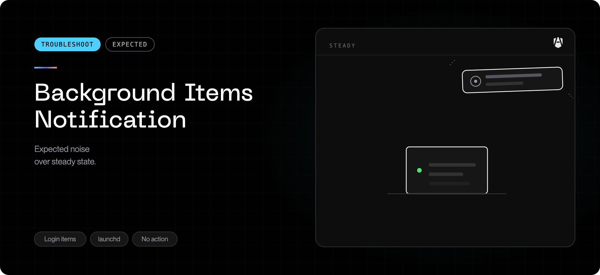

## What you are seeing

Right after installing or updating AgenShield, macOS shows a notification like:

> **Background Items Added** — "SomeOtherProduct" added items that can run in
> the background. You can manage these in Login Items & Extensions.

The named product is not AgenShield — often it is software that has been on the
machine for a long time and was not touched by anyone. The notification may
also come back later, at irregular intervals, without anything being installed.

## What this means

AgenShield registers only its own components, and they appear under the
AgenShield name in **System Settings → General → Login Items & Extensions**.
Installing AgenShield does not add, change, or run items belonging to any other
product.

The notification is posted by macOS itself, from its internal database of
login items and background items. That database can contain a broken record
for another product (typically left behind by one of that product's own
updates). Two things then happen:

- **Any installation can trigger one notification.** Installing or updating
  any software — AgenShield included — makes macOS re-scan its database. The
  re-scan stumbles over the broken record and re-announces it, naming the
  other product. Because the notification appears seconds after the install,
  it looks like the installer caused it.
- **macOS re-triggers it on its own.** The database's periodic maintenance
  trips the same broken record again, so the notification can reappear
  minutes or hours later with no installation activity at all.

The notification is advisory. Nothing new is running in the background, and
neither AgenShield nor the named product changed anything on the machine.

## How to confirm

1. Open **System Settings → General → Login Items & Extensions**. Items added
   by AgenShield appear under its own name; the named product's entries are
   its own, long-standing ones.
2. Note when the notification reappears: if it comes back while nothing is
   being installed, it is the macOS database re-announcing itself, not an
   installer.

## How to fix it

1. **Restart the Mac.** A restart lets macOS finish cleaning up its
   background-items database. If the notifications stop, you are done.
2. **Update or reinstall the product named in the notification.** A fresh
   install recreates its background-item records cleanly, which removes the
   broken record the notifications come from.
3. If the notifications persist, reset the macOS background-items database
   from Terminal, then restart:

   ```bash
   sudo sfltool resetbtm
   ```

   After the restart, every product on the machine re-announces its background
   items **once** at the next login — that burst is expected and harmless, and
   the repeating notifications stop. If you had disabled any login items,
   check that they are still disabled afterwards.

Current versions of AgenShield also avoid re-registering components that have
not changed during an update, so updates trigger this macOS behavior less
often. Keeping AgenShield up to date reduces the noise, but the repeating
notification itself is resolved by the steps above.

## When to escalate

Contact support with a screenshot of the notification and of **Login Items &
Extensions** if:

- the notification names **AgenShield** itself repeatedly, without AgenShield
  being installed or updated, or
- the notifications keep recurring after a restart, a reinstall of the named
  product, and the database reset above.

See [Collecting diagnostics](../troubleshoot/collecting-diagnostics.mdx) for how to
gather the information support will ask for.
