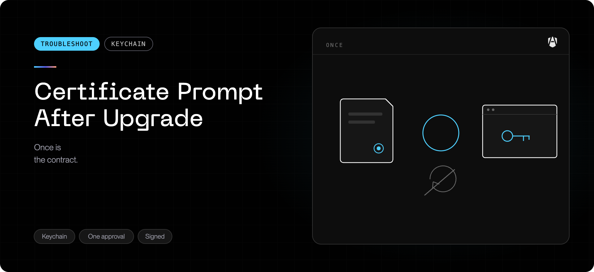

This is the single page for every AgenShield certificate symptom. Find yours in
the table, then read that section.

| What you are seeing                                         | Go to                                                                          |
| ----------------------------------------------------------- | ------------------------------------------------------------------------------ |
| Setup keeps showing **Trust the AgenShield certificate**    | [Certificate not trusted](#certificate-not-trusted)                            |
| The menu bar has no **Trust Certificate** action            | [Certificate not trusted](#certificate-not-trusted)                            |
| An AI agent or tool cannot reach a server that used to work | [Certificate not trusted](#certificate-not-trusted)                            |
| macOS asks for your password after an update                | [Password prompt after an update](#password-prompt-after-an-update)            |
| An update warns the certificate is not trusted              | [Password prompt after an update](#password-prompt-after-an-update)            |
| Connections fail with `CERT_HAS_EXPIRED`                    | [Expired certificate errors](#expired-certificate-errors)                      |
| You fixed it, but the warning will not clear                | [Warning will not clear](#the-command-worked-but-the-warning-is-still-showing) |

## The two commands, if you already know what you are doing

Check (if it reports `CSSMERR_TP_NOT_TRUSTED`, run it again with `-p ssl` added
before concluding anything — see [below](#first-check-what-state-you-are-in)):

```bash
security verify-cert -c ~/.agenshield/mitm-ca.pem -l -L
```

Fix (asks for your password), then **fully quit and reopen any AI agent that
had stopped connecting**:

```bash
sudo security add-trusted-cert -d -r trustRoot -k /Library/Keychains/System.keychain ~/.agenshield/mitm-ca.pem
```

Everything below explains what these do, when you need them, and what to do if
the warning does not clear afterwards.

## First: check what state you are in

Run this in Terminal. It is read-only and safe.

```bash
security verify-cert -c ~/.agenshield/mitm-ca.pem -l -L
```

<Warning>
  **Type the command, or paste it as plain text.** Chat apps, email clients and
  some browsers silently turn straight quotes (`"`) into curly ones (`”`). The
  shell does not treat curly quotes as quotes, so the command ends up looking
  for a file whose name literally contains them and answers `***Error reading
  file` — which looks like a missing certificate when nothing is missing. Every
  command on this page avoids quotes for that reason.

Running the check with `sudo` makes no difference and is not needed: trust
settings are readable by everyone. A `sudo` run that disagrees with a plain one
means something else is wrong — see [When to escalate](#when-to-escalate).

</Warning>

| Result                                       | What it means                                                                                    |
| -------------------------------------------- | ------------------------------------------------------------------------------------------------ |
| `...certificate verification successful`     | Trust is in place. If a setup card is still showing, it is stale — quit and reopen AgenShield.   |
| `Cert Verify Result: CSSMERR_TP_NOT_TRUSTED` | Not trusted for **every** purpose — which is not yet a problem. Run the TLS check below.         |
| `***Error reading file ...`                  | The command never read a certificate — the file is absent, or curly quotes crept in (see above). |

If you saw `CSSMERR_TP_NOT_TRUSTED`, check TLS trust specifically:

```bash
security verify-cert -c ~/.agenshield/mitm-ca.pem -l -L -p ssl
```

- **It reports `...certificate verification successful`:** the certificate is
  trusted for exactly what AgenShield needs. This is how most MDM certificate
  profiles install it, and nothing needs fixing. On `2026.9.0` and earlier the
  setup card can still show for this form; from `2026.9.1` it is recognised.
- **It also reports `CSSMERR_TP_NOT_TRUSTED`:** the certificate exists but is
  **not trusted**. Go to [Certificate not trusted](#certificate-not-trusted).

---

## Certificate not trusted

### What this means

The certificate was created on this Mac. What did not happen is the second half —
recording it as **trusted** in the system keychain, which needs an administrator
password.

Until that completes:

- **Encrypted (HTTPS) traffic is not inspected.** Network observation runs
  degraded, and AgenShield suspends inspection rather than interfering with
  connections.
- **Everything else is unaffected.** The security and network extensions keep
  enforcing, your organization's policy keeps syncing, and command and file
  activity keeps being recorded.

This is a gap in coverage, not an unprotected machine.

<Warning>
  **On `2026.9.0` and earlier, an untrusted certificate can break tools, not just
  reduce visibility.** AgenShield inspected encrypted connections even while its
  own certificate was untrusted. Applications that read the system keychain —
  which includes most command-line AI agents and other tools not built on
  Node.js — could not verify the connection and saw it close immediately. The
  usual report is an AI assistant saying a server is unreachable, closed, or has
  been disabled, while a browser on the same Mac is fine.

From `2026.9.1`, inspection is suspended automatically whenever the certificate
is untrusted, so connections keep working and only visibility is reduced.
Trusting the certificate restores inspection with no further action.

</Warning>

### The most common cause: nobody was at the keyboard

If AgenShield was installed by your IT team without anyone signed in — a
zero-touch deployment, or an install that ran overnight — the Mac was almost
certainly at the login screen or locked.

The certificate step needs the Mac **unlocked**, because it needs a user session
and an administrator password. It cannot complete on a locked Mac; it waits for
someone to unlock.

**If that describes your Mac, unlock it and sign in.** That lets the step
proceed — but it does not finish on its own: macOS still has to ask for an
administrator password, and someone has to **approve** that prompt.

The setup card clears only once AgenShield has confirmed the certificate is
trusted — which is after the prompt is approved, not after the unlock.

### How to fix it

<Steps>
  <Step title="Use the menu bar action (preferred)">
    Open the AgenShield menu bar item and choose **Trust Certificate**, then
    enter your administrator password when macOS asks.

    This is the supported path: it keeps the app's own state in step, and the
    setup card clears on its own once it succeeds.

  </Step>
  <Step title="If the action is missing or the prompt never appears, run it yourself">
    Copy and paste both lines. The first asks macOS to trust the certificate and
    will prompt for your password; the second confirms it worked.

    ```bash
    sudo security add-trusted-cert -d -r trustRoot -k /Library/Keychains/System.keychain ~/.agenshield/mitm-ca.pem
    security verify-cert -c ~/.agenshield/mitm-ca.pem -l -L
    ```

    Expect `...certificate verification successful` from the second command.

    <Note>
      **What this command does, so you can decide with your eyes open.** It marks
      the AgenShield certificate — the one already on this Mac at the path shown —
      as a trusted root, which is what lets AgenShield inspect encrypted traffic.
      It is the same operation the **Trust Certificate** menu action performs;
      running it by hand only removes AgenShield from the middle of it. It grants
      nothing to any other certificate, and it can be undone at any time with
      `sudo security remove-trusted-cert -d ~/.agenshield/mitm-ca.pem`.
    </Note>

    <Warning>
      **Do not add `-p ssl`.** You will find that flag in most general guidance
      about trusting an interception certificate, and the instinct is sound —
      it scopes trust to TLS instead of granting it for every purpose.

    But macOS then records the trust differently, and the standard check —
    `security verify-cert` without a policy — reports
    `CSSMERR_TP_NOT_TRUSTED` for it. On `2026.9.0` and earlier AgenShield used
    only that check, so a certificate trusted with `-p ssl` reads as
    untrusted and the setup card never clears.

    Use the command exactly as written above. From `2026.9.1` AgenShield also
    checks TLS trust specifically, so an `-p ssl` certificate — including one
    installed by your MDM — is recognised as trusted and inspection stays on.

    </Warning>

  </Step>
  <Step title="Reopen the apps that were failing">
    An AI agent that already marked a server unreachable will not retry on its
    own. Quit it fully and start it again.
  </Step>
</Steps>

<Note>
  Administrator rights are needed **only** to approve the prompt. AgenShield
  tries the non-interactive route first and, where that succeeds, no password is
  asked for at all — so a standard-user account is not automatically blocked
  here.

When the prompt _is_ required and your account is a standard user, someone with
administrator rights has to approve it. Fleets can remove the per-device step
entirely by distributing the certificate through MDM — see
[MDM deployment](../deployment/mdm/overview.mdx).

</Note>

### The command worked, but the warning is still showing

This is expected on `2026.9.0` and earlier, and it does not mean the fix
failed. Confirm the fix first:

```bash
security verify-cert -c ~/.agenshield/mitm-ca.pem -l -L
```

If that reports success, **the certificate is trusted**. What you are still
seeing is a stale reading: AgenShield's background service checks trust at
startup and caches the answer, and it has no way to notice that you changed the
system trust settings by hand. Quitting and reopening the AgenShield app does
**not** clear it — the background service keeps running independently of the app.

Restart the background service and the card clears within a few seconds:

```bash
sudo launchctl kickstart -k system/com.frontegg.AgenShield.daemon
```

From `2026.9.1` the service re-checks on its own — within about 30 seconds of a
manual fix — so this step is not needed.

<Warning>
  On `2026.9.1` and later there is a second reason not to leave this stale:
  while AgenShield believes the certificate is untrusted it **suspends traffic
  inspection**, so that connections keep working. Until the service picks the
  change up, inspection stays off on a Mac that is actually fine.
</Warning>

### If it comes back

- **You dismissed the password prompt once.** AgenShield deliberately does not
  re-ask immediately — repeatedly prompting for a password nobody wanted to give
  is worse than waiting. Use **Trust Certificate** from the menu bar when you are
  ready, or run the command above.
- **It reappears after every update.** See
  [Password prompt after an update](#password-prompt-after-an-update).
- **It reappears on many Macs at once.** Ask your IT team whether your
  organization can distribute a company-wide certificate through MDM, which
  removes the per-device step entirely. See
  [MDM deployment](../deployment/mdm/overview.mdx).

### Seeing it across the fleet

In the Frontegg Portal, **Devices → the Setup filter** narrows the list to every
device still waiting on the certificate, so you can tell one stuck Mac from a
rollout-wide gap. See [Fleet setup status](../using/fleet-setup-status.mdx).

---

## Password prompt after an update

### What you are seeing

Shortly after AgenShield updates itself, macOS shows its standard administrator
dialog asking to modify the system certificate trust settings. It may appear
while you are working, and again on the next update.

### What it means

In affected versions this prompt could appear even when the certificate had not
changed at all. Two internal checks ran at the same moment and interfered with
each other; one briefly could not confirm the certificate's status, and
AgenShield responded by asking macOS to re-apply trust — which needs your
password.

**Your protection was not affected.** The certificate was already installed and
already trusted throughout. Network inspection kept working whether you entered
your password or dismissed the dialog.

|          |                         |
| -------- | ----------------------- |
| Affected | `2026.7.24` and earlier |
| Fixed in | `2026.7.25`             |

### A related case: the update SAYS the certificate is not trusted

In `2026.8.4` and earlier, an update could finish by warning that the
certificate was not trusted and that inspected connections would fail — even
though it had been installed and trusted seconds earlier. Two checks that run at
the end of an update could interfere with each other, and the second reported a
failure that had not happened.

**The warning was cosmetic. Network inspection kept working normally.**

|          |                        |
| -------- | ---------------------- |
| Affected | `2026.8.4` and earlier |
| Fixed in | `2026.8.5`             |

To confirm your own Mac is fine, run the
[check command](#first-check-what-state-you-are-in). If it reports success, the
warning was the false one and there is nothing to do.

### What to do

<Steps>
  <Step title="You can safely dismiss it">
    Click Cancel. Nothing breaks — AgenShield will not re-show it in a loop, and
    inspection continues normally.
  </Step>
  <Step title="Entering your password is also fine">
    Approving simply re-applies trust settings that were already in place.
  </Step>
  <Step title="Update to the fixed version">
    On `2026.8.5` or later the prompt stops appearing for a certificate that has
    not changed.
  </Step>
</Steps>

### When a prompt IS expected

A genuine request for your password is normal in one case: when the certificate
has actually been renewed or replaced. macOS treats a new certificate as new, and
approving it once is required. That is a rare, deliberate event — not something
that should accompany routine updates.

---

## Expired certificate errors

### What you are seeing

An AI agent (an AI coding assistant, an MCP client, or similar) fails to connect
over HTTPS with a certificate-expired error such as `CERT_HAS_EXPIRED`.
Typically it fails for **every** inspected destination at once, while the same
sites open normally in a browser or in a tool that is not being inspected.

### What is actually happening

For the connections it inspects, AgenShield presents its own certificate for the
destination, issued under the AgenShield root your organization installed. Those
per-site certificates are short-lived and normally re-issued automatically.

In affected versions the background service could keep re-using a **previously
issued** per-site certificate after it had expired. After about a week of
continuous uptime those certificates aged out, so the agent received an expired
certificate for every inspected destination.

Two things confirm this is the cause rather than a problem with the destination:

- The **destination's own certificate is valid** — the site opens fine in a
  browser or in any tool AgenShield is not inspecting.
- The **AgenShield root certificate is valid** — it has a normal multi-month
  lifetime and is unchanged. The
  [check command](#first-check-what-state-you-are-in) confirms this.

Only the short-lived per-site certificate is expired.

### How to recover now

Restart the background service, or restart the machine. That discards the stored
per-site certificates, and the next connection is issued a fresh one, so
inspected connections work again immediately.

This is temporary — on an affected version the problem can return after about a
week of continuous uptime. Updating is the durable fix.

|          |                      |
| -------- | -------------------- |
| Affected | Before `2026.8.2`    |
| Fixed in | `2026.8.2` and later |

AgenShield now checks a stored per-site certificate's expiry before re-using it
and issues a fresh one instead of presenting an expired certificate. No
configuration change is needed.

---

## When to escalate

Collect a diagnostics bundle and contact support if:

- `~/.agenshield/mitm-ca.pem` does not exist even after the Mac has been unlocked
  and signed in for a few minutes;
- `verify-cert` still fails right after the `add-trusted-cert` command reports
  success;
- the setup step clears and then returns without an update having been installed;
- the prompt still appears on every update on `2026.8.5` or later;
- connections still fail with a certificate-expired error after updating and
  restarting.

Include the exact error text and the destination host. See
[Collecting diagnostics](../troubleshoot/collecting-diagnostics.mdx).
