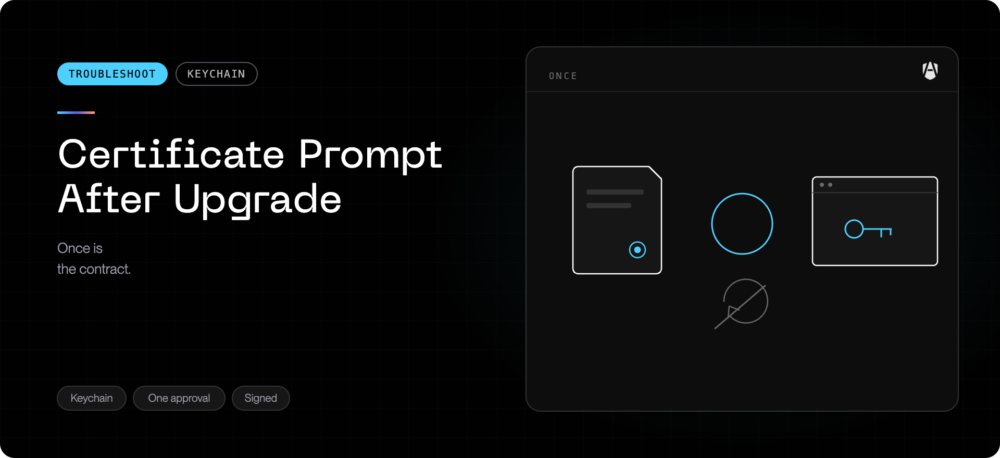

## What you are seeing

Shortly after AgenShield updates itself, macOS shows its standard
administrator dialog asking to modify the system certificate trust settings.
It may appear while you are working, and it may appear again the next time
AgenShield updates.

## What it means

In affected versions this prompt could appear even when the network inspection
certificate on your Mac had not changed at all. Two internal checks ran at the
same moment and interfered with each other; one of them briefly could not
confirm the certificate's status, and AgenShield responded by asking macOS to
re-apply trust — which requires your password.

**Your protection was not affected.** The certificate was already installed and
already trusted throughout. Network inspection kept working whether you entered
your password or dismissed the dialog.

## Affected and fixed versions

|          |                         |
| -------- | ----------------------- |
| Affected | `2026.7.24` and earlier |
| Fixed in | `2026.7.25`             |

## What to do

<Steps>
  <Step title="You can safely dismiss it">
    If the dialog appears and you would rather not enter your password, click
    Cancel. Nothing breaks — AgenShield will not keep re-showing it in a loop,
    and inspection continues normally.
  </Step>
  <Step title="Entering your password is also fine">
    Approving simply re-applies trust settings that were already in place.
  </Step>
  <Step title="Update to the fixed version">
    Once your Mac is running `2026.7.25` or later, the prompt stops appearing
    for a certificate that has not changed.
  </Step>
</Steps>

## How to confirm your certificate is healthy

Open AgenShield from the menu bar. The certificate status should read as
installed and trusted. If it does, no action is needed regardless of whether
you dismissed the dialog.

## When a prompt IS expected

A genuine request for your password is normal in one case: when the network
inspection certificate has actually been renewed or replaced. macOS treats a
new certificate as new, and approving it once is required. That is a rare,
deliberate event — not something that should accompany routine updates.

## When to escalate

Contact support if, after updating to `2026.7.25` or later:

- the prompt still appears on every update, or
- the menu bar reports the certificate as missing or not trusted, or
- applications report certificate or TLS errors.

Include a diagnostic bundle — see
[Collecting diagnostics](../troubleshoot/collecting-diagnostics.mdx).
