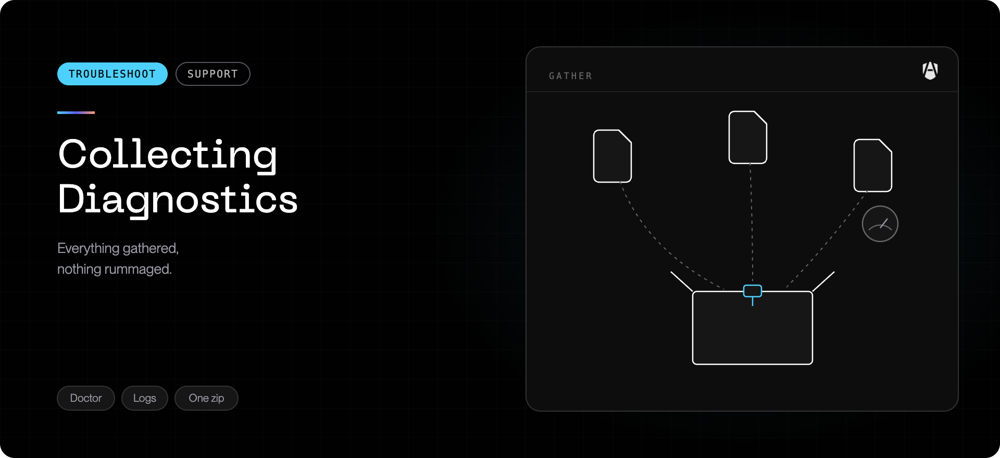

When [Common issues](../troubleshoot/common-issues.mdx) has not resolved a problem,
support needs the same set of information every time. The AgenShield app collects
it for you — there are no files to find and nothing to run as root.

## Download the bundle

<Steps>
  <Step title="Open the AgenShield app">
    From the menubar icon, or from `/Applications`.
  </Step>
  <Step title="Go to Support">
    The **Diagnostics** card is near the top of the page.
  </Step>
  <Step title="Click “Download diagnostics (.zip)”">
    The app shows collection progress; a full bundle can take up to a minute.
    macOS then asks where to save the archive.
  </Step>
  <Step title="Send that one file to support">
    The app shows the saved path and its size, with a button to reveal it in
    Finder.
  </Step>
</Steps>

That single `.zip` contains every AgenShield log plus the current permission and
health status.

<Warning>
  Collect the bundle **before** uninstalling or disabling AgenShield.
  Uninstalling removes the configuration and state that explain what went wrong.
</Warning>

## What the bundle contains

| Area              | Contents                                                                   |
| ----------------- | -------------------------------------------------------------------------- |
| Logs              | AgenShield logs and relevant macOS system-log excerpts                     |
| Permission status | Full Disk Access, and whether each system extension is approved and active |
| Health status     | Background service state, policy sync, and network inspection status       |
| Environment       | macOS version, chip, installed versions, and configuration profiles        |
| `README.txt`      | An index — including anything that **could not** be read, and why          |

That last row matters: if a log was unreadable rather than absent, the bundle
says so. It lets support tell "there is nothing here" apart from "we could not
open it".

## If the app says it saved a reduced bundle

The app prefers a full bundle assembled by the background service. If that
service is down or hung — often exactly when you need diagnostics most — the app
falls back to a **reduced** bundle built from the log files it can read directly,
and tells you so.

A reduced bundle is still worth sending. Mention that you saw the warning, since
it is itself a useful signal.

## If the Mac is unresponsive

If the machine is too degraded to open the app, boot into **Safe Mode** — third
party system extensions do not load there, so AgenShield is inert and the Mac
becomes usable again:

Shut down, hold the **power button** until "Loading startup options" appears,
select the disk, hold **Shift**, and choose **Continue in Safe Mode**.

Then open the app and download the bundle as above, before disabling or
uninstalling anything.

## What it never collects

Every log excerpt, probe result, and index entry is passed through secret
redaction **before** it enters the archive. The bundle never contains:

- access tokens or passwords
- any private key
- the encrypted local store

Each log is also truncated to its most recent portion, so archives stay small —
usually single-digit megabytes.

<Note>
  Some files are readable only by an administrator. The app runs as you, so those
  appear in `README.txt` as skipped with a reason rather than causing the
  collection to fail.
</Note>

## Handling the bundle

No secrets are included, but the bundle still contains sensitive **operational**
data: usernames, the hostname, process and network activity, configuration
profiles, and the policy in force. Treat it as confidential.

- **Send it only through an approved support channel** — the support ticket or
  file transfer you were given. Never a public paste or an unmanaged share.
- **Delete your local copy** once support confirms receipt.

## What to send with it

- what you were doing when the problem appeared
- roughly when it started, and whether it followed an upgrade
- whether the Mac is MDM-managed
- the output of `agenshield status` and `agenshield doctor`

The **Support** page also links to the public issue tracker and the release notes
if you would rather report it there.

## Related

- [Common issues](../troubleshoot/common-issues.mdx) — try these first.
- [What gets installed](../components.mdx) — components, approvals, and health checks.
- [Privacy and data handling](../configuration/privacy-and-data.mdx) — what is observed
  and what leaves the device.
