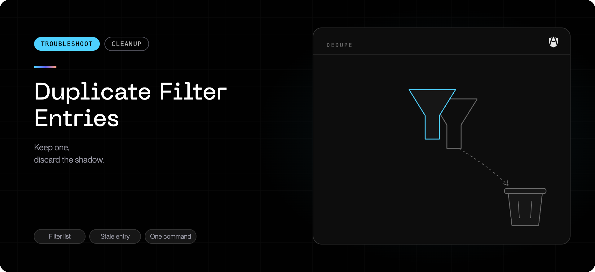

## What you are seeing

In **System Settings → Network → Filters & Proxies**, the list shows AgenShield
more than once — typically two **Content Filter** rows (one may say _Disabled_)
plus one **Transparent Proxy** row.

## What this means

Only one AgenShield network extension is installed and running. Updating
AgenShield replaces the extension in place — it never installs a second copy.

Two AgenShield rows are **normal**: one _Content Filter_ plus one _Transparent
Proxy_. Each row in this list is a stored **configuration entry**, and
AgenShield uses both kinds.

What is not normal is seeing the **Content Filter type twice**. That extra row
is a leftover configuration entry. It usually appears when a company-managed
(MDM) profile provides one filter entry while an earlier, manually-approved
entry from the app is still present — or when an update raced the system's
configuration store. A _Disabled_ duplicate carries no traffic, but it is
confusing and can interfere with AgenShield's automatic network recovery, so
it is worth removing.

## How to confirm

1. Open **System Settings → Network**, scroll to **Filters & Proxies**.
2. Count the rows named like _AgenShield Network Filter_ with type
   **Content Filter**. One is correct; two or more means a stale duplicate.
3. Recent versions of AgenShield also detect this automatically and show a
   **"Remove the duplicate network filter entry"** card on the dashboard's
   Overview page.

## How to fix it

**Update AgenShield to the latest version.** The update checks for duplicate
entries and removes the stale one automatically. During the update, macOS may
ask for your password (removing an entry requires it) and may ask _"AgenShield
Would Like to Filter Network Content"_ — click **Allow**. On company-managed
Macs the entry provided by your IT profile is kept automatically. Machines
with a single, correct entry are not touched and see no extra prompts.

If the duplicate is still there after updating (for example, the password
prompt during the update was dismissed), open the AgenShield dashboard: the
Overview page shows a **"Remove the duplicate network filter entry"** card
with a **Remove duplicate now** button. Click it, then enter your password
when macOS asks — the card disappears once the duplicate is gone.

You can also run the repair from Terminal:

```bash
"/Applications/AgenShield.app/Contents/MacOS/AgenShield" --dedup-nf
```

- Enter your password if macOS asks (each removal requires it).
- If macOS asks _"AgenShield Would Like to Filter Network Content"_, click
  **Allow** — that re-creates the single correct entry.

If the command reports an unknown option, update AgenShield first, or remove
the stale row manually: in **Filters & Proxies**, select the extra AgenShield
**Content Filter** row (the _Disabled_ one) and click the **–** button below
the list.

## If it comes back or won't remove

- An entry that cannot be removed is usually owned by a company profile. Ask
  your IT admin to review the AgenShield profile in your MDM console —
  removing and re-pushing it replaces its entry cleanly. AgenShield
  detects this case and stops re-trying automatically on later updates, so it
  will not keep asking for your password; the dashboard card explains what is
  left to do.
- If an update reports that the duplicate was removed but **no filter is
  active**, the remaining entry is your company profile's and it is switched
  off — your IT admin needs to enable it. AgenShield restores its own entry
  by itself once the network extension is confirmed active.
- If the duplicate reappears after an update, collect diagnostics
  (see [Collecting diagnostics](../troubleshoot/collecting-diagnostics.mdx)) and
  contact support with the screenshot of the Filters & Proxies list.
