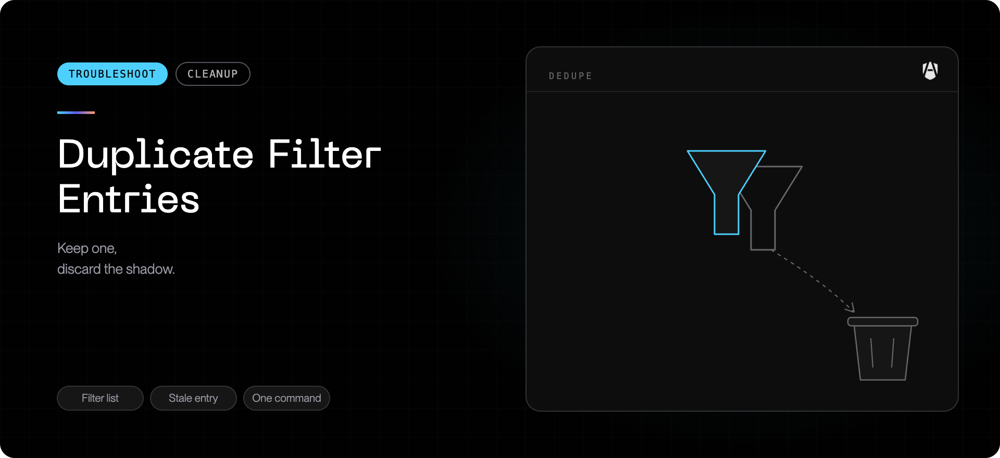

## What you are seeing

In **System Settings → Network → Filters & Proxies**, the list shows AgenShield
more than once — typically two **Content Filter** rows (one may say _Disabled_)
plus one **Transparent Proxy** row.

## What this means

Only one AgenShield network extension is installed and running. Updating
AgenShield replaces the extension in place — it never installs a second copy.

Two AgenShield rows are **normal**: one _Content Filter_ plus one _Transparent
Proxy_. Each row in this list is a stored **configuration entry**, and
AgenShield uses both kinds.

What is not normal is seeing the **Content Filter type twice**. That extra row
is a leftover configuration entry. It usually appears when a company-managed
(MDM) profile provides one filter entry while an earlier, manually-approved
entry from the app is still present — or when an update raced the system's
configuration store. A _Disabled_ duplicate carries no traffic, but it is
confusing and can interfere with AgenShield's automatic network recovery, so
it is worth removing.

## How to confirm

1. Open **System Settings → Network**, scroll to **Filters & Proxies**.
2. Count the rows named like _AgenShield Network Filter_ with type
   **Content Filter**. One is correct; two or more means a stale duplicate.
3. Recent versions of AgenShield also detect this automatically and show a
   **"Remove the duplicate network filter entry"** card on the dashboard's
   Overview page.

## How to fix it

**Update AgenShield to the latest version.** The update checks for duplicate
entries and removes the stale one automatically. During the update, macOS may
ask for your password (removing an entry requires it) and may ask _"AgenShield
Would Like to Filter Network Content"_ — click **Allow**. On company-managed
Macs the entry provided by your IT profile is kept automatically. Machines
with a single, correct entry are not touched and see no extra prompts.

If the duplicate is still there after updating (for example, the password
prompt during the update was dismissed), open the AgenShield dashboard: the
Overview page shows a **"Remove the duplicate network filter entry"** card
with a **Remove duplicate now** button. Click it, then enter your password
when macOS asks — the card disappears once the duplicate is gone.

If the extra entry was installed by your company's configuration profile,
AgenShield cannot remove it and the card says so instead of offering the button:
only your IT admin or MDM can remove that entry. Network filtering keeps working
in the meantime.

You can also run the repair from Terminal:

```bash
"/Applications/AgenShield.app/Contents/MacOS/AgenShield" --dedup-nf
```

- Enter your password if macOS asks (each removal requires it).
- If macOS asks _"AgenShield Would Like to Filter Network Content"_, click
  **Allow** — that re-creates the single correct entry.

If the command reports an unknown option, update AgenShield first, or remove
the stale row manually: in **Filters & Proxies**, select the extra AgenShield
**Content Filter** row (the _Disabled_ one) and click the **–** button below
the list.

## If it comes back or won't remove

- An entry that cannot be removed is usually owned by a company profile. Ask
  your IT admin to review the AgenShield profile in your MDM console —
  removing and re-pushing it replaces its entry cleanly. AgenShield detects this
  case and stops re-trying automatically on later updates, so it will not keep
  asking for your password.

  Once a repair has actually run and reported that it could not remove the
  entry, the dashboard card replaces the Remove button with an explanation of
  what is left to do. If the most recent thing that happened was an automatic
  skip rather than a repair attempt, the button is still offered — clicking it
  is harmless and gets you the same explanation.

  In versions up to and including `2026.8.5` the card kept offering the button in
  this situation and gave no feedback when it achieved nothing, so it looked as
  though clicking it did nothing at all. Fixed in `2026.8.6`, which corrects the
  reporting; the entry itself still has to be removed by your MDM.

- If AgenShield reports that **no filter is active**, read which entry it names —
  the two cases need opposite responses, and this is reported whether or not the
  extra entry was removed, because an inactive filter is the more urgent fact.
  - **"ask your IT admin to enable the remaining entry"** — the surviving entry
    is your company profile's and it is switched off. Only your IT admin can
    change that: a company entry that is switched off reads as a deliberate
    choice, so AgenShield leaves it alone rather than overriding it.
  - **"no action is needed"** — AgenShield removed the duplicate and is waiting
    to re-create its own entry until it can confirm the network extension is
    active. It restores filtering by itself, usually within a minute or two.
    Turning a filter on before that confirmation can cut the Mac off the
    network, so the wait is deliberate. Nothing is required from you or your IT
    admin; if it has not cleared after a few minutes, collect diagnostics.

- If the duplicate reappears after an update, collect diagnostics
  (see [Collecting diagnostics](../troubleshoot/collecting-diagnostics.mdx)) and
  contact support with the screenshot of the Filters & Proxies list.
