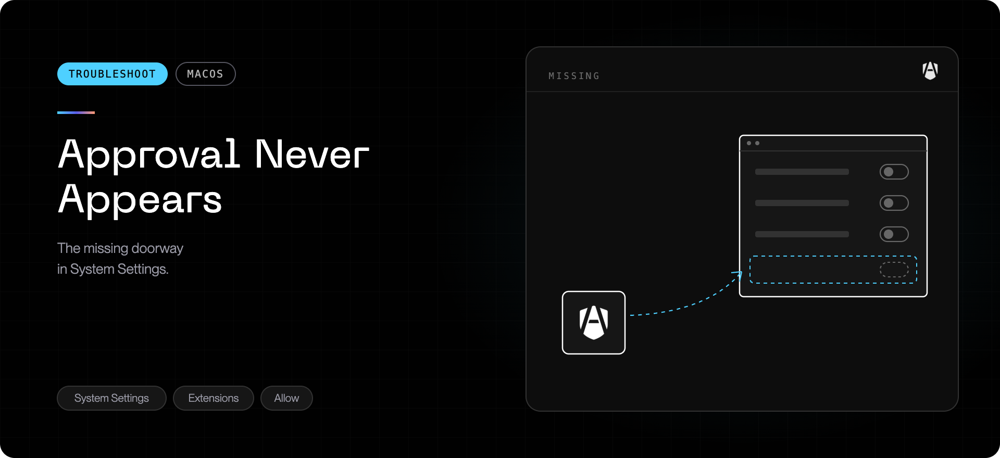

During installation (or `agenshield activate`), AgenShield asks you to approve
its Endpoint Security and Network extensions in **System Settings → General →
Login Items & Extensions** — but the extensions are not listed there, no
approval prompt ever appears, and the installer keeps waiting.

## What this actually means

On a company-managed Mac, the device-management (MDM) system can carry a
**System Extensions policy** that decides which vendors' extensions are allowed
to install at all. When that policy does not include AgenShield and does not
let users approve additional extensions themselves, macOS rejects the
installation request outright — **before** anything is staged for approval.

That is why nothing appears in System Settings: there is nothing to approve.
No amount of waiting, restarting, or reinstalling changes it. Only your IT
admin can, by updating the policy in the MDM system.

While blocked, AgenShield is installed and its background service runs and
reports status, but protection is off.

<Note>
  This is different from the normal "waiting for approval" state, where the
  extensions DO appear in System Settings with a toggle to turn on. If you can
  see them listed, follow
  [Common issues → An extension shows as not active](../troubleshoot/common-issues.mdx#an-extension-shows-as-not-active)
  instead.
</Note>

## Confirm it

Any of these confirms the blocked state (available from version 2026.8.3):

- The AgenShield dashboard's **Overview** shows a **"Your company's device
  policy is blocking AgenShield"** card.
- `agenshield doctor` reports **"blocked by MDM policy"** for the extensions.
- The guided installer marks the extension steps **"blocked by your
  organization's device policy"** instead of waiting.

On any version, you can check what macOS has registered:

```bash
systemextensionsctl list | grep AgenShield
```

No output means no AgenShield extension is registered yet. That is consistent
with this state, but not proof of it — the list is also empty before an
installation has been attempted, or when the app is missing. To confirm the
block itself, use one of the product signals above, or ask your IT admin to
check the MDM's System Extensions policy for this Mac.

## Fix it (IT admin)

Allow AgenShield in your MDM's **System Extensions** policy:

- **Team identifier:** `3R2X6557U2`
- **Extensions:** `com.frontegg.AgenShield.es-extension` (Endpoint Security)
  and `com.frontegg.AgenShield.network-extension` (Network)

The simplest way is to push the AgenShield configuration profile from the
[MDM deployment guide](../deployment/mdm/overview.mdx) — it carries exactly this
allowlist (plus the related approvals), so the extensions install with no
user clicks at all.

## After the policy lands

Once the updated policy reaches the Mac, no reinstall is needed:

```bash
agenshield activate
```

or quit and reopen AgenShield. The extensions activate through the normal
flow (silently, if the pushed profile pre-approves them).

## When to escalate

If the policy allows AgenShield (or the Mac is not company-managed) and the
extensions still never appear in System Settings, collect diagnostics and
contact support — see
[Collecting diagnostics](../troubleshoot/collecting-diagnostics.mdx).
