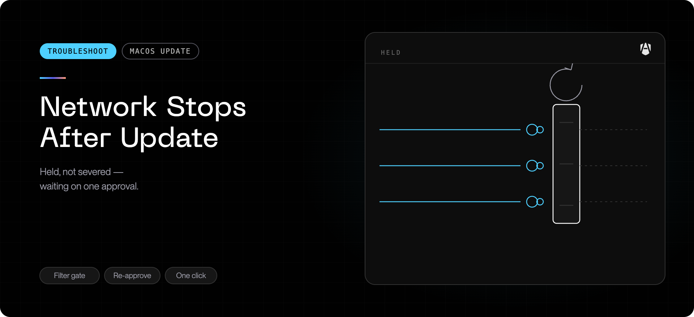

In rare cases, replacing or re-enabling the network extension during an
AgenShield update **or a fresh install** can leave it in a stuck state: macOS
keeps holding every new connection for the extension's answer, but the answers
never come — in the worst variant the extension is not even handed the
connections it is supposed to answer. Either way, from that moment **the whole
Mac loses network access** — not just AI tools.

Typical signs, starting at the exact minute the update or install ran:

- Browsers spin forever; nothing loads in any application.
- AI coding tools show connection or certificate errors — for example
  `Unable to connect to API (UNKNOWN_CERTIFICATE_VERIFICATION_ERROR)` with
  endless retries.
- Wi-Fi shows connected and the network itself is fine — connections open but
  no data ever moves.

<Warning>
  A Mac in this state looks healthy almost everywhere: the network extension
  shows as enabled, the background service is running, and the AgenShield
  status looks green. Do not rule AgenShield out because its own health checks
  pass — go by the symptom and the timing.
</Warning>

## What state the product is in

Nothing has been blocked by your organization's policy, and nothing is wrong
with your network. The network extension is running but stuck: it is not
issuing allow or block decisions at all, and macOS keeps holding every
connection that is waiting for one. Because the stuck component sits in the
path of **all** traffic, every application is affected equally — including
AgenShield's own connection to your organization's AgenShield backend.

## Confirm it

Three things together make this diagnosis near-certain:

1. **Timing** — connectivity died at the moment an AgenShield update ran, not
   gradually.
2. **Scope** — every application is affected, on every network destination,
   while Wi-Fi or Ethernet still shows connected.
3. **The toggle test** — turn the AgenShield network extension off (next
   section). If connectivity returns immediately, this was the cause.

## Restore connectivity now

Open **System Settings → General → Login Items & Extensions → Network
Extensions**, and turn **AgenShield** off.

Connectivity returns within seconds. No restart is needed.

## After you recover

1. Update AgenShield to the latest release.
2. Turn the network extension back on in the same System Settings pane.
3. If the problem returns as soon as you re-enable it, leave it off and
   [collect a diagnostics bundle](../troubleshoot/collecting-diagnostics.mdx), then
   contact support.

While the network extension is off, network monitoring and network policy are
not applied on this Mac. Re-enable it as soon as you are on a fixed version.

Two harmless quirks you may notice on the way back:

- **A stale "Disabled" row in System Settings.** After the off/on cycle, the
  **VPN & Filters** pane can keep showing an AgenShield row — often the
  transparent proxy — as _Disabled_, and toggling that row does nothing. The
  pane is rendering a configuration that no longer exists; AgenShield already
  recreated and enabled a fresh one. Fully quit System Settings and reopen it
  (or reboot) and the row shows its real state.
- **Two "Allow" dialogs during re-enable.** Older versions could show the
  content-filter consent dialog twice in quick succession, the newer dialog
  replacing the older one. Approving the one that remains is sufficient; the
  fixed versions only ever show one.

## Affected versions

- **Affected:** the 2026.8.2 alpha line, and 2026.8.2 when installed over an
  earlier install that was itself unhealthy. The stuck state is rare and tied
  to the moment the network extension is replaced or re-enabled — most updates
  and installs on these versions complete normally.
- **Fixed:** releases after 2026.8.2 close this from three directions. The
  install flow no longer restarts the network filtering while the installer's
  temporary safety hold is active (the restart was what created the stuck
  state). If the stuck state ever occurs anyway, AgenShield now detects it
  within about two minutes — including the silent variant its earlier checks
  could not see — using a built-in connectivity probe that tells "stuck" apart
  from "offline", and recovers on its own: it restarts the network filtering,
  then replaces the network extension entirely, and as a last resort stands
  the network filtering down so the Mac stays online. The stuck state also
  shows plainly in the AgenShield status and diagnostics instead of reporting
  healthy.

## When to escalate

Contact support with a [diagnostics
bundle](../troubleshoot/collecting-diagnostics.mdx) if:

- turning the network extension off does **not** restore connectivity — the
  cause is then something other than AgenShield;
- the stuck state returns on a version newer than the 2026.8.2 alpha line; or
- you run other endpoint-security or VPN products alongside AgenShield and hit
  this repeatedly — the combination is exactly what support will want to see.

The bundle records what the network extension was doing at the time, which
determines the answer.
