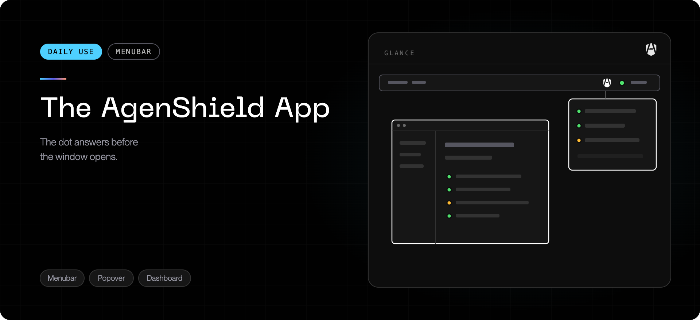

AgenShield installs one app with two faces: a **menubar icon** for at-a-glance
status and quick actions, and a **dashboard** for detail. Everything it shows is
read-only reporting of this Mac — policy itself is managed centrally in the
[Frontegg Portal](https://portal.frontegg.com).

## The menubar icon

Always present once AgenShield is installed. The shield icon itself never
changes — a small **status dot** next to it is the fastest answer to "is
everything working right now?":

| Dot       | Meaning                                                                                                               |
| --------- | --------------------------------------------------------------------------------------------------------------------- |
| 🟢 Green  | Healthy — signed in, enforcement active, policy current                                                               |
| 🟠 Orange | Attention needed — a macOS approval is pending, enforcement is paused, or the connection to your organization is down |
| 🔴 Red    | Not signed in — click the icon and use **Log in**                                                                     |
| ⚪ Gray   | The background service is not running                                                                                 |

Click the icon to see the detail behind the dot: the status of each component,
the agents AgenShield found on this Mac, a **Log in** button when you are
signed out, and **Open Dashboard**.

## Signing in

The menubar is also where you sign in: click the icon, then **Log in** — it
opens your organization's sign-in page in the browser. The dashboard shows the
same button when you are signed out. (From the terminal, `agenshield login`
starts the same browser sign-in.)

## The dashboard

Open it from the menubar. The sidebar follows the shape of the product:

| Page                 | What it shows                                                                      |
| -------------------- | ---------------------------------------------------------------------------------- |
| **Overview**         | Live status of this Mac — health, what needs attention, inventory counts           |
| **Agents**           | Every AI agent detected on this Mac, with the policy posture applied to each       |
| **Agent resources**  | Skills, extensions, and other resources your agents load, and their approval state |
| **MCP servers**      | Connectors your agents have configured, and whether each is permitted              |
| **Managed policies** | The policy currently in force on this Mac, as delivered by your organization       |
| **Workspaces**       | The project directories your agents work in                                        |
| **Activity**         | Live feed of what your agents are doing, and the decision made on each action      |
| **Support**          | Diagnostics download, update status, and links to report an issue                  |

### Overview

Start here. It answers whether the Mac is healthy and, when it is not, what needs
to happen — usually an approval macOS is still waiting on. See
[What gets installed](../components.mdx) for the three approvals.

### Activity

The most useful page day to day. It shows what your agents actually did — the
programs, files, and destinations — and whether each was allowed, blocked, or
merely recorded.

If something your agent needed was blocked, this is where you find the entry to
send your administrator. See
[Working with your agents](../using/working-with-agents.mdx).

### Managed policies

Shows the policy this Mac received, so you can see the rules being applied
rather than guessing. It is **read-only by design** — there is no local override.
To change what an agent may do, the change is made in the
[Frontegg Portal](https://portal.frontegg.com).

### Support

Two things worth knowing about:

- **Download diagnostics (.zip)** — one click collects every log plus the current
  permission and health status into a single archive to send to support. See
  [Collecting diagnostics](../troubleshoot/collecting-diagnostics.mdx).
- **Updates** — shows the installed version and whether a newer release is
  available.

## What the app does not do

- It does not make policy decisions — it reports what the enforcement components
  decided.
- It cannot turn enforcement off, or relax a rule. That is central by design.
- It shows only this Mac. Fleet-wide views live in the
  [Frontegg Portal](https://portal.frontegg.com).

## Related

- [Working with your agents](../using/working-with-agents.mdx) — what changes day to
  day for a developer.
- [Common issues](../troubleshoot/common-issues.mdx) — when the app reports something
  is wrong.
