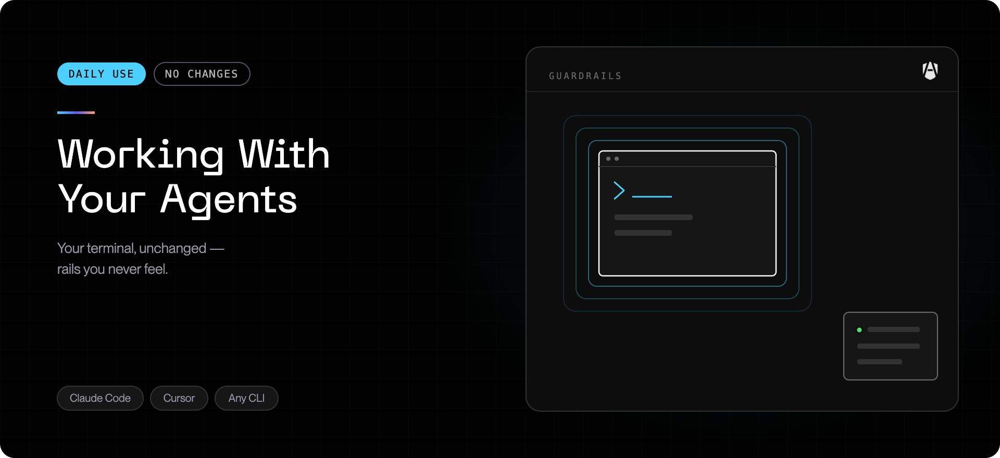

Your organization has put AI coding agents under AgenShield. This page is what
you actually need to know. The short version: **almost nothing changes**.

## What changed

Everything your agents run, read, and connect to is now evaluated against your
organization's policy, and recorded. Practically:

| Before                                 | Now                                                        |
| -------------------------------------- | ---------------------------------------------------------- |
| The agent could read anything you can  | Policy decides what it may read and write                  |
| The agent could connect anywhere       | Policy decides which destinations it may reach             |
| Nobody could say what it had done      | Every action is recorded and visible to your security team |
| You started it with your usual command | **Unchanged** — start it the way you always have           |

There is nothing to enable per agent: every agent AgenShield detects is
governed by the policy your organization publishes. You do not need a new
command to launch anything, and nothing about your day-to-day workflow changes.

## Checking status

The quickest answer is the menubar icon; the
[dashboard](../using/the-app.mdx) shows the detail. From the terminal:

```bash
agenshield status
```

```text
AgenShield Status
=================

Daemon         ✓ running — v2026.8.3, pid 4821, up 2h 14m
Setup          ✓ complete (cloud)
Crash reports  ✓ none

Policy         ✓ bundle 3f9c1a2e · enforce · 142 rules
Cloud sync     ✓ connected — last sync 2m ago

Organization   ✓ enrolled — Example Corp
User           ✓ dev@example.com — logged in

Enforcement    ✓ Enforcing — the security and network extensions are loaded, functional, and enforcing policy.
  ✓ Endpoint Security    enforcing
  ✓ Full Disk Access     granted
  ✓ Network filtering    on
  ✓ Transparent proxy    running
  ✓ CA trust             installed and trusted

Workers        ✓ 9/9 running

Installed agents
  claude-code   v1.4.2   ● running (2 processes)
  cursor        v0.51.1  ○ installed

──────────────────────────────
Status: ✅ Healthy
```

The bottom line summarizes the machine:

| Status                    | Meaning                                                                          |
| ------------------------- | -------------------------------------------------------------------------------- |
| `✅ Healthy`              | Service running, policy current, enforcement active                              |
| `○ Running, not enrolled` | Working, but not yet connected to your organization                              |
| `⚠ Degraded`              | Something needs attention — the line names it; run `agenshield doctor`           |
| `⛔ Boot-locked`          | The service parked itself after repeated start failures; run `agenshield doctor` |
| `✗ Not running`           | The background service is stopped — run `agenshield start`                       |

## When something is blocked

A blocked action fails the way an ordinary permissions problem fails. There is no
AgenShield dialog in your terminal:

| What was blocked            | What you see                                    |
| --------------------------- | ----------------------------------------------- |
| Running a program           | The command fails to start, as if not permitted |
| Reading or writing a file   | A permission-denied error                       |
| Connecting to a destination | The connection fails or times out               |

**Do not work around it.** Every block is recorded with the rule that caused it,
and that record is exactly what your administrator needs to fix the policy. Send
them:

- what you were trying to do
- roughly when it happened
- the error your agent reported

Being in **monitor** mode does not guarantee nothing is blocked: individual
rules can be promoted to enforce and still block an action (see
[the three enforcement modes](../how-it-works.mdx#the-three-enforcement-modes)). If your
administrator confirms no rule recorded a block, the failure has another cause —
check [Common issues](../troubleshoot/common-issues.mdx).

## Signing in

Open the AgenShield menubar icon and click **Log in** — it opens your
organization's sign-in page in the browser. The same button is on the
dashboard. Signing in links this Mac to your user account so policy can apply
rules scoped to your team, role, or group; until you do, only device-wide
rules apply.

Prefer the terminal? `agenshield login` starts the same browser sign-in.

## Everyday commands

| Command              | What it does                                                  |
| -------------------- | ------------------------------------------------------------- |
| `agenshield status`  | System status — service, policy, enforcement, detected agents |
| `agenshield doctor`  | Diagnose a problem; `--fix` attempts a repair                 |
| `agenshield logs`    | Stream local logs while reproducing something                 |
| `agenshield upgrade` | Update to the latest release                                  |

Full list: [CLI reference](../reference/cli.md).

## Frequently asked

**Can I turn it off?**
No — policy is managed centrally by design, and there is no local override. Ask
whoever administers AgenShield for your organization.

**Is it watching what I do?**
No. Enforcement and recording are scoped to AI agents. Your own commands,
files, browsing, and other applications are not observed. See
[Privacy and data handling](../configuration/privacy-and-data.mdx).

**Will it slow my Mac down?**
Decisions are made in the kernel and cached. You should not notice it in normal
use. If you do, that is a bug — run `agenshield doctor` and report it.

**Can it lock me out of my Mac?**
No. The processes and system paths macOS needs can never be denied — those limits
are compiled into the signed security extension and are not configurable. If
AgenShield ever starts denying an unusual volume of ordinary activity, it stands
itself down automatically and heals itself. And if the host account is ever
blocked anyway, an administrator can disable enforcement locally in seconds —
see [It cannot lock you out](../how-it-works.mdx#it-cannot-lock-you-out).
