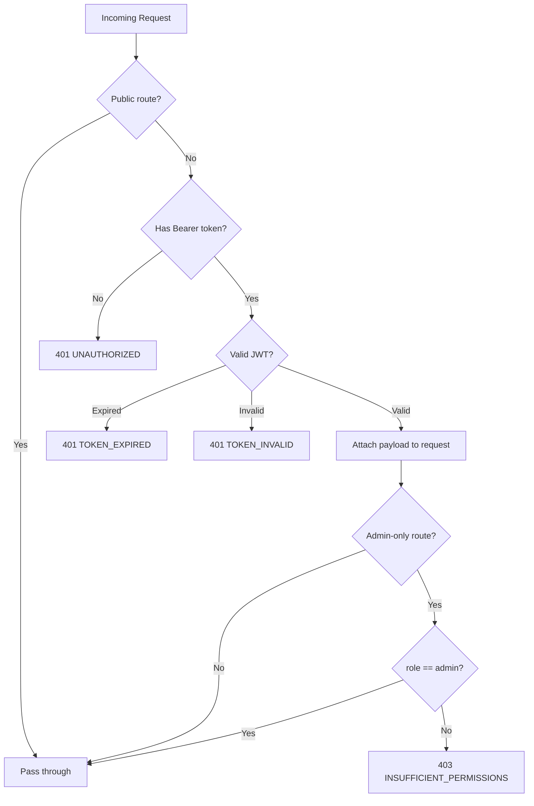

# @agenshield/auth

JWT authentication, Ed25519 cloud auth, sudo verification, and role-based access control for AgenShield.

Built on **jose** (JWT), **Node.js crypto** (Ed25519), and **scrypt** key derivation.

## Architecture

```mermaid
graph TD
    subgraph JWT["JWT Authentication"]
        SECRET[SecretManager] -->|HMAC key| SIGN[signAdminToken / signBrokerToken]
        SECRET -->|HMAC key| VERIFY[verifyToken / verifyTokenOrThrow]
        SIGN --> MW[Fastify Auth Middleware]
        VERIFY --> MW
        ROLES[Role Definitions] --> MW
    end

    subgraph Cloud["Cloud Auth (Ed25519)"]
        KEYGEN[generateEd25519Keypair] --> AGENTSIG[createAgentSigHeader]
        AGENTSIG --> CLOUDSIG[verifyAgentSig]
        CREDS[Cloud Credentials] --> AGENTSIG
        DEVICE[Device Code Flow] --> CREDS
    end

    subgraph Sudo["Sudo Verification"]
        SUDOV[verifySudoPassword] --> DSCL[macOS dscl]
        RATE[Rate Limiter] --> SUDOV
    end

    subgraph MDM["MDM Configuration"]
        MDMR[loadMdmConfig] --> MDMF[(~/.agenshield/mdm.json)]
        MDMW[saveMdmConfig] --> MDMF
    end

    MW --> DAEMON[Shield Daemon]
    CLOUDSIG --> DAEMON
    SUDOV --> DAEMON
    MDMR --> DAEMON
```



## Quick Start

```typescript
import {
  loadOrCreateSecret,
  signAdminToken,
  signBrokerToken,
  verifyToken,
  createJwtAuthHook,
} from '@agenshield/auth';

// Initialize the JWT secret (creates ~/.agenshield/.jwt-secret if needed)
loadOrCreateSecret();

// Sign tokens
const adminJwt = await signAdminToken();           // 30-min TTL
const brokerJwt = await signBrokerToken('p1', 't1'); // no expiration

// Verify tokens
const result = await verifyToken(adminJwt);
// { valid: true, payload: { sub: 'shield-ui', role: 'admin', iat, exp } }

// Fastify middleware
const hook = createJwtAuthHook();
fastify.addHook('preHandler', hook);
```

## JWT System

### Token Roles

| Role | Subject | TTL | Purpose |
|------|---------|-----|---------|
| `admin` | `shield-ui` | 30 minutes | Shield-UI and CLI access |
| `broker` | Profile ID | No expiration | Shielded app (target profile) access |

### Secret Management

The JWT signing secret is a 256-bit HMAC key stored at `~/.agenshield/.jwt-secret` (mode `0o600`).

```typescript
import {
  loadOrCreateSecret,
  getSecret,
  clearSecretCache,
  getSecretPath,
  generateSecret,
} from '@agenshield/auth';

// Load or create secret (cached in memory)
const secret = loadOrCreateSecret();
// With custom location:
const secret = loadOrCreateSecret('/custom/dir', '.my-secret');

// Get cached secret (throws if not loaded)
const cached = getSecret();

// Clear from memory (zeros the buffer)
clearSecretCache();

// Get file path
const path = getSecretPath(); // ~/.agenshield/.jwt-secret
```

### Signing

```typescript
import { signAdminToken, signBrokerToken, getAdminTtlSeconds } from '@agenshield/auth';

const adminToken = await signAdminToken();
const brokerToken = await signBrokerToken('profile-123', 'target-456');
const ttl = getAdminTtlSeconds(); // 1800
```

### Verification

```typescript
import { verifyToken, verifyTokenOrThrow } from '@agenshield/auth';
import { TokenExpiredError, TokenInvalidError } from '@agenshield/auth';

// Safe verification (returns result object)
const result = await verifyToken(token);
if (result.valid) {
  console.log(result.payload); // JwtPayload
} else {
  console.log(result.error);   // error message
}

// Throwing verification
try {
  const payload = await verifyTokenOrThrow(token);
} catch (err) {
  if (err instanceof TokenExpiredError) { /* re-authenticate */ }
  if (err instanceof TokenInvalidError) { /* reject */ }
}
```

## Fastify Middleware

The auth middleware handles public routes, token extraction, verification, and admin-only enforcement.

```typescript
import { createJwtAuthHook, extractBearerToken } from '@agenshield/auth';

// Create hook with defaults (uses built-in PUBLIC_ROUTES and ADMIN_ONLY_ROUTES)
const hook = createJwtAuthHook();

// Custom routes
const hook = createJwtAuthHook({
  publicRoutes: ['/api/custom-public'],
  adminOnlyRoutes: [{ method: 'POST', path: '/api/custom-admin' }],
});

fastify.addHook('preHandler', hook);
```

### Request Flow



### Token Extraction

Tokens are extracted from (in order):
1. `Authorization: Bearer <token>` header
2. `?token=<token>` query parameter (SSE fallback)

### Built-in Route Definitions

**Public routes** (no auth):
`/api/health`, `/api/status`, `/api/auth/status`, `/api/auth/sudo-login`, `/api/auth/admin-token`, `/api/workspace-paths`, `/api/setup/status`, `/api/setup/cloud`, `/api/setup/local`

**Admin-only routes** (require `admin` role):
`PUT /api/config`, `POST|PUT|DELETE /api/wrappers`, `POST|PATCH|DELETE /api/secrets`, `POST /api/config/factory-reset`, skill mutations (`POST /api/skills/*/install|approve|revoke|unblock|analyze`), marketplace mutations, and more. See `ADMIN_ONLY_ROUTES` in `roles.ts` for the full list.

## Role System

```typescript
import {
  hasMinimumRole,
  isPublicRoute,
  isAdminOnlyRoute,
  ROLE_HIERARCHY,
  PUBLIC_ROUTES,
  ADMIN_ONLY_ROUTES,
} from '@agenshield/auth';

// Role hierarchy: broker < admin
hasMinimumRole('admin', 'admin');   // true
hasMinimumRole('admin', 'broker');  // true
hasMinimumRole('broker', 'admin'); // false

// Route checks
isPublicRoute('/api/health');                // true
isAdminOnlyRoute('PUT', '/api/config');      // true
isAdminOnlyRoute('POST', '/api/skills/my-skill/install'); // true (wildcard match)
```

## Cloud Authentication (Ed25519 AgentSig)

For agent-to-cloud communication using Ed25519 digital signatures.

### Keypair Management

```typescript
import { generateEd25519Keypair } from '@agenshield/auth';

const { publicKey, privateKey } = generateEd25519Keypair();
// publicKey:  PEM-encoded SPKI
// privateKey: PEM-encoded PKCS8
```

### AgentSig Headers

Format: `AgentSig {agentId}:{timestamp}:{base64Signature}`

```typescript
import {
  createAgentSigHeader,
  parseAgentSigHeader,
  verifyAgentSig,
} from '@agenshield/auth';

// Create
const header = createAgentSigHeader('agent-123', privateKey);
// "AgentSig agent-123:1709836800000:base64sig..."

// Parse
const parts = parseAgentSigHeader(header);
// { agentId: 'agent-123', timestamp: 1709836800000, signature: Buffer }

// Verify (checks signature + 5-minute clock skew)
const agentId = verifyAgentSig(header, publicKey);
// 'agent-123' or null
```

### Cloud Credentials

Stored at `~/.agenshield/cloud.json` (mode `0o600`).

```typescript
import {
  saveCloudCredentials,
  loadCloudCredentials,
  isCloudEnrolled,
  CLOUD_CONFIG,
} from '@agenshield/auth';

// Save after registration
saveCloudCredentials('agent-id', privateKey, 'https://cloud.example.com', 'MyCompany');

// Load
const creds = loadCloudCredentials();
// { agentId, privateKey, cloudUrl, companyName, registeredAt }

// Check enrollment
isCloudEnrolled(); // true/false

// Cloud URL (override via AGENSHIELD_CLOUD_URL env)
CLOUD_CONFIG.url;             // 'http://localhost:9090' or env override
CLOUD_CONFIG.credentialsPath; // ~/.agenshield/cloud.json
```

### Device Code Flow

OAuth2-style device authorization for cloud enrollment.

```typescript
import {
  initiateDeviceCode,
  pollDeviceCode,
  registerDevice,
} from '@agenshield/auth';

// 1. Initiate — get codes for user
const { deviceCode, userCode, verificationUri, interval } = await initiateDeviceCode(cloudUrl);
// Show userCode + verificationUri to user

// 2. Poll — wait for user approval
const result = await pollDeviceCode(cloudUrl, deviceCode, interval);
// { status: 'approved', enrollmentToken: '...' }

// 3. Register — exchange token for agent credentials
const { agentId, agentKey } = await registerDevice(
  cloudUrl, result.enrollmentToken!, publicKey, hostname, version,
);
```

## Sudo Verification (macOS)

Verifies user passwords via macOS `dscl` with built-in rate limiting (5 attempts per 15 minutes).

```typescript
import {
  verifySudoPassword,
  getCurrentUsername,
  resetRateLimit,
} from '@agenshield/auth';
import { RateLimitError } from '@agenshield/auth';

const username = getCurrentUsername(); // detects console user, even when running as root

try {
  const result = await verifySudoPassword(username, password);
  // { valid: true/false, username }
} catch (err) {
  if (err instanceof RateLimitError) {
    console.log(`Retry in ${err.retryAfterMs}ms`);
  }
}

// Reset rate limit state (for testing)
resetRateLimit();
```

## MDM Configuration

Reads/writes MDM org config for managed device enrollment.

```typescript
import {
  loadMdmConfig,
  saveMdmConfig,
  hasMdmConfig,
} from '@agenshield/auth';

// Save (during MDM installation)
saveMdmConfig({
  orgClientId: 'org-client-id',
  cloudUrl: 'https://cloud.example.com',
  createdAt: new Date().toISOString(),
});

// Load (at daemon boot)
const config = loadMdmConfig();
// { orgClientId, cloudUrl, createdAt } or null

// Check existence
hasMdmConfig(); // true/false
```

Config stored at `~/.agenshield/mdm.json` (mode `0o644`).

## Error Classes

All errors extend `AuthError` (base class with `.code` property):

| Error | Code | Properties | When |
|-------|------|------------|------|
| `AuthError` | `AUTH_ERROR` | `code` | Base error |
| `TokenExpiredError` | `TOKEN_EXPIRED` | — | JWT has expired |
| `TokenInvalidError` | `TOKEN_INVALID` | — | Malformed or bad signature |
| `InsufficientPermissionsError` | `INSUFFICIENT_PERMISSIONS` | `requiredRole`, `actualRole` | Missing required role |
| `SudoVerificationError` | `SUDO_VERIFICATION_FAILED` | `username` | macOS dscl auth failed |
| `RateLimitError` | `RATE_LIMITED` | `retryAfterMs` | Too many sudo attempts |
| `CloudAuthError` | `CLOUD_AUTH_FAILED` | `agentId?` | AgentSig verification failed |

```typescript
import {
  AuthError,
  TokenExpiredError,
  TokenInvalidError,
  InsufficientPermissionsError,
  SudoVerificationError,
  RateLimitError,
  CloudAuthError,
} from '@agenshield/auth';
```

## Types

```typescript
import type {
  TokenRole,          // 'admin' | 'broker'
  AdminPayload,       // { sub: 'shield-ui', role: 'admin', iat, exp }
  BrokerPayload,      // { sub: string, role: 'broker', targetId, iat }
  JwtPayload,         // AdminPayload | BrokerPayload
  VerifyResult,       // { valid, payload?, error? }
  JwtAuthHookOptions, // { publicRoutes?, adminOnlyRoutes? }
  SecretManagerOptions,
  SudoVerifyResult,   // { valid, username }
  Ed25519Keypair,     // { publicKey, privateKey }
  CloudCredentials,   // { agentId, privateKey, cloudUrl, companyName, registeredAt }
  AgentSigParts,      // { agentId, timestamp, signature }
  MdmOrgConfig,       // { orgClientId, cloudUrl, createdAt }
  DeviceCodeResponse,
  DeviceCodePollResult,
  DeviceRegistrationResult,
} from '@agenshield/auth';
```

## Environment Variables

| Variable | Default | Purpose |
|----------|---------|---------|
| `AGENSHIELD_CLOUD_URL` | `http://localhost:9090` | Cloud API base URL |
| `AGENSHIELD_USER_HOME` | `$HOME` / `os.homedir()` | Override home dir for config paths |
| `SUDO_USER` | — | Override username for sudo verification |

## Project Structure

```
libs/auth/src/
├── index.ts          # Public barrel export
├── types.ts          # Core type definitions
├── errors.ts         # AuthError + 6 typed subclasses
├── secret.ts         # JWT HMAC secret management
├── sign.ts           # JWT signing (admin + broker)
├── verify.ts         # JWT verification
├── middleware.ts      # Fastify preHandler hook
├── roles.ts          # Role hierarchy + route definitions
├── sudo-verify.ts    # macOS dscl password verification
├── cloud-auth.ts     # Ed25519 keypair, AgentSig, credentials, device code flow
├── mdm-config.ts     # MDM org config reader/writer
└── __tests__/
    ├── errors.spec.ts
    ├── secret.spec.ts
    ├── sign-verify.spec.ts
    ├── middleware.spec.ts
    ├── roles.spec.ts
    ├── sudo-verify.spec.ts
    ├── cloud-auth.spec.ts
    └── mdm-config.spec.ts
```

## Testing

```bash
npx nx test auth --coverage
```

All source files have 100% line, branch, and function coverage (144 tests).
