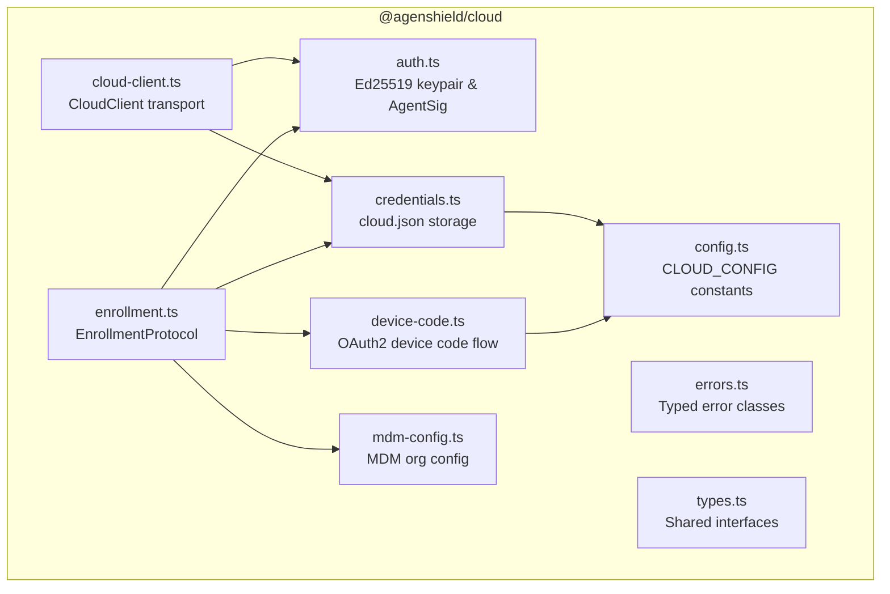
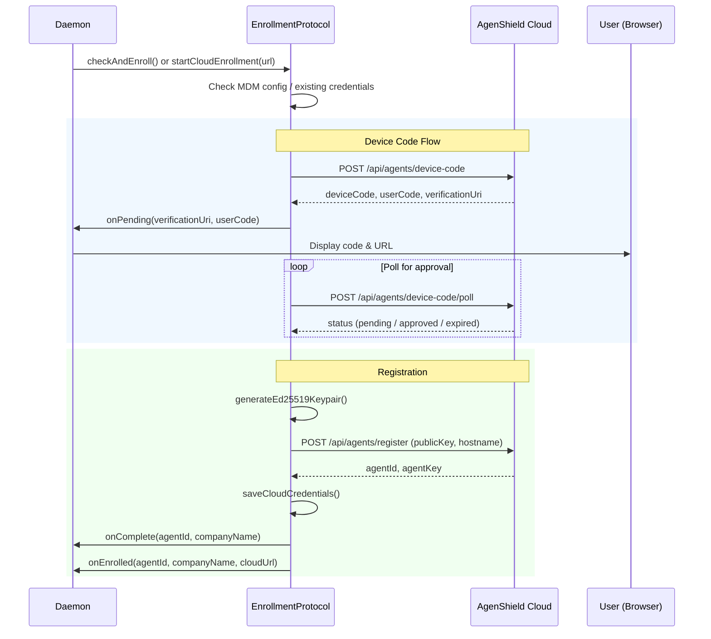
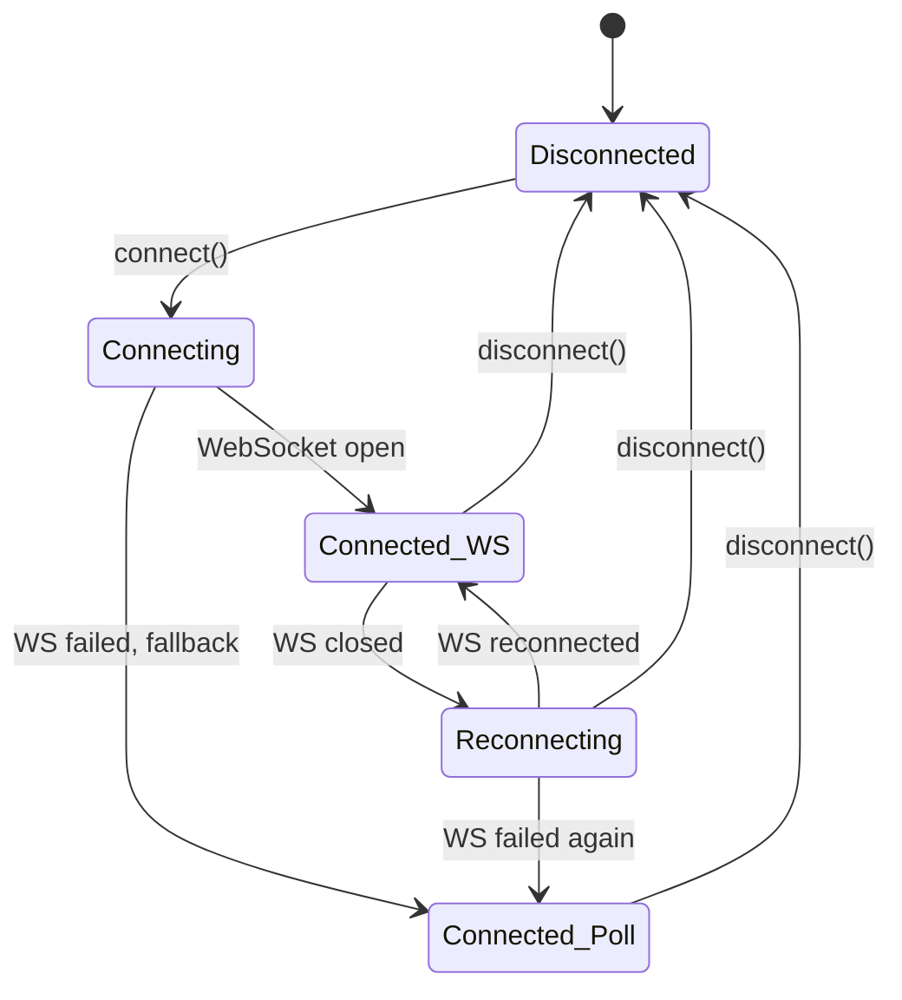
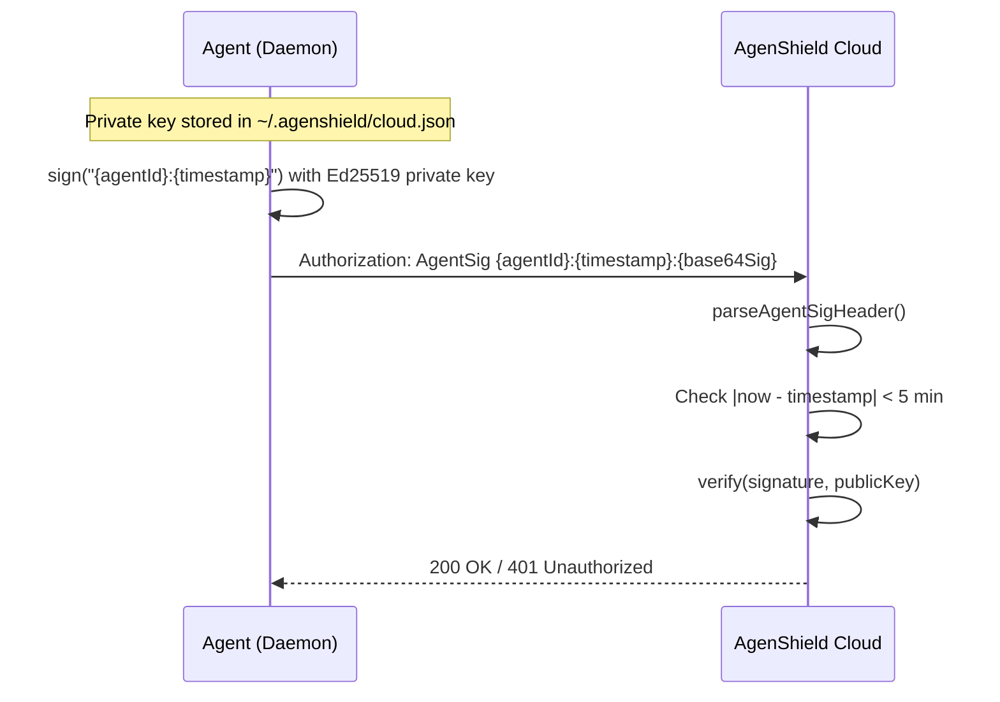

# @agenshield/cloud

Cloud transport, authentication, and enrollment protocol for AgenShield agents.

Handles Ed25519 agent authentication (AgentSig headers), credential storage, OAuth2 device code enrollment, MDM-initiated enrollment, WebSocket/HTTP transport with automatic reconnect, and HTTP polling fallback.

## Architecture

### Module overview



### Enrollment flow

The enrollment protocol orchestrates the full device registration lifecycle — from MDM detection or user-initiated setup through device code authorization to credential storage.



### Cloud client transport

The `CloudClient` manages the persistent connection to AgenShield Cloud. It prefers WebSocket for real-time command delivery, with automatic reconnect and HTTP polling fallback.



### AgentSig authentication

All agent-to-cloud communication is authenticated using Ed25519 signatures. The `AgentSig` header prevents replay attacks with a timestamp and 5-minute clock skew tolerance.



## Quick Start

### Check enrollment and connect

```typescript
import { CloudClient, EnrollmentProtocol, isCloudEnrolled } from '@agenshield/cloud';

// 1. Enroll if not already
if (!isCloudEnrolled()) {
  const enrollment = new EnrollmentProtocol({
    onPending: ({ verificationUri, userCode }) => {
      console.log(`Visit ${verificationUri} and enter code: ${userCode}`);
    },
    onComplete: ({ agentId, companyName }) => {
      console.log(`Enrolled as ${agentId} in ${companyName}`);
    },
    onFailed: ({ error, retryAt }) => {
      console.error(`Enrollment failed: ${error}`);
    },
    getAgentVersion: () => '1.0.0',
    onEnrolled: async ({ agentId, cloudUrl }) => {
      // Post-enrollment actions (e.g., start cloud client)
    },
  });

  await enrollment.startCloudEnrollment('https://cloud.agenshield.io');
}

// 2. Connect transport
const client = new CloudClient({ logger: console });
client.setCommandHandler(async (command) => {
  console.log(`Received command: ${command.method}`, command.params);
});
client.setOnConnect(async () => {
  console.log('Connected to cloud');
});
await client.connect();
```

### Auth primitives

```typescript
import {
  generateEd25519Keypair,
  createAgentSigHeader,
  parseAgentSigHeader,
  verifyAgentSig,
} from '@agenshield/cloud';

// Generate a keypair
const { publicKey, privateKey } = generateEd25519Keypair();

// Create an auth header
const header = createAgentSigHeader('agent-123', privateKey);
// => "AgentSig agent-123:1709000000000:base64sig..."

// Parse it back
const parts = parseAgentSigHeader(header);
// => { agentId: 'agent-123', timestamp: 1709000000000, signature: Buffer }

// Verify (returns agentId or null)
const agentId = verifyAgentSig(header, publicKey);
```

### Credentials and MDM config

```typescript
import {
  saveCloudCredentials,
  loadCloudCredentials,
  isCloudEnrolled,
  loadMdmConfig,
  saveMdmConfig,
  hasMdmConfig,
} from '@agenshield/cloud';

// Credential management (~/.agenshield/cloud.json)
saveCloudCredentials('agent-123', privateKey, 'https://cloud.test', 'Acme Corp');
const creds = loadCloudCredentials(); // CloudCredentials | null
const enrolled = isCloudEnrolled();   // boolean

// MDM org config (~/.agenshield/mdm.json)
saveMdmConfig({ orgClientId: 'org-1', cloudUrl: 'https://cloud.test', createdAt: new Date().toISOString() });
const mdm = loadMdmConfig();          // MdmOrgConfig | null
```

### Authenticated API calls

```typescript
const client = new CloudClient();
await client.connect();

// GET /api/agents/{agentId}/config
const config = await client.agentGet<{ policies: string[] }>('/config');

// POST /api/agents/{agentId}/heartbeat
await client.agentPost('/heartbeat', { status: 'healthy', version: '1.0.0' });
```

## Public API

### Auth primitives (`auth.ts`)

| Export | Description |
|--------|-------------|
| `generateEd25519Keypair()` | Generate an Ed25519 keypair (PEM-encoded SPKI public, PKCS8 private) |
| `createAgentSigHeader(agentId, privateKey)` | Create an `AgentSig` authorization header |
| `parseAgentSigHeader(header)` | Parse an `AgentSig` header into `AgentSigParts` (or `null`) |
| `verifyAgentSig(header, publicKey)` | Verify an `AgentSig` header; returns `agentId` or `null` |
| `AGENT_SIG_MAX_SKEW_MS` | Maximum clock skew for AgentSig timestamps (5 minutes) |

### Credentials (`credentials.ts`)

| Export | Description |
|--------|-------------|
| `saveCloudCredentials(agentId, privateKey, cloudUrl, companyName)` | Save credentials to `~/.agenshield/cloud.json` (mode 0600) |
| `loadCloudCredentials()` | Load credentials; returns `CloudCredentials \| null` |
| `isCloudEnrolled()` | Check if credentials exist |

### MDM config (`mdm-config.ts`)

| Export | Description |
|--------|-------------|
| `loadMdmConfig()` | Load MDM org config; returns `MdmOrgConfig \| null` |
| `saveMdmConfig(config)` | Save MDM org config to `~/.agenshield/mdm.json` |
| `hasMdmConfig()` | Check if MDM config exists |

### Device code flow (`device-code.ts`)

| Export | Description |
|--------|-------------|
| `initiateDeviceCode(cloudUrl?, orgClientId?)` | Start device code flow; returns `DeviceCodeResponse` |
| `pollDeviceCode(cloudUrl, deviceCode, interval, timeoutMs?)` | Poll for authorization; returns `DeviceCodePollResult` |
| `registerDevice(cloudUrl, enrollmentToken, publicKey, hostname, agentVersion)` | Register device with enrollment token |

### Transport (`cloud-client.ts`)

| Method | Description |
|--------|-------------|
| `new CloudClient(options?)` | Create client (optional `CloudLogger`) |
| `connect()` | Connect to cloud (WebSocket with HTTP polling fallback) |
| `disconnect()` | Disconnect and clean up timers |
| `isConnected()` | Connection status |
| `getCredentials()` | Current `CloudCredentials` or `null` |
| `setCommandHandler(handler)` | Register handler for incoming cloud commands |
| `setOnConnect(handler)` | Register post-connection callback |
| `agentGet<T>(path, timeoutMs?)` | Authenticated GET to `/api/agents/{agentId}{path}` |
| `agentPost<T>(path, body, timeoutMs?)` | Authenticated POST to `/api/agents/{agentId}{path}` |

### Enrollment (`enrollment.ts`)

| Method | Description |
|--------|-------------|
| `new EnrollmentProtocol(callbacks, logger?)` | Create enrollment protocol |
| `checkAndEnroll()` | Auto-enroll if MDM config present and not yet enrolled |
| `startCloudEnrollment(cloudUrl)` | Start enrollment from a user/API request |
| `stop()` | Stop enrollment and cancel retry timers |
| `getState()` | Current `EnrollmentState` |

### Config (`config.ts`)

| Export | Description |
|--------|-------------|
| `CLOUD_CONFIG.url` | Cloud API URL (env: `AGENSHIELD_CLOUD_URL`, default: `http://localhost:9090`) |
| `CLOUD_CONFIG.credentialsPath` | Path to `cloud.json` (respects `AGENSHIELD_USER_HOME`) |

## Error Classes

All errors extend `CloudError` which has a `.code` string property.

| Error | Code | Context property |
|-------|------|------------------|
| `CloudError` | `CLOUD_ERROR` | Base class |
| `CloudConnectionError` | `CLOUD_CONNECTION_FAILED` | `cloudUrl?: string` |
| `CloudAuthError` | `CLOUD_AUTH_FAILED` | `agentId?: string` |
| `CloudEnrollmentError` | `CLOUD_ENROLLMENT_FAILED` | `retryable: boolean` |
| `CloudCommandError` | `CLOUD_COMMAND_FAILED` | `method?: string` |

> **Note:** `CloudAuthError` exists in both `@agenshield/cloud` and `@agenshield/auth` intentionally. They serve different base class hierarchies. Cloud consumers should use `@agenshield/cloud`'s version.

## Types

```typescript
// Auth
interface Ed25519Keypair { publicKey: string; privateKey: string }
interface AgentSigParts { agentId: string; timestamp: number; signature: Buffer }
interface CloudCredentials { agentId: string; privateKey: string; cloudUrl: string; companyName: string; registeredAt: string }

// Device code
interface DeviceCodeResponse { deviceCode: string; userCode: string; verificationUri: string; expiresIn: number; interval: number }
interface DeviceCodePollResult { status: 'authorization_pending' | 'approved' | 'expired' | 'denied'; enrollmentToken?: string; companyName?: string; error?: string }

// Transport
interface CloudCommand { id: string; method: string; params: Record<string, unknown> }
type CloudCommandHandler = (command: CloudCommand) => Promise<void>

// Enrollment
type EnrollmentState =
  | { state: 'idle' }
  | { state: 'initiating' }
  | { state: 'pending_user_auth'; verificationUri: string; userCode: string; expiresAt: string }
  | { state: 'registering' }
  | { state: 'complete'; agentId: string; companyName: string }
  | { state: 'failed'; error: string; retryAt?: string }
```

## File Layout

```
src/
├── auth.ts            # Ed25519 keypair, AgentSig create/parse/verify
├── cloud-client.ts    # CloudClient — WebSocket + HTTP polling transport
├── config.ts          # CLOUD_CONFIG (URLs, paths)
├── credentials.ts     # cloud.json read/write
├── device-code.ts     # OAuth2 device code initiate/poll/register
├── enrollment.ts      # EnrollmentProtocol state machine
├── errors.ts          # CloudError + 4 typed subclasses
├── mdm-config.ts      # MDM org config read/write
├── types.ts           # Shared interfaces
├── index.ts           # Barrel export
└── __tests__/
    ├── auth.spec.ts
    ├── cloud-client.spec.ts
    ├── config.spec.ts
    ├── credentials.spec.ts
    ├── device-code.spec.ts
    ├── enrollment.spec.ts
    ├── errors.spec.ts
    └── mdm-config.spec.ts
```

## Testing

```bash
npx nx test cloud              # run tests
npx nx test cloud --coverage   # run with coverage report
```

Tests use temp directories with `AGENSHIELD_USER_HOME` for file-based isolation, `jest.mock` for module dependencies, `global.fetch` mocking for HTTP tests, and `jest.useFakeTimers()` for timer-dependent tests (heartbeat, reconnect, polling).

## Environment Variables

| Variable | Purpose |
|----------|---------|
| `AGENSHIELD_CLOUD_URL` | Override cloud API base URL |
| `AGENSHIELD_USER_HOME` | Override home directory for credential/config file resolution |

## Backward Compatibility

`@agenshield/auth` re-exports auth primitives and credential functions from this library. New code should import directly from `@agenshield/cloud`.
