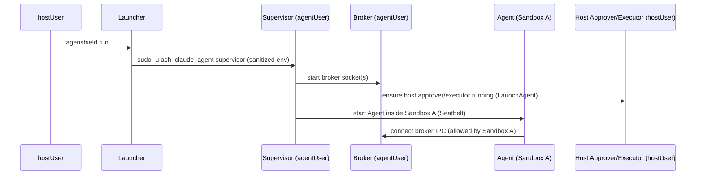
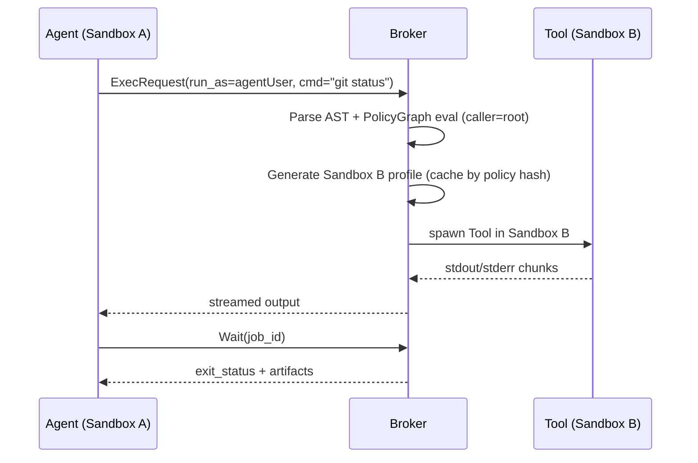
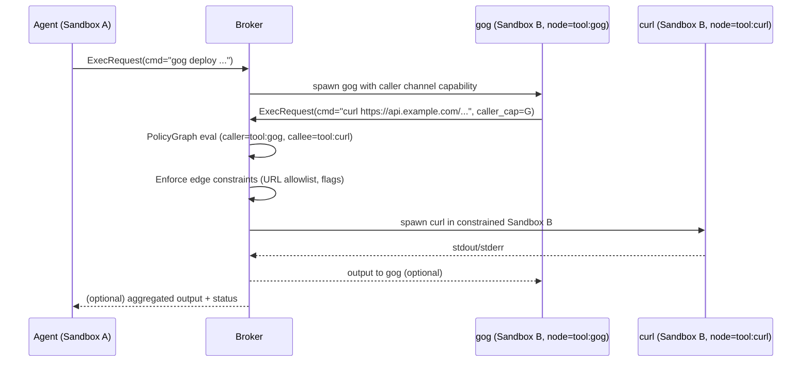
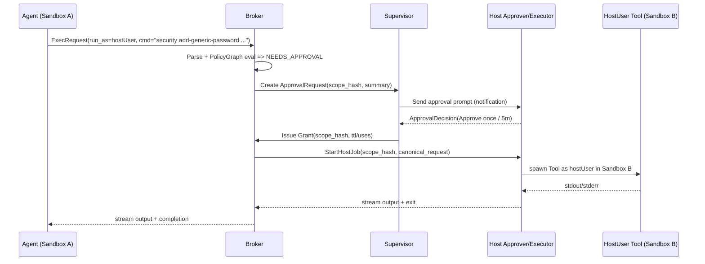

# AgenShield vNext Architecture
**Status:** Draft  
**Last updated:** 2026-03-05  
**Audience:** Engineers implementing AgenShield (Supervisor/Broker/Policy/Approvals) and contributors adding new tool policies.

---

## Table of contents
- [1. Background](#1-background)
- [2. Goals and non-goals](#2-goals-and-non-goals)
- [3. Security model and invariants](#3-security-model-and-invariants)
- [4. System overview](#4-system-overview)
- [5. Components](#5-components)
- [6. Core concepts](#6-core-concepts)
- [7. Policy Graph](#7-policy-graph)
- [8. Execution flows](#8-execution-flows)
- [9. Sandboxing strategy](#9-sandboxing-strategy)
- [10. Broker protocol](#10-broker-protocol)
- [11. Streaming, pipelines, and large files](#11-streaming-pipelines-and-large-files)
- [12. Network enforcement](#12-network-enforcement)
- [13. Just-in-time hostUser delegated execution](#13-just-in-time-hostuser-delegated-execution)
- [14. Auditing and observability](#14-auditing-and-observability)
- [15. Performance and reliability](#15-performance-and-reliability)
- [16. Migration plan](#16-migration-plan)
- [17. Testing plan](#17-testing-plan)
- [18. Appendix: Example policy graph](#18-appendix-example-policy-graph)

---

## 1. Background

AgenShield is an endpoint containment and execution-control system for AI code agents (e.g., Claude Code). The agent is run inside a dedicated system user (e.g., `ash_claude_agent`) and a strict OS sandbox (macOS Seatbelt), then granted narrow capabilities through a high-performance **Exec Broker**.

Key problems this architecture solves:
- Prevent arbitrary command execution, network access, and filesystem access from the agent.
- Support safe, ergonomic tooling (streaming output, pipes/pipelines, large artifacts).
- Provide **human-gated** escalation to run **specific commands as hostUser** for limited scopes/time.
- Provide **contextual permissions** via a **Policy Graph** where allowed capabilities depend on **caller path** (“who invoked whom”), not just the final command name.

---

## 2. Goals and non-goals

### Goals
1) **Contain the agent** inside a dedicated system user and Sandbox A (default deny).
2) Provide a **Broker-mediated execution model** that supports:
   - streaming stdout/stderr
   - optional streaming stdin
   - safe pipelines (`cmd1 | cmd2 | cmd3`)
   - large files and large outputs without routing GBs through the agent
3) Enforce policy at **two primary layers**:
   - OS sandbox (Seatbelt profiles)
   - Broker policy engine (validation + execution gating)
4) Add **Just-In-Time (JIT) approvals** for hostUser execution:
   - system popup notification actions (Approve once / Approve 5 min / Deny)
   - optional SMS channel (OTP + TTL)
5) Add **Policy Graph**:
   - permissions depend on **caller path**
   - env injection depends on node/edge context and subcommands
   - nested execution restrictions are enforced (e.g., `gog → curl` only to allowlisted URLs)

### Non-goals
- Replacing a full EDR suite. AgenShield focuses on **containment** and **capability brokering** for the agent.
- Supporting a full POSIX shell language. We implement a small, safe AST grammar sufficient for pipelines and common tooling.
- Perfectly preventing compromise if the trusted broker/executor is exploited. We reduce TCB size and harden it, but a memory-safety bug in the broker is still critical.

---

## 3. Security model and invariants

### Threat model (typical)
- The agent may attempt to:
  - exec arbitrary binaries (including user-downloaded ones)
  - access secrets on disk
  - exfiltrate data over the network
  - use symlink/hardlink races to access disallowed paths
  - trick wrappers/broker with argument/environment injection
  - exploit escalation pathways (hostUser credentials, SSH keys, keychain)
- The agent’s runtime may be modified (plugins, dependencies) but must remain confined by OS policy.

### Key invariants (MUST HOLD)
1) **Default deny everywhere**: deny exec/network/fs unless explicitly allowed.
2) **Agent cannot bypass broker**: Sandbox A denies direct exec; network is denied or restricted to IPC.
3) **Broker is the single execution authority** for tools (and hostUser runs).
4) **Contextual authority**: permissions depend on caller path in the Policy Graph.
5) **JIT approvals bind to scope** (canonical hash) and are time/usage-limited.
6) **All “outside sandbox” operations are minimized** and done only by trusted components.

---

## 4. System overview

### Logical view
```
hostUser
  └─ Launcher (agenshield CLI)
      └─ starts Supervisor (as agentUser)
            ├─ Broker (exec/policy/sandboxing/streaming)
            ├─ Agent (Claude Code) in Sandbox A (Seatbelt)
            ├─ Host Approver/Executor (as hostUser; UI + hostUser jobs)
            └─ (optional) Network Proxy (local)
```

### Authority boundaries
- **Sandbox A**: agent process has minimal privileges; communicates with broker only.
- **Sandbox B**: each tool execution runs inside a dynamic per-request sandbox.
- **hostUser execution**: performed by hostUser executor only after approval; still sandboxed with Sandbox B.

---

## 5. Components

### 5.1 Launcher (hostUser)
Responsibilities:
- Provide a single entrypoint to start AgenShield sessions.
- Perform environment sanitization (remove `DYLD_*`, `LD_*`, `PYTHON*`, `NODE_OPTIONS`, etc.).
- Use a **strict sudo rule** to launch Supervisor as `ash_claude_agent` (absolute path allowlist; no wildcards; no SETENV).

### 5.2 Supervisor (agentUser, outside Sandbox A)
Responsibilities:
- Load Policy Graph and versioned policy bundles.
- Start Broker and manage its lifecycle.
- Start Agent inside Sandbox A.
- Start/coordinate approval routing (to host approver + SMS gateway).
- Manage sessions/jobs registry and audit logs.

### 5.3 Exec Broker (agentUser, outside Sandbox A)
Responsibilities:
- Parse commands into AST (safe subset).
- Evaluate Policy Graph based on caller path.
- Generate effective policy and dynamic Seatbelt sandbox profiles.
- Spawn processes, wire pipes, stream outputs.
- Handle artifacts (spooling large outputs to disk).
- Issue/validate caller identity for nested requests (capability channel / tokens).
- Enforce timeouts, rlimits, kill process trees, and resource limits.

### 5.4 Agent (agentUser inside Sandbox A)
Responsibilities:
- Do agent work (LLM-driven).
- Ask Broker to run tools via IPC.
Constraints:
- Must not have direct exec/network/fs beyond explicitly allowed minimal set.

### 5.5 Host Approver + Host Executor (hostUser GUI session)
Responsibilities:
- Display interactive approval prompts.
- Accept approval decisions (Approve once / Approve TTL / Deny).
- Execute approved hostUser jobs and stream output back to Supervisor/Broker.
Notes:
- This component is essential to avoid granting `agentUser` the ability to impersonate hostUser.

### 5.6 Optional Network Proxy (local)
Responsibilities:
- Provide a single egress point for tool networking when policy uses proxy-only mode.
- Enforce allowlisted domains, log requests, and apply rate limits.

---

## 6. Core concepts

### 6.1 Sessions and jobs
- A **session** is a single agent runtime instance (one Agent process).
- A **job** is a single tool execution (or a pipeline execution) started by Broker/Host Executor.
- Jobs are correlated by:
  - `session_id`
  - `job_id`
  - `parent_job_id` (nested exec)
  - `caller_path` (policy graph path)

### 6.2 Canonical request
All approvals and caching rely on a canonical, stable representation:
- resolved command IDs and absolute exec paths
- normalized argv
- normalized cwd
- resolved resources (fs/net)
- computed env injection keys/values (values may be redacted)
- policy version IDs

The Broker computes:
- `scope_hash = SHA256(canonical_request_blob)`

### 6.3 Sandboxes
- **Sandbox A**: agent sandbox, long-lived.
- **Sandbox B**: per-job sandbox, generated from the effective policy for that job.

### 6.4 Capabilities and caller identity
To enforce caller-path policy:
- each job receives a broker “caller channel” capability (preferred: an FD).
- nested exec requests must present the caller capability to the broker.

---

## 7. Policy Graph

### 7.1 Why a graph?
A flat allowlist cannot express:
- “`curl` is forbidden generally, but allowed when called by `gog` and only to a specific URL allowlist.”
- “`jira create` injects env secrets; `jira read` does not.”

Policy Graph enables **contextual authority** via nodes and edges.

### 7.2 Definitions

#### Node
Represents an execution context (typically a tool, sometimes a tool+subcommand).
Fields (conceptual):
- `id`: stable node identifier (e.g., `root`, `tool:gog`, `tool:jira:create`)
- `match`: selection criteria for requests (command_id, exec path, argv predicate)
- `base_policy`:
  - `fs`: allowed roots (and optionally rw/ro)
  - `net`: deny | proxy_only | allowlist
  - `exec`: whether nested exec is permitted, and how (broker client only)
  - `env`: injected environment variables (with conditions)
  - `run_as`: agentUser | hostUser (hostUser usually requires approval)

#### Edge
Represents allowed transitions: `caller_node → callee_node`.
Fields (conceptual):
- allow/deny
- additional constraints (tightening) on callee
- argument schema restrictions (allowed flags, URL patterns, etc.)
- env modifications (add/remove) relative to node base_policy
- approval requirement (optional)
- run_as override (optional)

### 7.3 Standard policy is a single node
A “flat allowlist” policy is represented by a single node (`root`) and implicit edges or direct allow rules.

### 7.4 Policy evaluation algorithm (deterministic)
Given:
- `caller_node` (from caller capability; root if agent)
- `exec_request` (AST stage)
- `session_context`

Steps:
1) **Select callee node**: match by command_id and argv/subcommand predicates.
2) **Select edge**: find best matching edge `caller_node → callee_node` whose conditions match.
   - If no edge: DENY
3) Compute **effective policy**:
   - Start with global invariants (never relaxable)
   - Apply callee node base_policy
   - Apply edge constraints (tightening)
   - Apply session constraints
4) Return decision:
   - ALLOW
   - NEEDS_APPROVAL (with summary + allowed modes)
   - DENY (with reason)

### 7.5 Consequence reporting (graph explainability)
Given a target node and current caller path:
- compute immediate effective policy
- compute reachable next-hop edges (depth-limited; default depth=2)
- produce a user-facing “consequence summary”, e.g.:
  - env keys injected before execution
  - nested execs allowed (and under what constraints)
  - network destinations permitted
  - filesystem roots accessible
  - approvals required for certain edges

This powers approval prompts and policy introspection.

---

## 8. Execution flows

### 8.1 Startup


### 8.2 Single command execution (agentUser tool)


### 8.3 Nested execution (caller-path enforced)
Example: `gog` calling `curl`.



### 8.4 Pipelines

```mermaid
sequenceDiagram
  participant A as Agent (Sandbox A)
  participant B as Broker
  participant P1 as Stage1 (Sandbox B)
  participant P2 as Stage2 (Sandbox B)
  participant P3 as Stage3 (Sandbox B)

  A->>B: ExecRequest(cmd="cmd1 | cmd2 | cmd3")
  B->>B: Parse pipeline AST
  B->>B: Policy eval for each stage (caller=root or pipeline context)
  B->>P1: spawn stage1
  B->>P2: spawn stage2 (stdin from P1 stdout)
  B->>P3: spawn stage3 (stdin from P2 stdout)
  P3-->>B: stdout/stderr stream
  B-->>A: stream final output
  A->>B: Wait(pipeline_job_id)
  B-->>A: exit_status + artifacts
```


### 8.5 HostUser delegated execution (approval + run)


---

## 9. Sandboxing strategy

### 9.1 Sandbox A (Agent sandbox)
Default deny. Allow only what the agent needs:
- IPC to broker socket(s)
- minimal filesystem reads required by agent runtime
- workspace access (enforced primarily by OS perms/ACL + optionally Seatbelt)
Deny:
- `process-exec` (or allow only a single broker client binary if required)
- outbound network (except loopback to broker/proxy if required)

### 9.2 Sandbox B (per job)
Generated from effective policy. Must be strict:
- allow only required fs roots (ro/rw)
- network mode: deny / proxy-only / allowlist
- exec: default deny; optionally allow only immutable broker client/wrapper for nested exec
- apply resource controls (rlimits/timeouts where supported)

### 9.3 Dynamic profile generation and caching
- Compute `sandbox_hash = SHA256(effective_policy_blob)`
- Cache generated profiles under a supervisor-owned directory
- Profiles are immutable and not writable by agent sandbox

---

## 10. Broker protocol

This section specifies **message framing** and the **message types** for IPC between:
- Agent ↔ Broker
- Host Approver/Executor ↔ Supervisor/Broker (separate channel)

> Implementation note: keep the initial protocol simple and reliable. Optimize later by switching to binary payloads for stream chunks if needed.

### 10.1 Transport
- Unix domain sockets.
- Separate sockets recommended:
  - `broker.sock` (agent → broker control + streaming multiplex)
  - `host.sock` (supervisor/broker ↔ host executor control)
- Socket paths must be outside Sandbox A’s allowed filesystem paths (so the agent cannot connect to host channels).

### 10.2 Frame format (v1)
**Option A (recommended initially): length-prefixed JSON frames**
- Frame = 4-byte big-endian length `N` + `N` bytes UTF-8 JSON.

Pros: simple to implement everywhere.  
Cons: streaming bytes require base64 or chunked strings.

**Option B (recommended for performance once stable): binary frames**
- Fixed header + payload bytes. Stream chunks carry raw bytes (no base64).

Binary header example:
```c
struct AgFrameHeader {
  uint32_t magic;      // 'AGSH' = 0x41475348
  uint16_t version;    // 1
  uint16_t type;       // enum FrameType
  uint32_t flags;      // reserved
  uint64_t request_id; // correlates request/response
  uint32_t length;     // payload length
};
```

### 10.3 Common envelope fields
All JSON messages SHOULD include:
- `type`: message type string
- `request_id`: client-chosen id for correlation
- `session_id`: current session
- `job_id`: where relevant
- `ts`: unix epoch ms (optional)

### 10.4 Message types

#### 10.4.1 HELLO (handshake)
Client → Broker
```json
{
  "type": "HELLO",
  "request_id": "r1",
  "session_id": "S-123",
  "client": {"name":"agent","version":"0.1"},
  "capabilities": {"streaming":"mux-json-v1"}
}
```

Broker → Client
```json
{
  "type": "HELLO_OK",
  "request_id": "r1",
  "session_id": "S-123",
  "server": {"name":"broker","version":"0.1"},
  "limits": {"max_stream_chunk_bytes": 65536}
}
```

#### 10.4.2 EXEC_REQUEST
Agent → Broker (or tool → broker for nested exec)
```json
{
  "type": "EXEC_REQUEST",
  "request_id": "r2",
  "session_id": "S-123",
  "run_as": "agentUser",
  "cwd": "/path/to/repo",
  "command": "git status",
  "stdin_mode": "none",
  "stream_stdout": true,
  "stream_stderr": true,
  "caller": {
    "mode": "root|cap_fd|token",
    "token": null
  },
  "resources": {
    "fs": [{"mode":"rw","path":"/path/to/repo"}],
    "net": [{"mode":"proxy_only","hosts":["github.com"]}]
  }
}
```

#### 10.4.3 EXEC_RESPONSE
Broker → Agent
**Case A: allowed and started**
```json
{
  "type": "EXEC_STARTED",
  "request_id": "r2",
  "session_id": "S-123",
  "job_id": "J-456",
  "policy": {
    "caller_path": ["root","tool:git"],
    "sandbox_hash": "sha256:...",
    "effective_policy_hash": "sha256:..."
  }
}
```

**Case B: needs approval**
```json
{
  "type": "EXEC_NEEDS_APPROVAL",
  "request_id": "r2",
  "session_id": "S-123",
  "approval": {
    "approval_request_id": "AR-9",
    "scope_hash": "sha256:...",
    "expires_at": 1760000000,
    "modes": ["ONCE","TTL_300"],
    "summary": {
      "title": "Request to run as hostUser",
      "command_preview": "jira create ...",
      "cwd": "/path/to/repo",
      "network": "jira.company.com (proxy-only)",
      "fs": "rw: /path/to/repo",
      "caller_path": "root → tool:jira:create"
    }
  }
}
```

**Case C: denied**
```json
{
  "type": "EXEC_DENIED",
  "request_id": "r2",
  "session_id": "S-123",
  "reason": {
    "code": "POLICY_DENY",
    "message": "curl is only allowed when called by gog and only to api.example.com"
  }
}
```

#### 10.4.4 STREAM_CHUNK (multiplexed stream v1)
Broker → Agent
```json
{
  "type": "STREAM_CHUNK",
  "session_id": "S-123",
  "job_id": "J-456",
  "stream": "stdout",
  "seq": 12,
  "data_b64": "SGVsbG8sIHdvcmxkIQ=="
}
```

> If switching to binary frames, `data_b64` becomes raw bytes in payload.

#### 10.4.5 WAIT_REQUEST / WAIT_RESPONSE
Agent → Broker
```json
{"type":"WAIT_REQUEST","request_id":"r3","session_id":"S-123","job_id":"J-456"}
```

Broker → Agent
```json
{
  "type": "WAIT_RESPONSE",
  "request_id": "r3",
  "session_id": "S-123",
  "job_id": "J-456",
  "status": {"exit_code": 0, "signal": null},
  "output": {
    "stdout_bytes": 1234,
    "stderr_bytes": 0,
    "spooled": false,
    "artifacts": []
  }
}
```

#### 10.4.6 ARTIFACT_READ_REQUEST / RESPONSE
Agent → Broker
```json
{
  "type": "ARTIFACT_READ_REQUEST",
  "request_id": "r4",
  "session_id": "S-123",
  "artifact_id": "A-99",
  "offset": 0,
  "length": 65536
}
```

Broker → Agent
```json
{
  "type": "ARTIFACT_READ_RESPONSE",
  "request_id": "r4",
  "session_id": "S-123",
  "artifact_id": "A-99",
  "offset": 0,
  "data_b64": "...",
  "eof": false
}
```

### 10.5 Host approval protocol (Supervisor ↔ Host Approver/Executor)

#### 10.5.1 APPROVAL_REQUEST (Supervisor → Host)
```json
{
  "type": "APPROVAL_REQUEST",
  "request_id": "ar1",
  "approval_request_id": "AR-9",
  "scope_hash": "sha256:...",
  "expires_at": 1760000000,
  "actions": ["APPROVE_ONCE","APPROVE_TTL_300","DENY"],
  "summary": {
    "title": "AgenShield approval required",
    "caller_path": "root → tool:jira:create",
    "command_preview": "jira create ...",
    "cwd": "/path/to/repo",
    "network": "jira.company.com (proxy-only)",
    "fs": "rw: /path/to/repo",
    "env_keys": ["JIRA_TOKEN","JIRA_BASE_URL"]
  },
  "otp": "492183"
}
```

#### 10.5.2 APPROVAL_DECISION (Host → Supervisor)
```json
{
  "type": "APPROVAL_DECISION",
  "request_id": "ar2",
  "approval_request_id": "AR-9",
  "decision": "APPROVE|DENY",
  "mode": "ONCE|TTL",
  "ttl_seconds": 300,
  "approved_by": "hostUser",
  "channel": "notification|sms",
  "signature": "HMAC/Ed25519 signature over approval_request_id+decision+mode+ttl+ts"
}
```

#### 10.5.3 HOST_JOB_START (Broker/Supervisor → Host Executor)
```json
{
  "type": "HOST_JOB_START",
  "request_id": "hj1",
  "session_id": "S-123",
  "job_id": "J-456",
  "scope_hash": "sha256:...",
  "canonical_request": {
    "cwd": "/path/to/repo",
    "exec": "/usr/local/bin/jira",
    "argv": ["jira","create","..."],
    "env_inject": {"JIRA_BASE_URL":"https://jira.company.com","JIRA_TOKEN":"***"},
    "sandbox_profile_ref": "cache/seatbelt/sha256-....sb"
  }
}
```

Host Executor returns streams and completion similarly to broker streaming frames.

---

## 11. Streaming, pipelines, and large files

### 11.1 Streaming
- Tools run with stdout/stderr captured by Broker/Host Executor.
- Output is forwarded as chunks to the agent.
- Apply backpressure:
  - if agent cannot consume, broker must block reads or spool to disk.

### 11.2 Pipelines
- Broker parses pipeline AST and spawns stages with connected pipes.
- Policy is evaluated per stage.
- Stage-to-stage pipes are created by broker; tools do not get extra permissions from pipelines.

### 11.3 Large outputs and artifacts
- Stream up to `max_stream_bytes` per job.
- If exceeded, spool remainder to an artifact file in the session artifact store.
- Return artifact IDs and allow range reads via `ARTIFACT_READ_*` messages.

### 11.4 Large files
Preferred strategies:
1) **Workspace-first**: copy/symlink required inputs into a session workspace; allow tools to access only workspace roots.
2) **FD capabilities (strong mode)**: broker opens the file safely and passes an FD to the tool (prevents symlink races and avoids copying).

---

## 12. Network enforcement

### 12.1 Default deny
- Sandbox A denies network except required local IPC.
- Sandbox B denies network unless policy allows.

### 12.2 Proxy-only mode (recommended)
- Sandbox B allows connecting only to local proxy (loopback).
- Broker injects `HTTP_PROXY/HTTPS_PROXY/NO_PROXY` into env.
- Proxy enforces domain allowlists derived from policy graph edges.

### 12.3 Direct allowlist mode (optional)
- If proxy isn’t feasible, allow specific domains/IPs directly in Sandbox B.
- Still validate destinations at the broker policy level.

---

## 13. Just-in-time hostUser delegated execution

### 13.1 When approvals are required
- Any `run_as=hostUser` request MUST require approval by default.
- Policy graph edges may also require approval even when running as agentUser.

### 13.2 Binding approvals to scope
Approvals are issued for a **scope_hash** derived from canonical request:
- ONCE: exactly one execution of that scope
- TTL: repeated executions of the exact scope, or a bounded class if policy explicitly allows

### 13.3 User prompt content (graph-aware)
The approval UI should present:
- command preview
- cwd/workspace
- caller path (e.g., `root → tool:gog → tool:curl`)
- env keys that will be injected (no secret values)
- network destinations allowed
- filesystem roots allowed
- duration options

### 13.4 Host executor sandboxing
Even as hostUser, jobs SHOULD still run inside Sandbox B derived from effective policy to reduce blast radius.

---

## 14. Auditing and observability

### 14.1 Audit log requirements
Every job MUST log:
- session_id, job_id, parent_job_id
- caller_path (node IDs)
- decision outcome (allow/deny/needs_approval) + reason
- effective_policy_hash, sandbox_hash
- env keys injected (values redacted by default)
- network mode + allowed hosts
- fs roots (ro/rw)
- approval info (if any): approval_request_id, channel, ttl/once, approved_by
- exit code, duration, artifact IDs + hashes

### 14.2 Optional runtime interceptors (patched node/python/etc.)
Runtime interceptors can feed telemetry:
- attempted fs opens, connects, execs
- blocked events and policy reasons
These signals are valuable for:
- trace-driven policy refinement
- debugging and incident response
But they are **secondary** to OS sandbox + broker gating.

---

## 15. Performance and reliability

### 15.1 Performance goals
- Low-latency exec startup for common tools.
- Streaming output with minimal overhead.
- Seatbelt profile generation should be cached by hash.

### 15.2 Reliability goals
- Broker must not deadlock on pipes (use nonblocking I/O or dedicated pumping threads).
- Enforce timeouts and process-tree cleanup (process groups).
- Persist minimal session state for crash recovery (optional).

---

## 16. Migration plan

### Stage 1: Broker as the single authority
- Convert existing `$HOME/bin/*` wrappers into thin broker clients.
- Move wrappers out of agent-writable directories (root-owned).
- Stop “exec outside seatbelt” hopping; broker spawns tools in Sandbox B.

### Stage 2: Policy Graph + caller path
- Inject caller capability channel into jobs.
- Update wrappers/tools to forward caller context for nested exec.

### Stage 3: HostUser executor + approvals
- Add host approver/executor.
- Route hostUser exec through approval + grant store.

### Stage 4: Reduce wrappers
- For internal tools (e.g., `gog`), link a broker client library or direct IPC.
- Keep wrappers only for third-party binaries if needed.

---

## 17. Testing plan

### 17.1 Unit tests
- AST parser: accept pipelines; reject unsafe constructs.
- Policy graph: node matching, edge selection, effective policy composition.
- Canonicalization: stable scope_hash.

### 17.2 Integration tests
- Agent cannot exec disallowed binaries directly.
- `curl` denied from root but allowed on `gog → curl` edge with URL allowlist.
- `jira create` injects env; `jira read` does not.
- Approval grants:
  - ONCE cannot be replayed
  - TTL expires
  - scope mismatch is denied
- Artifact spooling and range reads.
- Proxy-only networking: only allowlisted domains.

### 17.3 Security tests (recommended)
- Symlink traversal attempts for file path args.
- Env injection attacks (`DYLD_*`, `PATH` poisoning).
- Argument injection against wrappers/broker.
- Pipeline edge-cases with huge outputs and slow consumers.

---

## 18. Appendix: Example policy graph

```yaml
version: 1

nodes:
  - id: root
    match: { type: root }
    base_policy:
      run_as: agentUser
      net: { mode: deny }
      fs:  { allow_roots: ["${workspace}"] }
      env: []

  - id: tool:gog
    match: { type: exec, command_id: gog }
    base_policy:
      run_as: agentUser
      net: { mode: deny }
      fs:  { allow_roots: ["${workspace}/deploy", "${workspace}/.gog"] }
      env:
        - { name: "GOG_ENV", value: "prod" }
        - { name: "AGSHIELD_TRACE", value: "1", when: "session.trace_enabled" }

  - id: tool:curl
    match: { type: exec, command_id: curl }
    base_policy:
      run_as: agentUser
      net: { mode: proxy_only }
      fs:  { allow_roots: ["${workspace}/.cache/curl"] }
      env: []

  - id: tool:jira:read
    match:
      type: exec
      command_id: jira
      argv_predicate: { subcommand_in: ["view","get","list","search"] }
    base_policy:
      run_as: agentUser
      net: { mode: deny }
      fs:  { allow_roots: ["${workspace}"] }
      env: []

  - id: tool:jira:create
    match:
      type: exec
      command_id: jira
      argv_predicate: { subcommand_in: ["create"] }
    base_policy:
      run_as: agentUser
      net: { mode: proxy_only, allow_hosts: ["jira.company.com"] }
      fs:  { allow_roots: ["${workspace}"] }
      env:
        - { name: "JIRA_TOKEN", value_from: "secrets.jira_token" }
        - { name: "JIRA_BASE_URL", value: "https://jira.company.com" }

edges:
  - from: root
    to: tool:gog
    allow: true

  - from: tool:gog
    to: tool:curl
    allow: true
    constraints:
      argv_schema:
        allow_flags: ["-sS","-L","--fail","-H","--data","--request"]
        url_allowlist: ["https://api.example.com/*"]
      net:
        mode: proxy_only
        allow_hosts: ["api.example.com"]

  - from: root
    to: tool:jira:read
    allow: true

  - from: root
    to: tool:jira:create
    allow: true
    approval:
      required: true
      modes: ["ONCE","TTL_300"]
      prompt_hint: "Creating Jira tickets posts externally."
```

---

## Notes / open questions
- Should pipelines be modeled as a special “pipeline context node” or treated as root caller for each stage?
- Should TTL approvals ever allow a bounded class (subcommand-only) or only exact scope replay?
- Exact Seatbelt profile syntax and allowed operations should be validated against supported macOS versions (profile templates will evolve).
