# @agenshield/policies

Standalone policy evaluation engine for AgenShield. Handles the full lifecycle of policy management — CRUD, compilation, fast evaluation, graph-based conditional chaining, sandbox path extraction, secret synchronization, hierarchy resolution, and presets.

Used by `shield-daemon` (RPC handler), `shield-interceptor` (seatbelt/sandbox), and the per-run HTTP proxy.

---

## Table of Contents

1. [Architecture](#architecture)
2. [Core Types](#core-types)
3. [PolicyManager](#policymanager)
4. [Compilation Model](#compilation-model)
5. [Pattern Matching](#pattern-matching)
   - [URL Matching](#url-matching)
   - [Command Matching](#command-matching)
   - [Filesystem Matching](#filesystem-matching)
6. [Scope System](#scope-system)
7. [Policy Graph](#policy-graph)
   - [Edge Effects](#edge-effects)
   - [Dormant Policy Activation](#dormant-policy-activation)
   - [Graph Effects Evaluation](#graph-effects-evaluation)
8. [Sandbox Path Extraction](#sandbox-path-extraction)
9. [Secrets](#secrets)
10. [Presets](#presets)
11. [Hierarchy](#hierarchy)
12. [Error Classes](#error-classes)
13. [End-to-End Flows](#end-to-end-flows)
14. [Testing](#testing)

---

## Architecture

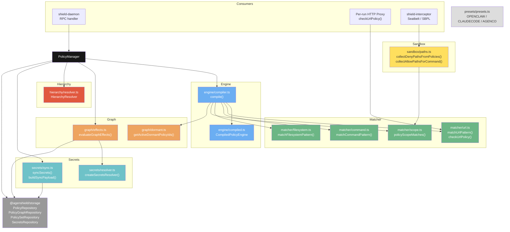

---

## Core Types

### `PolicyConfig` (from `@agenshield/ipc`)

The fundamental policy definition. Stored in SQLite, compiled into `CompiledRule` objects.

| Field | Type | Required | Description |
|-------|------|----------|-------------|
| `id` | `string` | yes | Unique identifier |
| `name` | `string` | yes | Human-readable name |
| `action` | `'allow' \| 'deny' \| 'approval'` | yes | What happens when matched |
| `target` | `'skill' \| 'command' \| 'url' \| 'filesystem'` | yes | Target type for pattern matching |
| `patterns` | `string[]` | yes | Glob/exact patterns to match |
| `enabled` | `boolean` | yes | Whether this policy is active |
| `priority` | `number` | no | Higher = evaluated first (default: 0) |
| `operations` | `string[]` | no | Filter to specific operations (empty = all) |
| `preset` | `string` | no | Preset ID if preset-seeded (undefined = user-created) |
| `scope` | `string` | no | Scope restriction (see [Scope System](#scope-system)) |
| `networkAccess` | `'none' \| 'proxy' \| 'direct'` | no | Network access level for sandboxed commands |

### `PolicyExecutionContext` (from `@agenshield/ipc`)

Runtime context passed during evaluation. Carries caller identity and process metadata.

| Field | Type | Description |
|-------|------|-------------|
| `callerType` | `'agent' \| 'skill'` | Whether the caller is an agent or a skill |
| `skillSlug` | `string?` | Slug of the skill (if callerType is `'skill'`) |
| `agentId` | `string?` | Agent identifier |
| `depth` | `number` | Call depth in the execution chain |
| `sourceLayer` | `'interceptor' \| 'es-extension'` | Source: Node.js interceptor or macOS EndpointSecurity |
| `esUser` | `string?` | Agent user name from ES extension |
| `esPid` | `number?` | Process ID from ES extension |
| `esPpid` | `number?` | Parent process ID from ES extension |
| `esSessionId` | `number?` | macOS audit session ID |

### `EvaluationInput`

Input to the evaluation engine.

```typescript
interface EvaluationInput {
  operation: string;        // 'http_request', 'exec', 'file_read', 'file_write', 'file_list'
  target: string;           // The URL, command, or path being evaluated
  context?: PolicyExecutionContext;
  profileId?: string;       // For scoped storage lookups
  defaultAction?: 'allow' | 'deny';  // Override engine default
}
```

### `EvaluationResult`

Output from evaluation.

```typescript
interface EvaluationResult {
  allowed: boolean;
  policyId?: string;                    // Which policy matched (undefined = default)
  reason?: string;                      // Human-readable explanation
  effects?: GraphEffects;               // Graph effects from matched policy node
  executionContext?: PolicyExecutionContext;
}
```

### `GraphEffects`

Accumulated effects from graph edge evaluation.

```typescript
interface GraphEffects {
  grantedNetworkPatterns: string[];           // Additional URL patterns granted
  grantedFsPaths: { read: string[]; write: string[] };  // Additional filesystem paths
  injectedSecrets: Record<string, string>;    // Secret name → value (resolved from vault)
  activatedPolicyIds: string[];               // Dormant policies activated by this match
  denied: boolean;                            // Graph deny override
  denyReason?: string;
}
```

### Policy Graph Types (from `@agenshield/ipc`)

```typescript
interface PolicyGraph {
  nodes: PolicyNode[];
  edges: PolicyEdge[];
  activations: EdgeActivation[];
}

interface PolicyNode {
  id: string;              // Node UUID
  policyId: string;        // References a PolicyConfig.id
  profileId?: string;      // Scope to a profile
  dormant: boolean;        // If true, policy only active when activated by an edge
  metadata?: unknown;
  createdAt: string;
  updatedAt: string;
}

interface PolicyEdge {
  id: string;
  sourceNodeId: string;    // When this node's policy matches...
  targetNodeId: string;    // ...apply effect on this node
  effect: EdgeEffect;      // 'activate' | 'deny' | 'inject_secret' | 'grant_network' | 'grant_fs' | 'revoke'
  lifetime: EdgeLifetime;  // 'session' | 'process' | 'once' | 'persistent'
  priority: number;        // Higher = evaluated first
  condition?: string;      // Optional condition string
  secretName?: string;     // For inject_secret edges
  grantPatterns?: string[];// For grant_network / grant_fs edges
  delayMs?: number;        // Future: delayed activation
  enabled: boolean;
  createdAt: string;
  updatedAt: string;
}

interface EdgeActivation {
  id: string;
  edgeId: string;          // Which edge was activated
  activatedAt: string;
  expiresAt?: string;
  processId?: number;      // For process-scoped activations
  consumed: boolean;       // True after one-time use or revocation
}
```

---

## PolicyManager

The main entry point. Wraps storage with a compiled engine for fast evaluation.

```typescript
import { PolicyManager } from '@agenshield/policies';
import { createStorage } from '@agenshield/storage';

const storage = createStorage({ dbPath: '/path/to/db.sqlite' });
const manager = new PolicyManager(storage, {
  eventBus,                                          // Optional: EventBus for emitting events
  pushSecrets: async (payload) => { /* broker */ },  // Optional: callback for secret sync
});
```

### Lifecycle

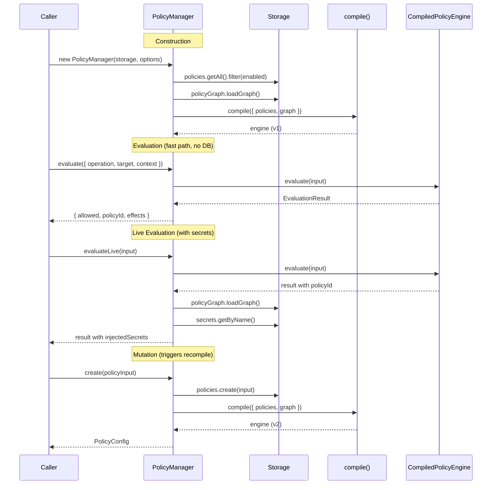

### Methods

#### Evaluation

| Method | Description |
|--------|-------------|
| `evaluate(input)` | Fast evaluation using compiled engine. No DB hit for rule matching. Pass `resolveSecrets: true` for live graph effects with secret injection. |
| `evaluateLive(input)` | Shorthand for `evaluate({ ...input, resolveSecrets: true })`. Used by daemon RPC. Hits DB for activations + vault for secrets. |

#### CRUD (each triggers recompile)

| Method | Signature | Description |
|--------|-----------|-------------|
| `create` | `(input) → PolicyConfig` | Create a new policy and recompile |
| `getById` | `(id) → PolicyConfig \| null` | Get by ID (no recompile) |
| `getAll` | `(scope?) → PolicyConfig[]` | Get all policies, optionally scoped |
| `getEnabled` | `(scope?) → PolicyConfig[]` | Get enabled policies only |
| `update` | `(id, input) → PolicyConfig \| null` | Update and recompile |
| `delete` | `(id) → boolean` | Delete and recompile |
| `seedPreset` | `(presetId) → number` | Seed preset policies, recompile if any added |

#### Engine Management

| Method / Property | Description |
|-------------------|-------------|
| `recompile()` | Force recompile (after graph changes, hierarchy updates, daemon restart) |
| `engineVersion` | Current engine version number (increments on each compile) |
| `compiledEngine` | Access the `CompiledPolicyEngine` directly for advanced use |

#### Other

| Method / Property | Description |
|-------------------|-------------|
| `hierarchy` | `HierarchyResolver` instance for multi-tenancy resolution |
| `syncSecrets(policies, logger?, scope?)` | Sync vault secrets to broker via `pushSecrets` callback |

---

## Compilation Model

The engine uses a **2-phase approach**: compile once on policy change, evaluate per-request with no DB hit.

### Phase 1: Compile

Called on every mutation (create, update, delete, seedPreset, recompile).

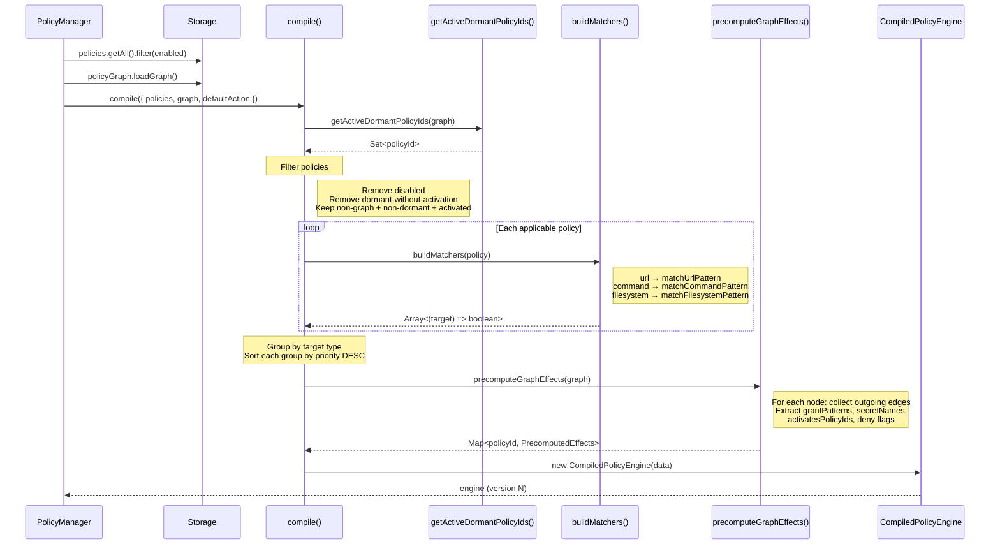

**`CompileInput`**:

```typescript
interface CompileInput {
  policies: PolicyConfig[];
  graph?: PolicyGraph;
  defaultAction?: 'allow' | 'deny';  // Default: 'deny'
}
```

**What happens**:
1. **Dormant resolution** — `getActiveDormantPolicyIds(graph)` determines which dormant policies have active activation records
2. **Filtering** — Remove disabled policies. For graph nodes: non-dormant always included, dormant only if activated, not-in-graph always included
3. **Matcher building** — Each policy's patterns are compiled into closure functions based on target type
4. **Grouping** — Rules split into `commandRules`, `urlRules`, `filesystemRules`
5. **Sorting** — Each group sorted by `priority` DESC (higher priority first)
6. **Graph precomputation** — Outgoing edges from each node analyzed: grant patterns, secret names, activation targets, deny flags stored in a `Map<policyId, PrecomputedEffects>`
7. **Version bump** — Global version counter incremented

### Phase 2: Evaluate

Called per-request. O(n) scan over pre-compiled rules, no DB access.

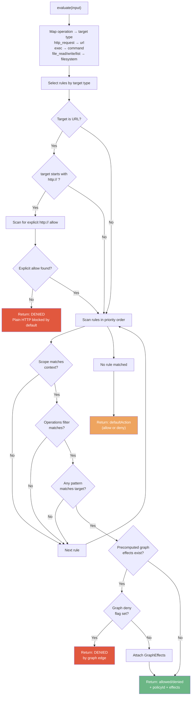

**Operation-to-target mapping** (`operationToTarget()`):

| Operation | Target Type |
|-----------|-------------|
| `http_request` | `url` |
| `exec` | `command` |
| `file_read` | `filesystem` |
| `file_write` | `filesystem` |
| `file_list` | `filesystem` |
| *(other)* | *(passthrough)* |

---

## Pattern Matching

### URL Matching

**File**: `src/matcher/url.ts`

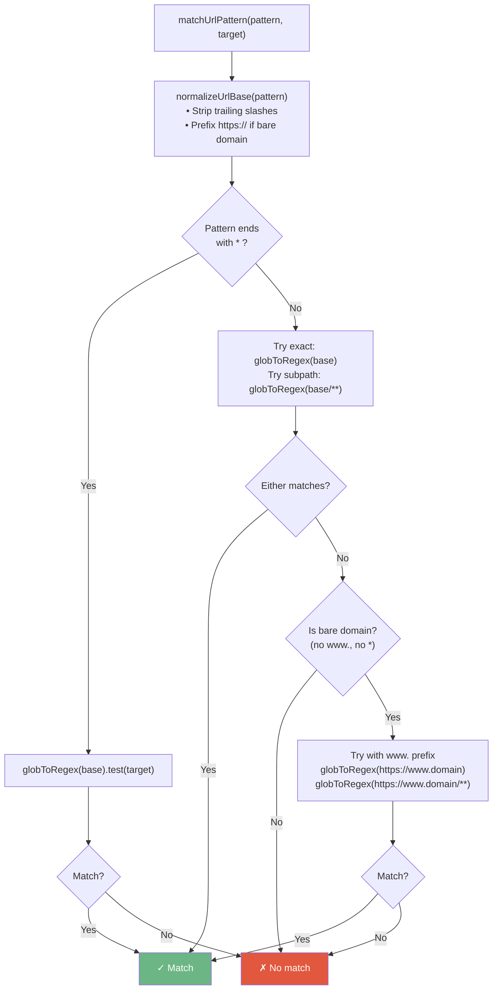

#### URL Functions

| Function | Description |
|----------|-------------|
| `globToRegex(pattern)` | Convert glob to RegExp. `*` = `[^/]*`, `**` = `.*`, `?` = `.`. Case-insensitive. |
| `normalizeUrlBase(pattern)` | Strip trailing `/`, prefix `https://` if no protocol present. |
| `normalizeUrlTarget(url)` | Parse URL, normalize path (strip trailing `/`, keep root `/`), reconstruct. |
| `matchUrlPattern(pattern, target)` | 3-strategy matching: glob-as-is, exact+subpath, www-variant. |
| `checkUrlPolicy(policies, url, defaultAction)` | Standalone URL check for per-run proxy. Filters to enabled URL policies, sorts by priority, checks plain HTTP blocking, scans for first match. |

#### URL Pattern Examples

| Pattern | Target | Matches? | Why |
|---------|--------|----------|-----|
| `api.openai.com` | `https://api.openai.com/v1/chat` | yes | Bare domain matches exact + subpaths |
| `facebook.com` | `https://www.facebook.com/page` | yes | Bare domain also tries www. variant |
| `*.github.com` | `https://api.github.com/repos` | yes | `*` matches single segment |
| `https://example.com/**` | `https://example.com/a/b/c` | yes | `**` matches any depth |
| `http://localhost:3000` | `http://localhost:3000/api` | yes | Explicit http:// protocol match |
| `api.openai.com` | `http://api.openai.com/v1` | no | Plain HTTP blocked unless explicit http:// pattern |
| `*.com` | `https://api.github.com/repos` | no | `*` doesn't cross `/` boundaries |

### Command Matching

**File**: `src/matcher/command.ts`

#### Command Functions

| Function | Description |
|----------|-------------|
| `extractCommandBasename(target)` | Strip `fork:` prefix and path components. `/usr/bin/curl -s https://x.com` → `curl`. |
| `matchCommandPattern(pattern, target)` | Claude Code-style matching with 4 semantics (see below). |

#### Command Pattern Semantics

| Pattern | Meaning | Examples |
|---------|---------|---------|
| `*` | Wildcard — matches everything | `git`, `curl https://x.com`, anything |
| `git` | Exact match only (no args) | `git` yes, `git push` no |
| `git:*` | Prefix match with optional args | `git` yes, `git push` yes, `git-lfs` no |
| `git push` | Exact multi-word match | `git push` yes, `git push origin` no |
| `git push:*` | Prefix match with optional args | `git push` yes, `git push origin main` yes |

Command matching is case-insensitive. Absolute paths in both patterns and targets are normalized to basenames:
- Pattern `/usr/bin/git:*` matches target `/usr/local/bin/git fetch`
- Target `fork:git push` is normalized to `git push` before matching

### Filesystem Matching

**File**: `src/matcher/filesystem.ts`

```typescript
matchFilesystemPattern(pattern, target): boolean
```

Uses `globToRegex()` from URL matcher. One special rule: **directory patterns ending with `/` automatically append `**`** to match all contents.

| Pattern | Target | Matches? | Why |
|---------|--------|----------|-----|
| `/etc/ssh/**` | `/etc/ssh/sshd_config` | yes | `**` matches any depth |
| `/etc/ssh/` | `/etc/ssh/sshd_config` | yes | Trailing `/` auto-appends `**` |
| `/tmp/*.log` | `/tmp/app.log` | yes | `*` matches single segment |
| `/home/user/.env` | `/home/user/.env` | yes | Exact match |
| `$WORKSPACE/**` | `$WORKSPACE/src/main.ts` | yes | Variable expanded at runtime |

---

## Scope System

**File**: `src/matcher/scope.ts`

Scopes restrict when a policy applies. Evaluated at two levels: **evaluation-time** (inside the engine) and **command-time** (in the per-run proxy).

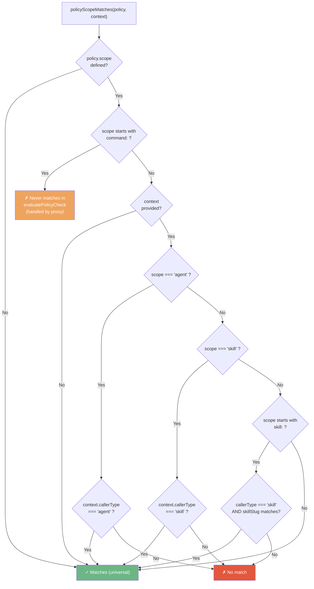

### Scope Values

| Scope | Where Applied | Meaning |
|-------|--------------|---------|
| *(none)* | Everywhere | Universal — applies to all callers and commands |
| `agent` | Engine evaluation | Only applies when `callerType === 'agent'` |
| `skill` | Engine evaluation | Only applies when `callerType === 'skill'` |
| `skill:<slug>` | Engine evaluation | Only applies to a specific skill by slug |
| `command:<name>` | Per-run proxy only | Only applies when the spawned command matches `<name>` |

### Scope Functions

| Function | Description |
|----------|-------------|
| `policyScopeMatches(policy, context)` | Evaluation-time scope check. Returns `false` for `command:` scopes (handled by proxy). |
| `commandScopeMatches(policy, commandBasename)` | Command-time scope check. Non-command scopes treated as universal. |
| `filterUrlPoliciesForCommand(policies, commandBasename)` | Filter URL policies for a specific command. Returns global (unscoped) first, then command-scoped. Used by per-run proxy to build the URL allowlist for a sandboxed process. |

---

## Policy Graph

The policy graph is a **directed acyclic graph (DAG)** where policies are nodes and edges define conditional relationships: "When policy A fires, apply effect on policy B."

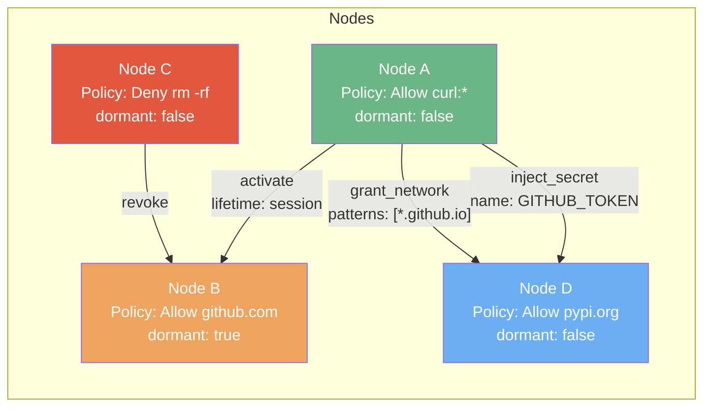

In this example:
- When **curl** is allowed (Node A matches), it **activates** the dormant github.com policy (Node B) for the session, **injects** `GITHUB_TOKEN` into the environment, and **grants** additional `*.github.io` network access
- When **rm -rf** is denied (Node C matches), it **revokes** Node B's activation

### Edge Effects

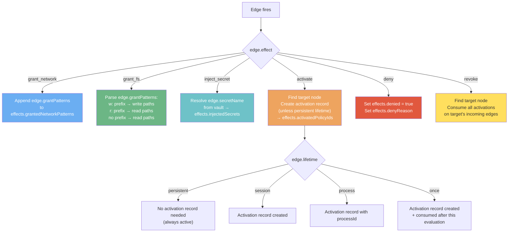

| Effect | Fields Used | Description |
|--------|------------|-------------|
| `grant_network` | `grantPatterns: string[]` | Grant additional URL patterns beyond the policy's own patterns |
| `grant_fs` | `grantPatterns: string[]` | Grant filesystem paths. Prefix `w:` for write, `r:` for read, no prefix = read |
| `inject_secret` | `secretName: string` | Resolve a named secret from the vault and inject into environment |
| `activate` | `lifetime: EdgeLifetime` | Activate a dormant policy. Lifetime controls how long activation persists |
| `deny` | `condition?: string` | Override an allow result with denial. `condition` becomes the deny reason |
| `revoke` | *(target node)* | Consume all active activation records on the target node's incoming edges |

### Dormant Policy Activation

**File**: `src/graph/dormant.ts`

A **dormant** policy (`node.dormant = true`) is excluded from evaluation unless activated by an incoming `activate` edge.

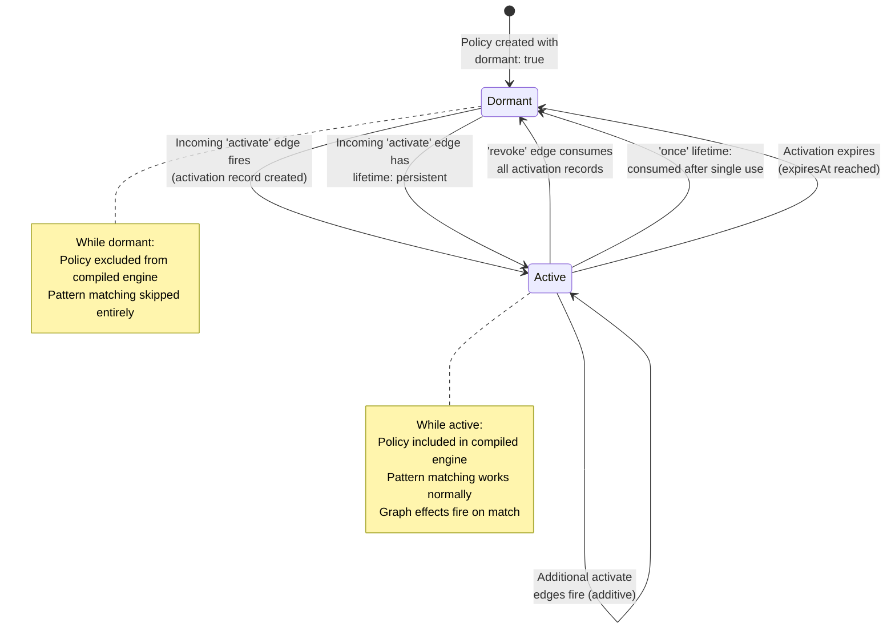

**`getActiveDormantPolicyIds(graph)`** algorithm:
1. Build a set of edge IDs that have non-consumed activations
2. Find all dormant nodes in the graph
3. For each dormant node, check incoming `activate` edges:
   - If any edge has `lifetime: 'persistent'` → active (no activation record needed)
   - If any edge has a non-consumed activation → active
4. Return `Set<policyId>` of active dormant policies

### Graph Effects Evaluation

**File**: `src/graph/effects.ts`

**`evaluateGraphEffects(matchedPolicyId, graph, graphRepo, secretsRepo, context)`**

Called by `PolicyManager.evaluateLive()` after the compiled engine finds a matching policy. Performs live graph evaluation with DB access for activations and vault access for secrets.

**Key design decisions**:
- **Direct edges only** — Only fires outgoing edges from the matched policy's node. No recursive traversal. Cascading happens across separate evaluation calls via the activation model.
- **Fault-open** — If any edge evaluation throws, the error is logged and skipped. The caller gets partial effects, never a blocked allow/deny.
- **Priority ordering** — Outgoing edges are sorted by priority DESC before evaluation.
- **Lazy secret resolution** — At compile time, only secret *names* are stored (`PrecomputedEffects.secretNames`). Actual values are resolved from the vault at evaluation time since vault state can change independently.

---

## Sandbox Path Extraction

**File**: `src/sandbox/paths.ts`

Extracts concrete filesystem paths from policies for use in macOS SBPL (Seatbelt Profile Language) sandbox profiles. SBPL only supports `(subpath "/path")` and `(literal "/path")` — no globs.

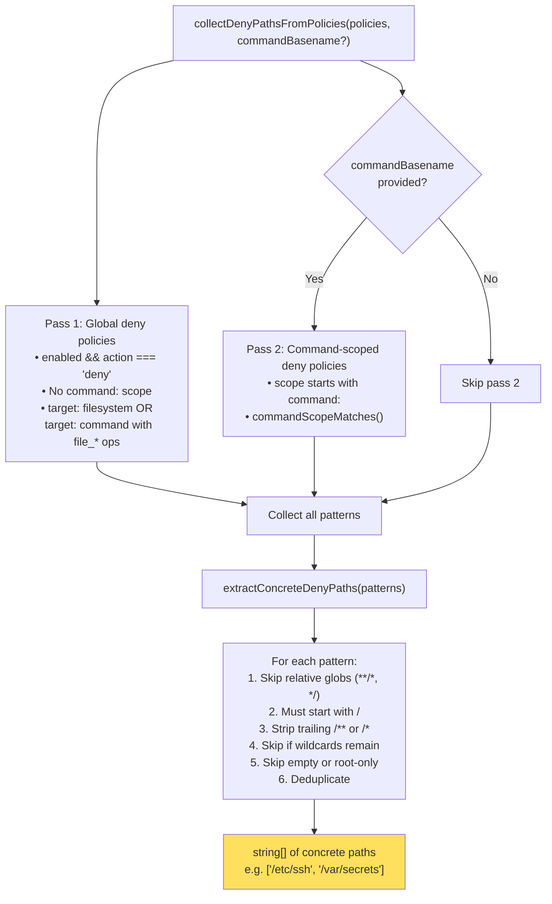

### Sandbox Functions

| Function | Description |
|----------|-------------|
| `extractConcreteDenyPaths(patterns)` | Filter patterns to SBPL-expressible paths. Strips trailing `/*` and `/**`, rejects globs, relative paths, and root. |
| `collectDenyPathsFromPolicies(policies, commandBasename?)` | 2-pass collection: global deny policies first, then command-scoped. Returns concrete deny paths. |
| `collectAllowPathsForCommand(policies, commandBasename)` | Collect read and write allow paths for a specific command. Returns `{ readPaths: string[], writePaths: string[] }`. Operations determine classification: `file_read`/`file_list` → read, `file_write` → write. |

---

## Secrets

### Secret Resolution (`secrets/resolver.ts`)

```typescript
function createSecretsResolver(
  secretsRepo: { getByName(name: string): { value: string } | null }
): SecretsResolver
```

Creates a `SecretsResolver` adapter from a storage secrets repository. Wraps vault access with error handling — returns `null` on `StorageLockedError`. Used by `evaluateGraphEffects()` for `inject_secret` edges.

### Secret Sync (`secrets/sync.ts`)

Synchronizes vault secrets to the broker for injection into sandboxed processes.

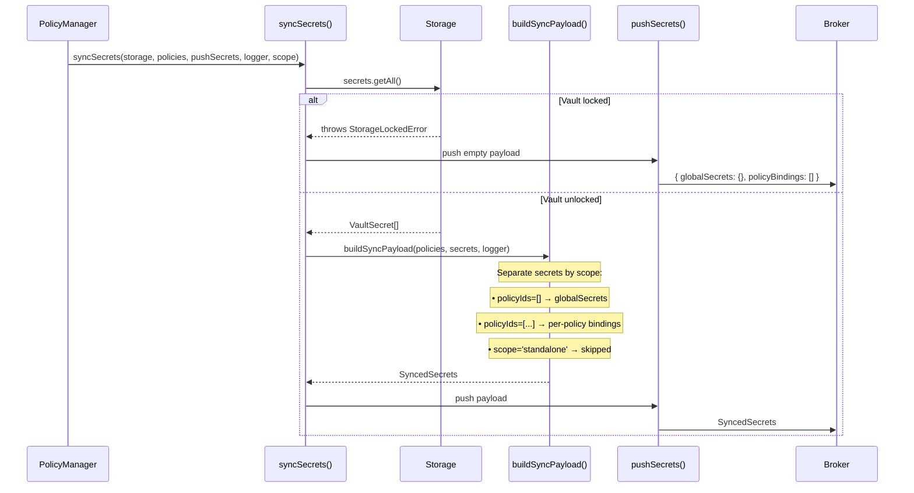

**`buildSyncPayload(policies, secrets, logger)`** produces:

```typescript
interface SyncedSecrets {
  version: '1.0.0';
  syncedAt: string;                         // ISO timestamp
  globalSecrets: Record<string, string>;    // Always injected into every exec
  policyBindings: SecretPolicyBinding[];    // Injected when policy patterns match
}

interface SecretPolicyBinding {
  policyId: string;
  target: 'url' | 'command';
  patterns: string[];
  secrets: Record<string, string>;
}
```

Rules:
- Secrets with `scope: 'standalone'` are never synced (stored-only)
- Secrets with empty `policyIds` become global secrets
- Policy-bound secrets include the policy's `target` and `patterns` for broker-side matching
- Only `url` and `command` target policies are synced (not `filesystem`)
- Disabled policies are skipped

---

## Presets

**File**: `src/presets/presets.ts`

Predefined policy sets that provide sensible defaults for common AI coding agents.

| Preset | ID | Policies |
|--------|----|----------|
| **OpenClaw** | `openclaw` | AI Provider APIs (OpenAI, Anthropic, Mistral, Cohere, OpenRouter), Package Registries & Git, Core Commands (node, npm, git, curl, shell utils), Workspace Access, Messaging Channels (WhatsApp, Telegram, Discord, Slack, Line) |
| **Claude Code** | `claudecode` | AI Provider APIs (Anthropic, OpenAI), Package Registries & Git, Claude Code Commands (claude, node, npm, git, python, shell utils), Workspace Access |
| **AgenCo** | `agenco` | AgenCo Commands, AgenCo Marketplace URL |

### Preset Functions

| Export | Description |
|--------|-------------|
| `OPENCLAW_PRESET` | OpenClaw preset definition |
| `CLAUDECODE_PRESET` | Claude Code preset definition |
| `AGENCO_PRESET` | AgenCo integrations preset definition |
| `PRESET_MAP` | `Record<string, PolicyPreset>` — lookup by ID |
| `POLICY_PRESETS` | `PolicyPreset[]` — all presets as array |
| `getPresetById(id)` | Get a preset by ID (returns `undefined` if not found) |

All preset policies have `priority: 5` and are tagged with their `preset` ID.

---

## Hierarchy

**File**: `src/hierarchy/resolver.ts`

For multi-tenancy, policies are organized in **policy sets** with parent-child inheritance chains.

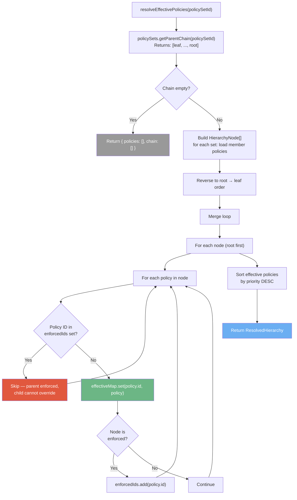

### Hierarchy Types

```typescript
interface HierarchyNode {
  policySetId: string;
  name: string;
  enforced: boolean;         // If true, policies from this set cannot be overridden by children
  policies: PolicyConfig[];
}

interface ResolvedHierarchy {
  policies: PolicyConfig[];  // Effective policies after merge, sorted by priority DESC
  chain: HierarchyNode[];   // Chain from leaf to root
}
```

### Merge Rules

- **Root policies** are added first, then each child level
- **Enforced** parent policies (from a policy set with `enforced: true`) cannot be overridden — child policies with the same ID are skipped
- **Non-enforced** parent policies can be overridden — child policy with the same ID replaces the parent's version
- Final result sorted by `priority` DESC

---

## Error Classes

All errors extend `PolicyError` (base class with `.code` property).

| Class | Code | Properties | When Thrown |
|-------|------|------------|------------|
| `PolicyError` | *(base)* | `code: string` | Base class — not thrown directly |
| `PolicyNotFoundError` | `POLICY_NOT_FOUND` | `policyId: string` | Policy lookup by ID fails |
| `PolicySetNotFoundError` | `POLICY_SET_NOT_FOUND` | `policySetId: string` | Policy set lookup fails |
| `GraphCycleError` | `GRAPH_CYCLE` | `sourceId, targetId` | Adding a graph edge would create a cycle |
| `GraphEvaluationError` | `GRAPH_EVALUATION_ERROR` | `nodeId?, edgeId?` | Graph effect evaluation fails |
| `SecretResolutionError` | `SECRET_RESOLUTION_ERROR` | `secretName: string` | Secret vault lookup fails |
| `CompilationError` | `COMPILATION_ERROR` | — | Engine compilation fails |

---

## End-to-End Flows

### Flow 1: Command Execution (`exec` operation)

How a command execution request flows through the system from interceptor to sandbox.

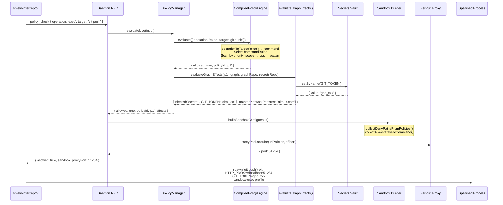

### Flow 2: HTTP Request Through Proxy

How a sandboxed process's HTTP request is checked by the per-run proxy.

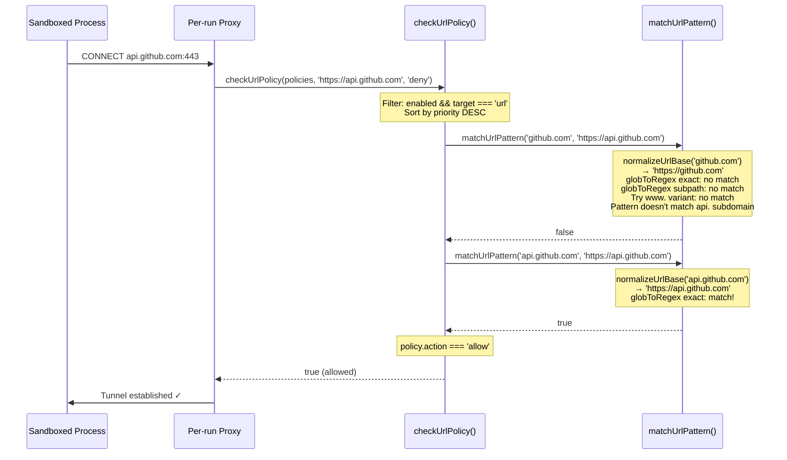

### Flow 3: Graph-Triggered Secret Injection

How a policy match triggers secret injection through the graph system.

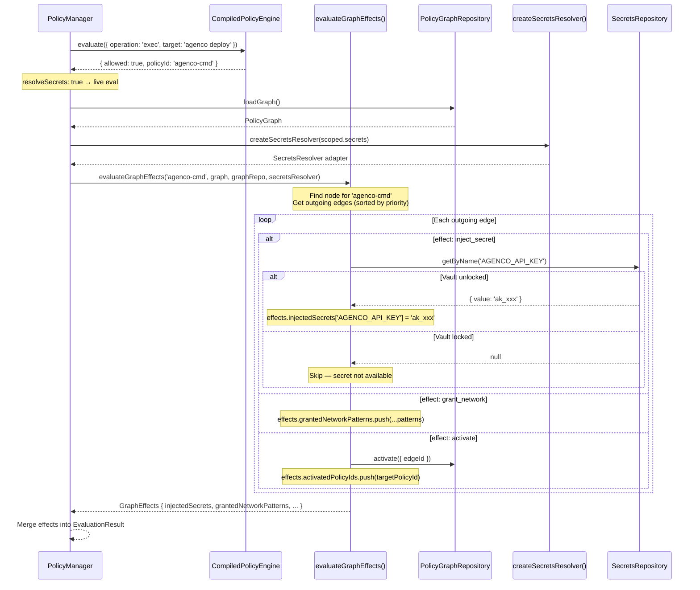

---

## Testing

```bash
# Run all tests
npx nx test policies --skip-nx-cache

# Run with coverage
npx nx test policies --skip-nx-cache --coverage

# Run specific module
npx nx test policies --skip-nx-cache --testPathPattern="matcher"
npx nx test policies --skip-nx-cache --testPathPattern="engine"
npx nx test policies --skip-nx-cache --testPathPattern="graph"
npx nx test policies --skip-nx-cache --testPathPattern="hierarchy"
```

**Coverage target: 90%+** (current: ~97% lines)

Test structure follows the storage convention with `__tests__/` folders per domain:

```
src/
  __tests__/helpers.ts              # Shared factories + mocks
  __tests__/errors.spec.ts          # Error class tests
  __tests__/manager.spec.ts         # Integration tests
  matcher/__tests__/url.spec.ts
  matcher/__tests__/command.spec.ts
  matcher/__tests__/filesystem.spec.ts
  engine/__tests__/compiler.spec.ts
  engine/__tests__/compiled.spec.ts
  graph/__tests__/effects.spec.ts
  graph/__tests__/dormant.spec.ts
  sandbox/__tests__/paths.spec.ts
  secrets/__tests__/sync.spec.ts
  secrets/__tests__/resolver.spec.ts
  presets/__tests__/presets.spec.ts
  hierarchy/__tests__/resolver.spec.ts
```
