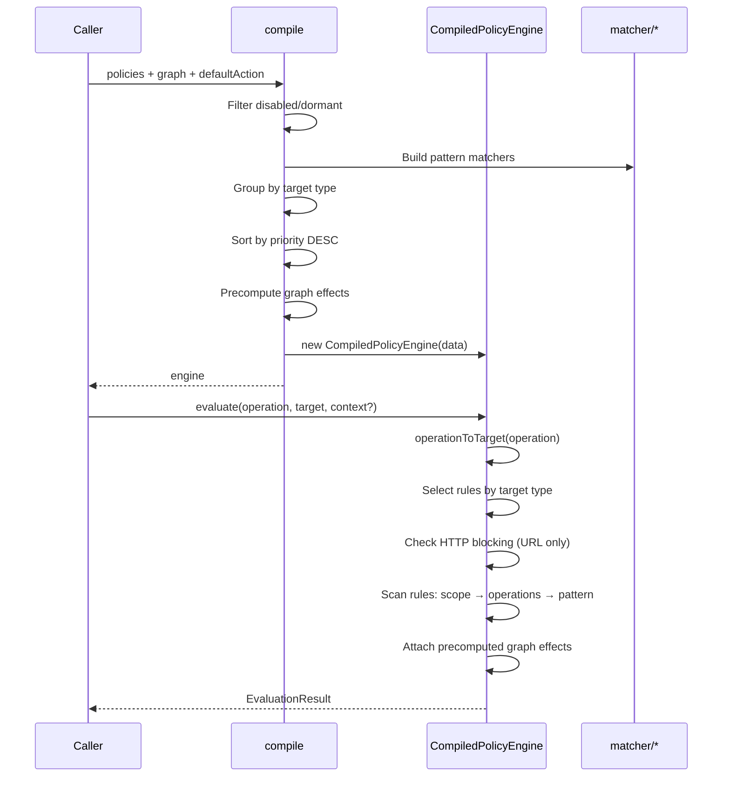

# engine/

Compiled policy engine: pre-processes policies + graph into fast in-memory data structures for O(n) evaluation with no DB hit.

## Architecture

## Exports

### `compile(input: CompileInput): CompiledPolicyEngine`

Builds a compiled engine from policies and optional graph. Called on every policy change (CRUD, graph edit).

### `operationToTarget(operation: string): string`

Maps interceptor operations to policy target types:

| Operation | Target |
|-----------|--------|
| `http_request` | `url` |
| `exec` | `command` |
| `file_read`, `file_write`, `file_list` | `filesystem` |
| other | passthrough |

### `CompiledPolicyEngine`

Fast in-memory evaluation engine. No DB access during `evaluate()`.

**Properties:**
- `version: number` — increments on each compile
- `compiledAt: number` — timestamp
- `activeDormantPolicyIds: Set<string>` — currently active dormant policies

**Methods:**
- `evaluate(input: EvaluationInput): EvaluationResult` — O(n) pattern scan

## Types

- `CompiledRule` — Pre-compiled rule with matchers, scope, operations
- `PrecomputedEffects` — Graph effects stored by policy ID (secrets as names, not values)
- `EvaluationInput` — `{ operation, target, context?, profileId?, defaultAction? }`
- `EvaluationResult` — `{ allowed, policyId?, reason?, effects?, executionContext? }`

## Compilation Model

1. **Filter**: Remove disabled policies and dormant policies without active activation
2. **Build matchers**: Create pattern matcher functions per policy (URL glob, command Claude-style, filesystem glob)
3. **Group**: Split into `commandRules`, `urlRules`, `filesystemRules`
4. **Sort**: Priority DESC within each group
5. **Precompute graph effects**: Walk graph edges once, store effects by policy ID
6. **Version**: Increment global counter for cache invalidation
