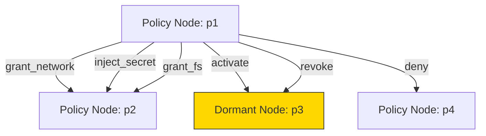

# graph/

Policy graph effects evaluation and dormant policy activation tracking.

## Architecture



## Exports

### `evaluateGraphEffects(policyId, graph, graphRepo, secretsRepo, context?): GraphEffects`

Evaluates outgoing edges from a matched policy node. Returns accumulated effects.

**Fail-open**: Errors on individual edges are caught and logged — they never block other edges.

### `emptyEffects(): GraphEffects`

Creates a fresh empty `GraphEffects` object.

### `getActiveDormantPolicyIds(graph: PolicyGraph): Set<string>`

Returns the set of dormant policy IDs that are currently activated via graph edges.

A dormant policy is active when:
- It has an incoming `activate` edge with `lifetime: 'persistent'`, OR
- It has an incoming `activate` edge with an active (non-consumed) activation record

## Edge Effect Types

| Effect | Description | Fields Used |
|--------|-------------|-------------|
| `grant_network` | Grant network access patterns | `grantPatterns[]` |
| `grant_fs` | Grant filesystem paths (prefixed `r:` / `w:`) | `grantPatterns[]` |
| `inject_secret` | Inject a secret by name from vault | `secretName` |
| `activate` | Activate a dormant target policy | `lifetime` (session/process/persistent) |
| `deny` | Override allow with denial | `condition` (reason string) |
| `revoke` | Consume all activations on target | — |

## Lifetime Model

| Lifetime | Activation Record | Behavior |
|----------|------------------|----------|
| `session` | Created | Active until consumed or session ends |
| `process` | Created with `processId` | Active until process exits |
| `persistent` | NOT created | Always active (no record needed) |

## Types

```typescript
interface GraphEffects {
  grantedNetworkPatterns: string[];
  grantedFsPaths: { read: string[]; write: string[] };
  injectedSecrets: Record<string, string>;
  activatedPolicyIds: string[];
  denied: boolean;
  denyReason?: string;
}

interface SecretsResolver {
  getByName(name: string): { value: string } | null;
}
```
