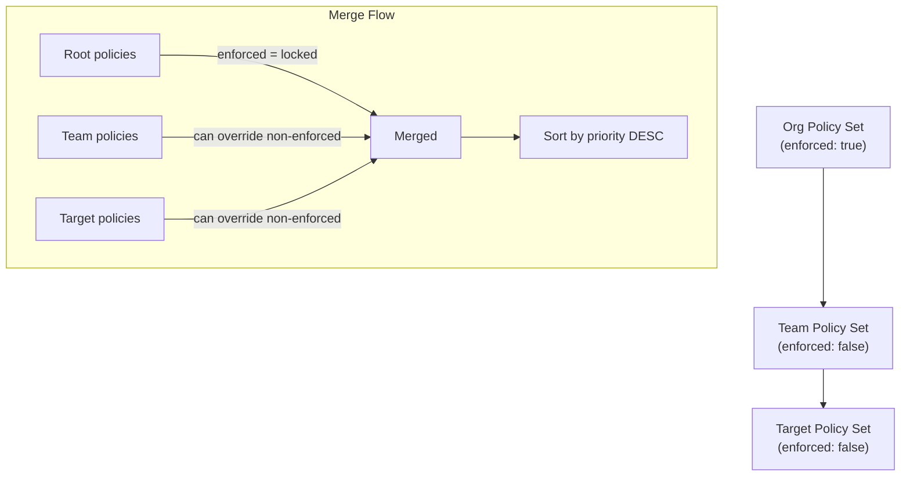

# hierarchy/

Multi-tenancy policy hierarchy resolution. Walks parent chains of policy sets and merges policies with enforcement rules.

## Architecture



## Exports

### `HierarchyResolver`

```typescript
class HierarchyResolver {
  constructor(policySets: PolicySetRepository, policies: PolicyRepository)
  resolveEffectivePolicies(policySetId: string): ResolvedHierarchy
}
```

### Algorithm

1. Walk from leaf (provided set) up to root via `parentId` chain
2. Build hierarchy nodes in leaf-to-root order
3. Reverse to root-to-leaf for merge processing
4. For each level, add policies to the effective map:
   - If the policy ID is already enforced by a parent, skip (cannot override)
   - Otherwise, set/override the policy in the effective map
   - If the current node is enforced, mark all its policies as enforced
5. Return merged policies sorted by priority DESC

### Enforcement Rules

| Scenario | Behavior |
|----------|----------|
| Parent enforced, child has same policy ID | Parent wins (locked) |
| Parent non-enforced, child has same policy ID | Child wins (override) |
| Only parent has policy | Included in result |
| Only child has policy | Included in result |

## Types

```typescript
interface HierarchyNode {
  policySetId: string;
  name: string;
  enforced: boolean;
  policies: PolicyConfig[];
}

interface ResolvedHierarchy {
  policies: PolicyConfig[];  // Effective policies after merge
  chain: HierarchyNode[];   // Leaf to root order
}
```
