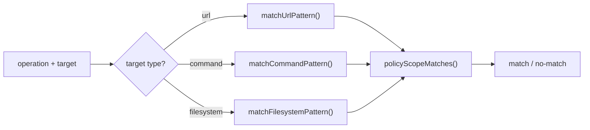

# matcher/

Pattern matching utilities for URL, command, and filesystem targets, plus scope filtering.

## Architecture

## Exports

| Function | File | Description |
|----------|------|-------------|
| `globToRegex(pattern)` | `url.ts` | Convert glob pattern to RegExp (`**`, `*`, `?`) |
| `normalizeUrlBase(pattern)` | `url.ts` | Normalize URL pattern (add `https://`, strip trailing `/`) |
| `normalizeUrlTarget(url)` | `url.ts` | Normalize URL target (ensure root path, strip trailing `/`) |
| `matchUrlPattern(pattern, target)` | `url.ts` | Match URL target against glob pattern with www subdomain fallback |
| `checkUrlPolicy(policies, url, defaultAction?)` | `url.ts` | Check URL against a set of policies with HTTP blocking |
| `extractCommandBasename(target)` | `command.ts` | Extract basename from command path (`/usr/bin/curl` → `curl`) |
| `matchCommandPattern(pattern, target)` | `command.ts` | Claude Code-style matching: `git:*`, `git push`, `*` |
| `matchFilesystemPattern(pattern, target)` | `filesystem.ts` | Glob-based filesystem matching with directory auto-expand |
| `policyScopeMatches(policy, context?)` | `scope.ts` | Check if policy scope matches execution context |
| `commandScopeMatches(policy, commandBasename)` | `scope.ts` | Check if policy applies to a command (proxy path) |
| `filterUrlPoliciesForCommand(policies, commandBasename)` | `scope.ts` | Filter URL policies for a specific command |

## Command Pattern Semantics

| Pattern | Matches | Does Not Match |
|---------|---------|----------------|
| `*` | Everything | — |
| `git` | `git` (exact) | `git push` |
| `git:*` | `git`, `git push`, `git push origin` | `curl` |
| `git push` | `git push` (exact) | `git push origin` |
| `git push:*` | `git push`, `git push origin main` | `git pull` |

## Scope Types

| Scope | `policyScopeMatches` | `commandScopeMatches` |
|-------|---------------------|-----------------------|
| `undefined` (universal) | Always matches | Always matches |
| `command:<name>` | Always `false` | Matches if command = name |
| `agent` | Matches agent callerType | Universal |
| `skill` | Matches skill callerType | Universal |
| `skill:<slug>` | Matches skill + slug | Universal |

