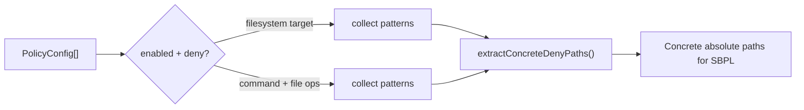

# sandbox/

SBPL-compatible filesystem path extraction from policies. Used by the seatbelt sandbox builder to generate macOS sandbox profiles.

## Architecture

## Exports

### `extractConcreteDenyPaths(patterns: string[]): string[]`

Filters patterns to only SBPL-expressible rules:
- Keeps absolute paths (`/etc/passwd`)
- Strips `/**` and `/*` suffixes (`/root/**` → `/root`)
- Skips relative globs (`**/.env`), mid-path wildcards (`/etc/*/config`), non-absolute paths
- Deduplicates and trims whitespace

### `collectDenyPathsFromPolicies(policies, commandBasename?): string[]`

Collects concrete deny paths from:
- `target: 'filesystem'` deny policies
- `target: 'command'` deny policies with `file_read`/`file_write`/`file_list` operations

When `commandBasename` is provided, includes command-scoped policies that match. Global policies come first, then command-scoped.

### `collectAllowPathsForCommand(policies, commandBasename): { readPaths, writePaths }`

Collects separate read and write allow paths for a command:
- `file_read` / no operations → `readPaths`
- `file_write` → `writePaths`
- Global policies first, then command-scoped
