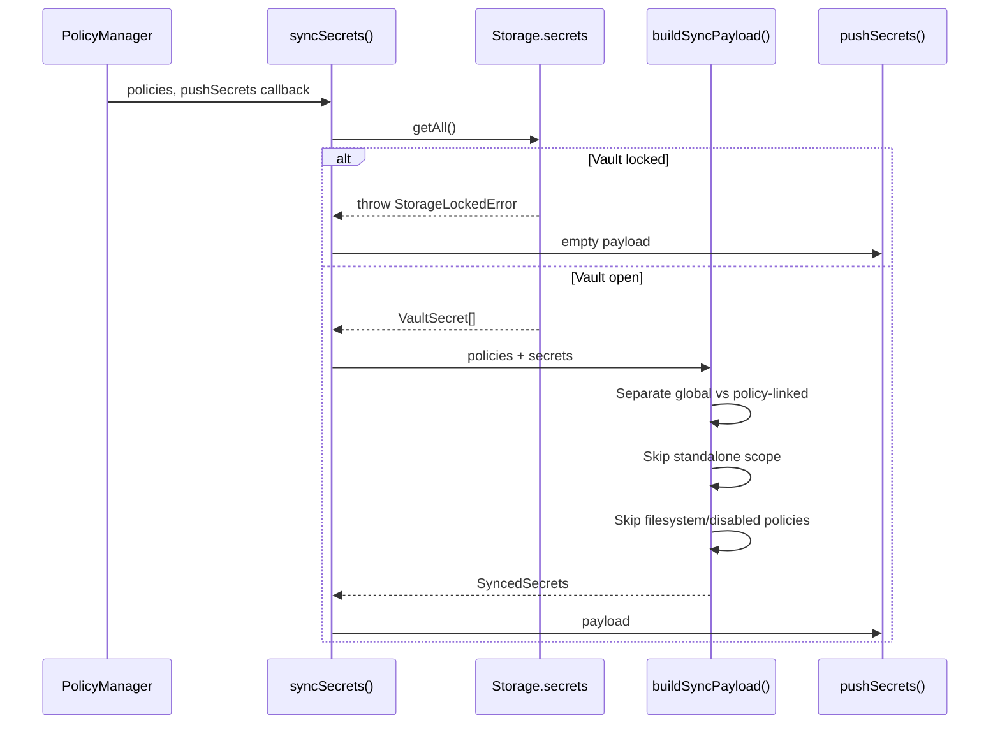

# secrets/

Secret sync to broker and lazy vault resolution for graph effects.

## Architecture



## Exports

### `buildSyncPayload(policies, secrets, logger?): SyncedSecrets`

Builds the sync payload from vault secrets and policies. Does NOT push.

**Secret categories:**
- **Global** (`policyIds=[]`): Always injected into every exec as env vars
- **Policy-linked**: Injected when the linked policy's patterns match
- **Standalone** (`scope='standalone'`): Stored only, never synced

Only `url` and `command` policies generate bindings (filesystem policies are skipped).

### `syncSecrets(storage, policies, pushSecrets, logger?, scope?): Promise<void>`

Full sync flow:
1. Read secrets from scoped vault
2. Handle `StorageLockedError` by pushing empty payload
3. Build payload via `buildSyncPayload`
4. Push via callback

### `createSecretsResolver(secretsRepo): SecretsResolver`

Wraps a secrets repository with error handling for use during graph effect evaluation. Returns `null` on vault access errors instead of throwing.

## Types

```typescript
type PushSecretsFn = (payload: SyncedSecrets) => Promise<void>;
```
