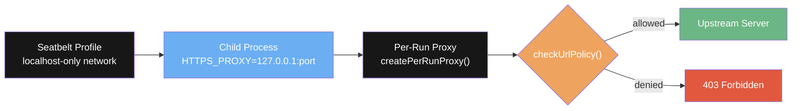
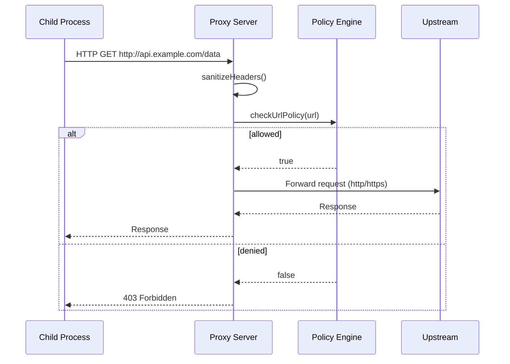
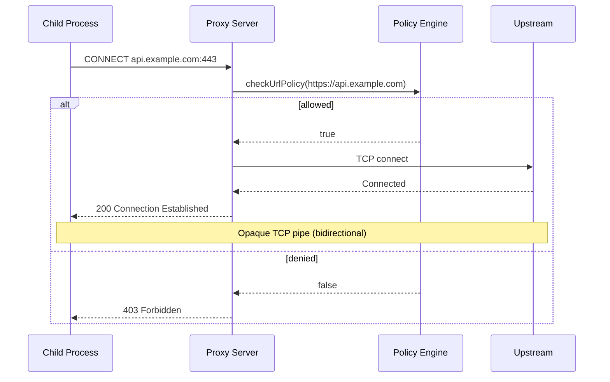
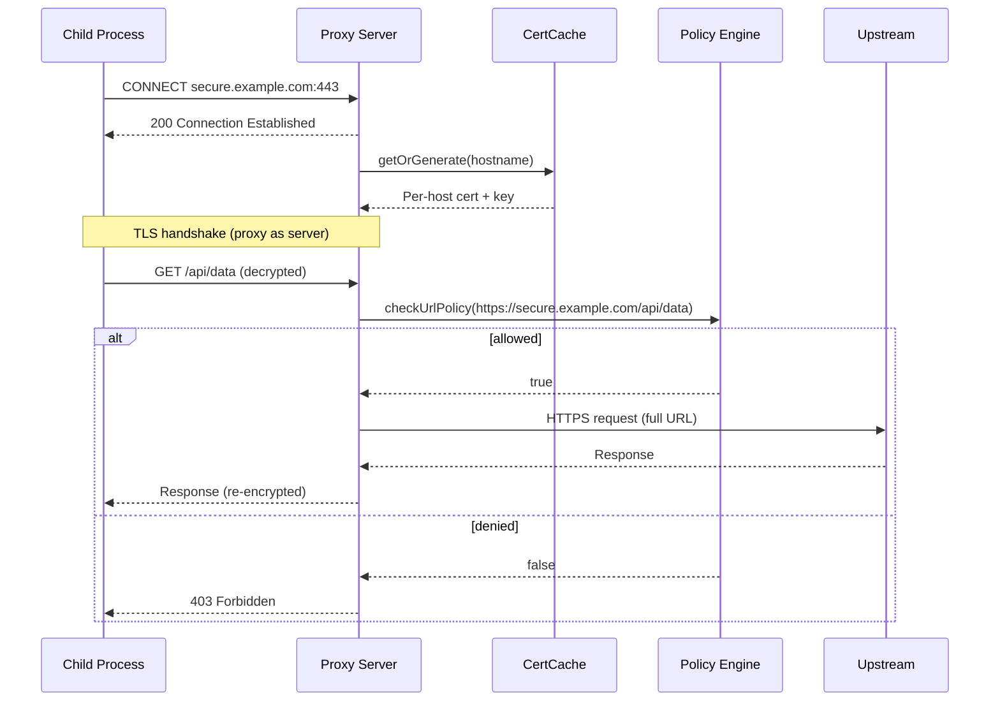
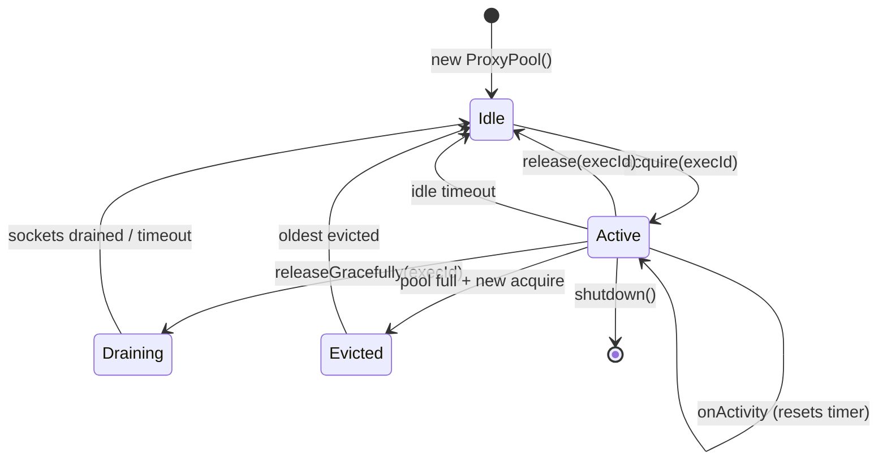
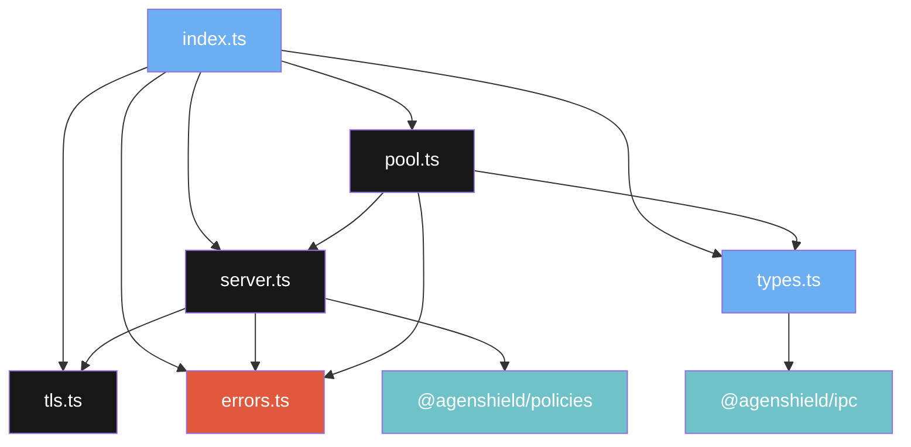
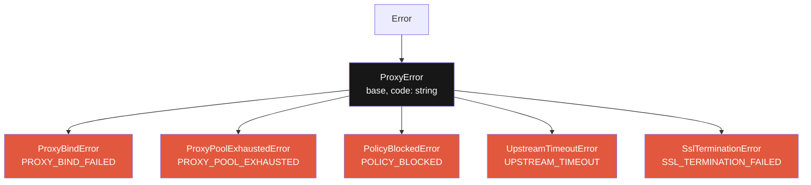

# @agenshield/proxy

Protocol-aware HTTP/HTTPS proxy with URL policy enforcement for sandboxed AI agent processes.

## Overview

Each seatbelt-wrapped command execution gets its own localhost proxy server. The macOS seatbelt profile restricts child processes to localhost-only network access, forcing all outbound traffic through the proxy. The proxy evaluates every request against URL policies before forwarding.

## Quick Start

### Standalone proxy

```typescript
import { createPerRunProxy } from '@agenshield/proxy';

const server = createPerRunProxy({
  getPolicies: () => myPolicies,
  getDefaultAction: () => 'deny',
  onActivity: () => { /* reset idle timer */ },
  logger: console.log,
  onBlock: (method, target, protocol) => {
    console.warn(`Blocked: ${method} ${target}`);
  },
});

server.listen(0, '127.0.0.1', () => {
  const port = (server.address() as any).port;
  // Set HTTPS_PROXY=http://127.0.0.1:${port} on child process
});
```

### ProxyPool (managed lifecycle)

```typescript
import { ProxyPool } from '@agenshield/proxy';

const pool = new ProxyPool(
  { maxConcurrent: 50, idleTimeoutMs: 300_000 },
  {
    onBlock: (execId, method, target, protocol) => { /* ... */ },
    onRelease: (execId) => { /* ... */ },
    logger: console.log,
  },
);

// Acquire — OS picks a free port
const { port } = await pool.acquire(
  'exec-abc123',
  'curl https://api.example.com',
  () => myPolicies,
  () => 'deny',
);

// Release when done
pool.release('exec-abc123');

// Or gracefully drain active connections first
await pool.releaseGracefully('exec-abc123', 5000);

// Shutdown all
pool.shutdown();
```

---

## Architecture

### Pipeline overview



### HTTP request flow



### CONNECT tunnel flow (opaque, no SSL termination)



### SSL termination flow (optional MITM)



### Pool lifecycle



### Module dependencies



---

## API Reference

### `createPerRunProxy(options): http.Server`

Create an HTTP proxy server that enforces URL policies on every request.

| Parameter | Type | Required | Description |
|-----------|------|----------|-------------|
| `getPolicies` | `() => PolicyConfig[]` | Yes | Returns current active policies |
| `getDefaultAction` | `() => 'allow' \| 'deny'` | Yes | Default action when no policy matches |
| `onActivity` | `() => void` | Yes | Called on every request (resets idle timer) |
| `logger` | `(msg: string) => void` | Yes | Logger for proxy events |
| `onBlock` | `(method, target, protocol) => void` | No | Callback on blocked requests |
| `onAllow` | `(method, target, protocol) => void` | No | Callback on allowed requests |
| `tls` | `TlsOptions` | No | TLS forwarding and SSL termination options |
| `maxConnections` | `number` | No | Max concurrent connections (default: 128) |
| `upstreamTimeoutMs` | `number` | No | Upstream request timeout in ms (default: 30000) |
| `maxBodyBytes` | `number` | No | Max request body size in bytes (default: 100MB) |

### `sanitizeHeaders(headers): IncomingHttpHeaders`

Strip hop-by-hop headers before forwarding. Removes `connection`, `keep-alive`, `proxy-authenticate`, `proxy-authorization`, `te`, `trailer`, `transfer-encoding`, `upgrade`, `proxy-connection`, and any headers listed in the `connection` header value.

### `ProxyPool`

Manages per-run proxy instances with lifecycle management.

| Method | Signature | Description |
|--------|-----------|-------------|
| `constructor` | `(options?: ProxyPoolOptions, hooks?: ProxyPoolHooks)` | Create pool |
| `acquire` | `(execId, command, getPolicies, getDefaultAction, callbacks?) => Promise<{ port }>` | Acquire a proxy, returns assigned port. `callbacks?: { onBlock?, onAllow? }` — same signatures as `CreateProxyOptions.onBlock/onAllow` |
| `release` | `(execId) => void` | Sync release (immediate close) |
| `releaseGracefully` | `(execId, drainTimeoutMs?) => Promise<void>` | Drain active sockets, then close |
| `shutdown` | `() => void` | Close all proxies and destroy sockets |
| `size` | `number` (getter) | Number of active proxies |

### `CertificateCache`

LRU cache for generated per-host TLS certificates.

| Method | Signature | Description |
|--------|-----------|-------------|
| `constructor` | `(maxSize?: number)` | Create cache (default max: 500) |
| `get` | `(hostname) => GeneratedCert \| undefined` | Retrieve and promote entry |
| `set` | `(hostname, cert) => void` | Store entry, evict LRU if full |
| `clear` | `() => void` | Remove all entries |
| `size` | `number` (getter) | Current entry count |

### `generateHostCertificate(hostname, caCert, caKey): GeneratedCert`

Generate a short-lived leaf certificate for a hostname, signed by the provided CA. Includes the hostname as a Subject Alternative Name (SAN).

### `createHostTlsContext(cert, caCert): tls.SecureContext`

Create a TLS secure context for the proxy acting as server. Used internally during SSL termination.

| Parameter | Type | Description |
|-----------|------|-------------|
| `cert` | `GeneratedCert` | Per-host cert and key |
| `caCert` | `string` | PEM CA certificate |

---

## Types Reference

### `TlsOptions`

| Field | Type | Default | Description |
|-------|------|---------|-------------|
| `rejectUnauthorized` | `boolean` | `true` | Reject invalid upstream certs |
| `sslTermination` | `SslTerminationConfig` | — | Enable MITM SSL termination |

### `SslTerminationConfig`

| Field | Type | Default | Description |
|-------|------|---------|-------------|
| `ca` | `string` | — | PEM root CA certificate |
| `key` | `string` | — | PEM root CA private key |
| `cert` | `string` | — | PEM root CA certificate (for TLS API) |
| `cacheCerts` | `boolean` | `true` | Cache generated per-host certificates |

### `CreateProxyOptions`

| Field | Type | Default | Description |
|-------|------|---------|-------------|
| `getPolicies` | `() => PolicyConfig[]` | — | Returns active policies |
| `getDefaultAction` | `() => 'allow' \| 'deny'` | — | Default when no match |
| `onActivity` | `() => void` | — | Activity signal |
| `logger` | `(msg: string) => void` | — | Event logger |
| `onBlock` | `(method, target, protocol) => void` | — | Block callback |
| `onAllow` | `(method, target, protocol) => void` | — | Allow callback |
| `tls` | `TlsOptions` | — | TLS options |
| `maxConnections` | `number` | `128` | Max concurrent connections |
| `upstreamTimeoutMs` | `number` | `30000` | Upstream timeout (ms) |
| `maxBodyBytes` | `number` | `104857600` | Max body size (bytes) |

### `ProxyInstance`

| Field | Type | Description |
|-------|------|-------------|
| `execId` | `string` | Execution identifier |
| `command` | `string` | Command being proxied |
| `port` | `number` | Assigned localhost port |
| `server` | `http.Server` | Underlying HTTP server |
| `lastActivity` | `number` | Timestamp of last activity |
| `idleTimer` | `NodeJS.Timeout` | Idle timeout handle |
| `activeSockets` | `Set<net.Socket>` | Tracked TCP connections |

### `GeneratedCert`

| Field | Type | Description |
|-------|------|-------------|
| `cert` | `string` | PEM-encoded leaf certificate |
| `key` | `string` | PEM-encoded private key |

### `ProxyCallbacks`

| Field | Type | Description |
|-------|------|-------------|
| `onBlock` | `(method: string, target: string, protocol: 'http' \| 'https') => void` | Called when a request is blocked |
| `onAllow` | `(method: string, target: string, protocol: 'http' \| 'https') => void` | Called when a request is allowed |

### `ProxyPoolOptions`

| Field | Type | Default | Description |
|-------|------|---------|-------------|
| `maxConcurrent` | `number` | `50` | Max simultaneous proxies |
| `idleTimeoutMs` | `number` | `300000` | Idle timeout before auto-release |
| `drainTimeoutMs` | `number` | `5000` | Graceful drain timeout |

### `ProxyPoolHooks`

| Field | Type | Description |
|-------|------|-------------|
| `onBlock` | `(execId, method, target, protocol) => void` | Pool-level block hook |
| `onAllow` | `(execId, method, target, protocol) => void` | Pool-level allow hook |
| `onRelease` | `(execId) => void` | Release hook |
| `logger` | `(msg: string) => void` | Logger (default: `console.log`) |
| `tls` | `TlsOptions` | TLS options for all proxies |

---

## Error Classes



| Error Class | Code | Key Properties |
|-------------|------|----------------|
| `ProxyError` | varies | `code: string` |
| `ProxyBindError` | `PROXY_BIND_FAILED` | — |
| `ProxyPoolExhaustedError` | `PROXY_POOL_EXHAUSTED` | `maxConcurrent: number` |
| `PolicyBlockedError` | `POLICY_BLOCKED` | `target`, `method`, `protocol` |
| `UpstreamTimeoutError` | `UPSTREAM_TIMEOUT` | `target`, `timeoutMs` |
| `SslTerminationError` | `SSL_TERMINATION_FAILED` | `hostname` |

### Utility: `classifyNetworkError(err)`

Classifies `Error` with `.code` into user-friendly categories:

| Code | Type | User Message |
|------|------|--------------|
| `ENOTFOUND`, `EAI_AGAIN` | `dns-resolution-failed` | DNS resolution failed |
| `ECONNREFUSED` | `connection-refused` | Connection refused |
| `ETIMEDOUT`, `ENETUNREACH`, `EHOSTUNREACH` | `connection-timeout` | Connection timed out |
| Other | `network-error` | Network error |

---

## Security Model

The proxy is one layer in a defense-in-depth stack:

1. **Seatbelt (macOS sandbox)** — restricts child process to localhost-only network. All outbound traffic must flow through the proxy. Cannot be bypassed from userspace.

2. **Proxy policy enforcement** — every HTTP request and CONNECT tunnel is checked against `PolicyConfig[]` via `checkUrlPolicy()`. Denied requests get `403` with `X-Proxy-Error: blocked-by-policy`.

3. **SSL termination (optional)** — when enabled, CONNECT tunnels are MITM'd with per-host certificates signed by a trusted CA. This allows full URL inspection for HTTPS traffic instead of hostname-only checks.

4. **Production hardening** — hop-by-hop header sanitization, connection limits, upstream timeouts (504), body size limits (413), socket tracking for graceful shutdown.

---

## Configuration

### Production tuning defaults

| Setting | Default | Description |
|---------|---------|-------------|
| `maxConnections` | 128 | Per-proxy connection limit (`server.maxConnections`) |
| `upstreamTimeoutMs` | 30000 | Upstream request/tunnel timeout |
| `maxBodyBytes` | 104857600 (100MB) | Request body size limit |
| `headersTimeout` | 60000 | Server headers timeout (server property, not configurable via constructor) |
| `requestTimeout` | 30000 | Server request timeout (server property, not configurable via constructor) |
| `maxConcurrent` | 50 | Max simultaneous proxies in pool |
| `idleTimeoutMs` | 300000 (5min) | Auto-release idle proxies |
| `drainTimeoutMs` | 5000 | Graceful shutdown drain timeout |

---

## Testing

```bash
# Unit tests
npx nx test proxy

# Performance tests (if configured)
npx nx perf proxy
```

### Test files

| File | Coverage |
|------|----------|
| `src/__tests__/server.spec.ts` | HTTP forwarding, CONNECT tunnels, SSL termination (MITM), header sanitization, timeouts, body limits, policy blocking, error handling |
| `src/__tests__/pool.spec.ts` | Pool lifecycle, acquire/release, hooks, idle timeout, eviction, socket tracking, graceful shutdown, error classes |
| `src/__tests__/pool-edge.spec.ts` | Edge cases with mocked server (bind errors, pipe addresses) |
| `src/__tests__/tls.spec.ts` | CertificateCache LRU, certificate generation, X509 parsing, SAN verification |
