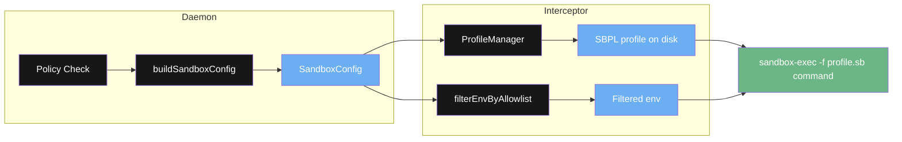
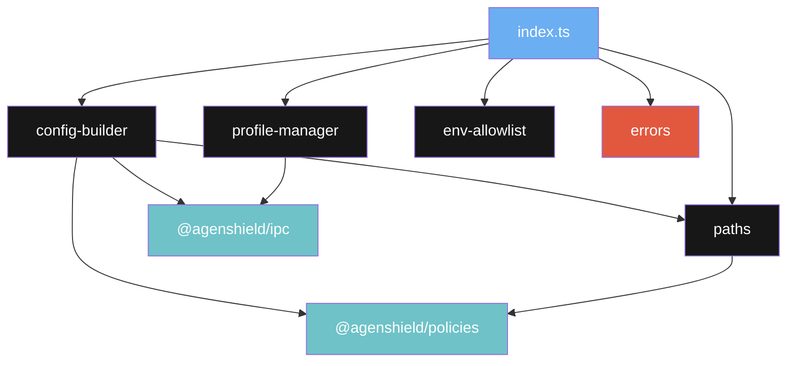
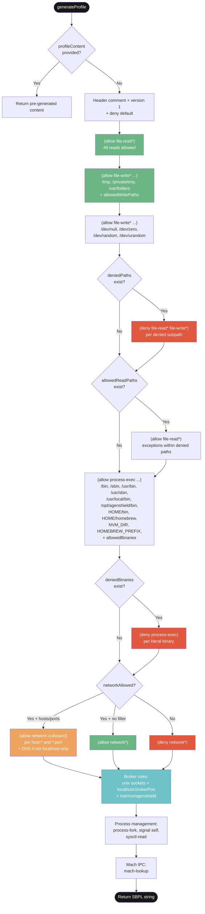
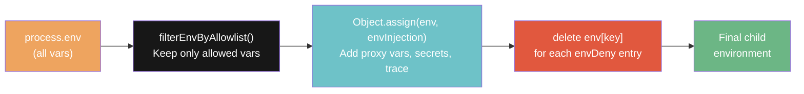
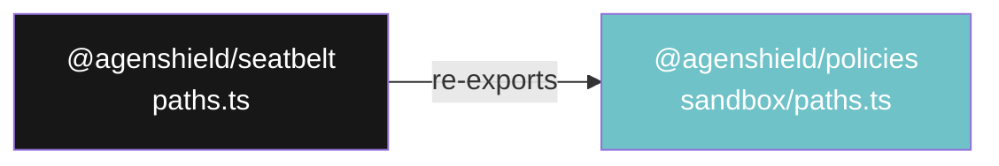
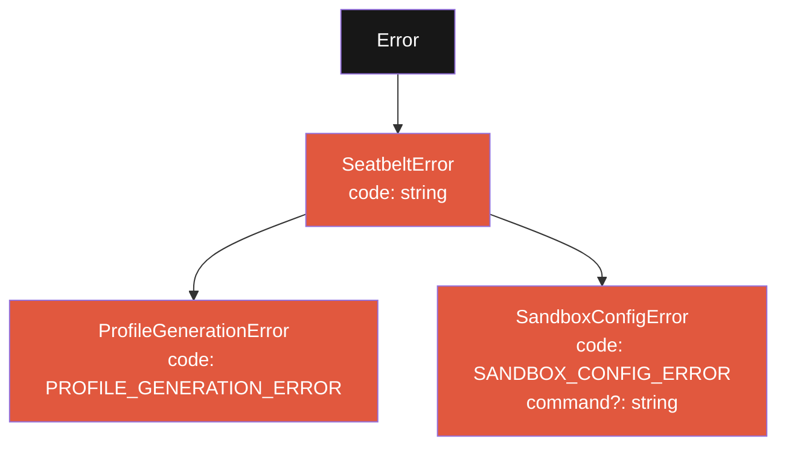
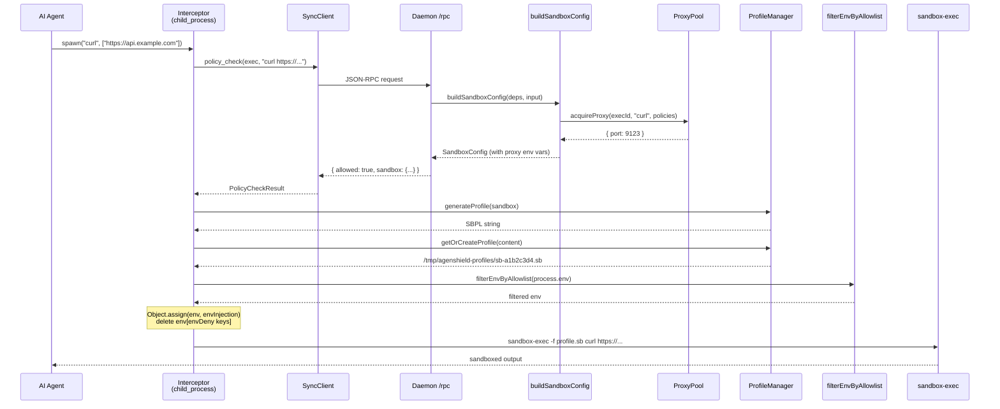

# @agenshield/seatbelt

macOS sandbox enforcement via SBPL profile generation, environment filtering, and `sandbox-exec` wrapping.

## Overview

The seatbelt library provides runtime process isolation for commands executed by AI agents. It generates macOS Seatbelt Profile Language (SBPL) profiles from a declarative `SandboxConfig`, manages environment variable filtering to prevent secret leakage, and builds sandbox configurations by combining policy rules, graph effects, and shared capabilities.

It sits between the daemon (which decides _what_ a sandboxed process can do) and the interceptor (which wraps the actual `child_process` call with `sandbox-exec`). macOS-only — on other platforms, seatbelt wrapping is skipped and only environment filtering applies.

## Quick Start

### Full pipeline (daemon-side config + interceptor-side wrapping)

```typescript
import { buildSandboxConfig, ProfileManager, filterEnvByAllowlist } from '@agenshield/seatbelt';

// 1. Daemon builds the sandbox config during policy evaluation
const sandbox = await buildSandboxConfig(
  {
    getPolicies: () => myPolicies,
    defaultAction: 'deny',
    agentHome: '/Users/ash_agent',
    acquireProxy: async (execId, cmd, policies, defaultAction) => {
      return { port: 8080 };
    },
  },
  {
    matchedPolicy: allowedPolicy,
    target: 'curl https://api.example.com',
    traceId: 'trace-abc',
    depth: 1,
  },
);

// 2. Interceptor generates SBPL and wraps the command
const pm = new ProfileManager('/tmp/agenshield-profiles');
const profileContent = pm.generateProfile(sandbox);
const profilePath = pm.getOrCreateProfile(profileContent);

// 3. Filter environment variables
const env = filterEnvByAllowlist(process.env as Record<string, string>);
Object.assign(env, sandbox.envInjection);
for (const key of sandbox.envDeny) delete env[key];

// 4. Execute: sandbox-exec -f /tmp/agenshield-profiles/sb-a1b2c3d4.sb curl https://api.example.com
```

### Profile generation only

```typescript
import { ProfileManager } from '@agenshield/seatbelt';
import type { SandboxConfig } from '@agenshield/ipc';

const sandbox: SandboxConfig = {
  enabled: true,
  allowedReadPaths: ['/workspace'],
  allowedWritePaths: ['/workspace/output', '/tmp'],
  deniedPaths: ['/etc/shadow'],
  networkAllowed: false,
  allowedHosts: [],
  allowedPorts: [],
  allowedBinaries: ['/usr/bin/python3'],
  deniedBinaries: [],
  envInjection: { AGENSHIELD_TRACE_ID: 'trace-123' },
  envDeny: ['NODE_OPTIONS'],
  envAllow: [],
};

const pm = new ProfileManager('/tmp/agenshield-profiles');
const sbpl = pm.generateProfile(sandbox);
const path = pm.getOrCreateProfile(sbpl);
// path → /tmp/agenshield-profiles/sb-<sha256-prefix>.sb
```

## Architecture

### Pipeline overview



### Module dependencies



## Module: config-builder

Builds a `SandboxConfig` for an approved exec operation. Combines policy rules, graph effects, shared capabilities, and network heuristics into a single config that the interceptor uses for wrapping.

### buildSandboxConfig flow

```mermaid
flowchart TD
  START([buildSandboxConfig called]) --> INIT[Initialize SandboxConfig<br/>enabled: true, empty arrays]
  INIT --> TRACE{traceId /<br/>depth provided?}
  TRACE -->|Yes| INJECT_TRACE[Inject AGENSHIELD_TRACE_ID<br/>+ AGENSHIELD_DEPTH env vars]
  TRACE -->|No| BASENAME
  INJECT_TRACE --> BASENAME

  BASENAME[Extract command basename<br/>from target string] --> DENY_NODE[Strip NODE_OPTIONS<br/>via envDeny]
  DENY_NODE --> COLLECT_DENY[collectDenyPathsFromPolicies<br/>→ deniedPaths]
  COLLECT_DENY --> COLLECT_ALLOW{commandBasename<br/>exists?}
  COLLECT_ALLOW -->|Yes| ALLOW_PATHS[collectAllowPathsForCommand<br/>→ readPaths + writePaths]
  COLLECT_ALLOW -->|No| RESOLVE_BIN
  ALLOW_PATHS --> RESOLVE_BIN

  RESOLVE_BIN[Resolve binary path<br/>+ realpath symlink] --> ESSENTIAL[Add essential paths:<br/>agentHome, /opt/agenshield/bin,<br/>homebrew, .nvm, bin]
  ESSENTIAL --> OPENCLAW[Deny .openclaw internals<br/>Allow .openclaw/workspace read]
  OPENCLAW --> GRAPH{GraphEffects<br/>provided?}

  GRAPH -->|Yes| MERGE_GRAPH[Merge grantedFsPaths<br/>+ injectedSecrets]
  GRAPH -->|No| SHARED
  MERGE_GRAPH --> SHARED

  SHARED{SharedCapabilities<br/>provided?}
  SHARED -->|Yes| MERGE_SHARED[Merge fsPaths<br/>+ resolve vault secrets]
  SHARED -->|No| NET_DECIDE
  MERGE_SHARED --> NET_DECIDE

  NET_DECIDE{Graph or shared<br/>network patterns?}
  NET_DECIDE -->|Yes| PROXY_MODE[Network mode: proxy]
  NET_DECIDE -->|No| DETERMINE[determineNetworkAccess]

  DETERMINE --> POLICY_NET{Explicit<br/>networkAccess<br/>on policy?}
  POLICY_NET -->|Yes| USE_POLICY[Use policy value:<br/>none / proxy / direct]
  POLICY_NET -->|No| KNOWN_CMD{Known network<br/>command?}
  KNOWN_CMD -->|Yes| PROXY_MODE
  KNOWN_CMD -->|No| NONE_MODE[Network mode: none]

  PROXY_MODE --> ACQUIRE[acquireProxy<br/>→ port number]
  ACQUIRE --> INJECT_PROXY[Inject HTTP_PROXY,<br/>HTTPS_PROXY, ALL_PROXY,<br/>+ lowercase variants]

  USE_POLICY --> DONE([Return SandboxConfig])
  NONE_MODE --> DONE
  INJECT_PROXY --> DONE

  style START fill:#171717,color:#fff
  style INIT fill:#6BAEF2,color:#fff
  style INJECT_TRACE fill:#6EC2C8,color:#fff
  style MERGE_GRAPH fill:#6CB685,color:#fff
  style MERGE_SHARED fill:#6CB685,color:#fff
  style COLLECT_DENY fill:#E1583E,color:#fff
  style ALLOW_PATHS fill:#6CB685,color:#fff
  style ACQUIRE fill:#6EC2C8,color:#fff
  style INJECT_PROXY fill:#6EC2C8,color:#fff
  style NET_DECIDE fill:#EEA45F,color:#fff
  style POLICY_NET fill:#EEA45F,color:#fff
  style KNOWN_CMD fill:#EEA45F,color:#fff
  style DONE fill:#171717,color:#fff
```



### API

| Export | Kind | Description |
|--------|------|-------------|
| `buildSandboxConfig(deps, input)` | `async function` | Build a `SandboxConfig` from injected deps + per-call input. May acquire a proxy. |
| `SeatbeltDeps` | `interface` | Dependency injection contract: `getPolicies`, `defaultAction`, `agentHome`, optional `acquireProxy`, `resolveSecrets`, `brokerHttpPort`. |
| `BuildSandboxInput` | `interface` | Per-call input: `matchedPolicy?`, `context?`, `target?`, `effects?`, `traceId?`, `depth?`, `sharedCapabilities?`. |
| `SharedCapabilities` | `interface` | Capabilities shared from parent via edge config: `networkPatterns`, `fsPaths`, `secretNames`. |

### SeatbeltDeps

| Field | Type | Required | Description |
|-------|------|----------|-------------|
| `getPolicies` | `() => PolicyConfig[]` | Yes | Returns all enabled policies |
| `defaultAction` | `string` | Yes | Fallback action when no policy matches |
| `agentHome` | `string` | Yes | Agent home directory for path resolution |
| `acquireProxy` | `(execId, command, policies, defaultAction) => Promise<{ port }>` | No | Acquire a per-run filtering proxy. Returns the port number. |
| `resolveSecrets` | `(names: string[]) => Record<string, string>` | No | Resolve secret names to values from vault |
| `brokerHttpPort` | `number` | No | Broker HTTP fallback port for localhost SBPL rules |

### Network command heuristic

When no explicit `networkAccess` is set on the matched policy, `determineNetworkAccess` checks the command basename against a known set. If matched, the command gets proxy-mode network access.

| Commands |
|----------|
| `curl`, `wget`, `git`, `npm`, `npx`, `yarn`, `pnpm`, `pip`, `pip3`, `brew`, `apt`, `ssh`, `scp`, `rsync`, `fetch`, `http`, `nc`, `ncat`, `node`, `deno`, `bun` |

Commands not in this set default to `none` (no network access).

## Module: profile-manager

Generates macOS SBPL profiles from `SandboxConfig` objects and writes them to disk with content-hash naming for deduplication.

### SBPL rule emission order



### API

| Method | Signature | Description |
|--------|-----------|-------------|
| `constructor` | `new ProfileManager(profileDir: string)` | Create a manager. Profiles are written to `profileDir`. |
| `generateProfile` | `(sandbox: SandboxConfig) => string` | Generate an SBPL profile string. If `sandbox.profileContent` is set, returns it directly. |
| `getOrCreateProfile` | `(content: string) => string` | Write profile to disk with content-hash name. Returns the absolute path. Reuses existing file if hash matches. |
| `cleanup` | `(maxAgeMs: number) => void` | Remove stale `.sb` files older than `maxAgeMs` from the profile directory. |

### Content-hash caching

Profile files are named `sb-{hash}.sb` where `{hash}` is the first 16 hex characters of the SHA-256 of the profile content. Identical sandbox configs produce identical SBPL, which produces the same hash, so the same file is reused without rewriting.

### Captured fs functions

The module captures references to `fs.mkdirSync`, `fs.writeFileSync`, `fs.existsSync`, etc. at **module load time** (before any interceptor patches `node:fs`). This prevents interception loops where `ProfileManager` writing a profile would trigger the file-system interceptor, which would call `ProfileManager` again.

## Module: env-allowlist

Controls which environment variables are passed from the parent process to sandboxed children. Prevents accidental secret leakage while preserving essential shell, toolchain, and system variables.

### Environment pipeline



### BASE_ENV_ALLOWLIST

| Category | Variables |
|----------|-----------|
| Identity & paths | `HOME`, `USER`, `LOGNAME`, `PATH`, `SHELL`, `TMPDIR` |
| Terminal & locale | `TERM`, `COLORTERM`, `LANG`, `LC_*` (prefix pattern) |
| macOS system | `XPC_FLAGS`, `XPC_SERVICE_NAME`, `__CF_USER_TEXT_ENCODING` |
| Shell | `SHLVL` |
| Toolchain | `NVM_DIR`, `HOMEBREW_PREFIX`, `HOMEBREW_CELLAR`, `HOMEBREW_REPOSITORY` |
| SSH | `SSH_AUTH_SOCK` |
| AgenShield | `AGENSHIELD_*` (prefix pattern) |
| Node.js | `NODE_OPTIONS` |

### API

| Export | Kind | Description |
|--------|------|-------------|
| `BASE_ENV_ALLOWLIST` | `readonly string[]` | The base allowlist. Entries ending with `*` are prefix patterns. |
| `filterEnvByAllowlist(sourceEnv, policyAllow?)` | `function` | Filter an environment object through the base allowlist + optional per-policy extensions. Returns a new object with only allowed variables. |

### Pattern matching

- **Exact match**: `HOME` matches only the key `HOME`.
- **Prefix match**: `LC_*` matches `LC_ALL`, `LC_CTYPE`, `LC_MESSAGES`, etc.

Per-policy `envAllow` extensions follow the same rules and are merged with the base allowlist before filtering.

### NODE_OPTIONS handling

`NODE_OPTIONS` is deliberately included in the base allowlist so the filtering stage preserves it. However, `envDeny` always includes `NODE_OPTIONS` (added by `buildSandboxConfig`), which strips it in the final deny stage. This prevents the interceptor's `--require` hook from re-activating inside sandboxed children, avoiding re-entrancy loops.

## Module: paths

Convenience re-exports of sandbox path functions from `@agenshield/policies`. Seatbelt consumers get these without needing a separate `@agenshield/policies` import.

### Re-export relationship



### API

| Export | Signature | Description |
|--------|-----------|-------------|
| `extractConcreteDenyPaths` | `(patterns: string[]) => string[]` | Filter filesystem patterns to those expressible as SBPL rules. Strips trailing `/*` and `/**`, skips globs and relative paths. |
| `collectDenyPathsFromPolicies` | `(policies: PolicyConfig[], commandBasename?: string) => string[]` | Scan enabled deny policies for concrete filesystem paths. Two passes: global first, then command-scoped if basename provided. |
| `collectAllowPathsForCommand` | `(policies: PolicyConfig[], commandBasename: string) => { readPaths: string[]; writePaths: string[] }` | Collect per-command allow paths from enabled allow policies. Separates read vs write based on policy operations. |

## Module: errors

Typed error classes following the project convention of a base class with `.code` and domain-specific subclasses.

### Error hierarchy



### Error reference

| Class | Code | Properties | When Thrown |
|-------|------|------------|------------|
| `SeatbeltError` | _(custom)_ | `code: string` | Base class — not thrown directly |
| `ProfileGenerationError` | `PROFILE_GENERATION_ERROR` | _(inherited)_ | SBPL generation fails (invalid config, write error) |
| `SandboxConfigError` | `SANDBOX_CONFIG_ERROR` | `command?: string` | Config building fails (proxy acquisition error, invalid input) |

### Usage

```typescript
import { SeatbeltError, SandboxConfigError } from '@agenshield/seatbelt';

try {
  const config = await buildSandboxConfig(deps, input);
} catch (err) {
  if (err instanceof SandboxConfigError) {
    console.error(`Config error for ${err.command}: ${err.message} [${err.code}]`);
  } else if (err instanceof SeatbeltError) {
    console.error(`Seatbelt error: ${err.message} [${err.code}]`);
  }
}
```

## Integration: Daemon + Interceptor

The full end-to-end flow spans two processes: the daemon (policy evaluation + config building) and the interceptor (SBPL generation + process wrapping).

### Cross-process sequence



## SandboxConfig Reference

The `SandboxConfig` interface (from `@agenshield/ipc`) is the central data structure passed from daemon to interceptor.

| Field | Type | Description |
|-------|------|-------------|
| `enabled` | `boolean` | Whether seatbelt wrapping is active |
| `allowedReadPaths` | `string[]` | Paths allowed for read access (exceptions within denied paths) |
| `allowedWritePaths` | `string[]` | Paths allowed for read+write access (`/tmp`, workspace, agent home) |
| `deniedPaths` | `string[]` | Paths explicitly denied for both read and write |
| `networkAllowed` | `boolean` | Whether network access is permitted |
| `allowedHosts` | `string[]` | Specific hosts allowed (e.g. `['localhost']` for proxy mode) |
| `allowedPorts` | `number[]` | Specific ports allowed for outbound connections |
| `allowedBinaries` | `string[]` | Binaries allowed to execute (paths ending in `/` are subpath rules) |
| `deniedBinaries` | `string[]` | Binaries explicitly denied from execution |
| `envInjection` | `Record<string, string>` | Environment variables to inject (proxy vars, secrets, trace IDs) |
| `envDeny` | `string[]` | Variable names to strip from the final environment |
| `envAllow` | `string[]` | Per-policy variable names/patterns extending the base allowlist |
| `brokerHttpPort` | `number?` | Broker HTTP fallback port for localhost SBPL rules (default: 5201) |
| `profileContent` | `string?` | Pre-generated SBPL content (bypasses `generateProfile` logic) |

## Testing

```bash
# Run all seatbelt tests
npx nx test seatbelt

# Run a specific test file
npx nx test seatbelt --testPathPattern=config-builder
```

### Test files

| File | Covers |
|------|--------|
| `config-builder.spec.ts` | `buildSandboxConfig` flow, network heuristics, path merging, proxy acquisition |
| `profile-manager.spec.ts` | SBPL generation, content-hash caching, cleanup, escaping |
| `env-allowlist.spec.ts` | Allowlist filtering, prefix patterns, policy extensions |
| `paths.spec.ts` | Re-exported path functions (delegates to `@agenshield/policies` tests) |
| `errors.spec.ts` | Error class hierarchy, codes, properties |
| `integration.spec.ts` | End-to-end: config → profile → env filtering pipeline |

## Project Structure

```
libs/seatbelt/
  src/
    config-builder.ts       # buildSandboxConfig + SeatbeltDeps + network heuristics
    profile-manager.ts       # ProfileManager class — SBPL generation + disk caching
    env-allowlist.ts         # BASE_ENV_ALLOWLIST + filterEnvByAllowlist
    paths.ts                 # Re-exports from @agenshield/policies
    errors.ts                # SeatbeltError, ProfileGenerationError, SandboxConfigError
    index.ts                 # Barrel exports
    __tests__/
      config-builder.spec.ts
      profile-manager.spec.ts
      env-allowlist.spec.ts
      paths.spec.ts
      errors.spec.ts
      integration.spec.ts
  package.json
  project.json
  tsconfig.json
  tsconfig.lib.json
  jest.config.ts
```
