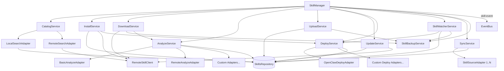
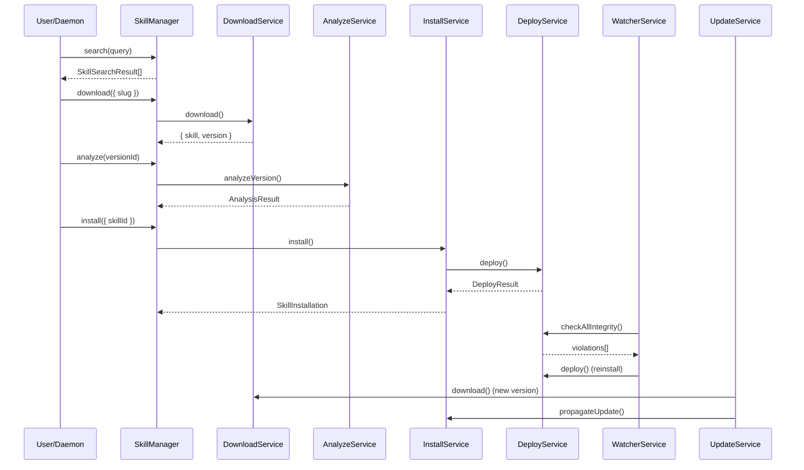

# @agenshield/skills

Standalone skill lifecycle manager for AgenShield — search, download, analyze, install, deploy, upload, sync, backup, auto-update, and integrity-watch skills.

## Architecture



## Getting Started

```typescript
import { SkillManager } from '@agenshield/skills';
import { Storage } from '@agenshield/storage';

const storage = Storage.open('/path/to/db.sqlite');

// Online mode (connects to marketplace)
const manager = new SkillManager(storage);

// Offline mode
const offline = new SkillManager(storage, { offlineMode: true });

// Custom analyzers + deployers + watcher
const full = new SkillManager(storage, {
  analyzers: [new BasicAnalyzeAdapter(), myCustomAdapter],
  deployers: [new OpenClawDeployAdapter({ skillsDir: '~/.openclaw/workspace/skills' })],
  watcher: { pollIntervalMs: 30_000 },
  autoStartWatcher: true,
  backupDir: '/path/to/backups',
  syncOptions: { onEvent: (e) => console.log(e) },
});
```

## SkillManager API

The `SkillManager` is the main entry point, orchestrating all sub-services.

| Method | Signature | Description |
|--------|-----------|-------------|
| `install` | `(params: InstallParams) => Promise<SkillInstallation>` | Install from remote or local skill, deploy if adapter available |
| `uninstall` | `(installationId: string) => Promise<boolean>` | Undeploy + remove installation |
| `download` | `(params: DownloadParams) => Promise<DownloadResult>` | Download from marketplace without installing |
| `installToTargets` | `(slug: string, targetIds: string[]) => Promise<SkillInstallation[]>` | Install a downloaded skill to multiple targets |
| `search` | `(query: string) => Promise<SkillSearchResult[]>` | Search local + remote catalogs |
| `uploadFiles` | `(params: UploadFromZipParams) => UploadResult` | Create skill from file buffers |
| `analyze` | `(versionId: string) => Promise<AnalysisResult>` | Run all analysis adapters on a version |
| `checkUpdates` | `() => Promise<UpdateCheckResult[]>` | Query remote for newer versions |
| `applyUpdates` | `() => Promise<UpdateResult[]>` | Check + download + propagate all updates |
| `listInstalled` | `() => Array<Skill & { version }>` | List installed skills (scope-aware) |
| `getSkill` | `(id: string) => Skill \| null` | Get skill by ID |
| `getSkillBySlug` | `(slug: string) => { skill, versions, installations } \| null` | Get skill with all versions and installations |
| `syncSource` | `(sourceId: string, target: TargetPlatform) => Promise<AdapterSyncResult>` | Sync a single source via SyncService |
| `approveSkill` | `(slug: string, opts?) => Promise<SkillInstallation>` | Approve quarantined skill, install, and deploy |
| `revokeSkill` | `(slug: string) => Promise<void>` | Uninstall + quarantine a skill |
| `rejectSkill` | `(slug: string) => Promise<void>` | Delete a skill entirely |
| `toggleSkill` | `(slug: string, opts?) => Promise<{ action: 'enabled' \| 'disabled' }>` | Enable or disable a skill |
| `resolveSlugForInstallation` | `(installationId: string) => string` | Resolve slug from installation UUID |
| `startWatcher` | `() => void` | Start integrity polling loop |
| `stopWatcher` | `() => void` | Stop integrity polling loop |

Sub-services are also accessible directly: `manager.catalog`, `manager.installer`, `manager.downloader`, `manager.analyzer`, `manager.uploader`, `manager.updater`, `manager.deployer`, `manager.watcher`, `manager.sync`, `manager.backup`.

## Domain Folders

| Folder | Service | Adapters | Description |
|--------|---------|----------|-------------|
| [`analyze/`](src/analyze/README.md) | `AnalyzeService` | `BasicAnalyzeAdapter`, `RemoteAnalyzeAdapter` | Multi-adapter skill analysis |
| [`backup/`](src/backup/README.md) | `SkillBackupService` | — | SHA-256 verified file backups |
| [`catalog/`](src/catalog/README.md) | `CatalogService` | `LocalSearchAdapter`, `RemoteSearchAdapter` | Search and browse skills |
| [`deploy/`](src/deploy/README.md) | `DeployService` | `OpenClawDeployAdapter` | Deploy skills to filesystem, integrity checks |
| [`download/`](src/download/README.md) | `DownloadService` | — | Download skills from marketplace |
| [`install/`](src/install/README.md) | `InstallService` | — | Install/uninstall skills with deploy integration |
| [`remote/`](src/remote/README.md) | `DefaultRemoteClient` | — | HTTP client for marketplace API |
| [`soul/`](src/soul/README.md) | `SoulInjector` | — | Prompt injection with security levels |
| [`sync/`](src/sync/README.md) | `SyncService` | `StaticSkillSource` | Multi-source skill synchronization |
| [`update/`](src/update/README.md) | `UpdateService` | — | Auto-update management |
| [`upload/`](src/upload/README.md) | `UploadService` | — | Create skills from files |
| [`watcher/`](src/watcher/README.md) | `SkillWatcherService` | — | Polling + fs.watch integrity monitor |

## Adapter Pattern

The **analyze**, **catalog**, **deploy**, and **sync** services use an adapter pattern for extensibility:

- **AnalyzeAdapter**: Implement `analyze(version, files) => AnalysisResult` to add custom analysis (e.g., security scanning, dependency checking). Multiple adapters run together with results merged (worst-status-wins).
- **SearchAdapter**: Implement `search(query) => SkillSearchResult[]` to add search sources. Results are deduplicated by slug (first adapter wins).
- **DeployAdapter**: Implement `canDeploy(targetId)`, `deploy(context)`, `undeploy()`, and `checkIntegrity()` to add deployment targets.
- **SkillSourceAdapter**: Implement `getTools()`, `getSkillsFor()`, `getBins()`, `getSkillFiles()`, `getInstructions()`, `isAvailable()` to add skill sources for sync.

### Adding a New Analyzer

```typescript
import type { AnalyzeAdapter } from '@agenshield/skills';

export class SecurityScanAdapter implements AnalyzeAdapter {
  readonly id = 'security-scan';
  readonly displayName = 'Security Scanner';

  analyze(version, files) {
    // Your analysis logic
    return { status: 'success', data: {}, requiredBins: [], requiredEnv: [], extractedCommands: [] };
  }
}
```

### Adding a New Search Source

```typescript
import type { SearchAdapter } from '@agenshield/skills';

export class CustomRegistryAdapter implements SearchAdapter {
  readonly id = 'custom-registry';
  readonly displayName = 'Internal Registry';

  async search(query) {
    // Fetch from your registry
    return [];
  }
}
```

## Skill Lifecycle



## Event System

All long-running operations emit `SkillEvent` via Node.js `EventEmitter`. The `SkillManager` can optionally bridge events to a typed `EventBus` from `@agenshield/ipc`.

```typescript
manager.on('skill-event', (event: SkillEvent) => {
  console.log(event.type, event);
});
```

### Event Categories

| Category | Events |
|----------|--------|
| **Download** | `download:started`, `download:progress`, `download:extracting`, `download:completed`, `download:error` |
| **Upload** | `upload:started`, `upload:extracting`, `upload:hashing`, `upload:registering`, `upload:uploading`, `upload:completed`, `upload:error` |
| **Install** | `install:started`, `install:downloading`, `install:analyzing`, `install:registering`, `install:creating`, `install:completed`, `install:error` |
| **Uninstall** | `uninstall:started`, `uninstall:completed`, `uninstall:error` |
| **Analyze** | `analyze:started`, `analyze:parsing`, `analyze:extracting`, `analyze:scanning`, `analyze:completed`, `analyze:error` |
| **Update** | `update:checking`, `update:found`, `update:applying`, `update:skill-done`, `update:completed`, `update:error` |
| **Deploy** | `deploy:started`, `deploy:copying`, `deploy:completed`, `deploy:error` |
| **Undeploy** | `undeploy:started`, `undeploy:completed`, `undeploy:error` |
| **Watcher** | `watcher:started`, `watcher:stopped`, `watcher:poll-started`, `watcher:poll-completed`, `watcher:integrity-violation`, `watcher:quarantined`, `watcher:reinstalled`, `watcher:skill-detected`, `watcher:fs-change`, `watcher:action-error`, `watcher:error` |
| **CRUD** | `skill:created`, `skill:updated`, `skill:deleted`, `version:created` |

## Error Classes

All errors extend `SkillsError` (base class with `.code` property):

| Error | Code | When |
|-------|------|------|
| `SkillNotFoundError` | `SKILL_NOT_FOUND` | Skill ID/slug doesn't exist |
| `VersionNotFoundError` | `VERSION_NOT_FOUND` | Version string/ID doesn't exist |
| `RemoteSkillNotFoundError` | `REMOTE_SKILL_NOT_FOUND` | Remote marketplace ID not found |
| `RemoteApiError` | `REMOTE_API_ERROR` | Marketplace HTTP error (has `.statusCode`) |
| `AnalysisError` | `ANALYSIS_ERROR` | Analysis adapter failure |
| `BackupTamperError` | `BACKUP_TAMPERED` | Backup file integrity check failed |

## Testing

```bash
npx jest --config libs/skills/jest.config.ts --rootDir libs/skills --coverage
```

## Contributing

When modifying this library:
- Update this README and per-module READMEs if public API changes
- Add tests in `__tests__/` for new functionality
- Emit events for new async operations via `this.emit('skill-event', event)`
- Use typed errors from `errors.ts` — never throw bare `Error`
- Follow the adapter pattern for extensible services
