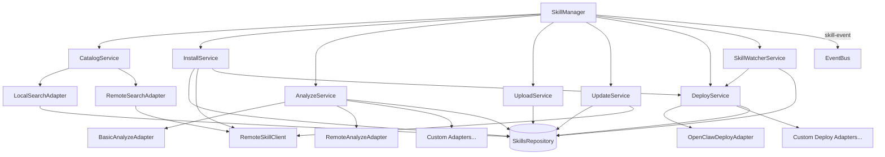

# @agentshield/skills

Standalone skill lifecycle manager for AgenShield — search, install, analyze, deploy, upload, auto-update, and integrity-watch skills.

## Architecture



## Getting Started

```typescript
import { SkillManager } from '@agentshield/skills';
import { Storage } from '@agenshield/storage';

const storage = Storage.open('/path/to/db.sqlite');

// Online mode (connects to marketplace)
const manager = new SkillManager(storage);

// Offline mode
const manager = new SkillManager(storage, { offlineMode: true });

// Custom analyzers + deployers
const manager = new SkillManager(storage, {
  analyzers: [new BasicAnalyzeAdapter(), myCustomAdapter],
  deployers: [new OpenClawDeployAdapter({ skillsDir: '~/.openclaw/workspace/skills' })],
  watcher: { pollIntervalMs: 30_000 },
  autoStartWatcher: true,
});
```

## SkillManager API

The `SkillManager` is the main entry point, orchestrating all sub-services.

| Method | Signature | Description |
|--------|-----------|-------------|
| `install` | `(params: InstallParams) => Promise<SkillInstallation>` | Install from remote or local skill, deploy if adapter available |
| `uninstall` | `(installationId: string) => Promise<boolean>` | Undeploy + remove installation |
| `search` | `(query: string) => Promise<SkillSearchResult[]>` | Search local + remote catalogs |
| `uploadFiles` | `(params: UploadFromZipParams) => UploadResult` | Create skill from file buffers |
| `analyze` | `(versionId: string) => Promise<AnalysisResult>` | Run all analysis adapters on a version |
| `checkUpdates` | `() => Promise<UpdateCheckResult[]>` | Query remote for newer versions |
| `applyUpdates` | `() => Promise<UpdateResult[]>` | Check + download + propagate all updates |
| `listInstalled` | `() => Array<Skill & { version }>` | List installed skills (scope-aware) |
| `getSkill` | `(id: string) => Skill \| null` | Get skill by ID |
| `startWatcher` | `() => void` | Start integrity polling loop |
| `stopWatcher` | `() => void` | Stop integrity polling loop |

Sub-services are also accessible directly: `manager.catalog`, `manager.installer`, `manager.analyzer`, `manager.uploader`, `manager.updater`, `manager.deployer`, `manager.watcher`.

## Domain Folders

| Folder | Service | Adapters | Description |
|--------|---------|----------|-------------|
| [`analyze/`](./analyze/README.md) | `AnalyzeService` | `BasicAnalyzeAdapter`, `RemoteAnalyzeAdapter` | Multi-adapter skill analysis |
| [`catalog/`](./catalog/README.md) | `CatalogService` | `LocalSearchAdapter`, `RemoteSearchAdapter` | Search and browse skills |
| [`deploy/`](./deploy/README.md) | `DeployService` | `OpenClawDeployAdapter` | Deploy skills to filesystem, integrity checks |
| [`install/`](./install/README.md) | `InstallService` | — | Install/uninstall skills with deploy integration |
| [`update/`](./update/README.md) | `UpdateService` | — | Auto-update management |
| [`upload/`](./upload/README.md) | `UploadService` | — | Create skills from files |
| [`watcher/`](./watcher/README.md) | `SkillWatcherService` | — | Polling-based integrity monitor |
| `remote/` | `DefaultRemoteClient` | — | HTTP client for marketplace API |

## Adapter Pattern

The **analyze**, **catalog**, and **deploy** services use an adapter pattern for extensibility:

- **AnalyzeAdapter**: Implement `analyze(version, files) => AnalysisResult` to add custom analysis (e.g., security scanning, dependency checking). Multiple adapters run together with results merged (worst-status-wins).
- **SearchAdapter**: Implement `search(query) => SkillSearchResult[]` to add search sources. Results are deduplicated by slug (first adapter wins).
- **DeployAdapter**: Implement `canDeploy(targetId)`, `deploy(context)`, `undeploy()`, and `checkIntegrity()` to add deployment targets.

### Adding a New Analyzer

```typescript
import type { AnalyzeAdapter } from '@agentshield/skills';

export class SecurityScanAdapter implements AnalyzeAdapter {
  readonly id = 'security-scan';
  readonly displayName = 'Security Scanner';

  analyze(version, files) {
    // Your analysis logic
    return { status: 'success', data: {}, requiredBins: [], requiredEnv: [], extractedCommands: [] };
  }
}
```

### Adding a New Search Source

```typescript
import type { SearchAdapter } from '@agentshield/skills';

export class CustomRegistryAdapter implements SearchAdapter {
  readonly id = 'custom-registry';
  readonly displayName = 'Internal Registry';

  async search(query) {
    // Fetch from your registry
    return [];
  }
}
```

## Event System

All long-running operations emit `SkillEvent` via Node.js `EventEmitter`. The `SkillManager` can optionally bridge events to a typed `EventBus` from `@agenshield/ipc`.

```typescript
manager.on('skill-event', (event: SkillEvent) => {
  console.log(event.type, event);
});
```

Event categories: `download:*`, `upload:*`, `install:*`, `uninstall:*`, `analyze:*`, `update:*`, `deploy:*`, `undeploy:*`, `watcher:*`, `skill:*`, `version:*`.

## Error Classes

All errors extend `SkillsError` (base class with `.code` property):

| Error | Code | When |
|-------|------|------|
| `SkillNotFoundError` | `SKILL_NOT_FOUND` | Skill ID/slug doesn't exist |
| `VersionNotFoundError` | `VERSION_NOT_FOUND` | Version string/ID doesn't exist |
| `RemoteSkillNotFoundError` | `REMOTE_SKILL_NOT_FOUND` | Remote marketplace ID not found |
| `RemoteApiError` | `REMOTE_API_ERROR` | Marketplace HTTP error (has `.statusCode`) |
| `AnalysisError` | `ANALYSIS_ERROR` | Analysis adapter failure |

## Testing

```bash
npx nx test skills
```
