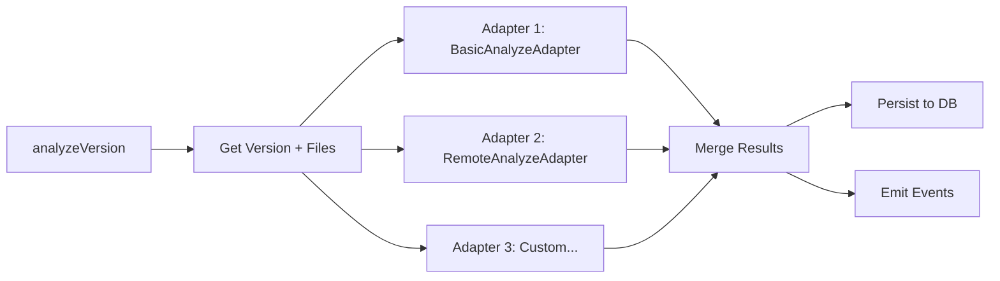

# Analyze Service

Performs skill version analysis using pluggable adapters. Multiple adapters can run together with results automatically merged. Adapters may be sync or async.

## Data Flow



## Public API

### `AnalyzeService`

| Method | Signature | Description |
|--------|-----------|-------------|
| `analyzeVersion` | `(versionId: string) => Promise<AnalysisResult>` | Run all adapters on a version, persist and return merged result |
| `analyzePending` | `() => Promise<AnalysisResult[]>` | Analyze all versions with `status: 'pending'` |
| `reanalyze` | `(versionId: string) => Promise<AnalysisResult>` | Reset analysis status and re-run |

### `AnalyzeAdapter` Interface

```typescript
interface AnalyzeAdapter {
  readonly id: string;
  readonly displayName: string;
  analyze(version: SkillVersion, files: SkillFile[]): AnalysisResult | Promise<AnalysisResult>;
}
```

## Merge Strategy

When multiple adapters run:
- **requiredBins/requiredEnv/extractedCommands**: Union (deduplicated)
- **status**: Worst-wins (`error` > `warning` > `success`)
- **data**: Merged object keyed by adapter ID (single adapter: unwrapped for backward compat)

## Built-in Adapters

### `BasicAnalyzeAdapter`

Extracts metadata from the skill version:
- Detects manifest files (`SKILL.md`, `skill.json`, `package.json`)
- Collects `requiredBins` and `requiredEnv` from version fields
- Extracts additional metadata from `metadataJson`

### `RemoteAnalyzeAdapter`

AI-powered security analysis via `skills.agentfront.dev`. Reads skill files from disk, POSTs them to the remote analyzer, and maps the NDJSON streaming response to an `AnalysisResult`.

```typescript
import { RemoteAnalyzeAdapter } from '@agenshield/skills';

const remote = new RemoteAnalyzeAdapter({
  baseUrl: 'https://skills.agentfront.dev', // default
  timeout: 240_000,                          // 4 min default
  noCache: false,                            // bypass upstream cache
});

const manager = new SkillManager(storage, {
  analyzers: [new BasicAnalyzeAdapter(), remote],
});
```

Detects:
- Vulnerability severity (safe/low/medium/high/critical)
- Required binaries and environment variables
- Run commands and entry points
- Security findings (CWE/OWASP categorized)
- MCP-specific risks (tool-poisoning, prompt-injection, etc.)

On error (network, timeout, no files), returns `{ status: 'error', error: '...' }` instead of throwing.
