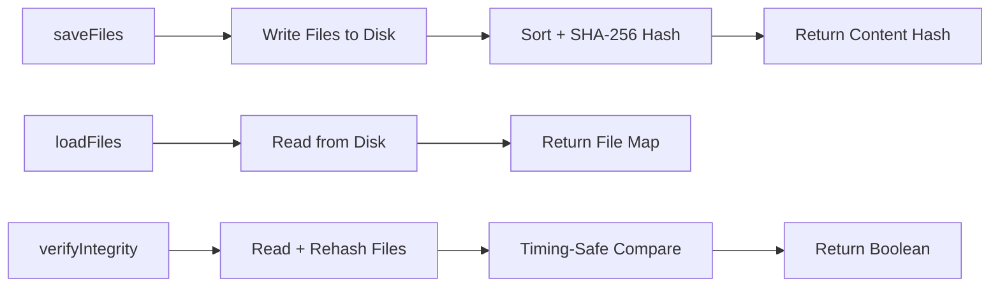

# Backup Service

SHA-256 verified file backups for skill versions. Stores skill files on disk with deterministic hashing for tamper detection.

## Data Flow



## Public API

### `SkillBackupService`

| Method | Signature | Description |
|--------|-----------|-------------|
| `saveFiles` | `(versionId, files) => string` | Save files to disk, return SHA-256 content hash |
| `loadFiles` | `(versionId: string) => Map<string, Buffer>` | Load all backup files for a version |
| `loadFile` | `(versionId, relativePath) => Buffer \| null` | Load a single backup file |
| `loadSkillMd` | `(versionId: string) => string \| null` | Load SKILL.md (with fallbacks to skill.md, README.md) |
| `removeFiles` | `(versionId: string) => void` | Delete backup directory for a version |
| `hasBackup` | `(versionId: string) => boolean` | Check if backup exists |
| `verifyIntegrity` | `(versionId, expectedHash) => boolean` | Verify backup integrity against expected hash |

## Storage Structure

```
{backupDir}/
  {versionId}/
    {relativePath}     # Original file content
```

## Content Hash

The content hash is deterministic and order-independent:
1. Files are sorted by `relativePath`
2. Each `path + content` pair is fed into the hash
3. Produces a single SHA-256 hex digest

Integrity verification uses **timing-safe comparison** (`crypto.timingSafeEqual`) to prevent timing attacks.

## Contributing

When modifying this module:
- Update this README if public API changes
- Add tests in `__tests__/backup.service.spec.ts`
- Emit events for new async operations
- Use typed errors from `../errors.ts`
